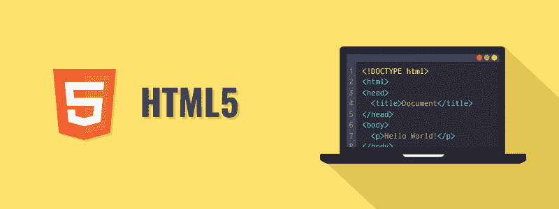

# HTML 教程

> 原文：<https://www.tutorialrepublic.com/html-tutorial/>

HTML 是描述网页结构的主要标签语言。

HTML 代表超文本标签语言。HTML 是万维网的基本构件。

超文本是显示在计算机或其他电子设备上的文本，它引用了用户通常通过鼠标点击或按键可以立即访问的其他文本。

除了文本，超文本还可以包含表格、列表、表单、图像和其他表示元素。这是一种易于使用且灵活的在互联网上共享信息的格式。

标签语言使用多组标签来表征文档中的文本元素，这些标签为 web 浏览器提供了文档应该如何显示的指令。

HTML 最初是由蒂姆·伯纳斯·李在 1990 年开发的。他也被称为网络之父。1996 年，万维网联盟(W3C)成为维护 HTML 规范的权威。HTML 也在 2000 年成为国际标准( ISO )。HTML5 是 HTML 的最新版本。HTML5 为 web 开发提供了更快、更健壮的方法。

 ***提示:**我们的 HTML 教程将帮助你学习最新的 HTML5 语言的基础，从基础到高级的主题一步一步来。如果你是初学者，从基础部分开始，通过每天学习一点点逐步前进。*  ** * *

## 你能用 HTML 做什么

你可以用 HTML 做更多的事情。

*   您可以在线发布带有文本、图像、列表、表格等的文档。
*   您可以通过超链接访问网络资源，如图像、视频或其他 HTML 文档。
*   您可以创建表单来收集用户输入，如姓名、电子邮件地址、评论等。
*   您可以在 HTML 文档中直接包含图像、视频、声音剪辑、flash 电影、应用和其他 HTML 文档。
*   你可以创建离线版本的网站，在没有互联网的情况下也能工作。
*   您可以将数据存储在用户的 web 浏览器中，并在以后访问。
*   您可以找到网站访问者的当前位置。

这个列表并没有到此为止，你还可以用 HTML 做很多其他有趣的事情。在接下来的章节中，你将会详细地了解它们。

 ***注意:**前面描述的 HTML 是一种标签语言，而不是编程语言，像 Java、Ruby、PHP 等。你需要一个网页浏览器来浏览 HTML 网页。web 浏览器不显示 HTML 标签，而是使用标签来解释网页的内容。*  ** * *

## 本教程涵盖的内容

本 HTML 教程系列涵盖了 HTML 的所有基础知识，包括元素和属性的概念、使用 HTML 标签格式化文本的方法、向文档添加样式信息的方法、插入图像和表格的技术、创建列表和表单的过程以及在当前文档中包含其他 HTML 文档的方法，等等。

一旦您熟悉了基础知识，您将进入下一个层次，解释 doctype 的概念、创建网页布局的方法、向网页添加元信息的重要性、添加脚本的方式、显示特殊字符的技术、URL 的剖析等等。

最后，您将探索 HTML5 中引入的一些高级功能，如新的输入类型、在网页上绘制图形，包括文档中的音频和视频、使用 web 存储在客户端存储数据、缓存文件、使用 Web 工作器 执行后台工作，以及获取用户的地理坐标、创建拖放应用等等。

 *提示:本教程的每一章都包含了大量真实世界的例子，你可以使用在线编辑器来尝试和测试。这些例子将帮助你更好地理解概念或主题。它还包含智能解决方案以及有用的提示和重要说明。***