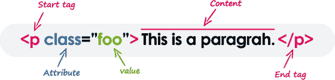

# HTML 元素

> 原文：<https://www.tutorialrepublic.com/html-tutorial/html-elements.php>

在本教程中，你将学习 HTML 标签和元素。

## HTML 元素语法

HTML 元素是 HTML 文档的一个单独的组件。它代表语义，或者说意义。例如，`title`元素代表文档的标题。

大多数 HTML 元素都是用一个*开始标签*(或开始标签)和一个*结束标签*(或结束标签)编写的，内容在它们之间。元素还可以包含定义其附加属性的属性。例如，由`p`元素表示的段落可以写成:



我们将在下一章的[中学习 HTML 属性。](html-attributes.php)

 ***注意:**所有元素都不需要结束标签或结束标签。这些被称为*空元件*、*自闭元件*或*空元件*。*  ** * *

## HTML 标签与元素

从技术上讲，HTML 元素是开始标签、它的属性、结束标签以及它们之间的所有东西的集合。另一方面，HTML 标记(开始或结束)用于标记元素的开始或结束，如上图所示。

然而，在通常的用法中，术语 HTML 元素和 HTML 标签是可以互换的，即标签是元素是标签。为了网站的简单起见，术语“标签”和“元素”被用来表示同一个意思——因为它将在你的网页上定义一些东西。

* * *

## HTML 标记和属性不区分大小写

在 HTML 中，标签和属性名称不区分大小写(但大多数属性值是区分大小写的)。它的意思是标签`<P>`，标签`<p>`在 HTML 中定义了同样的东西，也就是一个段落。

但是在 [XHTML](../xhtml-tutorial.php) 中，它们是区分大小写的，标签`<P>`不同于标签`<p>`。

#### 例子

[Try this code »](../codelab.php?topic=html&file=case-insensitivity "Try this code using online Editor")

```
<p>This is a paragraph.</p>
<P>This is also a valid paragraph.</P>
```

 *提示:我们建议在 HTML 中使用小写的标签和属性名称，因为这样做可以使你的文档更符合未来的升级。*  ** * *

## 空 HTML 元素

空元素(也称为自结束或空元素)不是容器标签——这意味着，你不能写`<hr>*some content*</hr>`或`<br>*some content*</br>`。

空元素的一个典型例子是代表换行符的`<br>`元素。其他一些常见的空元素有``、`<input>`、`<link>`、`<meta>`、`<hr>`等。

#### 例子

[Try this code »](../codelab.php?topic=html&file=empty-elements "Try this code using online Editor")

```
<p>This paragraph contains <br> a line break.</p>

<input type="text" name="username">
```

 ***注意:**在 HTML 中，一个自结束元素被简单地写成`[<br>](../html-reference/html-br-tag.php)`。在 XHTML 中，自结束元素需要一个空格和一个尾随斜杠，比如`<br />`。*  ** * *

## 嵌套 HTML 元素

大多数 HTML 元素可以包含任意数量的其他元素(除了[空元素](#empty-elements)，这些元素依次由标签、属性和内容或其他元素组成。

以下示例显示了嵌套在`<p>`元素中的一些元素。

#### 例子

[Try this code »](../codelab.php?topic=html&file=nesting-elements "Try this code using online Editor")

```
<p>Here is some <b>bold</b> text.</p>
<p>Here is some <em>emphasized</em> text.</p>
<p>Here is some <mark>highlighted</mark> text.</p>
```

 *提示:将一个元素放入另一个元素中称为嵌套。嵌套元素也称为子元素，如果其他元素嵌套在其中，它也可以是父元素。*  *HTML 标签应该以正确的顺序嵌套。它们必须按照定义的相反顺序关闭，这意味着最后打开的标签必须首先关闭。

#### 例子

[Try this code »](../codelab.php?topic=html&file=nesting-order "Try this code using online Editor")

```
<p><strong>These tags are nested properly.</strong></p>
<p><strong>These tags are not nested properly.</p></strong>
```

* * *

## 用 HTML 写评论

添加注释通常是为了让源代码更容易理解。它可以帮助其他开发人员(或者将来你编辑源代码时)理解你试图用 HTML 做什么。浏览器中不显示注释。

HTML 注释以`<!--`开始，以`-->`结束，如下例所示:

#### 例子

[Try this code »](../codelab.php?topic=html&file=comment-syntax "Try this code using online Editor")

```
<!-- This is an HTML comment -->
<!-- This is a multi-line HTML comment 
     that spans across more than one line -->
<p>This is a normal piece of text.</p>
```

出于调试目的，您还可以注释掉 HTML 代码的一部分，如下所示:

#### 例子

[Try this code »](../codelab.php?topic=html&file=commenting-code "Try this code using online Editor")

```
<!-- Hiding this image for testing

-->
```

* * *

## HTML 元素类型

元素可以放在两个不同的组中: *[块级](../css-tutorial/css-visual-formatting.php#block-level)* 和 *[内联级](../css-tutorial/css-visual-formatting.php#inline-level)* 元素。前者组成了文档的结构，而后者修饰了块的内容。

此外，block 元素占据了 100%的可用宽度，并且在前后使用换行符呈现。然而，内联元素将只占用它所需要的空间。

最常用的块级元素有`<div>`、`<p>`、`<h1>`到`<h6>`、`<form>`、`<ol>`、`<ul>`、`<li>`等等。而常用的内联级元素有``、`<a>`、`<span>`、`<strong>`、`<b>`、`<em>`、`<i>`、`<code>`、`<input>`、`<button>`等。

您将在接下来的章节中详细了解这些元素。

 ***注意:**块级元素不应该放在内联级元素中。例如，`<p>`元素不应该放在`<b>`元素内部。*****