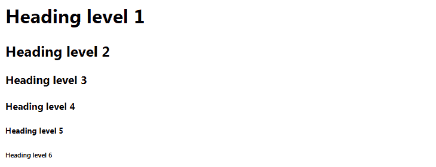

# HTML 标题

> 原文：<https://www.tutorialrepublic.com/html-tutorial/html-headings.php>

在本教程中，你将学习如何在 HTML 中创建标题。

## 用标题组织内容

标题有助于定义网页内容的层次和结构。

HTML 提供了六个级别的标题标签，从`<h1>`到`<h6>`；标题级别越低，其重要性越大——因此`<h1>`标签定义了最重要的标题，而`<h6>`标签定义了文档中最不重要的标题。

默认情况下，浏览器用比普通文本更大更粗的字体显示标题。另外，`<h1>`标题以最大字体显示，而`<h6>`标题以最小字体显示。

#### 例子

[Try this code »](../codelab.php?topic=html&file=headings "Try this code using online Editor")

```
<h1>Heading level 1</h1>
<h2>Heading level 2</h2>
<h3>Heading level 3</h3>
<h4>Heading level 4</h4>
<h5>Heading level 5</h5>
<h6>Heading level 6</h6>
```

—以上示例的输出类似于以下内容:

[](../codelab.php?topic=html&file=headings)  ***注意:**每次你在网页上放置一个标题标签，网页浏览器内置的样式表会自动在每个标题前后创建一些空白空间(称为边距)。您可以使用 CSS `[margin](../css-reference/css-margin-property.php)`属性来覆盖浏览器的默认样式表。*  **提示:你可以很容易地定制 HTML 标题标签的外观，比如它们的字体大小、粗细、字样等。使用 CSS [字体](/css-reference/css-font-property.php)属性。*  ** * *

## 标题的重要性

*   HTML 标题通过突出重要的主题和文档结构提供了有价值的信息，所以要仔细优化它们以提高用户参与度。
*   不要用标题让你的文本看起来很大或者很醒目。它们仅用于突出显示文档标题和显示文档结构。
*   因为搜索引擎，如谷歌，使用标题来索引网页的结构和内容，所以在你的网页中要非常明智地使用它们。
*   使用`<h1>`标题作为网页的主要标题，其次是`<h2>`标题，然后是不太重要的`<h3>`标题，依此类推。

 ***提示:**使用`<h1>`标签来标记最重要的标题，通常在页面的顶部。一个 HTML 文档通常应该只有一个`<h1>`标题，后面跟着更低级别的标题，如`<h2>`、`<h3>`、`<h4>`等等。***