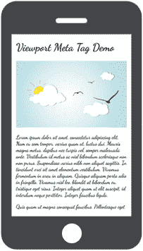
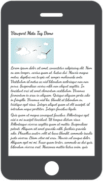

# HTML 元数据

> 原文：<https://www.tutorialrepublic.com/html-tutorial/html-meta.php>

在本教程中，你将学习如何使用 meta 标签来提供关于网页的元数据。

## 定义元数据

`<meta>`标签通常用于提供结构化元数据，如文档的*关键字*、*描述*、*作者姓名*、*字符编码*以及其他元数据。可以在 HTML 或 XHTML 文档的 [head section](html-head.php) 中放置任意数量的 meta 标签。

元数据不会显示在网页上，但可以被机器解析，并可以被浏览器、搜索引擎(如 Google)或其他网络服务使用。

以下部分描述了元标签的各种用途。

## 在 HTML 中声明字符编码

Meta 标签通常用于声明 HTML 文档中的字符编码。

#### 例子

[Try this code »](../codelab.php?topic=html&file=meta-character-encoding "Try this code using online Editor")

```
<!DOCTYPE html>
<html lang="en">
<head>
    <title>Declaring Character Encoding</title> 
    <meta charset="utf-8">
</head>
<body>
    <h1>Hello World!</h1>
</body>
</html>
```

要在 CSS 文档中设置字符编码，使用 [`@charset`](../css-reference/css-charset-rule.php) at 规则。

 ***注意:**[【UTF-8】](https://en.wikipedia.org/wiki/UTF-8)是一种非常通用的字符编码，推荐选择。但是，如果没有指定，则使用平台的默认编码。*  ** * *

## 定义文档的作者

您还可以使用 meta 标签来清楚地定义谁是网页的作者或创建者。

作者可以是个人、整个公司或第三方。

#### 例子

[Try this code »](../codelab.php?topic=html&file=meta-author-name "Try this code using online Editor")

```
<head>
    <title>Defining Document's Author</title>
    <meta name="author" content="Alexander Howick">
</head>
```

 ***注意:**meta 标签的`name`属性定义了一段文档级元数据的名称，而`content`属性给出了相应的值。`content`属性值可以包含文本和实体，但不能包含 HTML 标签。*  ** * *

## 搜索引擎的关键字和描述

一些搜索引擎使用元数据尤其是关键字和描述来索引网页；然而这不一定是真的。关键词赋予文档的关键词和描述额外的权重，提供页面的简短概要。这里有一个例子:

#### 例子

[Try this code »](../codelab.php?topic=html&file=meta-keywords-and-description "Try this code using online Editor")

```
<head>
    <title>Defining Keywords and Description</title>  
    <meta name="keywords" content="HTML, CSS, javaScript">
    <meta name="description" content="Easy to understand tutorials and references on HTML, CSS, javaScript and more..."> 
</head>
```

 *提示:当页面出现在搜索结果中时，搜索引擎通常会使用页面的元描述来创建页面的简短概要。元描述见[指南。](../faq/what-is-the-maximum-length-of-title-and-meta-description-tag.php)*  ** * *

## 为移动设备配置视区

您可以使用 viewport meta 标签在移动设备上正确显示网页。

如果没有 viewport meta 标签，移动浏览器会以典型的桌面屏幕宽度来呈现网页，然后将其缩小以适应移动屏幕。因此，在移动设备中需要缩放才能正确查看网页，这非常不方便。

下面的演示展示了两个网页——一个*带有视窗元标签*,另一个*没有设置视窗元标签*。在移动设备上打开这些链接，看看它是如何工作的。

[ With Viewport Meta Tag](/examples/html/page-with-viewport-meta-tag.html) [ Without Viewport Meta Tag](/examples/html/page-without-viewport-meta-tag.html) 

viewport meta 标签允许您设置在移动设备上查看网页的最佳视窗大小和缩放限制。典型的视口元标签定义如下所示:

#### 例子

[Try this code »](../codelab.php?topic=html&file=meta-viewport-tag "Try this code using online Editor")

```
<head>
    <title>Configuring the Viewport</title> 
    <meta name="viewport" content="width=device-width, initial-scale=1">
</head>
```

`content`属性中的`width=device-width`键-值对将视区的宽度设置为与设备的屏幕宽度相同，而`initial-scale=1`在浏览器首次加载页面时将初始比例或缩放级别设置为 100%。

 ***提示:**在你的网页中总是使用`<meta>` viewport 标签。它将使你的网站对用户友好，在手机和平板电脑等移动设备上更容易访问。****