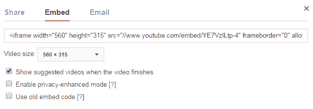

# HTML5 视频

> 原文：<https://www.tutorialrepublic.com/html-tutorial/html5-video.php>

在本教程中，你将学习如何在 HTML 文档中嵌入视频。

## 在 HTML 文档中嵌入视频

在网页上插入视频相对来说并不容易，因为 web 浏览器没有统一的标准来定义像视频这样的嵌入式媒体文件。

在这一章中，我们将展示一些在网页上添加视频的方法，从最新的 HTML5 `<video>`元素到流行的 YouTube 视频。

## 使用 HTML5 视频元素

新引入的 HTML5 `<video>`元素提供了一种在网页中嵌入视频的标准方式。然而，视频元素相对较新，但它可以在大多数现代 web 浏览器中工作。

下面的例子简单地将一个视频插入到 HTML 文档中，使用浏览器默认的控件集，其中一个源由`src`属性定义。

#### 例子

[Try this code »](../codelab.php?topic=html5&file=video-element "Try this code using online Editor")

```html
<video controls="controls" src="media/shuttle.mp4">
    Your browser does not support the HTML5 Video element.
</video>
```

使用浏览器默认控件集的视频，带有替代源。

#### 例子

[Try this code »](../codelab.php?topic=html5&file=video-element-with-alternative-sources "Try this code using online Editor")

```html
<video controls="controls">
    <source src="media/shuttle.mp4" type="video/mp4">
    <source src="media/shuttle.ogv" type="video/ogg">
    Your browser does not support the HTML5 Video element.
</video>
```

* * *

## 使用对象元素

元素用于将不同种类的媒体文件嵌入到一个 HTML 文档中。最初，这个元素用于插入 ActiveX 控件，但根据规范，对象可以是任何媒体对象，如视频、音频、PDF 文件、Flash 动画甚至图像。

下面的代码片段将 Flash 视频嵌入到网页中。

#### 例子

[Try this code »](../codelab.php?topic=html5&file=insert-video-using-object-element "Try this code using online Editor")

```html
<object data="media/blur.swf" width="400px" height="200px"></object>
```

只有支持 Flash 的浏览器或应用才能播放此视频。

 ***警告:**`[<object>](../html-reference/html-object-tag.php)`元素没有得到广泛的支持，并且很大程度上取决于被嵌入对象的类型。在许多情况下，其他方法可能是更好的选择。iPad 和 iPhone 设备不能显示 Flash 视频。*  ** * *

## 使用嵌入元素

元素用于将多媒体内容嵌入到 HTML 文档中。

下面的代码片段将 Flash 视频嵌入到网页中。

#### 例子

[Try this code »](../codelab.php?topic=html5&file=insert-video-using-embed-element "Try this code using online Editor")

```html
<embed src="media/blur.swf" width="400px" height="200px">
```

 ***警告:**然而，`<embed>`元素在当前的网络浏览器中得到了很好的支持，它也被定义为 HTML5 中的标准，但由于浏览器缺乏对 Flash 的支持或插件不可用，您的视频可能无法播放。*  ** * *

## 嵌入 YouTube 视频

这是在网页中嵌入视频文件最简单、最流行的方法。只需将视频上传到 YouTube 并插入 HTML 代码，就可以在您的网页中显示该视频。

下面是一个活生生的例子，后面是对整个过程的解释:

### 第一步:上传视频

转到 YouTube 上传视频页面，按照说明上传您的视频。

### 步骤 2:创建嵌入视频的 HTML 代码

当你在 YouTube 上打开你上传的视频时，你会在视频底部看到类似下图的东西。在 YouTube 中浏览并打开您上传的视频。现在，寻找位于视频正下方的共享按钮，如图所示。


当您单击“共享”按钮时，将会打开一个共享面板，显示更多按钮。现在，单击“嵌入”按钮，它将生成 HTML 代码，直接将视频嵌入到网页中。只需将代码复制并粘贴到您想要显示视频的 HTML 文档中，就万事俱备了。默认情况下，内嵌在 iframe 中的视频。



您可以进一步定制此嵌入代码，例如通过选择嵌入代码输入框下方的定制选项来更改视频大小。

下面的例子简单地嵌入了 YouTube 上的一个视频。让我们试一试:

#### 例子

[Try this code »](../codelab.php?topic=html5&file=embed-youtube-video "Try this code using online Editor")

```html
<!DOCTYPE html>
<html lang="en">
<head>
    <meta charset="utf-8">
    <title>YouTube Video</title>
</head>
<body>
    <iframe width="560" height="315" src="//www.youtube.com/embed/YE7VzlLtp-4" frameborder="0" allowfullscreen></iframe>
</body>
</html>
```

