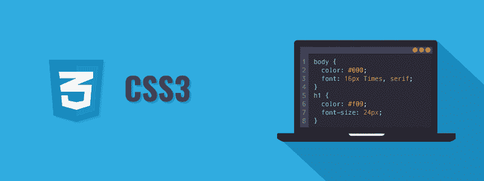

# CSS 教程

> 原文：<https://www.tutorialrepublic.com/css-tutorial/>

CSS 是网站设计中使用的关键表现技术。

CSS 代表级联样式表。CSS 是一种标准的样式表语言，用于描述网页的表现形式(即布局和格式)。

在 CSS 之前，几乎所有 HTML 文档的表示属性都包含在 HTML 标记中(特别是在 HTML 标签中)；所有的字体颜色、背景样式、元素对齐、边框和大小都必须在 HTML 中明确描述。

结果，大型网站的开发变成了一个漫长而昂贵的过程，因为样式信息被重复地添加到网站的每个页面上。

为了解决这个问题，万维网联盟(W3C)在 1996 年引入了 CSS，并保持了它的标准。CSS 的设计是为了实现表示和内容的分离。现在，web 设计人员可以将网页的格式信息转移到一个单独的样式表中，这将大大简化 HTML 标记，并提高可维护性。

CSS3 是 CSS 规范的最新版本。CSS3 增加了几个新的样式特性和改进，以增强 web 表示能力。

 ***注意:**我们的 CSS 教程将帮助你学习最新的 CSS3 语言的基础，从基础到高级的主题一步一步来。如果你是初学者，从基础部分开始，通过每天学习一点点逐步前进。*  ** * *

## 你能用 CSS 做什么

你可以用 CSS 做更多的事情。

*   您可以轻松地对多个元素应用相同的样式规则。
*   您可以使用单个样式表控制网站多个页面的显示。
*   您可以在不同的设备上以不同的方式呈现同一页面。
*   您可以设计元素的动态状态，如悬停、聚焦等。否则那是不可能的。
*   您可以在不更改标记的情况下更改元素在网页上的位置。
*   您可以改变现有 HTML 元素的显示。
*   您可以变换元素，如缩放、旋转、倾斜等。在 2D 或三维空间。
*   您可以不使用任何 JavaScript 创建动画和过渡效果。
*   您可以创建网页的打印友好版本。

这个列表并没有到此为止，你还可以用 CSS 做很多其他有趣的事情。在接下来的章节中，你将会详细地了解它们。

* * *

## 使用 CSS 的优势

CSS 的最大优势是它允许样式和布局与文档内容分离。这里有更多的优势，为什么应该开始使用 CSS？

*   CSS 节省大量时间 — CSS 为设置元素的样式属性提供了很大的灵活性。可以写一次 CSS 然后相同的代码可以应用于 HTML 元素组，也可以在多个 HTML 页面中重用。
*   **易于维护** — CSS 提供了一种简单的方法来更新文档的格式，并保持多个文档的一致性。因为可以使用一个或多个样式表轻松控制整组网页的内容。
*   **页面加载速度更快** — CSS 使多个页面能够共享格式信息，从而降低文档结构内容的复杂性和重复性。它显著减小了文件传输大小，从而加快了页面加载速度。
*   与 HTML 相比，CSS 拥有更广泛的表现能力，并能更好地控制网页的布局。因此，与 HTML 表示元素和属性相比，您可以让您的网页看起来更好。
*   **多种设备兼容性** — CSS 还允许网页针对多种类型的设备或媒体进行优化。使用 CSS，同一个 HTML 文档可以在不同的呈现设备(如桌面、手机等)上以不同的查看方式呈现。

 ***提示:**现在大多数的 [HTML 属性](../html-tutorial/html-attributes.php)都被弃用，不推荐使用。因此，尽可能多地使用 CSS 来增加网站的适应性并使其兼容未来的浏览器是一个好主意。*  ** * *

## 本教程涵盖的内容

这个 CSS 教程系列涵盖了 CSS 的所有基础知识，包括选择器的概念，设置颜色和背景的方法，格式化字体和文本的方式，设置用户界面元素的样式，如超链接，列表，表格等。以及 CSS 盒子模型的概念等等。

一旦您熟悉了基础知识，您将进入下一个层次，解释设置元素的尺寸和对齐方式、使用图像精灵在网页上定位元素的方法，以及相对和绝对单位的概念、可视化格式模型、显示和可见性、层、伪类和元素、媒体相关样式表等等。

最后，您将探索 CSS3 中引入的一些高级功能，如渐变颜色、投影效果、2D 和 3D 变换、alpha 透明度，以及创建过渡和动画效果的方法、flex 布局、滤镜效果、媒体查询的概念等。

 *提示:本教程的每一章都包含了大量真实世界的例子，你可以使用在线编辑器来尝试和测试。这些例子将帮助你更好地理解概念或主题。它还包含智能解决方案以及有用的提示和重要说明。***