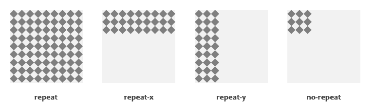
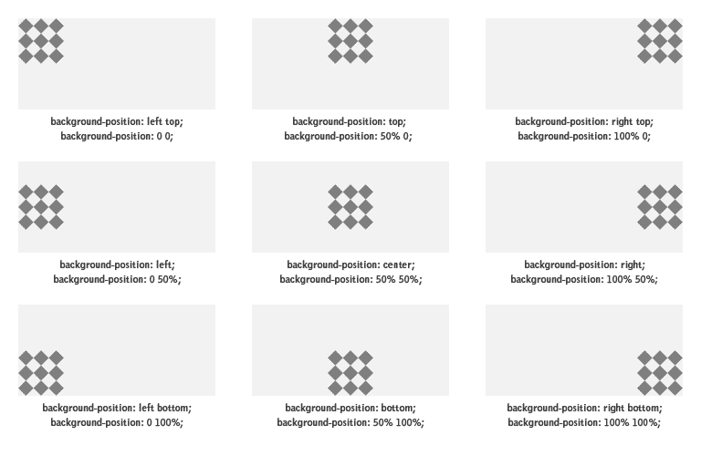

# CSS 背景

> 原文：<https://www.tutorialrepublic.com/css-tutorial/css-background.php>

在本教程中，你将学习如何使用 CSS 定义一个元素的背景样式。

## 设置背景属性

背景在网页的视觉呈现中起着重要的作用。

CSS 提供了几个属性来设计一个元素的背景，包括给背景上色，在背景中放置图片，管理图片的位置等等。

背景属性有`background-color`、`background-image`、`background-repeat`、`background-attachment`和`background-position`。

在下一节中，我们将更详细地讨论这些属性。

## 背景颜色

属性用来设置一个元素的背景颜色。

下面的例子演示了如何设置整个页面的背景色。

#### 例子

[Try this code »](../codelab.php?topic=css&file=background-color "Try this code using online Editor")

```css
body {
    background-color: #f0e68c;
}
```

CSS 中的颜色值通常以下列格式指定:

*   一个颜色的名字——像“红色”
*   类似“#ff0000”的十六进制值
*   一个类似 RGB 值的“rgb(255，0，0)”

请查看关于 [CSS 颜色](css-color.php)的教程，了解更多关于指定颜色值的信息。

* * *

## 背景图像

属性将图片设置为 HTML 元素的背景。

让我们看看下面这个为整个页面设置背景图片的例子。

#### 例子

[Try this code »](../codelab.php?topic=css&file=background-image "Try this code using online Editor")

```css
body {
    background-image: url("images/tile.png");
}
```

 ***注意:**将背景图像应用到元素时，确保您选择的图像不会影响元素文本内容的可读性。*  ****提示:**默认情况下，浏览器水平和垂直重复或平铺背景图像，以填充元素的整个区域。您可以使用`background-repeat`属性对此进行控制。*  ** * *

## 背景重复

属性允许你控制背景图片如何在元素的背景中重复或者平铺。您可以设定背景图像在垂直方向(y 轴)、水平方向(x 轴)、两个方向或两个方向都不重复。

让我们试试下面的例子，它演示了如何通过沿 x 轴水平重复切片图像来设置网页的渐变背景。

#### 例子

[Try this code »](../codelab.php?topic=css&file=background-repeat "Try this code using online Editor")

```css
body {
    background-image: url("images/gradient.png");
    background-repeat: repeat-x;
}
```

类似地，您可以使用值`repeat-y`沿 y 轴垂直重复背景图像，或者使用值`no-repeat`完全防止重复。

#### 例子

[Try this code »](../codelab.php?topic=css&file=disable-background-repeat "Try this code using online Editor")

```css
body {
    background-image: url("images/texture.png");
    background-repeat: no-repeat;
}
```

让我们看一下下面的插图来理解这个属性实际上是如何工作的。



* * *

## 背景位置

`background-position`属性用于控制背景图像的位置。

如果没有指定背景位置，背景图像被放置在元素的默认左上角位置，即`(0,0)`，让我们试试下面的例子:

#### 例子

[Try this code »](../codelab.php?topic=css&file=background-position "Try this code using online Editor")

```css
body {
    background-image: url("images/robot.png");
    background-repeat: no-repeat;
}
```

在下面的示例中，背景图像位于右上角。

#### 例子

[Try this code »](../codelab.php?topic=css&file=custom-background-position "Try this code using online Editor")

```css
body {
    background-image: url("images/robot.png");
    background-repeat: no-repeat;
    background-position: right top;
}
```

 ***注意:**如果为`background-position`属性指定了两个值，第一个值代表水平位置，第二个代表垂直位置。如果只指定了一个值，则假定第二个值是中心值。*  *除了关键字，您还可以使用百分比或[长度值](css-units.php)，例如该属性的`px`或`em`。

让我们看一下下面的插图来理解这个属性实际上是如何工作的。



* * *

## 背景附件

`background-attachment`属性确定背景图像相对于视窗是固定的还是随包含块一起滚动。

让我们尝试下面的例子来理解它的基本工作原理:

#### 例子

[Try this code »](../codelab.php?topic=css&file=background-attachment "Try this code using online Editor")

```css
body {
    background-image: url("images/bell.png");
    background-repeat: no-repeat;
    background-attachment: fixed;
}
```

* * *

## 背景速记属性

正如你在上面的例子中看到的，当处理背景时，有许多属性需要考虑。但是，也可以在一个属性中指定所有这些属性，以缩短代码或避免额外的键入。这就是所谓的速记属性。

`background`属性是用于一次性设置所有单独背景属性的简写属性，即 [`background-color`](../css-reference/css-background-color-property.php) 、 [`background-image`](../css-reference/css-background-image-property.php) 、 [`background-repeat`](../css-reference/css-background-repeat-property.php) 、 [`background-attachment`](../css-reference/css-background-attachment-property.php) 和 [`background-position`](../css-reference/css-background-position-property.php) 属性。让我们看看这是如何工作的:

#### 例子

[Try this code »](../codelab.php?topic=css&file=individual-background-properties "Try this code using online Editor")

```css
body {
    background-color: #f0e68c;
    background-image: url("images/smiley.png");
    background-repeat: no-repeat;
    background-attachment: fixed;
    background-position: 250px 25px;
}
```

使用简写符号，上面的例子可以写成:

#### 例子

[Try this code »](../codelab.php?topic=css&file=background-shorthand-property "Try this code using online Editor")

```css
body {
    background: #f0e68c url("images/smiley.png") no-repeat fixed 250px 25px;
}
```

当使用`background`速记属性时，属性值的顺序应该是。

background: *color* *image* *repeat* *attachment* *position*;

如果在使用速记符号时缺少或未指定单个背景属性的值，将使用该属性的默认值(如果有)。

 ***注意:**背景属性不像[颜色](css-color.php)属性那样继承，但是默认情况下父元素的背景是可见的，这是因为`background-color` CSS 属性的初始值或默认值`transparent`。****