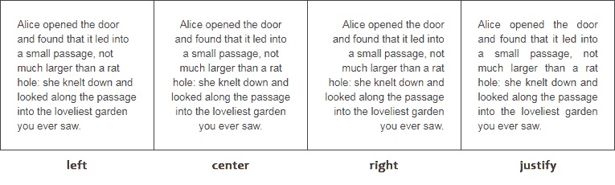

# CSS 文字

> 原文：<https://www.tutorialrepublic.com/css-tutorial/css-text.php>

在本教程中，你将学习如何使用 CSS 样式化网页上的文本。

## 用 CSS 格式化文本

CSS 提供了几个属性，允许您定义各种文本样式，如颜色、对齐、间距、装饰、变换等。非常简单有效。

常用的文本属性有:`text-align`、`text-decoration`、`text-transform`、`text-indent`、`line-height`、`letter-spacing`、`word-spacing`等等。这些属性让您可以精确控制*字符*、*单词*、*空格*等等的视觉外观。

让我们更详细地看看如何为元素设置这些文本属性。

## 文本颜色

文本的颜色由 CSS `color`属性定义。

以下示例中的样式规则将定义页面的默认文本颜色

#### 例子

[Try this code »](../codelab.php?topic=css&file=text-color "Try this code using online Editor")

```css
body {
    color: #434343;
}
```

虽然颜色属性看起来像是 CSS 文本的一部分，但它实际上是 CSS 中的一个独立属性。参见关于 [CSS 颜色](css-color.php)的教程，了解更多关于颜色属性的信息。

* * *

## 文本对齐

[`text-align`](../css-reference/css-text-align-property.php) 属性用于设置文本的水平对齐方式。

文本有四种对齐方式:左对齐、右对齐、居中对齐或两端对齐(左右边距)。

让我们看一个例子来理解这个属性是如何工作的。

#### 例子

[Try this code »](../codelab.php?topic=css&file=text-alignment "Try this code using online Editor")

```css
h1 {
    text-align: center;
}
p {
    text-align: justify;
}
```

 ***注意:**当`text-align`设置为`justify`时，每一行都被拉伸，使得每一行宽度相等(最后一行除外)，左右边距都是直的。这种对齐方式通常用于杂志和报纸等出版物。*  *让我们看一下下图，以了解这些值的实际含义。



* * *

## 文本装饰

[`text-decoration`](../css-reference/css-text-decoration-property.php) 属性用于设置或删除文本的修饰。

该属性通常接受下列值之一:`underline`、`overline`、`line-through`和`none`。你应该避免给不是链接的文本加下划线，因为这可能会让访问者感到困惑。

让我们尝试下面的例子来理解它的基本工作原理:

#### 例子

[Try this code »](../codelab.php?topic=css&file=text-decoration "Try this code using online Editor")

```css
h1 {
    text-decoration: overline;
}
h2 {
    text-decoration: line-through;
}
h3 {
    text-decoration: underline;
}
```

### 移除链接的默认下划线

属性被广泛地用于从 [HTML 超链接](/html-tutorial/html-links.php)中移除默认下划线。您可以进一步提供一些其他视觉提示，使其从普通文本中突出出来，例如，使用虚线边框而不是实线下划线。

让我们看一下下面的例子来理解它的基本工作原理:

#### 例子

[Try this code »](../codelab.php?topic=css&file=removing-underline-from-hyperlinks "Try this code using online Editor")

```css
a {
    text-decoration: none;
    border-bottom: 1px dotted;
}
```

 ***注意:**当你创建一个 [HTML 链接](../html-tutorial/html-links.php)时，内置在样式表中的浏览器会自动给它加下划线并应用蓝色，这样读者可以清楚地看到哪个文本是可点击的。*  ** * *

## 文本转换

`text-transform`属性用于设置文本的大小写。

文本通常是混合大小写。但是，在某些情况下，您可能希望以完全不同的大小写显示文本。使用此属性，您可以将元素的文本内容更改为大写或小写字母，或者大写每个单词的第一个字母，而无需修改原始文本。

让我们尝试下面的例子来理解它的基本工作原理:

#### 例子

[Try this code »](../codelab.php?topic=css&file=text-transform "Try this code using online Editor")

```css
h1 {
    text-transform: uppercase;
}
h2 {
    text-transform: capitalize;
}
h3 {
    text-transform: lowercase;
}
```

* * *

## 文本缩进

属性用于设置文本块中第一行文本的缩进。这通常是通过在第一行文本前插入空白来完成的。

缩进的大小可以使用百分比(%)、像素长度值、ems 等来指定。

下面的样式规则将段落的第一行缩进 100 像素。

#### 例子

[Try this code »](../codelab.php?topic=css&file=text-indent "Try this code using online Editor")

```css
p {
    text-indent: 100px;
}
```

 ***注意:**文本是从左边缩进*还是从右边*缩进*取决于元素内文本的方向，由 CSS [`direction`](../css-reference/css-direction-property.php) 属性定义。**  ** * *

## 字母间距

[`letter-spacing`](../css-reference/css-letter-spacing-property.php) 属性用于设置文本字符之间的额外间距。

该属性可以采用像素、ems 等形式的长度值。它也可能接受负值。设置字母间距时，长度值表示除默认字符间距之外的间距。

让我们看看下面的例子来理解它是如何工作的:

#### 例子

[Try this code »](../codelab.php?topic=css&file=letter-spacing "Try this code using online Editor")

```css
h1 {
    letter-spacing: -3px;
}
p {
    letter-spacing: 10px;
}
```

* * *

## 单词间距

`word-spacing`属性用于指定单词之间的额外间距。

该属性可以接受以像素、ems 等为单位的长度值。负值也是允许的。

让我们尝试下面的例子来理解这个属性是如何工作的:

#### 例子

[Try this code »](../codelab.php?topic=css&file=word-spacing "Try this code using online Editor")

```css
p.normal {
    word-spacing: 20px;
}
p.justified {
    word-spacing: 20px;
    text-align: justify;
}
p.preformatted {
    word-spacing: 20px;
    white-space: pre;
}
```

 ***注意:**文字间距会受到文字对齐方式的影响。此外，即使保留空白，单词之间的空格也会受到`word-spacing`属性的影响。*  ** * *

## 行高

[`line-height`](../css-reference/css-line-height-property.php) 属性用于设置文本行的高度。

它也被称为*前导*，通常用于设置文本行之间的距离。

该属性的值可以是数字、百分比(%)或以像素、ems 为单位的长度等。

#### 例子

[Try this code »](../codelab.php?topic=css&file=line-height "Try this code using online Editor")

```css
p {
    line-height: 1.2;
}
```

当该值是一个数字时，行高的计算方法是将元素的字体大小乘以该数字。而百分比值是相对于元素的字体大小的。

 ***注意:**`line-height`属性不允许负值。该属性也是 CSS [字体](../css-reference/css-font-property.php)速记属性的一个组件。*  *如果某个元素的`line-height`属性的值大于 [`font-size`](../css-reference/css-font-size-property.php) 的值，这个差值(称为*【前导】*)将被减半(称为*【半前导】*)，并平均分布在内嵌框的顶部和底部。让我们来看一个例子:

#### 例子

[Try this code »](../codelab.php?topic=css&file=half-leading "Try this code using online Editor")

```css
p {
    font-size: 14px;
    line-height: 20px;
    background-color: #f0e68c;
}
```

参见高级章节中关于 [CSS3 文本溢出](css3-text-overflow.php)的教程，了解如何处理溢出的文本。同样参见 [CSS3 文本阴影](css3-drop-shadows.php#text-shadow)部分，了解如何在文本上应用阴影效果。*****