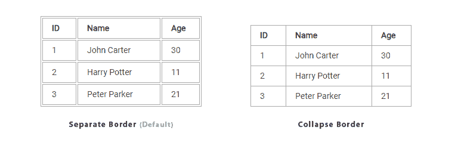
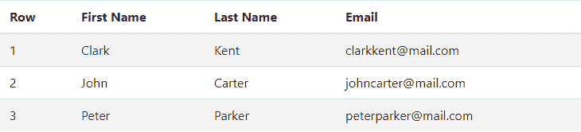

# CSS 表格

> 原文：<https://www.tutorialrepublic.com/css-tutorial/css-tables.php>

在本教程中，你将学习如何用 CSS 样式化 HTML 表格。

## 用 CSS 样式化表格

表格通常用于显示表格数据，如财务报表。

但是当你创建一个没有任何样式或属性的 HTML 表时，浏览器显示它们时没有任何边框。有了 CSS，你可以大大改善你的表格的外观。

CSS 提供了几个属性，允许您控制表格元素的布局和显示。在下一节中，您将看到如何使用 CSS 来创建优雅且一致的表格。

## 给表格添加边框

CSS [`border`](../css-reference/css-border-property.php) 属性是定义表格边框的最佳方式。

以下示例将为 [`<table>`](../html-reference/html-table-tag.php) 、 [`<th>`](../html-reference/html-th-tag.php) 和 [`<td>`](../html-reference/html-td-tag.php) 元素设置黑色边框。

#### 例子

[Try this code »](../codelab.php?topic=css&file=set-table-borders "Try this code using online Editor")

```css
table, th, td {
    border: 1px solid black;
}
```

默认情况下，browser 会在表格和所有单元格周围绘制一个边框，并在中间留出一些空间，这将导致双边框。要消除这种双边框问题，您可以简单地折叠相邻的表单元格边框，并创建干净的单线边框。

让我们看看下面的插图，了解如何将边框应用于表格。



* * *

## 折叠表格边框

CSS 中设置表单元格边框有两种截然不同的模式:*分离*和*折叠*。

在默认的单独边框模型中，每个表单元格都有自己独特的边框，而在折叠边框模型中，相邻的表单元格共享一个公共边框。您可以使用 CSS `border-collapse`属性为 HTML 表格设置边框模型。

以下样式规则将折叠表单元格边框，并应用一个像素的黑色边框。

#### 例子

[Try this code »](../codelab.php?topic=css&file=merge-table-borders "Try this code using online Editor")

```css
table {
    border-collapse: collapse;
}
th, td {
    border: 1px solid black;
}
```

 ***注意:**您也可以通过将 CSS [`border-spacing`](../css-reference/css-border-spacing-property.php) 属性的值设置为 0 来删除表单元格边框之间的空格。然而，它只是移除了空间，而没有像你设置`border-collapse`为`collapse`时那样合并边界。*  ** * *

## 调整表格内的空间

默认情况下，浏览器创建的表单元格的大小刚好足以容纳单元格中的数据。

要在表单元格内容和单元格边框之间添加更多空间，只需使用 CSS `padding`属性。让我们试试下面的例子，看看它是如何工作的:

#### 例子

[Try this code »](../codelab.php?topic=css&file=set-table-cell-padding "Try this code using online Editor")

```css
th, td {
    padding: 15px;
}
```

如果表格的边框是分隔的(这是默认设置)，您还可以使用 CSS [`border-spacing`](/css-reference/css-border-spacing-property.php) 属性来调整单元格边框之间的间距。

以下样式规则在表格内的所有边框之间应用 10 像素的间距:

#### 例子

[Try this code »](../codelab.php?topic=css&file=set-table-cell-spacing "Try this code using online Editor")

```css
table {
    border-spacing: 10px;
}
```

* * *

## 设置表格宽度和高度

默认情况下，表格呈现的宽度和高度足以容纳其所有内容。

但是，您也可以使用`width`和`height` CSS 属性显式设置表格及其单元格的宽度和高度。下例中的样式规则将表格的宽度设置为 100%，表格标题单元格的高度设置为 40px。

#### 例子

[Try this code »](../codelab.php?topic=css&file=set-table-width-and-height "Try this code using online Editor")

```css
table {
    width: 100%;
}
th {
    height: 40px;
}
```

* * *

## 控制表格布局

表格可以扩展和收缩以容纳其中包含的数据。这是默认行为。当数据填充到表中时，只要还有空间，它就会继续扩展。但是，有时为了管理布局，有必要为表格设置固定的宽度。

你可以在 CSS `table-layout`属性的帮助下做到这一点。此属性定义用于布局表单元格、行和列的算法。该属性采用两个值之一:

*   **自动** —使用自动表格布局算法。使用这种算法，表格及其单元格的宽度会根据内容进行调整。这是默认值。
*   **固定** —使用固定表格布局算法。使用这种算法，表格的水平布局不依赖于单元格的内容；它只取决于表格的宽度、列的宽度以及边框或单元格间距。它通常比汽车快。

以下示例中的样式规则指定 HTML 表格使用固定布局算法进行布局，并具有 300 像素的固定宽度。让我们尝试一下，看看它是如何工作的:

#### 例子

[Try this code »](../codelab.php?topic=css&file=table-layout-property "Try this code using online Editor")

```css
table {
    width: 300px;
    table-layout: fixed;
}
```

 ***提示:**您可以通过为`table-layout`属性指定值`fixed`来优化表格呈现性能。此属性的固定值导致表一次呈现一行，从而以更快的速度向用户提供信息。*  ****注意:**如果没有大型表格上`table-layout`属性的`fixed`值，用户将看不到表格的任何部分，直到浏览器呈现整个表格。*  ** * *

## 对齐表单元格内的文本

您可以水平或垂直对齐表单元格内的文本内容。

### 单元格内容的水平对齐

对于表单元格内文本的水平对齐，您可以像使用其他元素一样使用`text-align`属性。您可以将文本左对齐、右对齐、居中对齐或两端对齐。

以下样式规则将使`<th>`元素中的文本左对齐。

#### 例子

[Try this code »](../codelab.php?topic=css&file=horizontal-align-text-in-table-cells "Try this code using online Editor")

```css
th {
    text-align: left;
}
```

 ***注意:**`<td>`元素内的文本默认左对齐，而`<th>`元素内的文本默认居中对齐并以粗体显示。*  *### 单元格内容的垂直对齐

类似地，您可以使用 CSS `vertical-align`属性将`<th>`和`<td>`元素中的内容垂直对齐到顶部、底部或中间。默认的垂直对齐方式是居中。

以下样式规则将垂直底部对齐`<th>`元素中的文本。

#### 例子

[Try this code »](../codelab.php?topic=css&file=vertical-align-text-in-table-cells "Try this code using online Editor")

```css
th {
    height: 40px;
    vertical-align: bottom;
}
```

* * *

## 控制表格标题的位置

您可以使用 CSS `caption-side`属性设置表格标题的垂直位置。

标题可以放在表格的顶部或底部。默认位置是顶部。

#### 例子

[Try this code »](../codelab.php?topic=css&file=caption-side-property "Try this code using online Editor")

```css
caption {
    caption-side: bottom;
}
```

 ***提示:**要更改表格标题文本的水平对齐方式(例如，左对齐或右对齐)，您可以简单地使用 CSS [`text-align`](../css-reference/css-text-align-property.php) 属性，就像您处理普通文本一样。*  ** * *

## 处理空单元格

在默认情况下使用单独边框模型的表格中，您还可以使用`empty-cells` CSS 属性控制没有可见内容的单元格的呈现。

该属性接受值`show`或`hide`。默认值是`show`，它将空单元格呈现为普通单元格，但是如果指定了值`hide`，则空单元格周围不会绘制任何边框或背景。让我们尝试一个例子来理解它是如何工作的:

#### 例子

[Try this code »](../codelab.php?topic=css&file=empty-cells-property "Try this code using online Editor")

```css
table {
    border-collapse: separate;
    empty-cells: hide;
}
```

 ***注意:**在表单元格内放置一个不间断空格(`&nbsp;`)使其非空。因此，即使单元格看起来是空的，`hide`值也不会隐藏边框和背景。*  ** * *

## 创建斑马纹表格

为替换行设置不同的背景颜色是一种流行的技术，可以提高包含大量数据的表格的可读性。这就是通常所说的斑马纹表。

您可以通过使用 CSS `:nth-child()` [伪类](css-pseudo-classes.php)选择器简单地实现这种效果。

下面的样式规则将突出显示表体中的每一个奇数行。

#### 例子

[Try this code »](../codelab.php?topic=css&file=create-zebra-striped-table "Try this code using online Editor")

```css
tbody tr:nth-child(odd) {
    background-color: #f2f2f2;
}
```

斑马条纹的桌子通常看起来如下图所示。

[](../codelab.php?topic=css&file=create-zebra-striped-table)  ***注意:**`:nth-child()`伪类根据元素在一组兄弟元素中的位置来选择元素。它可以采用数字、关键字 even 或 odd，或者 xn+y 形式的表达式，其中 x 和 y 是整数(例如，1n，2n，2n+1，...)作为论据。*  ** * *

## 让桌子有反应

表本质上是没有响应的。但是，为了支持移动设备，您可以通过在小屏幕上启用水平滚动来增加表格的响应能力。为此，只需用一个`<div>`元素包装您的表格，并应用样式`overflow-x: auto;`，如下所示:

#### 例子

[Try this code »](../codelab.php?topic=css&file=create-responsive-table "Try this code using online Editor")

```css
<div style="overflow-x: auto;"> 
    <table>
        ... table content ...
    </table>
</div>
```

