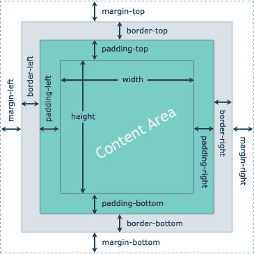

# CSS 盒子模型

> 原文：<https://www.tutorialrepublic.com/css-tutorial/css-box-model.php>

在本教程中，你将学习元素在网页上的视觉布局。

## 什么是箱式模型？

可以在网页上显示的每个元素都由一个或多个矩形框组成。CSS 盒子模型通常描述这些矩形框在网页上的布局。这些框可以有不同的属性，可以以不同的方式相互交互，但是每个框都有一个 ***内容区域*** 和可选的周围 ***填充*** 、 ***边框*** 和 ***边距区域*** 。

下图演示了 CSS 的宽度、高度、填充、边框和边距属性如何确定元素在网页上可以占据的空间。



Padding 是元素内容和它的边框(如果没有边框，则是框的边缘)之间的透明空间，而 margin 是边框周围的透明空间。

同样，如果一个元素有[背景色](css-background.php)，那么它将通过填充区域可见。空白区域始终保持透明，它不受元素背景颜色的影响，但是，它会使父元素的背景颜色透过它被看到。

* * *

## 元素的宽度和高度

通常当你使用 CSS [`width`](../css-reference/css-width-property.php) 和 [`height`](../css-reference/css-width-property.php) 属性设置一个元素的宽度和高度时，实际上你只是设置了该元素内容区域的宽度和高度。元素框的实际宽度和高度取决于几个因素。

元素的框在网页上可能占据的实际空间是这样计算的:

| 盒子大小 | CSS 属性 |
| 总宽度 | `width + padding-left + padding-right + border-left + border-right + margin-left + margin-right` |
| 总高度 | `height + padding-top + padding-bottom + border-top + border-bottom + margin-top + margin-bottom` |

你将在接下来的章节中详细了解这些 CSS 属性。

现在让我们尝试下面的例子来理解盒子模型实际上是如何工作的:

#### 例子

[Try this code »](../codelab.php?topic=css&file=box-formatting-model "Try this code using online Editor")

```
div {
    width: 300px;
    height: 200px;
    padding: 15px; /* set padding for all four sides */
    border: 10px solid black; /* set border for all four sides */
    margin: 20px auto; /* set top and bottom margin to 20 pixels, and left and right margin to auto */
}
```

 ***注:**在 CSS 盒子模型中；元素框的内容区域是其内容(例如，文本、图像、视频等)所在的区域。出现。它还可能包含后代元素框。*