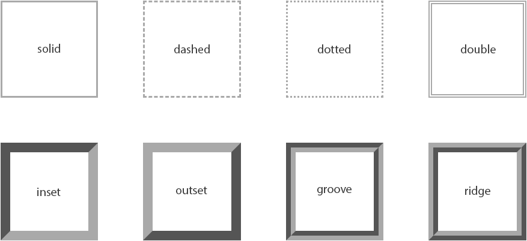

# CSS 边框

> 原文：<https://www.tutorialrepublic.com/css-tutorial/css-border.php>

在本教程中，你将学习如何使用 CSS 定义一个元素的边框。

## CSS 边框属性

CSS 边框属性允许你定义一个元素的边框区域。

边框直接出现在元素的边距和填充之间。边框可以是预定义的样式，如实线、虚线、双线等。或者[一个图像](css3-border.php)。

以下部分描述如何设置边框的样式、颜色和宽度。

## 了解不同的边框样式

[`border-style`](../css-reference/css-border-style-property.php) 属性设置盒子边框的样式，如:`solid`、`dotted`等。这是一个快捷的属性，用于设置元素边框四边的线条样式。

`border-style`属性可以有以下值:`none`、`hidden`、`solid`、`dashed`、`dotted`、`double`、`inset`、`outset`、`groove`和`ridge`。现在，让我们来看看下面的插图，它给你一个边界风格类型之间的差异的感觉。



值`none`和`hidden`显示无边框，但是，这两个值之间有细微的差别。在表格单元格和边框折叠的情况下，如果设置了任何其他冲突的边框，`none`值具有最低的优先级，而`hidden`值具有最高的*优先级。*

值`inset`、`outset`、`groove`和`ridge`产生类似 3D 的效果，这基本上取决于`border-color`值。这通常是通过用比边框颜色稍亮和稍暗的两种颜色创建“阴影”来实现的。让我们来看一个例子:

#### 例子

[Try this code »](../codelab.php?topic=css&file=border-style-property "Try this code using online Editor")

```
h1 {
    border-style: dotted;
}
p {
    border-style: ridge;
}
```

 ***注意:**你必须指定一个边框样式来使边框出现在元素周围，因为默认的边框样式是`none`。然而，默认的边框宽度或厚度是`medium`，并且默认的边框颜色与文本颜色相同。*  ** * *

## 设置边框宽度

[`border-width`](../css-reference/css-border-width-property.php) 属性指定边框区域的宽度。它是一个简写属性，用于同时设置元素边框的所有四条边的粗细。

让我们尝试下面的例子来理解它是如何工作的:

#### 例子

[Try this code »](../codelab.php?topic=css&file=border-width-property "Try this code using online Editor")

```
p {
    border-style: dashed;
    border-width: 10px;
}
```

 ***提示:**可以使用任何长度值来指定边框宽度，比如 px、em、rem 等等。除了长度单位，也可以使用三个关键字之一来指定边框宽度:`thin`、`medium`和`thick`。不允许百分比值。*  ** * *

## 指定边框颜色

[`border-color`](../css-reference/css-border-color-property.php) 属性指定了边界区域的 [`color`](../css-reference/css-color-property.php) 。这也是一个设置元素边框四边颜色的简写属性。

以下样式规则在段落周围添加红色实心边框。

#### 例子

[Try this code »](../codelab.php?topic=css&file=border-color-property "Try this code using online Editor")

```
p {
    border-style: solid;
    border-color: #ff0000;
}
```

 ***注意:**CSS`border-width`或`border-color`属性单独使用时不起作用。首先使用`border-style`属性设置边框的样式。*  ** * *

## 边框速记属性

[`border`](../css-reference/css-border-property.php) CSS 属性是用于在单个规则中设置一个或多个单独的边框属性`border-width`、`border-style`和`border-color`的简写属性。

让我们看一下下面的例子来理解它是如何工作的:

#### 例子

[Try this code »](../codelab.php?topic=css&file=border-shorthand-property-01 "Try this code using online Editor")

```
p {
    border: 5px solid #00ff00;
}
```

如果在设置 border 速记属性时省略或未指定单个 border 属性的值，将使用该属性的默认值(如果有)。

例如，如果设置边框时缺少或未指定 [`border-color`](../css-reference/css-border-color-property.php) 属性的值，则元素的 [`color`](css-color.php) 属性将用作边框颜色的值。

在下面的示例中，边框将是一条 5 像素宽的红色实线:

#### 例子

[Try this code »](../codelab.php?topic=css&file=border-shorthand-property-02 "Try this code using online Editor")

```
p {
    color: red;
    border: 5px solid;
}
```

但是，在`border-style`的情况下，省略该值将导致根本不显示边框，因为该属性的默认值是`none`。在下面的示例中，没有边框:

#### 例子

[Try this code »](../codelab.php?topic=css&file=border-shorthand-property-03 "Try this code using online Editor")

```
p {
    border: 5px #00ff00;
}
```***