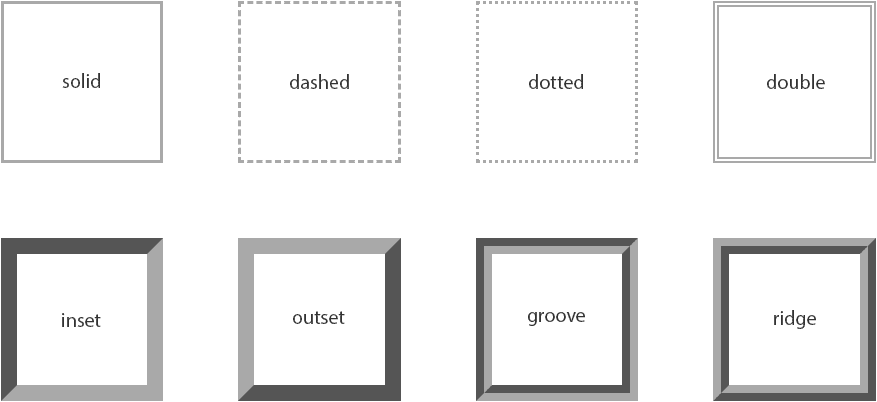

# CSS 大纲

> 原文：<https://www.tutorialrepublic.com/css-tutorial/css-outline.php>

在本教程中，你将学习如何使用 CSS 定义一个元素的轮廓。

## CSS 大纲属性

CSS outline 属性允许您定义元素框周围的轮廓区域。

轮廓是绘制在元素边框边缘之外的线条。轮廓通常用于指示按钮、链接、表单域等元素的焦点或活动状态。

以下部分描述了如何设置轮廓的样式、颜色和宽度。

## 轮廓与边框

轮廓看起来与边框非常相似，但它在以下方面与边框不同:

*   轮廓不占用空间，因为它们总是放在元素框的顶部，这可能会导致它们与页面上的其他元素重叠。
*   与边框不同，轮廓不允许我们为每条边设置不同的宽度，或者为每条边设置不同的颜色和样式。轮廓在所有方面都是相同的。
*   除了重叠之外，轮廓对周围元素没有任何影响。
*   与边框不同，轮廓不会改变元素的大小或位置。
*   轮廓可以是非矩形的，但不能创建圆形轮廓。

 ***注意:**如果你在一个元素上加了一个轮廓，它在网页上所占的空间和你在这个元素上没有轮廓时一样多。因为它重叠了[边距](css-margin.php)(边框外的透明区域)和周围的元素。*  ** * *

## 了解不同的大纲样式

[`outline-style`](../css-reference/css-outline-style-property.php) 属性设置元素轮廓的样式，如:`solid`、`dotted`等。

`outline-style`属性可以是下列值之一:`none`、`solid`、`dashed`、`dotted`、`double`、`inset`、`outset`、`groove`和`ridge`。现在，让我们来看看下面的插图，它给你一个大纲风格类型之间的差异的感觉。



值`none`不显示轮廓。值`inset`、`outset`、`groove`和`ridge`产生类似 3D 的效果，这基本上取决于值`outline-color`。这通常是通过用比轮廓颜色稍亮和稍暗的两种颜色创建“阴影”来实现的。

让我们试试下面的例子，看看它是如何工作的:

#### 例子

[Try this code »](../codelab.php?topic=css&file=outline-style-property "Try this code using online Editor")

```css
h1 {
    outline-style: dotted;
}
p {
    outline-style: ridge;
}
```

 ***注意:**你必须指定一个轮廓样式来使轮廓出现在元素周围，因为默认的轮廓样式是`none`。然而，默认轮廓宽度或厚度是`medium`，并且默认轮廓颜色与文本颜色相同。*  ** * *

## 设置轮廓宽度

属性指定要添加到元素上的轮廓的宽度。

让我们尝试下面的例子来理解它实际上是如何工作的:

#### 例子

[Try this code »](../codelab.php?topic=css&file=outline-width-property "Try this code using online Editor")

```css
p {
    outline-style: dashed;
    outline-width: 10px;
}
```

 ***提示:**轮廓宽度可以用任何长度值来指定，比如 px、em、rem 等等。也可以使用三个关键字之一来指定:`thin`、`medium`和`thick`。不允许百分比或负值—就像 [`border-width`](../css-reference/css-border-width-property.php) 属性一样。*  ** * *

## 指定轮廓颜色

`outline-color`属性设置轮廓的颜色。

该属性接受的值与用于 [`color`](css-color.php) 属性的值相同。

以下样式规则在段落周围添加蓝色的实心轮廓。

#### 例子

[Try this code »](../codelab.php?topic=css&file=outline-color-property "Try this code using online Editor")

```css
p {
    outline-style: solid;
    outline-color: #0000ff;
}
```

 ***注意:**CSS`outline-width`或`outline-color`属性单独使用时不起作用。首先使用`outline-style`属性设置轮廓的样式。*  ** * *

## 大纲速记属性

`outline` CSS 属性是用于在单个规则中设置一个或多个单独轮廓属性`outline-style`、`outline-width`和`outline-color`的简写属性。

让我们看一下下面的例子来理解它是如何工作的:

#### 例子

[Try this code »](../codelab.php?topic=css&file=outline-shorthand-property-01 "Try this code using online Editor")

```css
p {
    outline: 5px solid 	#ff00ff;
}
```

如果在设置大纲速记属性时省略或未指定单个大纲属性的值，将使用该属性的默认值(如果有)。

例如，如果在设置轮廓时缺少或未指定 [`outline-color`](../css-reference/css-outline-color-property.php) 属性的值，则元素的 [`color`](css-color.php) 属性将用作轮廓颜色的值。

在下面的示例中，轮廓将是一条 5px 宽的绿色实线:

#### 例子

[Try this code »](../codelab.php?topic=css&file=outline-shorthand-property-02 "Try this code using online Editor")

```css
p {
    color: green;
    outline: 5px solid;
}
```

但是，在 [`outline-style`](../css-reference/css-outline-style-property.php) 的情况下，省略该值将导致根本不显示轮廓，因为该属性的默认值是`none`。在下面的示例中，没有大纲:

#### 例子

[Try this code »](../codelab.php?topic=css&file=outline-shorthand-property-03 "Try this code using online Editor")

```css
p {
    outline: 5px #00ff00;
}
```

* * *

## 移除活动链接周围的轮廓

属性广泛用于移除活动链接周围的轮廓。

但是，建议应用一些替代样式来指示链接具有焦点。

让我们试试下面的例子，看看它是如何工作的:

#### 例子

[Try this code »](../codelab.php?topic=css&file=remove-outline "Try this code using online Editor")

```css
a, a:active, a:focus {
    outline: none;
}
```****