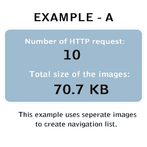
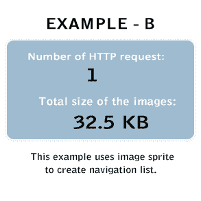
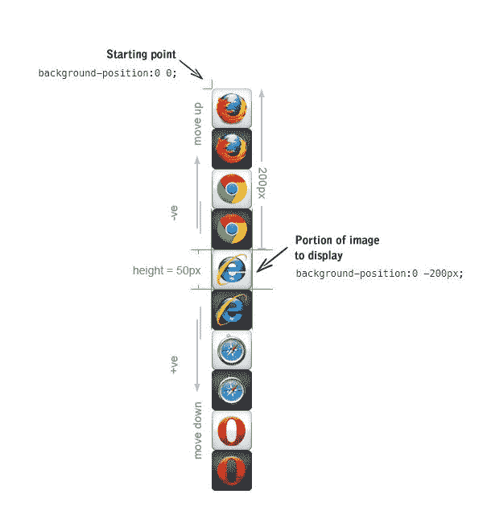

# CSS 精灵

> 原文：<https://www.tutorialrepublic.com/css-tutorial/css-sprites.php>

CSS sprites 技术是一种通过在单个文件中组合图像来减少对图像资源的 HTTP 请求数量的方法。

## 什么是雪碧

精灵是二维图像，由小图像在定义的 X 和 Y 坐标上组合成一个更大的图像。

要显示组合图像中的单个图像，可以使用 CSS [`background-position`](../css-reference/css-background-position-property.php) 属性，定义要显示的图像的确切位置。

## 使用 CSS 图像精灵的优势

一个有许多图像的网页，特别是许多小图像，如图标、按钮等。可能需要很长时间来加载并生成多个服务器请求。

使用图像精灵而不是单独的图像将大大减少浏览器向服务器发出的 HTTP 请求的数量，这对于改善网页的加载时间和网站的整体性能非常有效。

 ***注意:**减少 HTTP 请求的数量对减少响应时间具有重要影响，这使得网页对用户的响应更快。*  *看看下面的例子，你会发现一个明显的区别；当您第一次将鼠标指针放在非精灵版本的浏览器图标上时，悬停图像会在一段时间后出现，这是因为悬停图像是在鼠标悬停时从服务器加载的，因为普通图像和悬停图像是两种不同的图像。

而在 sprite 版本中，由于所有图像都组合在一个图像中，鼠标悬停时悬停图像会立即显示，从而产生平滑的悬停效果。

| 

*   [Firefox](javascript:void(0);)
*   [铬合金](javascript:void(0);)
*   [探险家](javascript:void(0);)
*   [狩猎之旅](javascript:void(0);)
*   [歌剧](javascript:void(0);)

 |  |

| 

*   [Firefox](javascript:void(0);)
*   [铬合金](javascript:void(0);)
*   [探险家](javascript:void(0);)
*   [狩猎之旅](javascript:void(0);)
*   [歌剧](javascript:void(0);)

 |  |

使用 CSS sprite 技术在:[ [EXAMPLE - B](#example-b) ]中演示；与[ [示例- A](#example-a) ]相比，我们能够将 HTTP 请求的数量减少 9 个，图像的总文件大小减少 38.2 KB.对于这样一个小例子来说，这是一个相当大的改进。想象一下你可以在一个完整的网站上做什么。

下面解释了创建这个示例的整个过程。

* * *

## 制作图像精灵

我们通过将 10 个独立的图像组合成一个图像来制作这个精灵图像([mySprite.png](/limg/mySprite.png))。你可以使用任何你喜欢的图像编辑工具来创建你自己的精灵。

 ***提示:**为了简单起见，我们使用了所有相同大小的图标，并将它们彼此靠近放置，以便于偏移计算。*  ** * *

## 显示图像精灵中的图标

最后，利用 CSS，我们可以只显示我们需要的图像精灵的一部分。

首先，我们将创建类`.sprite`来加载我们的精灵图像。这是为了避免重复，因为所有项目共享相同的背景图像。

#### 例子

[Try this code »](../codelab.php?topic=css&file=display-individual-icon-from-image-sprite "Try this code using online Editor")

```
.sprite {
    background: url("images/mySprite.png") no-repeat;
}
```

现在，我们必须为想要显示的每个项目定义一个类。例如，要从图像精灵中显示 Internet Explorer 图标，CSS 代码应该是。

#### 例子

[Try this code »](../codelab.php?topic=css&file=display-individual-icon-from-image-sprite "Try this code using online Editor")

```
.ie {
    width: 50px; /* Icon width */
    height: 50px; /* Icon height */
    display: inline-block; /* Display icon as inline block */
    background-position: 0 -200px; /* Icon background position in sprite */
}
```

现在问题来了，我们是怎么得到 [`background-position`](../css-reference/css-background-position-property.php) 的那些像素值的？让我们找出答案。第一个值是背景的*水平位置*，第二个值是背景的*垂直位置*。由于 Internet Explorer 图标的左上角接触到左边缘，所以它与图像子画面的起点即左上角的水平距离是 **0** ，由于它被放置在*第 5 个位置*，所以它与图像子画面起点的垂直距离是`4 X 50px = 200px`，因为每个图标的高度是 **50px** 。

要显示 Internet Explorer 图标，我们必须将其左上角移动到起点，即图像精灵(mySprite.png)的左上角。此外，由于这个图标被放置在垂直距离为 **200px** 处，我们需要将整个背景图像(mySprite.png)垂直向上移动 **200px** ，这需要我们将该值作为负数应用，即 **-200px** ，因为负值会使其垂直向上移动，而正值会使其向下移动。但是，它不需要水平偏移，因为在 Internet Explorer 图标的左上角之前没有像素。

 ***提示:**在接下来的例子中，只需摆弄一下 [`background-position`](../css-reference/css-background-position-property.php) 属性的值，您将很快学会补偿是如何工作的。*  ** * *

## 使用 CSS 图像精灵创建导航菜单

在上一节中，我们学习了如何显示图像精灵中的单个图标。这是使用图像精灵的最简单的方法，现在我们更进一步，构建一个带有*翻转效果*的导航菜单，如[示例- B](#example-b) 所示。

这里我们将使用相同的精灵图像([mySprite.png](/limg/mySprite.png))来创建我们的导航菜单。

## 导航的基础 HTML

我们将从创建带有 HTML [无序列表](../html-tutorial/html-lists.php#unordered-lists)的导航菜单开始。

#### 例子

[Try this code »](../codelab.php?topic=css&file=sprite-menu-markup "Try this code using online Editor")

```
<ul class="menu">
    <li class="firefox"><a href="#">Firefox</a></li>
    <li class="chrome"><a href="#">Chrome</a></li>
    <li class="ie"><a href="#">Explorer</a></li>
    <li class="opera"><a href="#">Opera</a></li>
    <li class="safari"><a href="#">Safari</a></li>
</ul>
```

## 在导航中应用 CSS

下面几节将向你介绍如何使用 CSS 将上面例子中给出的简单无序列表转换成基于恶意图片的导航。

### 步骤 1:重置列表结构

默认情况下，HTML [无序列表](../html-tutorial/html-lists.php#unordered-lists)用项目符号显示。我们需要通过将 [`list-style-type`](../css-reference/css-list-style-type-property.php) 属性设置为`none`来移除默认的项目符号。

#### 例子

[Try this code »](../codelab.php?topic=css&file=resetting-menu-list-structure "Try this code using online Editor")

```
ul.menu {
    list-style-type: none;
}
ul.menu li {
    padding: 5px;
    font-size: 16px;
    font-family: "Trebuchet MS", Arial, sans-serif;
}
```

### 步骤 2:为每个链接设置公共属性

在这一步中，我们将设置所有链接将要共享的所有公共 CSS 属性。如， [`color`](../css-reference/css-color-property.php) ， [`background-image`](../css-reference/css-background-image-property.php) ， [`display`](../css-reference/css-display-property.php) ， [`padding`](../css-reference/css-padding-property.php) 等。

#### 例子

[Try this code »](../codelab.php?topic=css&file=setting-common-links-properties "Try this code using online Editor")

```
ul.menu li a {
    height: 50px;
    line-height: 50px;
    display: inline-block;
    padding-left: 60px; /* To sift text off the background-image */
    color: #3E789F;
    background: url("images/mySprite.png") no-repeat; /* As all link share the same background-image */
}
```

### 步骤 3:设置每个链接的默认状态

现在，我们必须为每个菜单项定义一个类，因为图像精灵中的每个菜单项都有不同的 [`background-position`](../css-reference/css-background-position-property.php) 。例如，Firefox 图标位于图像精灵的起点，即左上角，因此无需移动背景图像。因此，在这种情况下，背景的垂直和水平位置将为 0。同样，您可以为图像精灵中的其他图标定义背景位置。

#### 例子

[Try this code »](../codelab.php?topic=css&file=setting-default-state-for-menu-links "Try this code using online Editor")

```
ul.menu li.firefox a {
    background-position: 0 0;
}
ul.menu li.chrome a {
    background-position: 0 -100px;
}
ul.menu li.ie a {
    background-position: 0 -200px;
}
ul.menu li.safari a {
    background-position: 0 -300px;
}
ul.menu li.opera a {
    background-position: 0 -400px;
}
```

### 步骤 4:添加链接的悬停状态

添加悬停状态与添加上述链接的原理相同。就像我们上面所做的那样，将它们的左上角移动到图像精灵的起点(即左上角)。您可以使用以下公式简单地计算出 [`background-position`](../css-reference/css-background-position-property.php) :

`Vertical position of hover state = Vertical position of normal state - 50px`

因为翻转图像刚好在默认状态之下，并且每个图标的高度等于 50px。图标的悬停状态也不需要水平偏移，因为在它们的左上角之前没有像素。

#### 例子

[Try this code »](../codelab.php?topic=css&file=setting-hover-state-for-menu-links "Try this code using online Editor")

```
ul.menu li.firefox a:hover {
    background-position: 0 -50px;
}
ul.menu li.chrome a:hover {
    background-position: 0 -150px;
}
ul.menu li.ie a:hover {
    background-position: 0 -250px;
}
ul.menu li.safari a:hover {
    background-position: 0 -350px;
}
ul.menu li.opera a:hover {
    background-position: 0 -450px;
}
```

搞定了。下面是我们结合整个过程后的最终 HTML 和 CSS 代码:

#### 例子

[Try this code »](../codelab.php?topic=css&file=complete-navigation-menu-based-on-image-sprite "Try this code using online Editor") *```
<!DOCTYPE html>
<html lang="en">
<head>
<meta charset="utf-8">
<title>Example of Sprite Navigation Menu</title>
<style>
    ul.menu {
        list-style-type: none;
    }
    ul.menu li {
        padding: 5px;
        font-size: 16px;
        font-family: "Trebuchet MS", Arial, sans-serif;
    }
    ul.menu li a {
        height: 50px;
        line-height: 50px;
        display: inline-block;
        padding-left: 60px; /* To sift text off the background-image */
        color: #3E789F;
        background: url("images/mySprite.png") no-repeat; /* As all link share the same background-image */
    }
    ul.menu li.firefox a {
        background-position: 0 0;
    }
    ul.menu li.chrome a {
        background-position: 0 -100px;
    }
    ul.menu li.ie a {
        background-position: 0 -200px;
    }
    ul.menu li.safari a {
        background-position: 0 -300px;
    }
    ul.menu li.opera a {
        background-position: 0 -400px;
    }
    ul.menu li.firefox a:hover {
        background-position: 0 -50px;
    }
    ul.menu li.chrome a:hover {
        background-position: 0 -150px;
    }
    ul.menu li.ie a:hover {
        background-position: 0 -250px;
    }
    ul.menu li.safari a:hover {
        background-position: 0 -350px;
    }
    ul.menu li.opera a:hover {
        background-position: 0 -450px;
    }
</style>
</head>
<body>
    <ul class="menu">
        <li class="firefox"><a href="#">Firefox</a></li>
        <li class="chrome"><a href="#">Chrome</a></li>
        <li class="ie"><a href="#">Explorer</a></li>
        <li class="opera"><a href="#">Opera</a></li>
        <li class="safari"><a href="#">Safari</a></li>
    </ul>
</body>
</html>
```****