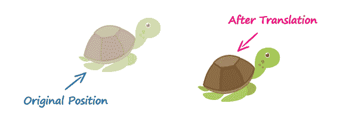
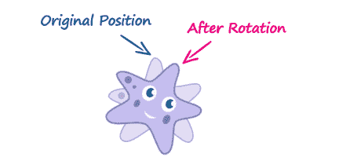
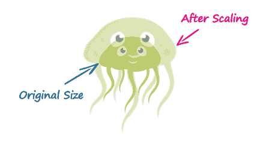
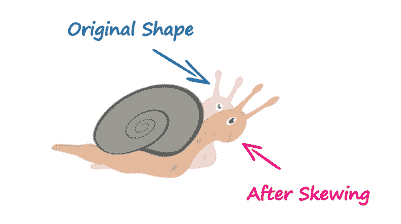

# CSS3 2D 变换

> 原文：<https://www.tutorialrepublic.com/css-tutorial/css3-2d-transforms.php>

CSS3 2D 变换特性允许元素在 2D 空间中进行变换。

## 元素的 2D 变换

使用 CSS3 2D 变换功能，您可以对二维空间中的元素执行基本的变换操作，如移动、旋转、缩放和倾斜。

变换后的元素不会影响周围的元素，但可以重叠它们，就像绝对定位的元素一样。但是，变换后的元素仍然在其默认(未变换)位置占据布局中的空间。

## 使用 CSS 转换和转换函数

CSS3 `transform`属性使用变换函数来操作元素使用的坐标系，以便应用变换效果。

以下部分描述了这些转换函数:

## `translate()`功能

沿 X 和 Y 轴将元素从当前位置移动到新位置。这个可以写成`translate(tx, ty)`。如果没有指定`ty`，它的值被假定为零。

#### 例子

[Try this code »](../codelab.php?topic=css3&file=translate-method "Try this code using online Editor")

```css
img {
    -webkit-transform: translate(200px, 50px);  /* Chrome, Safari, Opera */
       -moz-transform: translate(200px, 50px);  /* Firefox */
        -ms-transform: translate(200px, 50px);  /* IE 9 */
            transform: translate(200px, 50px);  /* Standard syntax */    
}
```

函数`translate(200px, 50px)`将图像沿正 x 轴水平移动 200 像素，沿正 y 轴垂直移动 50 像素。

[](../codelab.php?topic=css3&file=translate-method) 

* * *

## `rotate()`功能

`rotate()`函数将元素围绕其原点(由`transform-origin`属性指定)旋转指定的角度。这可以写成`rotate(a)`。

#### 例子

[Try this code »](../codelab.php?topic=css3&file=rotate-method "Try this code using online Editor")

```css
img {
    -webkit-transform: rotate(30deg);  /* Chrome, Safari, Opera */
       -moz-transform: rotate(30deg);  /* Firefox */
        -ms-transform: rotate(30deg);  /* IE 9 */
            transform: rotate(30deg);  /* Standard syntax */    
}
```

功能`rotate(30deg)`将图像围绕其原点顺时针旋转 30 度。可以使用负值逆时针旋转元素。

[](../codelab.php?topic=css3&file=rotate-method) 

* * *

## `scale()`功能

`scale()`函数增加或减少元素的大小。可以写成`scale(sx, sy)`。如果没有指定`sy`，则假定它等于`sx`。

#### 例子

[Try this code »](../codelab.php?topic=css3&file=scale-method "Try this code using online Editor")

```css
img {
    -webkit-transform: scale(1.5);  /* Chrome, Safari, Opera */
       -moz-transform: scale(1.5);  /* Firefox */
        -ms-transform: scale(1.5);  /* IE 9 */
            transform: scale(1.5);  /* Modern Browsers */    
}
```

函数`scale(1.5)`将图像`1.5`的宽度和高度按比例缩放至其原始尺寸。功能`scale(1)`或`scale(1, 1)`对元件没有影响。

[](../codelab.php?topic=css3&file=scale-method) 

* * *

## `skew()`功能

`skew()`函数将元素沿着 X 和 Y 轴倾斜指定的角度。可以写成`skew(ax, ay)`。如果没有指定`ay`，它的值被假定为零。

#### 例子

[Try this code »](../codelab.php?topic=css3&file=skew-method "Try this code using online Editor")

```css
img {
    -webkit-transform: skew(-40deg, 15deg);  /* Chrome, Safari, Opera */
       -moz-transform: skew(-40deg, 15deg);  /* Firefox */
        -ms-transform: skew(-40deg, 15deg);  /* IE 9 */
            transform: skew(-40deg, 15deg);  /* Modern Browsers */    
}
```

函数`skew(-40deg, 15deg)`沿
x 轴水平倾斜元素 40 度，沿 y 轴垂直倾斜 15 度。

[](../codelab.php?topic=css3&file=skew-method) 

* * *

## `matrix()`功能

`matrix()`函数可以同时执行所有的 2D 变换，如平移、旋转、缩放和倾斜。它以矩阵的形式接受六个参数，可以写成`matrix(a, b, c, d, e, f)`。下一节将向您展示如何使用`matrix()`来表示每个 2D 变换函数。

*   `translate(tx, ty) = matrix(1, 0, 0, 1, tx, ty);` —其中`tx`和`ty`是水平和垂直平移值。
*   `rotate(a) = matrix(cos(a), sin(a), -sin(a), cos(a), 0, 0);` —其中 a 是以度为单位的数值。您可以交换`sin(a)`和`-sin(a)`值来反转旋转。您可以执行的最大旋转是 360 度。
*   `scale(sx, sy) = matrix(sx, 0, 0, sy, 0 ,0);` —其中`sx`和`sy`为水平和垂直缩放值。
*   `skew(ax, ay) = matrix(1, tan(ay), tan(ay), 1, 0 ,0);` —其中`ax`和`ay`是以度为单位的水平和垂直值。

这是一个使用`matrix()`函数执行 2D 变换的例子。

#### 例子

[Try this code »](../codelab.php?topic=css3&file=matrix-method "Try this code using online Editor")

```css
img {
    -webkit-transform: matrix(0, -1, 1, 0, 200px, 50px);  /* Chrome, Safari, Opera */
       -moz-transform: matrix(0, -1, 1, 0, 200px, 50px);  /* Firefox */
        -ms-transform: matrix(0, -1, 1, 0, 200px, 50px);  /* IE 9 */
            transform: matrix(0, -1, 1, 0, 200px, 50px);  /* Standard syntax */
}
```

但是，当一次执行多个转换时，使用单个转换函数并按顺序列出它们会更方便，如下所示:

#### 例子

[Try this code »](../codelab.php?topic=css3&file=multiple-transforms "Try this code using online Editor")

```css
img {
    -webkit-transform: translate(200px, 50px) rotate(180deg) scale(1.5) skew(0, 30deg);  /* Chrome, Safari, Opera */
       -moz-transform: translate(200px, 50px) rotate(180deg) scale(1.5) skew(0, 30deg);  /* Firefox */
        -ms-transform: translate(200px, 50px) rotate(180deg) scale(1.5) skew(0, 30deg);  /* IE 9 */
            transform: translate(200px, 50px) rotate(180deg) scale(1.5) skew(0, 30deg);  /* Standard syntax */    
}
```

* * *

## 2D 变换函数

下表提供了所有 2D 变换函数的简要概述。

| 功能 | 描述 |
| --- | --- |
| `translate(tx,ty)` | 将元素沿 X 和 Y 轴移动给定的量。 |
| `translateX(tx)` | 将元素沿 X 轴移动给定的量。 |
| `translateY(ty)` | 将元素沿 Y 轴移动给定的量。 |
| `rotate(a)` | 按照`transform-origin`属性的定义，围绕元素的原点旋转元素指定的角度。 |
| `scale(sx,sy)` | 按给定的量放大或缩小元素的宽度和高度。功能`scale(1,1)`不起作用。 |
| `scaleX(sx)` | 按给定的量放大或缩小元素的宽度。 |
| `scaleY(sy)` | 按给定的量放大或缩小元素的高度。 |
| `skew(ax,ay)` | 沿 X 和 Y 轴以给定角度倾斜元素。 |
| `skewX(ax)` | 沿 X 轴以给定角度倾斜元素。 |
| `skewY(ay)` | 沿 Y 轴以给定角度倾斜元素。 |
| `matrix(n,n,n,n,n,n)` | 以包含六个值的变换矩阵的形式指定 2D 变换。 |