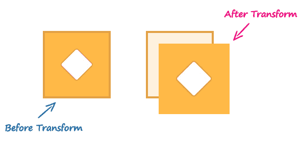
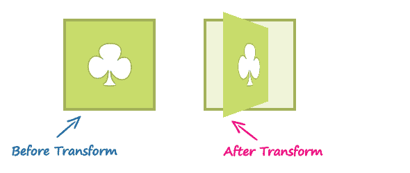
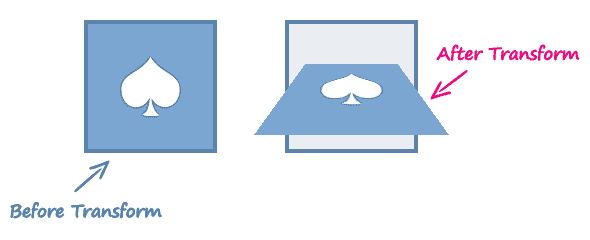

# CSS3 3D 变换

> 原文：<https://www.tutorialrepublic.com/css-tutorial/css3-3d-transforms.php>

CSS3 3D 变换功能允许在 3D 空间中变换元素。

## 元素的三维变换

使用 CSS3 3D 变换功能，您可以对三维空间中的元素执行基本的变换操作，如移动、旋转、缩放和倾斜。

变换后的元素不会影响周围的元素，但可以重叠它们，就像绝对定位的元素一样。但是，变换后的元素仍然在其默认(未变换)位置占据布局中的空间。

## 使用 CSS 转换和转换函数

CSS3 `transform`属性使用变换函数来操作元素使用的坐标系，以便应用变换效果。

以下部分描述了 3D 变换功能:

## `translate3d()`功能

沿 X、Y 和 Z 轴将元素从当前位置移动到新位置。这个可以写成`translate(tx, ty, tz)`。第三个转换值参数(即`tz`)不允许使用百分比值。

#### 例子

[Try this code »](../codelab.php?topic=css3&file=translate3d-method "Try this code using online Editor")

```css
.container {
    width: 125px;
    height: 125px;
    perspective: 500px;
    border: 4px solid #e5a043;
    background: #fff2dd;
}
.transformed {
    -webkit-transform: translate3d(25px, 25px, 50px); /* Chrome, Safari, Opera */
    transform: translate3d(25px, 25px, 50px); /* Standard syntax */
}
```

函数`translate3d(25px, 25px, 50px)`沿 X 和 Y 轴正方向移动图像 25 个像素，沿 Z 轴正方向移动 50 个像素。

[](../codelab.php?topic=css3&file=translate3d-method) 

然而，3D 变换使用三维坐标系，但是沿 Z 方向的移动并不总是明显的，因为元素存在于二维平面(平面)上，并且没有深度。

`perspective`和`perspective-origin` CSS 属性可用于增加场景的深度感，方法是使 Z 轴上较高的元素看起来更大，即更靠近查看者的元素看起来更小。

 ***注意:**如果您在没有设置透视的情况下对元素应用 3D 变换，则产生的效果不会显示为三维的。*  ** * *

## `rotate3d()`功能

`rotate3d()`函数将 3D 空间中的元素围绕[x，y，z]方向向量旋转指定的角度。这个可以写成`rotate(vx, vy, vz, angle)`。

#### 例子

[Try this code »](../codelab.php?topic=css3&file=rotate3d-method "Try this code using online Editor")

```css
.container{
    width: 125px;
    height: 125px;
    perspective: 300px;
    border: 4px solid #a2b058;
    background: #f0f5d8;
}
.transformed {
    -webkit-transform: rotate3d(0, 1, 0, 60deg); /* Chrome, Safari, Opera */
    transform: rotate3d(0, 1, 0, 60deg); /* Standard syntax */
}
```

功能`rotate3d(0, 1, 0, 60deg)`将图像沿 Y 轴旋转 60 度。您可以使用负值以相反方向旋转元素。

[](../codelab.php?topic=css3&file=rotate3d-method) 

* * *

## `scale3d()`功能

函数的作用是改变一个元素的大小。可以写成`scale(sx, sy, sz)`。此函数的效果并不明显，除非您将它与其他变换函数(如旋转和透视)结合使用，如下例所示。

#### 例子

[Try this code »](../codelab.php?topic=css3&file=scale3d-method "Try this code using online Editor")

```css
.container{
    width: 125px;
    height: 125px;
    perspective: 300px;
    border: 4px solid #6486ab;
    background: #e9eef3;
}
.transformed {
    -webkit-transform: scale3d(1, 1, 2) rotate3d(1, 0, 0, 60deg); /* Chrome, Safari, Opera */
    transform: scale3d(1, 1, 2) rotate3d(1, 0, 0, 60deg); /* Standard syntax */
}
```

函数`scale3d(1, 1, 2)`沿 Z 轴缩放元素，函数`rotate3d(1, 0, 0, 60deg)`沿 X 轴旋转图像 60 度。

[](../codelab.php?topic=css3&file=scale3d-method) 

* * *

## `matrix3d()`功能

`matrix3d()`功能可以同时执行所有的 3D 变换，如平移、旋转和缩放。它以 4×4 变换矩阵[的形式接受 16 个参数](http://www.w3.org/TR/css3-transforms/#MatrixDefined)。

这是一个使用`matrix3d()`函数执行 3D 变换的例子。

#### 例子

[Try this code »](../codelab.php?topic=css3&file=matrix3d-method "Try this code using online Editor")

```css
.container{
    width: 125px;
    height: 125px;
    perspective: 300px;
    border: 4px solid #d14e46;
    background: #fddddb;
}
.transformed {
    -webkit-transform: matrix3d(0.359127, -0.469472, 0.806613, 0, 0.190951, 0.882948, 0.428884, 0, -0.913545, 0, 0.406737, 0, 0, 0, 0, 1); /* Chrome, Safari, Opera */
    transform: matrix3d(0.359127, -0.469472, 0.806613, 0, 0.190951, 0.882948, 0.428884, 0, -0.913545, 0, 0.406737, 0, 0, 0, 0, 1); /* Standard syntax */
}
```

但是，当一次执行多个转换时，使用单个转换函数并按顺序列出它们会更方便，如下所示:

#### 例子

[Try this code »](../codelab.php?topic=css3&file=multiple-3d-transforms "Try this code using online Editor")

```css
.container{
    width: 125px;
    height: 125px;
    perspective: 300px;
    border: 4px solid #a2b058;
    background: #f0f5d8;
}
.transformed {
    -webkit-transform: translate3d(0, 0, 60px) rotate3d(0, 1, 0, -60deg) scale3d(1, 1, 2); /* Chrome, Safari, Opera */
    transform: translate3d(0, 0, 60px) rotate3d(0, 1, 0, -60deg) scale3d(1, 1, 2); /* Standard syntax */
}
```

* * *

## 3D 变换函数

下表提供了所有 3D 变换函数的简要概述。

| 功能 | 描述 |
| --- | --- |
| `translate3d(tx,ty,tz)` | 沿 X、Y 和 Z 轴按给定的量移动元素。 |
| `translateX(tx)` | 将元素沿 X 轴移动给定的量。 |
| `translateY(ty)` | 将元素沿 Y 轴移动给定的量。 |
| `translateZ(tz)` | 将元素沿 Z 轴移动给定的量。 |
| `rotate3d(x,y,z, a)` | 围绕[x，y，z]方向向量，以最后一个参数中指定的角度旋转 3D 空间中的元素。 |
| `rotateX(a)` | 将元素绕 X 轴旋转给定的角度。 |
| `rotateY(a)` | 围绕 Y 轴按给定角度旋转元素。 |
| `rotateZ(a)` | 围绕 Z 轴按给定角度旋转元素。 |
| `scale3d(sx,sy,sz)` | 沿 X、Y 和 Z 轴按给定量缩放元素。功能`scale3d(1,1,1)`不起作用。 |
| `scaleX(sx)` | 沿 X 轴缩放元素。 |
| `scaleY(sy)` | 沿 Y 轴缩放元素。 |
| `scaleZ(sz)` | 沿 Z 轴缩放元素。 |
| `matrix3d(n,n,n,n,n,n, n,n,n,n,n,n,n,n,n,n)` | 以 16 个值的 4×4 变换矩阵的形式指定三维变换。 |
| `perspective(length)` | 定义 3D 变换元素的透视图。一般来说，随着该函数值的增加，元素将出现在离观察者更远的地方。 |*