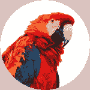

# CSS3 过滤器

> 原文：<https://www.tutorialrepublic.com/css-tutorial/css3-filters.php>

CSS3 滤镜效果提供了一种将视觉效果应用到图像的简单方法。

## 了解 CSS3 过滤器功能

在这一章中，我们将讨论 CSS3 中引入的滤镜效果，你可以用它来执行视觉效果操作，如模糊、平衡对比度或亮度、色彩饱和度等。在将图像绘制到网页上之前，在图形元素上显示。

可以使用 CSS3 `filter`属性将滤镜效果应用于元素，该属性按照提供的顺序接受一个或多个滤镜函数。

| 过滤器: | 虚化()&#124;()&#124;()&#124;&#124;【投影() &#124; 灰度() &#124; 色相-旋转() &#124; 反转() &#124; 不透明度() &#124; 棕褐色() &#124; 饱和()&#124;URL()； |

 ***警告:**目前任何版本的 Internet Explorer 都不支持 CSS3 滤镜效果。旧版本的 IE 支持非标准的`filter`属性来创建不透明的效果，但是这个特性已经被否决了。*  *## 模糊效果

可以使用`blur()`功能将 Photoshop 中的高斯模糊效果应用到元素上。这个函数接受 CSS 长度值作为定义模糊半径的参数。较大的值会产生更多的模糊。如果没有提供参数，则使用值`0`。

#### 例子

[Try this code »](../codelab.php?topic=css3&file=blur-filter-effect "Try this code using online Editor")

```
img {
    -webkit-filter: blur(5px); /* Chrome, Safari, Opera */
    filter: blur(5px);
}
```

—以上示例的输出类似于以下内容:

| T2】 | T2】 | T2】 |
| `blur(0)` | `blur(2px)` | `blur(5px)` |

* * *

## 设置图像亮度

`brightness()`功能可用于设置图像的亮度。值`0%`将创建一个全黑的图像。然而，`100%`或`1`的值保持图像不变。其他值是效果的线性乘数。

您也可以将亮度设置为高于 100%,这样会产生更亮的图像。如果缺少 amount 参数，则使用值`1`。不允许负值。

#### 例子

[Try this code »](../codelab.php?topic=css3&file=brightness-filter-effect "Try this code using online Editor")

```
img.bright {
    -webkit-filter: brightness(200%); /* Chrome, Safari, Opera */
    filter: brightness(200%);
}
img.dark {
    -webkit-filter: brightness(50%); /* Chrome, Safari, Opera */
    filter: brightness(50%);
}
```

—以上示例的输出类似于以下内容:

| T2】 | T2】 | T2】 |
| `brightness(50%)` | `brightness(100%)` | `brightness(200%)` |

 ***注意:**采用百分号表示的值的过滤函数(如`75%`)也接受十进制表示的值(如，`0.75`)。如果该值无效，该函数将返回`none`，并且不会应用任何滤镜效果。*  ** * *

## 调整图像对比度

`contrast()`功能用于调整图像的对比度。值`0%`将创建一个全黑的图像。然而，`100%`或`1`的值保持图像不变。超过 100%的值也是允许的，这提供了具有较小对比度的结果。如果金额参数缺失或省略，则使用值`1`。

#### 例子

[Try this code »](../codelab.php?topic=css3&file=contrast-filter-effect "Try this code using online Editor")

```
img.bright {
    -webkit-filter: contrast(200%); /* Chrome, Safari, Opera */
    filter: contrast(200%);
}
img.dim {
    -webkit-filter: contrast(50%); /* Chrome, Safari, Opera */
    filter: contrast(50%);
}
```

—以上示例的输出类似于以下内容:

| T2】 | T2】 | T2】 |
| `contrast(50%)` | `contrast(100%)` | `contrast(200%)` |

* * *

## 给图像添加投影

您可以使用`drop-shadow()`功能像 Photoshop 一样对图像应用投影效果。该功能类似于 [`box-shadow`](/css-reference/css3-box-shadow-property.php) 属性。

#### 例子

[Try this code »](../codelab.php?topic=css3&file=drop-shadow-filter-effect "Try this code using online Editor")

```
img {
    -webkit-filter: drop-shadow(4px 4px 10px orange); /* Chrome, Safari, Opera */
    filter: drop-shadow(4px 4px 10px orange);
}
```

—以上示例的输出类似于以下内容:

| T2】 | T2】 | T2】 |
| `drop-shadow(0)` | `drop-shadow(2px 2px 4px orange)` | `drop-shadow(4px 4px 10px orange)` |

 ***注意:**`drop-shadow()`函数的第一个和第二个参数分别指定阴影的水平和垂直偏移，而第三个参数指定模糊半径，最后一个参数指定阴影颜色，就像`box-shadow`属性一样，只有一个例外，不允许使用“`inset`”关键字。*  ** * *

## 将图像转换为灰度

使用`grayscale()`功能可以将图像转换成灰度。`100%`的值完全是灰度。值为`0%`会保持图像不变。`0%`和`100%`之间的值是效果的线性乘数。如果缺少金额参数，则使用值`0`。

#### 例子

[Try this code »](../codelab.php?topic=css3&file=grayscale-filter-effect "Try this code using online Editor")

```
img.complete-gray {
    -webkit-filter: grayscale(100%); /* Chrome, Safari, Opera */
    filter: grayscale(100%);
}
img.partial-gray {
    -webkit-filter: grayscale(50%); /* Chrome, Safari, Opera */
    filter: grayscale(50%);
}
```

—以上示例的输出类似于以下内容:

| T2】 | T2】 | T2】 |
| `grayscale(0)` | `grayscale(50%)` | `grayscale(100%)` |

* * *

## 对图像应用色调旋转

`hue-rotate()`功能对图像进行色调旋转。传递的参数定义了图像样本将被调整的色环的度数。值`0deg`保持图像不变。如果缺少'`angle`'参数，则使用值`0deg`。没有最大值，上述`360deg`值的影响是环绕的。

#### 例子

[Try this code »](../codelab.php?topic=css3&file=hue-rotate-filter-effect "Try this code using online Editor")

```
img.hue-normal {
    -webkit-filter: hue-rotate(150deg); /* Chrome, Safari, Opera */
    filter: hue-rotate(150deg);
}
img.hue-wrap {
    -webkit-filter: hue-rotate(480deg); /* Chrome, Safari, Opera */
    filter: hue-rotate(480deg);
}
```

—以上示例的输出类似于以下内容:

| T2】 | T2】 | T2】 |
| `hue-rotate(0)` | `hue-rotate(150deg)` | `hue-rotate(480deg)` |

* * *

## 反转效果

像 Photoshop 这样的反转效果可以用`invert()`功能应用到图像上。`100%`或`1`的值完全反转。值`0%`保持输入不变。`0%`和`100%`之间的值是效果的线性乘数。如果缺少'【T6]'参数，则使用值`0`。不允许负值。

#### 例子

[Try this code »](../codelab.php?topic=css3&file=invert-filter-effect "Try this code using online Editor")

```
img.partially-inverted {
    -webkit-filter: invert(80%); /* Chrome, Safari, Opera */
    filter: invert(80%);
}
img.fully-inverted {
    -webkit-filter: invert(100%); /* Chrome, Safari, Opera */
    filter: invert(100%);
}
```

—以上示例的输出类似于以下内容:

| T2】 | T2】 | T2】 |
| `invert(0)` | `invert(80%)` | `invert(100%)` |

* * *

## 对图像应用不透明度

`opacity()`功能可用于将透明度应用于图像。值`0%`是完全透明的。值`100%`或`1`保持图像不变。`0%`和`100%`之间的值是效果的线性乘数。如果缺少'【T6]'参数，则使用值`1`。该功能类似于 [`opacity`](/css-reference/css3-opacity-property.php) 属性。

#### 例子

[Try this code »](../codelab.php?topic=css3&file=opacity-filter-effect "Try this code using online Editor")

```
img {
    -webkit-filter: opacity(80%); /* Chrome, Safari, Opera */
    filter: opacity(80%);
}
```

—以上示例的输出类似于以下内容:

| T2】 | T2】 | T2】 |
| `opacity(100%)` | `opacity(80%)` | `opacity(30%)` |

* * *

## 将棕褐色效果应用到图像

`sepia()`功能将图像转换为棕褐色。`100%`或`1`的值是完全棕褐色。值`0%`保持图像不变。`0%`和`100%`之间的值是效果的线性乘数。如果缺少'【T6]'参数，则使用值`0`。

#### 例子

[Try this code »](../codelab.php?topic=css3&file=sepia-filter-effect "Try this code using online Editor")

```
img.complete-sepia {
    -webkit-filter: sepia(100%); /* Chrome, Safari, Opera */
    filter: sepia(100%);
}
img.partial-sepia {
    -webkit-filter: sepia(30%); /* Chrome, Safari, Opera */
    filter: sepia(30%);
}
```

—以上示例的输出类似于以下内容:

| T2】 | T2】 | T2】 |
| `sepia(0%)` | `sepia(30%)` | `sepia(100%)` |

 ***提示:**在摄影术语中，棕褐色调色是一种特殊的处理方法，可以使黑白照片呈现更温暖的色调(红棕色)，以提高其存档质量。*  ** * *

## 调整图像的饱和度

`saturate()`功能可用于调整图像的饱和度。`0%`的值完全不饱和。值为`100%`会保持图像不变。其他值是效果的线性乘数。超过 100%的数量值也是允许的，提供超饱和的结果。如果'`amount`'参数缺失，则使用值`1`。

#### 例子

[Try this code »](../codelab.php?topic=css3&file=saturate-filter-effect "Try this code using online Editor")

```
img.un-saturated {
    -webkit-filter: saturate(0%); /* Chrome, Safari, Opera */
    filter: saturate(0%);
}
img.super-saturated {
    -webkit-filter: saturate(200%); /* Chrome, Safari, Opera */
    filter: saturate(200%);
}
```

—以上示例的输出类似于以下内容:

| T2】 | T2】 | T2】 |
| `saturate(100%)` | `saturate(200%)` | `saturate(0%)` |

 ***注意:**`url()`函数指定了一个过滤器对特定过滤器元素的引用。比如`url(commonfilters.svg#foo)`。如果过滤器引用一个不存在的元素或者被引用的元素不是过滤器元素，那么整个过滤器链被忽略。没有滤镜应用于该元素。*****