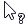
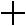
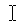
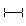
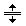
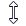
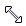

# CSS 光标属性

> 原文：<https://www.tutorialrepublic.com/css-reference/css-cursor-property.php>

题目: [CSS3 属性参考](css3-properties.php) [上一个](css-counter-reset-property.php) | [下一个](css-direction-property.php)

## 描述

CSS 属性指定当指针放在一个元素上时显示的光标类型。

下表总结了该属性的用法上下文和版本历史记录。

| 默认值: | `auto` |
| 适用于: | 所有元素 |
| 继承的: | 是 |
| 可制作动画: | [号*见*号*动图属性*号](css-animatable-properties.php)。 |
| 版本: | CSS 2，3 |

* * *

## 句法

属性的语法如下所示:

| cursor : | [url( *光标文件的地址*)，] <sup>0 或更多次</sup> &#124; 自动 &#124; 默认 &#124; 无&#124; 上下文菜单 &#124; 帮助 &#124; 指针 &#124; 进度 &#124; 等待 &#124; 单元格 &#124; 十字准线 不掉落 &#124; 不允许 &#124; 抓取 &#124; 抓取&#124; e-resize&#124;n-resize&#124;ne-resize&#124;NW-resize&#124; s-resize&#124;se-resize&#124; |

下面的例子展示了`cursor`属性的作用。

#### 例子

[Try this code »](../codelab.php?topic=css&file=cursor-property "Try this code using online Editor")

```
h1 {
    cursor: copy;
}
p {
    cursor: help;
}
a {
    cursor: url("custom.gif"), url("custom.cur"), default;
}
```

cursor 属性处理用户定义的游标值的逗号分隔列表，后跟“通用游标”。如果第一个游标指定错误或找不到，将使用逗号分隔列表中的下一个游标，依此类推，直到找到可用的游标。

如果用户定义的光标都无效或不受浏览器支持，将使用列表末尾的通用光标。[了解更多。](../css-tutorial/css-cursors.php)

* * *

## 属性值

下表描述了该属性的值。

| 价值 | 看 | 描述 |
| **通用** |
| `auto` |   | 浏览器根据当前上下文确定要显示的光标。例如当悬停文本时等同于文本。这是默认设置。 |
| `default` |  | 平台的默认光标，不考虑上下文，通常是箭头。 |
| `none` |   | 不呈现任何光标。 |
| `initial` |  | 将此属性设置为其默认值。 |
| `inherit` |  | 如果指定的话，关联的元素取其父元素`cursor`属性的[计算值](../definitions.php#computed-value)。 |
| **链接&状态光标** |
| `context-menu` |  | 指示上下文菜单可用。 |
| `help` |  | 表示帮助可用。 |
| `pointer` |  | 指示链接的光标，通常是伸出食指的手。 |
| `progress` |  | 进度指标。程序正在执行一些处理，但是用户仍然可以与界面交互(不像`wait`)。 |
| `wait` |  | 表示程序正忙，用户应该等待。 |
| **选择光标** |
| `cell` |  | 指示可以选择一个单元格(或一组单元格)。 |
| `crosshair` |  | 一个简单的十字准线。通常用于指示位图中的选择。 |
| `text` |  | 指示可以选择的文本，通常为工字梁。 |
| `vertical-text` |  | 指示可以选择垂直文本，即横向工字梁。 |
| **拖放光标** |
| `alias` |  | 表示要创建别名或快捷方式。 |
| `copy` |  | 表示某物可以被复制。 |
| `move` |  | 指示可以移动悬停的对象。 |
| `no-drop` |  | 指示不能将拖动的项放在当前位置。 |
| `not-allowed` |  | 表示某事不能做。 |
| **调整大小&滚动光标** |
| `all-scroll` |  | 表示某物可以向任何方向滚动(平移)。 |
| `col-resize` |  | 指示可以水平调整列的大小。 |
| `row-resize` |  | 指示可以垂直调整行的大小。 |
| `n-resize` |  | 指示某条边要上移(北向)。 |
| `e-resize` |  | 指示某条边将向右(东)移动。 |
| `s-resize` |  | 指示某条边将被下移(南移)。 |
| `w-resize` |  | 指示某条边将向左(西)移动。 |
| `ne-resize` |  | 表示某条边将被上移和右移(北/东)。 |
| `nw-resize` |  | 表示某条边将被上移和左移(北/西)。 |
| `se-resize` |  | 表示某条边将向下和向右(南/东)移动。 |
| `sw-resize` |  | 表示某条边将被向左下移动(南/西)。 |
| `ew-resize` |  | 指示双向调整光标大小。 |
| `ns-resize` |  |
| `nesw-resize` |  |
| `nwse-resize` |  |
| **缩放和抓取光标** |
| `zoom-in` |  | 表示某物可以放大。 |
| `zoom-out` |  | 表示可以缩小某些内容。 |
| `grab` |  | 表示可以抓住某物(拖动以移动)。 |
| `grabbing` |  | 表示有东西被抓了。 |

* * *

## 浏览器兼容性

所有主流浏览器都支持`cursor`属性。

|  | 

## 基本支持——

*   火狐 1+
*   谷歌浏览器 1+
*   Internet Explorer 4+
*   苹果 Safari 1.2+
*   歌剧 7+

 |

* * *

## 进一步阅读

参见教程: [CSS 光标](../css-tutorial/css-cursors.php)。