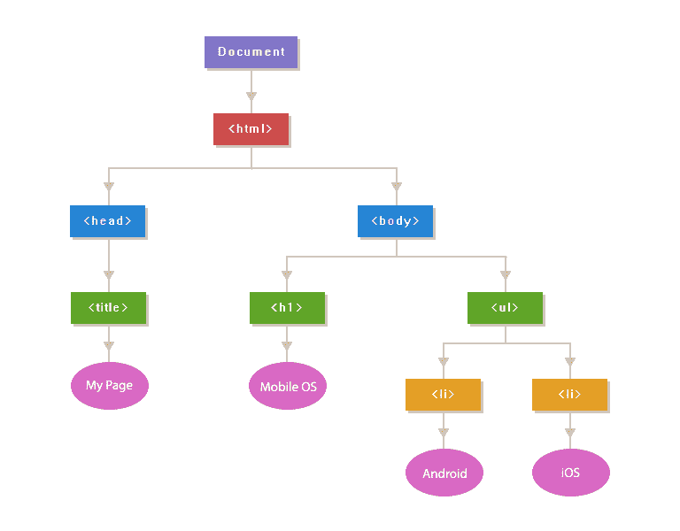

# JavaScript DOM 节点

> 原文：<https://www.tutorialrepublic.com/javascript-tutorial/javascript-dom-nodes.php>

在本教程中，您将学习文档对象模型(DOM)的概念。

## 了解文档对象模型

文档对象模型，简称 DOM，是一种独立于平台和语言的模型，用来表示 HTML 或 XML 文档。它定义了文档的逻辑结构以及应用访问和操作文档的方式。

在 DOM 中，文档的所有部分，如元素、属性、文本等。被组织成分层的树状结构；类似于现实生活中由父母和子女组成的家谱。在 DOM 术语中，文档的这些独立部分被称为*节点*。

表示 HTML 文档的文档对象模型被称为 HTML DOM。类似地，表示 XML 文档的 DOM 也称为 XML DOM。

在这一章中，我们将介绍 HTML DOM，它提供了一个通过 JavaScript 访问和操作 HTML 文档的标准接口。有了 HTML DOM，您可以使用 JavaScript 构建 HTML 文档，导航它们的层次结构，以及添加、修改或删除元素和属性或它们的内容，等等。在 HTML DOM 的帮助下，几乎可以使用 JavaScript 访问、更改、删除或添加 HTML 文档中的任何内容。

为了更清楚地理解这一点，让我们考虑以下简单的 HTML 文档:

#### 例子

[Try this code »](../codelab.php?topic=javascript&file=html-dom "Try this code using online Editor")

```js
<!DOCTYPE html>
<html>
<head>
    <title>My Page</title>
</head>
<body>
    <h1>Mobile OS</h1>
    <ul>
        <li>Android</li>
        <li>iOS</li>
    </ul>
</body>
</html>
```

上面的 HTML 文档可以用下面的 DOM 树来表示:



上图展示了节点之间的父/子关系。最顶层的节点，即文档节点是 DOM 树的根节点，它有一个子节点，即`<html>`元素。然而，`<head>`和`<body>`元素是`<html>`父节点的子节点。

`<head>`和`<body>`元素也是兄弟元素，因为它们处于同一级别。此外，元素内的文本内容是父元素的子节点。例如，“移动操作系统”被认为是包含它的`<h1>`的子节点，等等。

[注释](javascript-syntax.php#comments)HTML 文档中的节点也是 DOM 树中的节点，尽管它不会以任何方式影响文档的可视化表示。注释对于记录代码很有用，但是，您很少需要检索和操作它们。

HTML 属性如`id`、`class`、`title`、`style`等。也被视为 DOM 层次结构中的节点，但它们不像其他节点那样参与父/子关系。它们作为包含它们的元素节点的属性被访问。

HTML 文档中的每个元素，如图像、超链接、表单、按钮、标题、段落等。使用 DOM 层次结构中的 JavaScript 对象来表示，每个对象都包含描述和操作这些对象的属性和方法。例如，DOM 元素的`style`属性可用于[获取或设置元素](javascript-dom-styling.php)的内联样式。

在接下来的几章中，我们将学习如何访问和操作网页上的单个元素，例如，改变它们的样式、内容等。使用 JavaScript 程序。

 *提示:事实上，文档对象模型或 DOM 基本上是浏览器和当前 Web 文档(HTML 或 XML)的各种组件的表示，可以使用脚本语言(如 JavaScript)来访问或操作。*