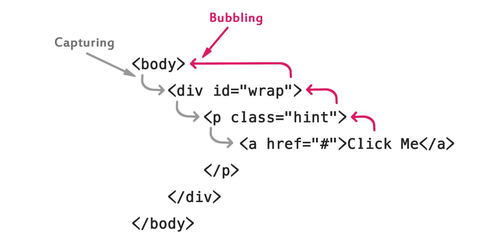

# JavaScript 事件传播

> 原文：<https://www.tutorialrepublic.com/javascript-tutorial/javascript-event-propagation.php>

在本教程中，您将学习事件如何在 JavaScript 的 DOM 树中传播。

## 了解事件传播

事件传播是一种机制，它定义了事件如何通过 DOM 树传播或传播以到达其目标，以及之后会发生什么。

让我们借助一个例子来理解这一点，假设您在一个嵌套在段落(即 [`<p>`](../html-reference/html-p-tag.php) 元素)内的超链接(即 [`<a>`](../html-reference/html-a-tag.php) 元素)上分配了一个点击[事件处理程序](javascript-events.php)。现在，如果您单击该链接，处理程序将被执行。但是，如果您将 click 事件处理程序分配给包含链接的段落，而不是 link，那么即使在这种情况下，单击链接仍然会触发处理程序。这是因为事件不仅仅影响生成事件的目标元素——它们在 DOM 树中上下移动以到达它们的目标。这就是所谓的事件传播

在现代浏览器中，事件传播分两个阶段进行: ***捕获*** ，以及 ***冒泡*** 阶段。在我们继续下一步之前，请看下图:



上图展示了当事件在具有父元素的元素上触发时，在事件传播的不同阶段，事件是如何在 DOM 树中传播的。

引入事件传播的概念是为了处理具有父子关系的 DOM 层次结构中的多个元素对同一个事件(比如鼠标单击)有事件处理程序的情况。现在的问题是，当用户单击内部元素时，将首先处理哪个元素的 click 事件——外部元素或内部元素的 click 事件。

在本章的以下部分，我们将更详细地讨论事件传播的每个阶段，并找出这个问题的答案。

 ***注:**形式上有三个阶段，*捕获*，*瞄准*和*冒泡*阶段。但是，第二阶段，即目标阶段(当事件到达生成事件的目标元素时发生)在现代浏览器中不是单独处理的，注册用于*捕获*和*冒泡*阶段的处理程序在该阶段执行。*  *## 捕获阶段

在捕获阶段，事件从[窗口](javascript-window.php)通过 DOM 树向下传播到目标节点。例如，如果用户单击一个超链接，该单击事件将通过包含该链接的 [`<html>`](../html-reference/html-html-tag.php) 元素、 [`<body>`](../html-reference/html-body-tag.php) 元素和 [`<p>`](../html-reference/html-p-tag.php) 元素。

此外，如果任何祖先(即父母、祖父母等。)并且目标本身有一个专门注册的**捕获事件监听器**用于该类型的事件，那么这些监听器将在这个阶段执行。让我们看看下面的例子:

#### 例子

[Try this code »](../codelab.php?topic=javascript&file=event-capturing "Try this code using online Editor") 

```js
<!DOCTYPE html>
<html lang="en">
<head>
<meta charset="utf-8">
<title>Event Capturing Demo</title>
<style type="text/css">
    div, p, a{
        padding: 15px 30px;
        display: block;
        border: 2px solid #000;
        background: #fff;
    }
</style>
</head>
<body>
<div id="wrap">DIV
    <p class="hint">P
        <a href="#">A</a>
    </p>
</div>

<script>
    function showTagName() {
        alert("Capturing: "+ this.tagName);
    }

    var elems = document.querySelectorAll("div, p, a");
    for(let elem of elems) {
        elem.addEventListener("click", showTagName, true);
    }
</script>
</body>
</html>
```*  *这里是一个简单的演示，我们利用上面的例子向您展示事件捕获是如何工作的。单击任何元素，观察警报弹出窗口出现的顺序。

<div id="wrap">

</p>

</div>

并非所有浏览器都支持事件捕获，也很少使用。例如，Internet Explorer 之前的版本不支持事件捕获。

此外，当第三个参数设置为`true`时，事件捕获仅适用于用`addEventListener()`方法注册的事件处理程序。分配事件处理程序的传统方法，如使用`onclick`、`onmouseover`等。在这里行不通。请查看 [JavaScript 事件监听器](javascript-event-listeners.php)章节，了解更多关于事件监听器的信息。

* * *

## 冒泡阶段

在冒泡阶段，情况正好相反。在这个阶段，事件沿着 DOM 树向上传播或冒泡，从目标元素一直到[窗口](javascript-window.php)，逐个访问目标元素的所有祖先。例如，如果用户点击一个超链接，点击事件将通过包含该链接的`<p>`元素、`<body>`元素、`<html>`元素和`document`节点。

此外，如果目标元素的任何祖先和目标本身都有为该类型的事件分配的事件处理程序，则这些处理程序将在此阶段执行。在现代浏览器中，默认情况下，所有事件处理程序都在冒泡阶段注册。让我们来看一个例子:

#### 例子

[Try this code »](../codelab.php?topic=javascript&file=event-bubbling "Try this code using online Editor") 

```js
<!DOCTYPE html>
<html lang="en">
<head>
<meta charset="utf-8">
<title>Event Bubbling Demo</title>
<style type="text/css">
    div, p, a{
        padding: 15px 30px;
        display: block;
        border: 2px solid #000;
        background: #fff;
    }
</style>
</head>
<body>
<div onclick="alert('Bubbling: ' + this.tagName)">DIV
    <p onclick="alert('Bubbling: ' + this.tagName)">P
        <a href="#" onclick="alert('Bubbling: ' + this.tagName)">A</a>
    </p>
</div>
</body>
</html>
```*  *这里是一个简单的演示，我们利用上面的例子向您展示事件冒泡是如何工作的。单击任何元素，观察警报弹出窗口出现的顺序。

<div id="wrap">

</p>

</div>

所有浏览器都支持事件冒泡，它适用于所有处理程序，不管它们是如何注册的，例如使用`onclick`或`addEventListener()`(除非它们注册为[捕获事件监听器](javascript-event-listeners.php))。这就是为什么术语事件传播经常被用作事件冒泡的同义词。

* * *

## 访问目标元素

目标元素是生成事件的 DOM 节点。例如，如果用户单击一个超链接，目标元素就是该超链接。

目标元素可作为`event.target`访问，它在事件传播阶段不会改变。此外，`this`关键字表示当前元素(也就是说，该元素有一个当前正在运行的处理程序)。让我们来看一个例子:

#### 例子

[Try this code »](../codelab.php?topic=javascript&file=get-the-event-target "Try this code using online Editor") 

```js
<!DOCTYPE html>
<html lang="en">
<head>
<meta charset="utf-8">
<title>Event Target Demo</title>
<style type="text/css">
    div, p, a{
        padding: 15px 30px;			
        display: block;
        border: 2px solid #000;
        background: #fff;
    }
</style>
</head>
<body>
<div id="wrap">DIV
    <p class="hint">P
        <a href="#">A</a>
    </p>
</div>

<script>
    // Selecting the div element
    var div = document.getElementById("wrap");

    // Attaching an onclick event handler
    div.onclick = function(event) {
        event.target.style.backgroundColor = "lightblue";

        // Let the browser finish rendering of background color before showing alert
        setTimeout(() => {
            alert("target = " + event.target.tagName + ", this = " + this.tagName);
            event.target.style.backgroundColor = ''
        }, 0);
    }
</script>
</body> 
</html>
```*  *这是我们利用上面的例子创建的一个简单的演示。单击任何元素，它将显示目标元素和当前元素的标签名。

<div id="wrap">

</p>

</div>

我们在上面的例子中使用的粗箭头(`=>`)符号是一个箭头函数表达式。它具有比函数表达式更短的语法，并且它会使`this`关键字行为正常。请查看关于 [ES6 特性](javascript-es6-features.php)的教程，了解更多关于箭头功能的信息。

* * *

## 停止事件传播

如果您想阻止任何祖先元素的事件处理程序得到有关事件的通知，也可以在中间停止事件传播。

例如，假设您有嵌套元素，并且每个元素都有显示警告对话框的`onclick`事件处理程序。通常，当你点击内部元素时，所有的处理程序都会被立即执行，因为事件会上升到 DOM 树。

#### 例子

[Try this code »](../codelab.php?topic=javascript&file=event-propagation "Try this code using online Editor") 

```js
<!DOCTYPE html>
<html lang="en">
<head>
<meta charset="utf-8">
<title>Event Propagation Demo</title>
<style type="text/css">
    div, p, a{
        padding: 15px 30px;
        display: block;
        border: 2px solid #000;
        background: #fff;
    }
</style>
</head>
<body>
<div id="wrap">DIV
    <p class="hint">P
        <a href="#">A</a>
    </p>
</div>

<script>
    function showAlert() {
        alert("You clicked: "+ this.tagName);
    }

    var elems = document.querySelectorAll("div, p, a");
    for(let elem of elems) {
        elem.addEventListener("click", showAlert);
    }
</script>
</body>
</html>
```*  *这是我们利用上面的例子创建的一个简单的演示。如果您单击任何子元素，父元素上的事件处理程序也会被执行，您可能会看到多个警告框。

<div id="wrap">

</p>

</div>

为了防止这种情况，您可以使用`event.stopPropagation()`方法来阻止事件在 DOM 树中冒泡。在下面的示例中，如果您单击子元素，父元素上的 click 事件侦听器将不会执行。

#### 例子

[Try this code »](../codelab.php?topic=javascript&file=stop-event-propagation "Try this code using online Editor") 

```js
<!DOCTYPE html>
<html lang="en">
<head>
<meta charset="utf-8">
<title>Stop Event Propagation Demo</title>
<style type="text/css">
    div, p, a{
        padding: 15px 30px;
        display: block;
        border: 2px solid #000;
        background: #fff;
    }
</style>
</head>
<body>
<div id="wrap">DIV
    <p class="hint">P
        <a href="#">A</a>
    </p>
</div>

<script>
    function showAlert(event) {
        alert("You clicked: "+ this.tagName);
        event.stopPropagation();
    }

    var elems = document.querySelectorAll("div, p, a");
    for(let elem of elems) {
        elem.addEventListener("click", showAlert);
    }
</script>
</body>
</html>
```*  *这是更新后的演示。现在，如果您单击任何子元素，只会出现一个警告。

<div id="wrap">

</p>

</div>

此外，您甚至可以使用`stopImmediatePropagation()`方法防止附加到相同事件类型的相同元素的任何其他侦听器被执行。

在下面的示例中，我们将多个侦听器附加到超链接，但是当您单击该链接时，只有一个侦听器会执行，并且您将只看到一个警报。

#### 例子

[Try this code »](../codelab.php?topic=javascript&file=stop-immediate-propagation-of-an-event "Try this code using online Editor") 

```js
<!DOCTYPE html>
<html lang="en">
<head>
<meta charset="utf-8">
<title>Stop Immediate Propagation Demo</title>
<style type="text/css">
    div, p, a{
        padding: 15px 30px;
        display: block;
        border: 2px solid #000;
        background: #fff;
    }
</style>
</head>
<body>
<div onclick="alert('You clicked: ' + this.tagName)">DIV
    <p onclick="alert('You clicked: ' + this.tagName)">P
        <a href="#" id="link">A</a>
    </p>
</div>

<script>
    function sayHi() {
        alert("Hi, there!");
        event.stopImmediatePropagation();
    }
    function sayHello() {
        alert("Hello World!");
    }

    // Attaching multiple event handlers to hyperlink
    var link = document.getElementById("link");
    link.addEventListener("click", sayHi);  
    link.addEventListener("click", sayHello);
</script>
</body>
</html>
```*  ****注意:**如果几个侦听器被附加到相同事件类型的相同元素，它们将按照添加的顺序执行。但是，如果任何监听器调用了`event.stopImmediatePropagation()`方法，将不会执行任何剩余的监听器。*  ** * *

## 阻止默认操作

一些事件有与之相关联的默认操作。例如，如果你点击一个链接浏览器带你到链接的目标，当你点击一个表格提交按钮浏览器提交表格，等等。您可以使用事件对象的`preventDefault()`方法来防止这种默认操作。

但是，阻止默认操作并不会停止事件传播；事件照常继续传播到 DOM 树。下面是一个例子:

#### 例子

[Try this code »](../codelab.php?topic=javascript&file=prevent-default-actions "Try this code using online Editor") 

```js
<!DOCTYPE html>
<html lang="en">
<head>
<meta charset="utf-8">
<title>Prevent Default Demo</title>
</head>
<body>
<form action="/examples/html/action.php" method="post" id="users">
    <label>First Name:</label>
    <input type="text" name="first-name" id="firstName">
    <input type="submit" value="Submit" id="submitBtn">
</form>

<script>
    var btn = document.getElementById("submitBtn");

    btn.addEventListener("click", function(event) {
        var name = document.getElementById("firstName").value;
        alert("Sorry, " + name + ". The preventDefault() won't let you submit this form!");
        event.preventDefault(); // Prevent form submission
    });
</script>
</body>
</html>
```*********