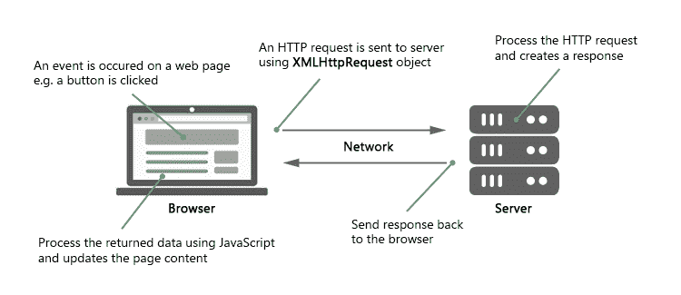

# JavaScript Ajax

> 原文：<https://www.tutorialrepublic.com/javascript-tutorial/javascript-ajax.php>

在本教程中，你将学习什么是 Ajax，以及如何用 JavaScript 实现它。

## 什么是 Ajax？

Ajax 代表 **A** 同步**J**avascript**A**nd**X**ml。Ajax 只是一种从服务器加载数据和有选择地更新网页的一部分而不需要重新加载整个页面的方法。

基本上，Ajax 所做的是利用浏览器内置的`XMLHttpRequest` (XHR)对象在后台与 web 服务器异步发送和接收信息，而不会阻塞页面或干扰用户体验。

Ajax 变得如此流行，以至于你几乎找不到一个在某种程度上不使用 Ajax 的应用。一些大型 Ajax 驱动的在线应用的例子有:Gmail、Google Maps、Google Docs、YouTube、脸书、Flickr 等等许多其他应用。

 ***注意:** Ajax 并不是一项新技术，事实上，Ajax 甚至根本就不是真正的技术。Ajax 只是一个术语，用来描述通过 JavaScript 从 web 服务器异步交换数据的过程，不需要刷新页面。*  ****提示:**不要被 AJAX 中的术语 **X** (即 **XML** )所迷惑。它只是因为历史原因而存在。可以使用 JSON、HTML 或纯文本等其他数据交换格式来代替 XML。*  *## 理解 Ajax 的工作原理

为了执行 Ajax 通信，JavaScript 使用浏览器内置的特殊对象——`XMLHttpRequest`(XHR)对象——向服务器发出 HTTP 请求并接收响应数据。

所有现代浏览器(Chrome、Firefox、IE7+、Safari、Opera)都支持`XMLHttpRequest`对象。

下图演示了 Ajax 通信的工作原理:



由于 Ajax 请求通常是异步的，所以一旦发送了 Ajax 请求，脚本就会继续执行，也就是说，在服务器响应返回之前，浏览器不会暂停脚本的执行。

在下一节中，我们将逐一讨论该过程中涉及的每个步骤:

## 发送请求并检索响应

在客户端和服务器之间执行 Ajax 通信之前，您必须做的第一件事是实例化一个`XMLHttpRequest`对象，如下所示:

var request = new XMLHttpRequest();

现在，将请求发送到服务器的下一步是使用 XMLHttpRequest 对象的`open()`方法实例化新创建的请求对象。

`open()`方法通常接受两个参数——要使用的 HTTP 请求方法，如“GET”、“POST”等。，以及向其发送请求的 URL，如下所示:

request.open("GET", "info.txt"); -Or- request.open("POST", "add-user.php"); ***提示:**该文件可以是任何类型的，如`.txt`或`.xml`，或者是服务器端脚本文件，如`.php`或`.asp`，它们可以在将响应发送回客户端之前在服务器上执行一些操作(如插入或读取数据库中的数据)。*  *最后使用 XMLHttpRequest 对象的`send()`方法将请求发送到服务器。

request.send(); -Or- request.send(*body*); ***注意:**`send()`方法接受一个可选的`*body*`参数，该参数允许我们指定请求的主体。这主要用于 HTTP POST 请求，因为 HTTP GET 请求没有请求体，只有请求头。*  *GET 方法通常用于向服务器发送少量数据。然而，POST 方法用于发送大量数据，如表单数据。

在 GET 方法中，数据作为 URL 参数发送。但是，在 POST 方法中，数据作为 HTTP 请求体的一部分被发送到服务器。通过 POST 方法发送的数据在 URL 中不可见。

有关这两种方法的详细比较，请参见关于 [HTTP GET 与 POST](/php-tutorial/php-get-and-post.php) 的章节。

在下一节中，我们将仔细看看 Ajax 请求实际上是如何工作的。

## 执行 Ajax GET 请求

GET 请求通常用于从服务器获取或检索某种信息，不需要对数据库进行任何操作或更改，例如，根据某个术语获取搜索结果，根据用户 id 或姓名获取用户详细信息，等等。

下面的例子将向您展示如何用 JavaScript 发出 Ajax GET 请求。

#### 例子

[Try this code »](../codelab.php?topic=javascript&file=ajax-get-request "Try this code using online Editor")

```
<!DOCTYPE html>
<html lang="en">
<head>
<meta charset="utf-8">
<title>JavaScript Ajax GET Demo</title>
<script>
function displayFullName() {
    // Creating the XMLHttpRequest object
    var request = new XMLHttpRequest();

    // Instantiating the request object
    request.open("GET", "greet.php?fname=John&lname=Clark");

    // Defining event listener for readystatechange event
    request.onreadystatechange = function() {
        // Check if the request is compete and was successful
        if(this.readyState === 4 && this.status === 200) {
            // Inserting the response from server into an HTML element
            document.getElementById("result").innerHTML = this.responseText;
        }
    };

    // Sending the request to the server
    request.send();
}
</script>
</head>
<body>
    <div id="result">
        <p>Content of the result DIV box will be replaced by the server response</p>
    </div>
    <button type="button" onclick="displayFullName()">Display Full Name</button>
</body>
</html>
```

当请求是异步的时，`send()`方法在发送请求后立即返回。因此，在使用`XMLHttpRequest`对象的`readyState`属性处理响应之前，您必须检查响应在其生命周期中的当前位置。

`readyState`是一个整数，指定 HTTP 请求的状态。同样，分配给每次`readyState`属性改变时调用的`onreadystatechange`事件处理程序的函数。下面总结了`readyState`属性的可能值。

| 价值 | 状态 | 描述 |
| `0` | `UNSENT` | 已经创建了一个`XMLHttpRequest`对象，但是还没有调用`open()`方法(即请求没有初始化)。 |
| `1` | `OPENED` | 已经调用了`open()`方法(即建立了服务器连接)。 |
| `2` | `HEADERS_RECEIVED` | 已经调用了`send()`方法(即服务器已经收到请求)。 |
| `3` | `LOADING` | 服务器正在处理请求。 |
| `4` | `DONE` | 请求已被处理，响应已准备好。 |

 ***注意:**理论上，`readystatechange`事件应该在每次`readyState`属性改变时触发。但是，当`readyState`变为 0 或 1 时，大多数浏览器不会触发这个事件。然而，当`readyState`变为 4 时，所有的浏览器都会触发这个事件。*  *属性返回 XMLHttpRequest 响应的数字 HTTP 状态代码。下面列出了一些常见的 HTTP 状态代码:

*   200 —好的。服务器成功处理了请求。
*   404 —未找到。服务器找不到请求的页面。
*   503-服务不可用。服务器暂时不可用。

请查看 [HTTP 状态代码](/html-reference/http-status-codes.php)参考，获取完整的响应代码列表。

下面是我们的“greet.php”文件中的代码，该文件通过连接一个人的名和姓来创建他的全名，并输出一条问候消息。

#### 例子

[Download](../examples/bin/download-source.php?topic=php&file=greet "Download Source Code")

```
<?php
if(isset($_GET["fname"]) && isset($_GET["lname"])) {
    $fname = htmlspecialchars($_GET["fname"]);
    $lname = htmlspecialchars($_GET["lname"]);

    // Creating full name by joining first and last name
    $fullname = $fname . " " . $lname;

    // Displaying a welcome message
    echo "Hello, $fullname! Welcome to our website.";
} else {
    echo "Hi there! Welcome to our website.";
}
?>
```

* * *

## 执行 Ajax POST 请求

POST 方法主要用于向 web 服务器提交表单数据。

下面的例子将向您展示如何使用 Ajax 向服务器提交表单数据。

#### 例子

[Try this code »](../codelab.php?topic=javascript&file=ajax-post-request "Try this code using online Editor")

```
<!DOCTYPE html>
<html lang="en">
<head>
<meta charset="utf-8">
<title>JavaScript Ajax POST Demo</title>
<script>
function postComment() {
    // Creating the XMLHttpRequest object
    var request = new XMLHttpRequest();

    // Instantiating the request object
    request.open("POST", "confirmation.php");

    // Defining event listener for readystatechange event
    request.onreadystatechange = function() {
        // Check if the request is compete and was successful
        if(this.readyState === 4 && this.status === 200) {
            // Inserting the response from server into an HTML element
            document.getElementById("result").innerHTML = this.responseText;
        }
    };

    // Retrieving the form data
    var myForm = document.getElementById("myForm");
    var formData = new FormData(myForm);

    // Sending the request to the server
    request.send(formData);
}
</script>
</head>
<body>
    <form id="myForm">
        <label>Name:</label>
        <div><input type="text" name="name"></div>
        <br>
        <label>Comment:</label>
        <div><textarea name="comment"></textarea></div>
        <p><button type="button" onclick="postComment()">Post Comment</button></p>
    </form>    
    <div id="result">
        <p>Content of the result DIV box will be replaced by the server response</p>
    </div>    
</body>
</html>
```

如果您没有使用`FormData`对象发送表单数据，例如，如果您正在以*查询字符串*格式，即`request.send(key1=value1&key2=value2)`向服务器发送表单数据，那么您需要[使用`setRequestHeader()`方法显式设置请求头](../codelab.php?topic=javascript&file=set-request-header)，如下所示:

request.setRequestHeader("Content-type", "application/x-www-form-urlencoded");

必须在调用`open()`之后，调用`send()`之前调用`setRequestHeader()`方法。

一些常见的请求头有:`application/x-www-form-urlencoded`、`multipart/form-data`、`application/json`、`application/xml`、`text/plain`、`text/html`等等。

 ***注意:**`FormData`对象提供了一种简单的方法来构造一组表示表单字段及其值的键/值对，可以使用`XMLHttpRequest.send()`方法发送。如果表单的编码类型设置为`multipart/form-data`，传输数据的格式与表单的`submit()`方法发送数据的格式相同。*  *下面是我们的“confirmation.php”文件的代码，它只输出用户提交的值。

#### 例子

[Download](../examples/bin/download-source.php?topic=php&file=confirmation "Download Source Code")

```
<?php
if($_SERVER["REQUEST_METHOD"] == "POST") {
    $name = htmlspecialchars(trim($_POST["name"]));
    $comment = htmlspecialchars(trim($_POST["comment"]));

    // Check if form fields values are empty
    if(!empty($name) && !empty($comment)) {
        echo "<p>Hi, <b>$name</b>. Your comment has been received successfully.<p>";
        echo "<p>Here's the comment that you've entered: <b>$comment</b></p>";
    } else {
        echo "<p>Please fill all the fields in the form!</p>";
    }
} else {
    echo "<p>Something went wrong. Please try again.</p>";
}
?>
```

出于安全原因，浏览器不允许您进行跨域 Ajax 请求。这意味着您只能从与原始页面相同的域向 URL 发出 Ajax 请求，例如，如果您的应用运行在域“mysite.com”上，您就不能向“othersite.com”或任何其他域发出 Ajax 请求。这就是俗称的*同源政策*。

但是，您可以从任何域加载图像、样式表、JS 文件和其他资源。

 ***提示:**查看 [jQuery Ajax 方法](/jquery-tutorial/jquery-ajax-get-and-post-requests.php)，快速无缝地实现 Ajax。jQuery 框架提供了非常方便的方法来实现 Ajax 功能。*******