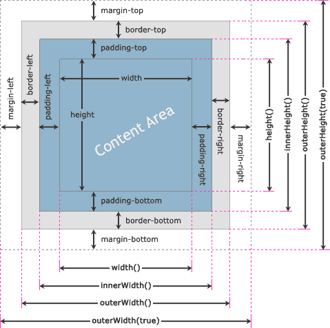

# jQuery 维度

> 原文：<https://www.tutorialrepublic.com/jquery-tutorial/jquery-dimensions.php>

在本教程中，您将学习如何使用 jQuery 获取或设置元素框的尺寸，如宽度和高度。

## 了解 jQuery 维度

jQuery 提供了几种方法，如`height()`、`innerHeight()`、`outerHeight()`、`width()`、`innerWidth()`和`outerWidth()`来获取和设置元素的 CSS 尺寸。查看下图，了解这些方法是如何计算元素的盒子尺寸的。



* * *

## jQuery `width()`和`height()`方法

jQuery `width()`和`height()`方法分别获取或设置元素的 [`width`](../css-reference/css-width-property.php) 和 [`height`](../css-reference/css-height-property.php) 。这个宽度和高度不包括元素上的 [`padding`](../css-reference/css-padding-property.php) 、 [`border`](../css-reference/css-border-property.php) 和 [`margin`](../css-reference/css-margin-property.php) 。下面的例子将返回一个 [`<div>`](../html-reference/html-div-tag.php) 元素的宽度和高度。

#### 例子

[Try this code »](../codelab.php?topic=jquery&file=get-width-and-height-of-an-element "Try this code using online Editor")

```
<script>
$(document).ready(function(){
    $("button").click(function(){
        var divWidth = $("#box").width();
        var divHeight = $("#box").height();
        $("#result").html("Width: " + divWidth + ", " + "Height: " + divHeight);
    });
});
</script>
```

类似地，您可以通过将值作为参数包含在`width()`和`height()`方法中来设置元素的宽度和高度。该值可以是字符串(数字和单位，例如 100px、20em 等。)或者一个数字。下面的例子将分别设置`<div>`元素的宽度为 400 像素，高度为 300 像素。

#### 例子

[Try this code »](../codelab.php?topic=jquery&file=set-width-and-height-of-an-element "Try this code using online Editor")

```
<script>
$(document).ready(function(){
    $("button").click(function(){
        $("#box").width(400).height(300);
    });
});
</script>
```

 ***注意:**如果您想在数学计算中使用元素的宽度或高度，请使用 jQuery `width()`或`height()`方法，因为它会将 [`width`](../css-reference/css-width-property.php) 和 [`height`](../css-reference/css-height-property.php) 属性值作为无单位像素值(例如 400)返回。然而，`css("width")`或`css("height")`方法返回带有单位的值(例如 400px)。*  ** * *

## jQuery `innerWidth()`和`innerHeight()`方法

jQuery `innerWidth()`和`innerHeight()`方法分别获取或设置元素的*内部宽度*和*内部高度*。该内部宽度和高度包括元素上的`padding`，但不包括`border`和`margin`。下面的例子将返回点击按钮时`<div>`元素的内部宽度和高度。

#### 例子

[Try this code »](../codelab.php?topic=jquery&file=get-inner-width-and-height-of-an-element "Try this code using online Editor")

```
<script>
$(document).ready(function(){
    $("button").click(function(){
        var divWidth = $("#box").innerWidth();
        var divHeight = $("#box").innerHeight();
        $("#result").html("Inner Width: " + divWidth + ", " + "Inner Height: " + divHeight);
    });
});
</script>
```

类似地，您可以通过将值作为参数传递给`innerWidth()`和`innerHeight()`方法来设置元素的内部宽度和高度。这些方法只改变元素内容区域的宽度或高度来匹配指定的值。

例如，如果元素的当前宽度是 300 像素，并且左右填充之和等于 50 像素，那么在将内部宽度设置为 400 像素之后，元素的新宽度是 350 像素，即`New Width = Inner Width - Horizontal Padding`。同样，您可以在设置内部高度的同时估计高度的变化。

#### 例子

[Try this code »](../codelab.php?topic=jquery&file=set-inner-width-and-height-of-an-element "Try this code using online Editor")

```
<script>
$(document).ready(function(){
    $("button").click(function(){
        $("#box").innerWidth(400).innerHeight(300);
    });
});
</script>
```

* * *

## jQuery `outerWidth()`和`outerHeight()`方法

jQuery `outerWidth()`和`outerHeight()`方法分别获取或设置元素的*外宽*和*外高*。该外部宽度和高度包括`padding`和`border`，但不包括元素上的`margin`。下面的例子将返回点击按钮时`<div>`元素的外部宽度和高度。

#### 例子

[Try this code »](../codelab.php?topic=jquery&file=get-outer-width-and-height-of-an-element "Try this code using online Editor")

```
<script>
$(document).ready(function(){
    $("button").click(function(){
        var divWidth = $("#box").outerWidth();
        var divHeight = $("#box").outerHeight();
        $("#result").html("Outer Width: " + divWidth + ", " + "Outer Height: " + divHeight);
    });
});
</script>
```

您还可以获得包含元素的`padding`和`border`以及`margin`的外部宽度和高度。为此，只需为外部宽度方法指定`true`参数，如`outerWidth(true)`和`outerHeight(true)`。

#### 例子

[Try this code »](../codelab.php?topic=jquery&file=get-outer-width-and-height-of-an-element-including-margin "Try this code using online Editor")

```
<script>
$(document).ready(function(){
    $("button").click(function(){
        var divWidth = $("#box").outerWidth(true);
        var divHeight = $("#box").outerHeight(true);
        $("#result").html("Outer Width: " + divWidth + ", " + "Outer Height: " + divHeight);
    });
});
</script>
```

类似地，您可以通过将值作为参数传递给`outerWidth()`和`outerHeight()`方法来设置元素的外部宽度和高度。这些方法只改变元素内容区域的宽度或高度来匹配指定的值，就像`innerWidth()`和`innerHeight()`方法一样。

例如，如果元素的当前宽度是 300 像素，并且左右填充的和等于 50 像素，并且左右边框的宽度的和是 20 像素，则在将外部宽度设置为 400 像素之后，元素的新宽度是 330 像素，即`New Width = Outer Width - (Horizontal Padding + Horizontal Border)`。同样，您可以在设置外部高度时估计高度的变化。

#### 例子

[Try this code »](../codelab.php?topic=jquery&file=set-outer-width-and-height-of-an-element "Try this code using online Editor")

```
<script>
$(document).ready(function(){
    $("button").click(function(){
        $("#box").outerWidth(400).outerHeight(300);
    });
});
</script>
```*