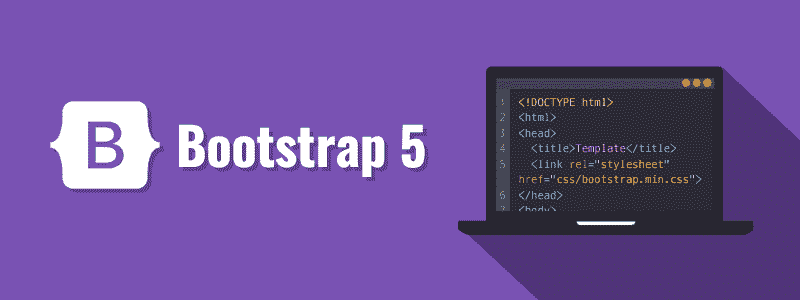

# 引导教程

> 原文：<https://www.tutorialrepublic.com/twitter-bootstrap-tutorial/>

Bootstrap 是最流行和最强大的前端(HTML、CSS 和 JavaScript)框架，用于更快和更容易响应的 web 开发。

Bootstrap 是一个强大的前端框架，用于更快更容易的 web 开发。它包括基于 HTML 和 CSS 的设计模板，用于创建常见的用户界面组件，如表单、按钮、导航、下拉菜单、警告、模态、标签、折叠、传送带、工具提示等等。

Bootstrap 使您能够以更少的努力创建灵活且响应迅速的 web 布局。

Bootstrap 最初是由 Twitter 的一名设计师和一名开发人员在 2010 年年中创建的。在成为开源框架之前，Bootstrap 被称为 Twitter Blueprint。

使用 Bootstrap 可以节省大量时间和精力。所以，把这个网站收藏起来，继续前进。

 ***提示:**我们的引导程序教程将通过对每个主题的简单易懂的解释，帮助您逐步了解引导程序的基本和高级功能。如果你是初学者，从基础开始，通过每天学习一点点逐步前进。*  ** * *

## 你能用 Bootstrap 做什么

使用 Bootstrap 可以做更多的事情。

*   你可以很容易地创建响应网站。
*   您可以使用预定义的类快速创建多列布局。
*   您可以快速创建不同类型的表单布局。
*   你可以快速创建不同变化的导航条。
*   您可以轻松地创建组件，如手风琴、调式钢琴等。无需编写任何 JS 代码。
*   您可以轻松创建动态选项卡来管理大量内容。
*   您可以轻松地创建工具提示和弹出窗口来显示提示文本。
*   您可以轻松创建旋转木马或图像滑块来展示您的内容。
*   您可以快速创建不同类型的警告框。

列表并没有到此结束，您还可以使用 Bootstrap 做许多其他有趣的事情。在接下来的章节中，你将会详细地了解它们。

* * *

## 使用自举的优势

如果你有一些前端框架的经验，你可能想知道是什么让 Bootstrap 如此特别。以下是选择 Bootstrap 框架的一些优势:

*   **节省大量时间** —使用 Bootstrap 预定义的设计模板和类，您可以节省大量时间和精力，并专注于其他开发工作。
*   **响应式功能** —使用 Bootstrap，您可以轻松创建响应式网站，在不同的设备和屏幕分辨率上显示更合适，而无需更改任何标记。
*   **一致的设计** —所有引导组件通过一个中央库共享相同的设计模板和样式，因此您的网页的设计和布局将是一致的。
*   **易于使用** — Bootstrap 非常易于使用。任何具备 HTML、CSS 和 JavaScript 基本工作知识的人都可以从 Bootstrap 开始开发。
*   **与浏览器兼容** — Bootstrap 是为现代网络浏览器设计的，它与所有现代浏览器兼容，如 Chrome、Firefox、Safari、Internet Explorer 等。
*   **开源**——最棒的是，它完全免费下载和使用。

 ***注意:**默认情况下，引导响应采用移动优先方法。Bootstrap 5 是 Bootstrap 的最新和最稳定的版本。Bootstrap 5 在所有主要的现代浏览器中都得到支持，如 Google Chrome、Firefox、Safari、Internet Explorer 10 及更高版本等。*  ** * *

## 本教程涵盖的内容

本系列教程涵盖了 Bootstrap 框架的所有特性，从基础开始，比如网格系统、版式设计机制、表单设计方法，以及设计表格、列表、图像等常见用户界面元素的技术。

此外，您将了解如何利用现成的引导组件，如列表组、输入组、按钮组、卡片、导航栏、面包屑、分页、标签和徽章、进度条等。以及如何定制它们以创建不同的变体。

最后，您将探索 Bootstrap 的一些高级特性，如创建模态窗口、动态标签、工具提示、警告、折叠菜单、旋转木马、scrollspy 等。以及如何使用可用的选项和方法定制它们或扩展它们的现有功能。

 *提示:本教程的每一章都包含了大量真实世界的例子，你可以使用在线编辑器来尝试和测试。这些例子将帮助你更好地理解概念或主题。它还包含智能解决方案以及有用的提示和重要说明。***