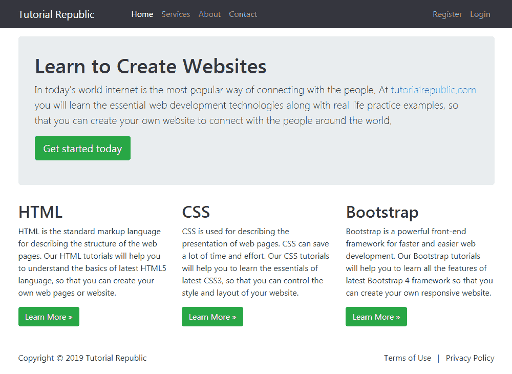

# Bootstrap固定布局

> 原文：<https://www.tutorialrepublic.com/twitter-bootstrap-tutorial/bootstrap-fixed-layout.php>

在本教程中，你将学习如何用 Bootstrap 创建固定布局。

## 使用Bootstrap创建固定布局

使用 Bootstrap，您仍然可以基于固定数量的像素创建网页布局，但是容器宽度会根据视口宽度而变化，并且布局也会做出响应。

创建固定但反应灵敏的布局的过程基本上从`.container`类开始。之后，您可以用`.row`类创建行来包装水平的列组。行必须放在一个`.container`内，以便正确对齐和填充。

使用预定义的网格类，如`.col`、`col-{xs|sm|md|lg|xl|xxl}-*`，可以在一行内创建更多的列，其中`*`代表网格编号，应该是从 1 到 12。请查看关于[Bootstrap网格系统](bootstrap-grid-system.php)的教程，了解更多关于网格类的知识..

 ***注:**文字、图片、视频、表格等实际内容。应该放在列中，并且只有列可以是行的直接子级。*  *以下示例将创建一个固定宽度的响应布局，在平板电脑等中型设备上为 720 像素宽(视口≥768 像素)，而在小型笔记本电脑等大型设备上为 960 像素宽(视口≥992 像素)，在台式机等超大型设备上为 1140 像素宽(视口≥1200 像素)，在大型台式机等超大型设备上为 1320 像素宽(视口≥1400 像素)。

但是，在手机等小型设备上(576px ≤ viewport < 768px)，布局宽度将为 540px。但是，在超小型设备(视窗< 576 像素)上，布局将覆盖 100%的宽度。此外，在这两种情况下，列将垂直堆叠，navbar 将折叠。

#### 例子

[Try this code »](../codelab.php?topic=bootstrap&file=fixed-layout "Try this code using online Editor") *```
<!DOCTYPE html>
<html lang="en">
<head>
<meta charset="utf-8">
<meta name="viewport" content="width=device-width, initial-scale=1">
<title>Bootstrap Fixed Layout Example</title>
<link rel="stylesheet" href="css/bootstrap.min.css">
<script src="js/bootstrap.bundle.min.js"></script>
</head>
<body>
<nav class="navbar navbar-expand-lg navbar-dark bg-dark">
    <div class="container-fluid">
        <a href="#" class="navbar-brand">Tutorial Republic</a>
        <button type="button" class="navbar-toggler" data-bs-toggle="collapse" data-bs-target="#navbarCollapse">
            <span class="navbar-toggler-icon"></span>
        </button>
        <div class="collapse navbar-collapse" id="navbarCollapse">
            <div class="navbar-nav">
                <a href="#" class="nav-item nav-link active">Home</a>
                <a href="#" class="nav-item nav-link">Services</a>
                <a href="#" class="nav-item nav-link">About</a>
                <a href="#" class="nav-item nav-link">Contact</a>
            </div>
            <div class="navbar-nav ms-auto">
                <a href="#" class="nav-item nav-link">Register</a>
                <a href="#" class="nav-item nav-link">Login</a>
            </div>
        </div>
    </div>
</nav>
<div class="container">
    <div class="p-5 my-4 bg-light rounded-3">
        <h1>Learn to Create Websites</h1>
        <p class="lead">In today's world internet is the most popular way of connecting with the people. At <a href="https://www.tutorialrepublic.com" class="text-success" target="_blank">tutorialrepublic.com</a> you will learn the essential web development technologies along with real life practice examples, so that you can create your own website to connect with the people around the world.</p>
        <p><a href="https://www.tutorialrepublic.com" target="_blank" class="btn btn-success btn-lg">Get started today</a></p>
    </div>
    <div class="row">
        <div class="col-md-4">
            <h2>HTML</h2>
            <p>HTML is the standard markup language for describing the structure of the web pages. Our HTML tutorials will help you to understand the basics of latest HTML5 language, so that you can create your own web pages or website.</p>
            <p><a href="https://www.tutorialrepublic.com/html-tutorial/" target="_blank" class="btn btn-success">Learn More &raquo;</a></p>
        </div>
        <div class="col-md-4">
            <h2>CSS</h2>
            <p>CSS is used for describing the presentation of web pages. CSS can save a lot of time and effort. Our CSS tutorials will help you to learn the essentials of latest CSS3, so that you can control the style and layout of your website.</p>
            <p><a href="https://www.tutorialrepublic.com/css-tutorial/" target="_blank" class="btn btn-success">Learn More &raquo;</a></p>
        </div>
        <div class="col-md-4">
            <h2>Bootstrap</h2>
            <p>Bootstrap is a powerful front-end framework for faster and easier web development. Our Bootstrap tutorials will help you to learn all the features of latest Bootstrap 4 framework so that you can easily create responsive websites.</p>
            <p><a href="https://www.tutorialrepublic.com/twitter-bootstrap-tutorial/" target="_blank" class="btn btn-success">Learn More &raquo;</a></p>
        </div>
    </div>
    <hr>
    <footer>
        <div class="row">
            <div class="col-md-6">
                <p>Copyright &copy; 2021 Tutorial Republic</p>
            </div>
            <div class="col-md-6 text-md-end">
                <a href="#" class="text-dark">Terms of Use</a> 
                <span class="text-muted mx-2">|</span> 
                <a href="#" class="text-dark">Privacy Policy</a>
            </div>
        </div>
    </footer>
</div>
</body>
</html>
```*  *—以上示例的输出类似于以下内容:

[](../codelab.php?topic=bootstrap&file=fixed-layout) 

我们已经使用了保证金实用程序类，如`.mb-3`、`.ml-auto`、`mx-2`等。调整元素之间的间距。而类`.text-dark`、`.text-muted`、`.text-md-right`是文本实用程序类，用于调整文本的颜色和对齐。你将在后面的章节中了解它们。**