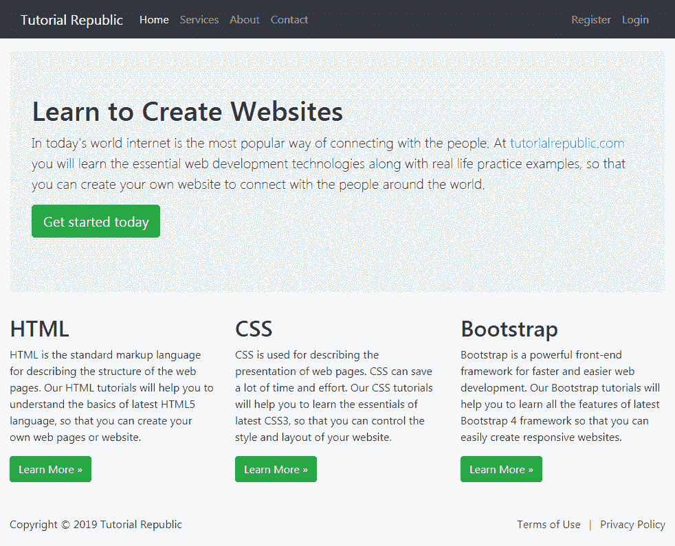

# Bootstrap 流式布局

> 原文：<https://www.tutorialrepublic.com/twitter-bootstrap-tutorial/bootstrap-fluid-layout.php>

在本教程中，您将学习如何使用 Bootstrap 创建流式布局。

## 使用 Bootstrap 创建流式布局

在 Bootstrap 中，您可以使用类`.container-fluid`创建流式布局，以利用所有设备(超小型、小型、中型、大型、超大型和超大型)的 100%视口宽度。

类`.container-fluid`简单地应用`width: 100%`而不是不同的宽度来适应不同的视窗尺寸。但是，布局仍然可以响应，您可以像往常一样使用网格类。参见关于[Bootstrap 网格系统](bootstrap-grid-system.php)的教程，了解更多关于网格类的知识。

以下示例将创建一个覆盖屏幕 100%宽度的流式布局。

#### 例子

[Try this code »](../codelab.php?topic=bootstrap&file=fluid-layout "Try this code using online Editor") *```html
<!DOCTYPE html>
<html lang="en">
<head>
<meta charset="utf-8">
<meta name="viewport" content="width=device-width, initial-scale=1">
<title>Bootstrap Fluid Layout Example</title>
<link rel="stylesheet" href="css/bootstrap.min.css">
<script src="js/bootstrap.bundle.min.js"></script>
</head>
<body>
<nav class="navbar navbar-expand-lg navbar-dark bg-dark">
    <div class="container-fluid">
        <a href="#" class="navbar-brand">Tutorial Republic</a>
        <button type="button" class="navbar-toggler" data-bs-toggle="collapse" data-bs-target="#navbarCollapse">
            <span class="navbar-toggler-icon"></span>
        </button>
        <div class="collapse navbar-collapse" id="navbarCollapse">
            <div class="navbar-nav">
                <a href="#" class="nav-item nav-link active">Home</a>
                <a href="#" class="nav-item nav-link">Services</a>
                <a href="#" class="nav-item nav-link">About</a>
                <a href="#" class="nav-item nav-link">Contact</a>
            </div>
            <div class="navbar-nav ms-auto">  
                <a href="#" class="nav-item nav-link">Register</a>            	
                <a href="#" class="nav-item nav-link">Login</a>
            </div>
        </div>
    </div>
</nav>
<div class="container-fluid">
    <div class="p-5 my-4 bg-light rounded-3">
        <h1>Learn to Create Websites</h1>
        <p class="lead">In today's world internet is the most popular way of connecting with the people. At <a href="https://www.tutorialrepublic.com" class="text-success" target="_blank">tutorialrepublic.com</a> you will learn the essential web development technologies along with real life practice examples, so that you can create your own website to connect with the people around the world.</p>
        <p><a href="https://www.tutorialrepublic.com" target="_blank" class="btn btn-success btn-lg">Get started today</a></p>
    </div>
    <div class="row">
        <div class="col-md-4">
            <h2>HTML</h2>
            <p>HTML is the standard markup language for describing the structure of the web pages. Our HTML tutorials will help you to understand the basics of latest HTML5 language, so that you can create your own web pages or website.</p>
            <p><a href="https://www.tutorialrepublic.com/html-tutorial/" target="_blank" class="btn btn-success">Learn More &raquo;</a></p>
        </div>
        <div class="col-md-4">
            <h2>CSS</h2>
            <p>CSS is used for describing the presentation of web pages. CSS can save a lot of time and effort. Our CSS tutorials will help you to learn the essentials of latest CSS3, so that you can control the style and layout of your website.</p>
            <p><a href="https://www.tutorialrepublic.com/css-tutorial/" target="_blank" class="btn btn-success">Learn More &raquo;</a></p>
        </div>
        <div class="col-md-4">
            <h2>Bootstrap</h2>
            <p>Bootstrap is a powerful front-end framework for faster and easier web development. Our Bootstrap tutorials will help you to learn all the features of latest Bootstrap 4 framework so that you can easily create responsive websites.</p>
            <p><a href="https://www.tutorialrepublic.com/twitter-bootstrap-tutorial/" target="_blank" class="btn btn-success">Learn More &raquo;</a></p>
        </div>
    </div>
    <hr>
    <footer>
        <div class="row">
            <div class="col-md-6">
                <p>Copyright &copy; 2021 Tutorial Republic</p>
            </div>
            <div class="col-md-6 text-md-end">
                <a href="#" class="text-dark">Terms of Use</a> 
                <span class="text-muted mx-2">|</span> 
                <a href="#" class="text-dark">Privacy Policy</a>
            </div>
        </div>
    </footer>
</div>
</body>
</html>
```*  *—以上示例的输出类似于以下内容:

[](../codelab.php?topic=bootstrap&file=fluid-layout)*