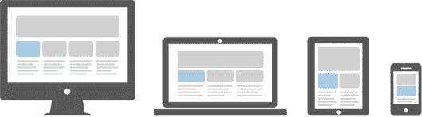

# Bootstrap 响应布局

> 原文：<https://www.tutorialrepublic.com/twitter-bootstrap-tutorial/bootstrap-responsive-layout.php>

在本教程中，你将学习如何用 Bootstrap 框架创建响应性网站。

## 什么是响应式网页设计

响应式网站设计是一个设计和构建网站的过程，通过针对不同设备进行优化，为用户提供更好的可访问性和最佳的浏览体验。

随着智能手机和平板电脑的增长趋势，忽略移动设备网站的优化几乎是不可避免的。响应式网页设计是一种更好的选择，也是一种更有效的方式，可以用少得多的努力来瞄准各种各样的设备。

响应式布局可自动调整并适应任何设备屏幕尺寸，无论是台式机、笔记本电脑、平板电脑还是手机。请参见下图。



* * *

## 使用 Bootstrap 创建响应式布局

借助 Bootstrap 强大的移动 first [flexbox](../css-tutorial/css3-flexible-box-layouts.php) 网格系统，创建响应迅速、移动友好的网站和应用变得更加容易。

Bootstrap 从一开始就响应迅速且移动友好。它的[六层网格类](bootstrap-grid-system.php)提供了对布局的更好控制，以及它将如何在不同类型的设备上呈现，如手机、平板电脑、笔记本电脑和台式机、大屏幕设备等。

以下示例将创建一个响应式布局，在超大设备(视窗≥ 1200px)中呈现为 4 列布局，在大型设备(992px ≤视窗< 1200px)中呈现为 3 列布局，而在中型设备(768px ≤视窗< 992px)中呈现为 2 列布局，在小型和超小型设备(视窗< 768px)中呈现为 1 列布局。让我们尝试一下，看看它是如何工作的:

#### 例子

[Try this code »](../codelab.php?topic=bootstrap&file=responsive-layout "Try this code using online Editor") *```
<!DOCTYPE html>
<html lang="en">
<head>
<meta charset="utf-8">
<meta name="viewport" content="width=device-width, initial-scale=1">
<title>Bootstrap Responsive Layout Example</title>
<link rel="stylesheet" href="css/bootstrap.min.css">
<script src="js/bootstrap.bundle.min.js"></script>
</head>
<body>
<nav class="navbar navbar-expand-lg navbar-dark bg-dark">
    <div class="container-fluid">
        <a href="#" class="navbar-brand">Tutorial Republic</a>
        <button type="button" class="navbar-toggler" data-bs-toggle="collapse" data-bs-target="#navbarCollapse">
            <span class="navbar-toggler-icon"></span>
        </button>
        <div class="collapse navbar-collapse" id="navbarCollapse">
            <div class="navbar-nav">
                <a href="#" class="nav-item nav-link active">Home</a>
                <a href="#" class="nav-item nav-link">Services</a>
                <a href="#" class="nav-item nav-link">About</a>
                <a href="#" class="nav-item nav-link">Contact</a>
            </div>
            <div class="navbar-nav ms-auto">
                <a href="#" class="nav-item nav-link">Register</a>
                <a href="#" class="nav-item nav-link">Login</a>
            </div>
        </div>
    </div>
</nav>
<div class="container">
    <div class="p-5 my-4 bg-light rounded-3">
        <h1>Learn to Create Websites</h1>
        <p class="lead">In today's world internet is the most popular way of connecting with the people. At <a href="https://www.tutorialrepublic.com" class="text-success" target="_blank">tutorialrepublic.com</a> you will learn the essential web development technologies along with real life practice examples, so that you can create your own website to connect with the people around the world.</p>
        <p><a href="https://www.tutorialrepublic.com" target="_blank" class="btn btn-success btn-lg">Get started today</a></p>
    </div>
    <div class="row g-3">
        <div class="col-md-6 col-lg-4 col-xl-3">
            <h2>HTML</h2>
            <p>HTML is the standard markup language for describing the structure of the web pages. Our HTML tutorials will help you to understand the basics of latest HTML5 language, so that you can create your own website.</p>
            <p><a href="https://www.tutorialrepublic.com/html-tutorial/" target="_blank" class="btn btn-success">Learn More &raquo;</a></p>
        </div>
        <div class="col-md-6 col-lg-4 col-xl-3">
            <h2>CSS</h2>
            <p>CSS is used for describing the presentation of web pages. CSS can save a lot of time and effort. Our CSS tutorials will help you to learn the essentials of latest CSS3, so that you can control the style and layout of your website.</p>
            <p><a href="https://www.tutorialrepublic.com/css-tutorial/" target="_blank" class="btn btn-success">Learn More &raquo;</a></p>
        </div>
        <div class="col-md-6 col-lg-4 col-xl-3">
            <h2>JavaScript</h2>
            <p>JavaScript is the most popular and widely used client-side scripting language. Our JavaScript tutorials will provide in-depth knowledge of the JavaScript including ES6 features, so that you can create interactive websites.</p>
            <p><a href="https://www.tutorialrepublic.com/javascript-tutorial/" target="_blank" class="btn btn-success">Learn More &raquo;</a></p>
        </div>
        <div class="col-md-6 col-lg-4 col-xl-3">
            <h2>Bootstrap</h2>
            <p>Bootstrap is a powerful front-end framework for faster and easier web development. Our Bootstrap tutorials will help you to learn all the features of latest Bootstrap 4 framework so that you can easily create responsive websites.</p>
            <p><a href="https://www.tutorialrepublic.com/twitter-bootstrap-tutorial/" target="_blank" class="btn btn-success">Learn More &raquo;</a></p>
        </div>
        <div class="col-md-6 col-lg-4 col-xl-3">
            <h2>PHP</h2>
            <p>PHP is the most popular server-side scripting language for creating dynamic web pages. Our PHP tutorials will help you to learn all the features of latest PHP7 scripting language so that you can easily create dynamic websites.</p>
            <p><a href="https://www.tutorialrepublic.com/twitter-bootstrap-tutorial/" target="_blank" class="btn btn-success">Learn More &raquo;</a></p>
        </div>
        <div class="col-md-6 col-lg-4 col-xl-3">
            <h2>SQL</h2>
            <p>SQL is a standard language designed for managing data in relational database management system. Our SQL tutorials will help you to learn the fundamentals of the SQL language so that you can efficiently manage your databases.</p>
            <p><a href="https://www.tutorialrepublic.com/twitter-bootstrap-tutorial/" target="_blank" class="btn btn-success">Learn More &raquo;</a></p>
        </div>
        <div class="col-md-6 col-lg-4 col-xl-3">
            <h2>References</h2>
            <p>Our references section outlines all the standard HTML5 tags and CSS3 properties along with other useful references such as color names and values, character entities, web safe fonts, language codes, HTTP messages, and more.</p>
            <p><a href="https://www.tutorialrepublic.com/twitter-bootstrap-tutorial/" target="_blank" class="btn btn-success">Learn More &raquo;</a></p>
        </div>
        <div class="col-md-6 col-lg-4 col-xl-3">
            <h2>FAQ</h2>
            <p>Our Frequently Asked Questions (FAQ) section is an extensive collection of FAQs that provides quick and working solution of common questions and queries related to web design and development with live demo.</p>
            <p><a href="https://www.tutorialrepublic.com/twitter-bootstrap-tutorial/" target="_blank" class="btn btn-success">Learn More &raquo;</a></p>
        </div>
    </div>
    <hr>
    <footer>
        <div class="row">
            <div class="col-md-6">
                <p>Copyright &copy; 2021 Tutorial Republic</p>
            </div>
            <div class="col-md-6 text-md-end">
                <a href="#" class="text-dark">Terms of Use</a>
                <span class="text-muted mx-2">|</span>
                <a href="#" class="text-dark">Privacy Policy</a>
            </div>
        </div>
    </footer>
</div>
</body>
</html>
```*  ****提示:**在新的空白窗口中打开这个例子的输出(点击 CodeLab 编辑器中的链接)并调整屏幕大小，你会看到当视窗宽度跨越或接近某个限制(即[断点](bootstrap-grid-system.php#grid-features))时内容框的方向会发生变化。**