# Bootstrap 表

> 原文：<https://www.tutorialrepublic.com/twitter-bootstrap-tutorial/bootstrap-tables.php>

在本教程中，你将学习如何用 Bootstrap 创建优雅的表格。

## 什么是桌子？

HTML 表格用于以网格方式显示数据，如行和列。使用 Bootstrap，你可以以一种快速简单的方式极大地改善表格的外观。

参见关于 [HTML 表格](../html-tutorial/html-tables.php)的教程，了解更多关于表格的信息。

## 使用 Bootstrap 创建简单的表

您可以创建具有水平分隔线和小单元格填充(默认为 8px)的基本样式的表格，只需将 Bootstrap 的类`.table`添加到 [`<table>`](../html-reference/html-table-tag.php) 元素中。

#### 例子

[Try this code »](../codelab.php?topic=bootstrap&file=simple-table "Try this code using online Editor") *```
<table class="table">
    <thead>
        <tr>
            <th>#</th>
            <th>First Name</th>
            <th>Last Name</th>
            <th>Email</th>
        </tr>
    </thead>
    <tbody>
        <tr>
            <td>1</td>
            <td>Clark</td>
            <td>Kent</td>
            <td>clarkkent@mail.com</td>
        </tr>
        <tr>
            <td>2</td>
            <td>Peter</td>
            <td>Parker</td>
            <td>peterparker@mail.com</td>
        </tr> 
        <tr>
            <td>3</td>
            <td>John</td>
            <td>Carter</td>
            <td>johncarter@mail.com</td>
        </tr>                   
    </tbody>
</table>
```*  *—以上示例的输出类似于以下内容:

[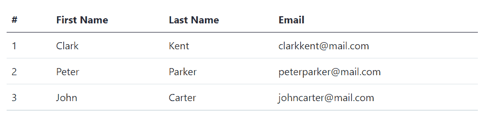](../codelab.php?topic=bootstrap&file=simple-table) 

* * *

## 创建重音表

Bootstrap 甚至提供了一些上下文类，如`.table-primary`、`.table-secondary`、`.table-success`、`.table-danger`、`.table-warning`、`.table-info`、`.table-light`和`.table-dark`来给表格、表格行或单个单元格着色。

例如，您可以通过将上下文类`.table-dark`添加到`.table`基类来创建深色版本的表格(即深色背景上带有浅色文本的表格)，如下所示:

#### 例子

[Try this code »](../codelab.php?topic=bootstrap&file=dark-table "Try this code using online Editor") *```
<table class="table table-dark">
    <thead>
        <tr>
            <th>#</th>
            <th>First Name</th>
            <th>Last Name</th>
            <th>Email</th>
        </tr>
    </thead>
    <tbody>
        <tr>
            <td>1</td>
            <td>Clark</td>
            <td>Kent</td>
            <td>clarkkent@mail.com</td>
        </tr>
        <tr>
            <td>2</td>
            <td>Peter</td>
            <td>Parker</td>
            <td>peterparker@mail.com</td>
        </tr> 
        <tr>
            <td>3</td>
            <td>John</td>
            <td>Carter</td>
            <td>johncarter@mail.com</td>
        </tr>                   
    </tbody>
</table>
```*  *—上述示例的输出类似于以下内容:

[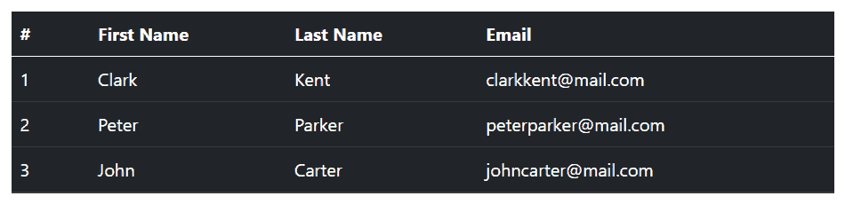](../codelab.php?topic=bootstrap&file=dark-table) 

同样，您可以使用其他上下文类。例如，下面的例子使用了`.table`上的类`.table-success`来创建表格的绿色变体。

#### 例子

[Try this code »](../codelab.php?topic=bootstrap&file=accented-table "Try this code using online Editor") *```
<table class="table table-success">
    <thead>
        <tr>
            <th>#</th>
            <th>First Name</th>
            <th>Last Name</th>
            <th>Email</th>
        </tr>
    </thead>
    <tbody>
        <tr>
            <td>1</td>
            <td>Clark</td>
            <td>Kent</td>
            <td>clarkkent@mail.com</td>
        </tr>
        <tr>
            <td>2</td>
            <td>Peter</td>
            <td>Parker</td>
            <td>peterparker@mail.com</td>
        </tr> 
        <tr>
            <td>3</td>
            <td>John</td>
            <td>Carter</td>
            <td>johncarter@mail.com</td>
        </tr>                   
    </tbody>
</table>
```*  *—以上示例的输出类似于以下内容:

[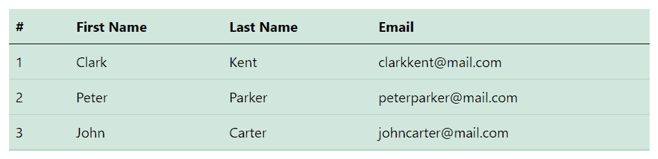](../codelab.php?topic=bootstrap&file=accented-table) 

查看 snippets 部分，查看一些设计精美的 Bootstrap 表的例子。

 ***提示:**您可以在`.table`基类上使用这些上下文相关的类来创建任何表格的彩色版本，比如条带化的、可悬停的、有边框的、紧凑的表格等等。*  *与表格类似，您也可以使用这些上下文类来强调表格中的行。下面是一个带有强调行的表格示例，让我们来看看:

#### 例子

[Try this code »](../codelab.php?topic=bootstrap&file=table-with-accented-rows "Try this code using online Editor") *```
<table class="table">
    <thead>
        <tr>
            <th>#</th>
            <th>Bill</th>
            <th>Payment Date</th>
            <th>Payment Status</th>
        </tr>
    </thead>
    <tbody>
        <tr class="table-primary">
            <td>1</td>
            <td>Credit Card</td>
            <td>04/07/2021</td>
            <td>Waiting for statement</td>
        </tr>
        <tr class="table-secondary">
            <td>2</td>
            <td>Insurance</td>
            <td>02/07/2021</td>
            <td>Cancelled</td>
        </tr>
        <tr class="table-success">
            <td>3</td>
            <td>Water</td>
            <td>01/07/2021</td>
            <td>Paid</td>
        </tr>
        <tr class="table-info">
            <td>4</td>
            <td>Internet</td>
            <td>05/07/2021</td>
            <td>Change plan</td>
        </tr>
        <tr class="table-warning">
            <td>5</td>
            <td>Electricity</td>
            <td>03/07/2021</td>
            <td>Pending</td>
        </tr>
        <tr class="table-danger">
            <td>6</td>
            <td>Telephone</td>
            <td>06/07/2021</td>
            <td>Due</td>
        </tr>
        <tr class="table-light">
            <td>7</td>
            <td>Car Service</td>
            <td>08/07/2021</td>
            <td>Call in to confirm</td>
        </tr>
        <tr class="table-dark">
            <td>8</td>
            <td>Gas</td>
            <td>06/07/2021</td>
            <td>Payment failed</td>
        </tr>
    </tbody>
</table>
```*  *—以上示例的输出类似于以下内容:

[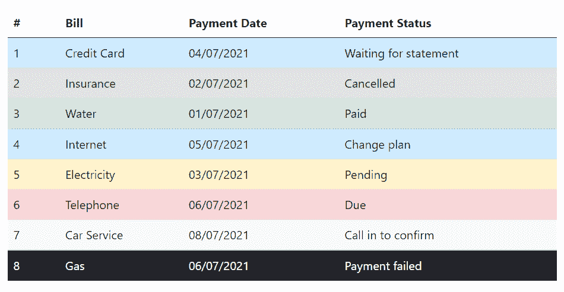](../codelab.php?topic=bootstrap&file=table-with-accented-rows) 

* * *

## 创建带条纹行的表

您还可以在 [`<tbody>`](/html-reference/html-tbody-tag.php) 中的表格行中添加斑马条纹，只需在`.table`基类中添加一个额外的类`.table-striped`，如下所示:

#### 例子

[Try this code »](../codelab.php?topic=bootstrap&file=table-striped "Try this code using online Editor") *```
<table class="table table-striped">
    <thead>
        <tr>
            <th>#</th>
            <th>First Name</th>
            <th>Last Name</th>
            <th>Email</th>
        </tr>
    </thead>
    <tbody>
        <tr>
            <td>1</td>
            <td>Clark</td>
            <td>Kent</td>
            <td>clarkkent@mail.com</td>
        </tr>
        <tr>
            <td>2</td>
            <td>Peter</td>
            <td>Parker</td>
            <td>peterparker@mail.com</td>
        </tr>  
        <tr>
            <td>3</td>
            <td>John</td>
            <td>Carter</td>
            <td>johncarter@mail.com</td>
        </tr>                  
    </tbody>
</table>
```*  *—以上示例的输出类似于以下内容:

[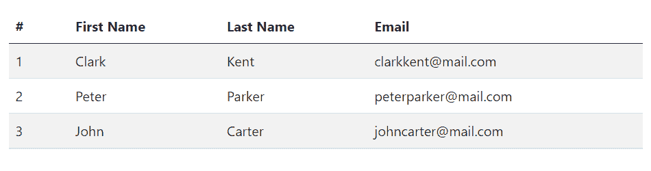](../codelab.php?topic=bootstrap&file=table-striped) 

* * *

## 创建带边框的表格

通过将修饰符类`.table-bordered`添加到`.table`基类，可以在表格和单元格的所有边上添加边框，如下例所示:

#### 例子

[Try this code »](../codelab.php?topic=bootstrap&file=table-bordered "Try this code using online Editor") *```
<table class="table table-bordered">
    <thead>
        <tr>
            <th>#</th>
            <th>First Name</th>
            <th>Last Name</th>
            <th>Email</th>
        </tr>
    </thead>
    <tbody>
        <tr>
            <td>1</td>
            <td>Clark</td>
            <td>Kent</td>
            <td>clarkkent@mail.com</td>
        </tr>
        <tr>
            <td>2</td>
            <td>Peter</td>
            <td>Parker</td>
            <td>peterparker@mail.com</td>
        </tr>
        <tr>
            <td>3</td>
            <td>John</td>
            <td>Carter</td>
            <td>johncarter@mail.com</td>
        </tr>                    
    </tbody>
</table>
```*  *—上述示例的输出类似于以下内容:

[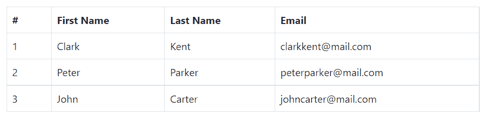](../codelab.php?topic=bootstrap&file=table-bordered) 

* * *

## 创建无边框表格

您还可以使用`.table`元素上的类`.table-borderless`来创建无边框表格。

#### 例子

[Try this code »](../codelab.php?topic=bootstrap&file=borderless-table "Try this code using online Editor") *```
<table class="table table-borderless">
    <thead>
        <tr>
            <th>#</th>
            <th>First Name</th>
            <th>Last Name</th>
            <th>Email</th>
        </tr>
    </thead>
    <tbody>
        <tr>
            <td>1</td>
            <td>Clark</td>
            <td>Kent</td>
            <td>clarkkent@mail.com</td>
        </tr>
        <tr>
            <td>2</td>
            <td>Peter</td>
            <td>Parker</td>
            <td>peterparker@mail.com</td>
        </tr>
        <tr>
            <td>3</td>
            <td>John</td>
            <td>Carter</td>
            <td>johncarter@mail.com</td>
        </tr>                    
    </tbody>
</table>
```*  *—以上示例的输出类似于以下内容:

[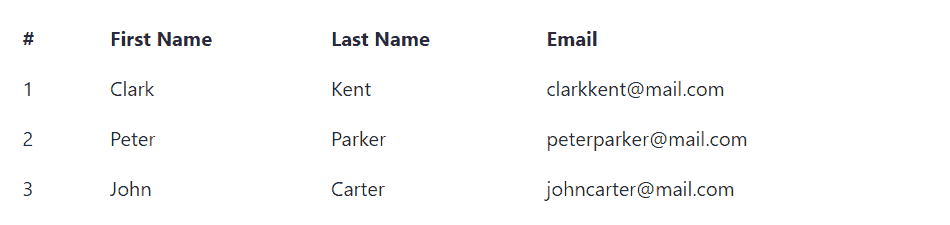](../codelab.php?topic=bootstrap&file=borderless-table) 

* * *

## 在表行上启用悬停状态

通过将修饰符类`.table-hover`添加到`.table`基类中，还可以在 [`<tbody>`](../html-reference/html-tbody-tag.php) 元素中的表格行上启用悬停状态。让我们试试下面的例子:

#### 例子

[Try this code »](../codelab.php?topic=bootstrap&file=table-with-hover-states "Try this code using online Editor") *```
<table class="table table-hover">
    <thead>
        <tr>
            <th>#</th>
            <th>First Name</th>
            <th>Last Name</th>
            <th>Email</th>
        </tr>
    </thead>
    <tbody>
        <tr>
            <td>1</td>
            <td>Clark</td>
            <td>Kent</td>
            <td>clarkkent@mail.com</td>
        </tr>
        <tr>
            <td>2</td>
            <td>Peter</td>
            <td>Parker</td>
            <td>peterparker@mail.com</td>
        </tr>
        <tr>
            <td>3</td>
            <td>John</td>
            <td>Carter</td>
            <td>johncarter@mail.com</td>
        </tr>                    
    </tbody>
</table>
```*  *—以上示例的输出类似于以下内容:

[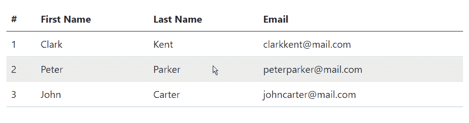](../codelab.php?topic=bootstrap&file=table-with-hover-states) 

* * *

## 创建小型或紧凑的表格

您还可以通过将修饰符类`.table-sm`添加到`.table`基类来使您的表更加紧凑并节省空间。`.table-sm`类通过将所有单元格填充减半来压缩表格。让我们看看下面的例子:

#### 例子

[Try this code »](../codelab.php?topic=bootstrap&file=compact-table "Try this code using online Editor") *```
<table class="table table-sm">
    <thead>
        <tr>
            <th>#</th>
            <th>First Name</th>
            <th>Last Name</th>
            <th>Email</th>
        </tr>
    </thead>
    <tbody>
        <tr>
            <td>1</td>
            <td>Clark</td>
            <td>Kent</td>
            <td>clarkkent@mail.com</td>
        </tr>
        <tr>
            <td>2</td>
            <td>Peter</td>
            <td>Parker</td>
            <td>peterparker@mail.com</td>
        </tr>
        <tr>
            <td>3</td>
            <td>John</td>
            <td>Carter</td>
            <td>johncarter@mail.com</td>
        </tr>                    
    </tbody>
</table>
```*  *—以上示例的输出类似于以下内容:

[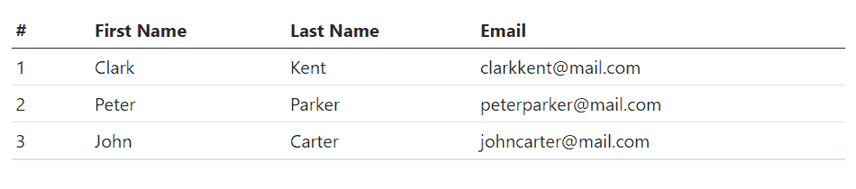](../codelab.php?topic=bootstrap&file=compact-table) 

* * *

## 设置表格标题颜色

与亮表和暗表类似，您可以在`<thead>`元素上使用修改器类`.table-light`或`.table-dark`，使其以亮灰色或暗灰色显示。

下面的例子将创建一个浅灰色背景标题的表格。

#### 例子

[Try this code »](../codelab.php?topic=bootstrap&file=table-head-light "Try this code using online Editor") *```
<table class="table">
    <thead class="table-light">
        <tr>
            <th>#</th>
            <th>First Name</th>
            <th>Last Name</th>
            <th>Email</th>
        </tr>
    </thead>
    <tbody>
        <tr>
            <td>1</td>
            <td>Clark</td>
            <td>Kent</td>
            <td>clarkkent@mail.com</td>
        </tr>
        <tr>
            <td>2</td>
            <td>Peter</td>
            <td>Parker</td>
            <td>peterparker@mail.com</td>
        </tr>
        <tr>
            <td>3</td>
            <td>John</td>
            <td>Carter</td>
            <td>johncarter@mail.com</td>
        </tr>                    
    </tbody>
</table>
```*  *—上述示例的输出类似于以下内容:

[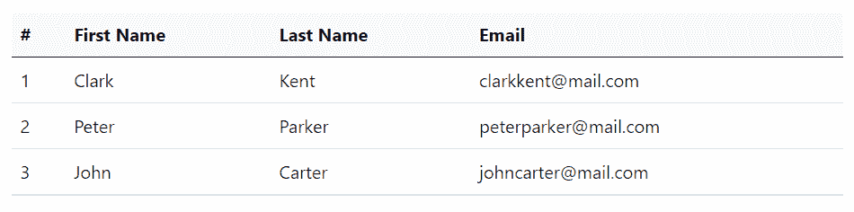](../codelab.php?topic=bootstrap&file=table-head-light) 

下面的例子将创建一个暗灰色背景的表格。

#### 例子

[Try this code »](../codelab.php?topic=bootstrap&file=table-head-dark "Try this code using online Editor") *```
<table class="table">
    <thead class="table-dark">
        <tr>
            <th>#</th>
            <th>First Name</th>
            <th>Last Name</th>
            <th>Email</th>
        </tr>
    </thead>
    <tbody>
        <tr>
            <td>1</td>
            <td>Clark</td>
            <td>Kent</td>
            <td>clarkkent@mail.com</td>
        </tr>
        <tr>
            <td>2</td>
            <td>Peter</td>
            <td>Parker</td>
            <td>peterparker@mail.com</td>
        </tr>
        <tr>
            <td>3</td>
            <td>John</td>
            <td>Carter</td>
            <td>johncarter@mail.com</td>
        </tr>                    
    </tbody>
</table>
```*  *—以上示例的输出类似于以下内容:

[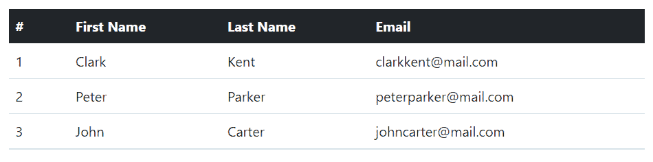](../codelab.php?topic=bootstrap&file=table-head-dark) 

* * *

## 使用 Bootstrap 创建响应表

您还可以创建响应式表格，以便在小型设备上实现水平滚动。

要使任何表格有响应性，只需将它放在一个 [`<div>`](../html-reference/html-div-tag.php) 元素中，并在其上应用`.table-responsive`类。您也可以使用`.table-responsive{-sm|-md|-lg|-xl}`类，根据视窗宽度(即[断点](bootstrap-grid-system.php#grid-features))指定表格何时应该有滚动条。

让我们尝试下面的例子来理解它的基本工作原理:

#### 例子

[Try this code »](../codelab.php?topic=bootstrap&file=responsive-table "Try this code using online Editor") *```
<div class="table-responsive"> 
    <table class="table">
        <thead>
            <tr>
                <th>#</th>
                <th>First Name</th>
                <th>Last Name</th>
                <th>Email</th>
                <th>Biography</th>
            </tr>
        </thead>
        <tbody>
            <tr>
                <td>1</td>
                <td>Clark</td>
                <td>Kent</td>
                <td>clarkkent@mail.com</td>
                <td>Lorem ipsum dolor sit amet...</td>
            </tr>
            <tr>
                <td>2</td>
                <td>Peter</td>
                <td>Parker</td>
                <td>peterparker@mail.com</td>
                <td>Integer pulvinar leo id risus...</td>
            </tr>
            <tr>
                <td>3</td>
                <td>John</td>
                <td>Carter</td>
                <td>johncarter@mail.com</td>
                <td>Vestibulum consectetur scelerisque...</td>
            </tr>            
        </tbody>
    </table>
</div>
```*  ****提示:**`<thead>`单元格内的文本始终垂直对齐底部。然而，`<tbody>`单元格内的文本继承了`<table>`的对齐方式，默认情况下垂直对齐顶部。使用[垂直对齐类](bootstrap-helper-classes.php#vertical-alignment-classes)在需要的地方重新对齐文本。**************