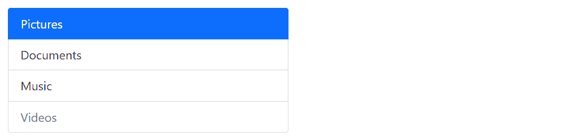

# Bootstrap 列表组

> 原文：<https://www.tutorialrepublic.com/twitter-bootstrap-tutorial/bootstrap-list-groups.php>

在本教程中，您将学习如何使用 Bootstrap 列表组组件。

## 使用 Bootstrap 创建列表组

列表组是非常有用和灵活的组件，用于以漂亮的方式显示元素列表。在最基本的形式中，列表组只是一个具有类`.list-group`的[无序列表](../html-tutorial/html-lists.php)，而列表项具有类`.list-group-item`。

#### 例子

[Try this code »](../codelab.php?topic=bootstrap&file=list-group "Try this code using online Editor")

```
<ul class="list-group w-50">
    <li class="list-group-item">Pictures</li>
    <li class="list-group-item">Documents</li>        
    <li class="list-group-item">Music</li>
    <li class="list-group-item">Videos</li>
</ul>
```

—以上示例的输出类似于以下内容:

[](../codelab.php?topic=bootstrap&file=list-group)  ***提示:**列表组默认为 100%宽。要显式设置它们的宽度，你可以使用 Bootstrap 程序的[宽度实用程序类](bootstrap-helper-classes.php#sizing-classes)(例如`w-25`、`w-50`等)。)或将它们放在[网格栏](bootstrap-grid-system.php)内。*  ** * *

## 指示禁用和活动的项目

您可以简单地将类`.active`添加到一个`.list-group-item`中，以指示当前的活动选择。同样，你可以给一个`.list-group-item`加上`.disabled`，让它看起来像是被禁用了。

#### 例子

[Try this code »](../codelab.php?topic=bootstrap&file=disabled-and-active-items-within-list-group "Try this code using online Editor")

```
<ul class="list-group w-50">
    <li class="list-group-item active">Pictures</li>
    <li class="list-group-item">Documents</li>        
    <li class="list-group-item">Music</li>
    <li class="list-group-item disabled">Videos</li>
</ul>
```

—上述示例的输出类似于以下内容:

[](../codelab.php?topic=bootstrap&file=disabled-and-active-items-within-list-group)  ***提示:**在[列表组有链接项](#list-group-with-linked-items)的情况下，`.disabled`类只是让链接看起来像是被禁用了，但链接仍然是可点击的。要真正禁用链接，您需要使用 JavaScript 或手动删除锚点的 href 属性。*  ** * *

## 边到边列表组

您可以选择将类`.list-group-flush`添加到`list-group`元素中，以移除外部边框和圆角，从而创建与其父容器边对边的列表组。

让我们看看下面的例子，以了解它实际上是如何工作的:

#### 例子

[Try this code »](../codelab.php?topic=bootstrap&file=edge-to-edge-list-group "Try this code using online Editor")

```
<ul class="list-group list-group-flush w-50">
    <li class="list-group-item">Pictures</li>
    <li class="list-group-item">Documents</li>        
    <li class="list-group-item">Music</li>
    <li class="list-group-item">Videos</li>
</ul>
```

—以上示例的输出类似于以下内容:

[](../codelab.php?topic=bootstrap&file=edge-to-edge-list-group) 

* * *

## 创建编号列表组

您还可以创建列表组，通过在`.list-group`元素上添加修饰符类`.list-group-numbered` 来对列表项进行编号，如下所示:

#### 例子

[Try this code »](../codelab.php?topic=bootstrap&file=numbered-list-group "Try this code using online Editor")

```
<ol class="list-group list-group-numbered w-50">
    <li class="list-group-item">An item</li>
    <li class="list-group-item">A second item</li>
    <li class="list-group-item">A third item</li>
    <li class="list-group-item">A fourth item</li>
</ol>
```

—上述示例的输出类似于以下内容:

[](../codelab.php?topic=bootstrap&file=numbered-list-group)  ***注意:**数字是通过 CSS(与 [`<ol>`](/html-reference/html-ol-tag.php) 元素的默认浏览器样式相反)生成的，以便更好地放置在列表组项目中，并允许更好的定制。参见 CSS [`counter-reset`](/css-reference/css-counter-reset-property.php) 和 [`counter-increment`](/css-reference/css-counter-increment-property.php) 属性了解更多信息。*  ** * *

## 带有复选框和单选按钮的列表组

您还可以将 Bootstrap 的自定义复选框和单选按钮放在列表组项目中。

以下示例将创建一个带有自定义复选框的列表组:

#### 例子

[Try this code »](../codelab.php?topic=bootstrap&file=list-group-with-checkboxes "Try this code using online Editor")

```
<div class="list-group w-50">
    <label class="list-group-item">
        <input type="checkbox" class="form-check-input me-1" name="hobbies"> Music
    </label>
    <label class="list-group-item">
        <input type="checkbox" class="form-check-input me-1" name="hobbies"> Travel & Adventure
    </label>
    <label class="list-group-item">
        <input type="checkbox" class="form-check-input me-1" name="hobbies"> Reading
    </label>
</div>
```

—以上示例的输出类似于以下内容:

[](../codelab.php?topic=bootstrap&file=list-group-with-checkboxes) 

同样，您可以在列表组项目中放置自定义单选按钮，如下所示:

#### 例子

[Try this code »](../codelab.php?topic=bootstrap&file=list-group-with-radios "Try this code using online Editor")

```
<div class="list-group w-50">
    <label class="list-group-item">
        <input type="radio" class="form-check-input me-1" name="gender"> Male
    </label>
    <label class="list-group-item">
        <input type="radio" class="form-check-input me-1" name="gender"> Female
    </label>
</div>
```

—以上示例的输出类似于以下内容:

[](../codelab.php?topic=bootstrap&file=list-group-with-radios) 

您将在[Bootstrap 定制表单](bootstrap-custom-forms.php)一章中了解定制复选框和单选按钮。

* * *

## 带有链接项目的列表组

您还可以通过 HTML 标签中的微小变化将[列表组项目链接到](../html-tutorial/html-links.php)。

只需将 [`<li>`](../html-reference/html-li-tag.php) 替换为 [`<a>`](../html-reference/html-a-tag.php) 标签，并使用 [`<div>`](../html-reference/html-div-tag.php) 元素作为父元素，而不是 [`<ul>`](../html-reference/html-ul-tag.php) 。您还可以将[图标](bootstrap-icons.php)和[徽章](bootstrap-labels-and-badges.php)添加到该列表组中，使其更加优雅。这里有一个例子:

#### 例子

[Try this code »](../codelab.php?topic=bootstrap&file=list-group-with-linked-items "Try this code using online Editor")

```
<div class="list-group w-50">
    <a href="#" class="list-group-item list-group-item-action active">
        <i class="bi-house-fill"></i> Home
    </a>
    <a href="#" class="list-group-item list-group-item-action">
        <i class="bi-camera-fill"></i> Pictures
        <span class="badge rounded-pill bg-primary float-end">145</span>
    </a>
    <a href="#" class="list-group-item list-group-item-action">
        <i class="bi-music-note-beamed"></i> Music
        <span class="badge rounded-pill bg-primary float-end">50</span>
    </a>
    <a href="#" class="list-group-item list-group-item-action">
        <i class="bi-film"></i> Videos
        <span class="badge rounded-pill bg-primary float-end">8</span>
    </a>
</div>
```

—以上示例的输出类似于以下内容:

[](../codelab.php?topic=bootstrap&file=list-group-with-linked-items)  ***提示:**您可以使用 Bootstrap 列表组组件来创建侧边栏导航菜单，例如在您的网站上显示产品或类别列表。*  ** * *

## 具有自定义内容的列表组

借助 flexbox 实用程序，您还可以在列表组中添加几乎任何 HTML。

这是一个带有标题和段落的链表组的例子。

#### 例子

[Try this code »](../codelab.php?topic=bootstrap&file=linked-list-group-with-custom-content "Try this code using online Editor")

```
<div class="list-group">
    <a href="#" class="list-group-item list-group-item-action">
        <div class="d-flex w-100 justify-content-between">
            <h4>Asteroid detected near earth</h4>
            <small>1 days ago</small>
        </div>        
        <p>Researchers have detected an asteroid of the size of a football field near earth. This asteroid does not pose any threat to the planet, but it is difficult to be tracked.</p>
    </a>
    <a href="#" class="list-group-item list-group-item-action active">
        <div class="d-flex w-100 justify-content-between">
            <h4>Scientists found massive black hole</h4>
            <small>2 days ago</small>
        </div>
        <p>Scientists have found an ultra-bright, supermassive black hole at the center of a distant galaxy, whose mass is about a million times that of our Sun.</p>
    </a>
    <a href="#" class="list-group-item list-group-item-action">
        <div class="d-flex w-100 justify-content-between">
            <h4>NASA launches solar probe</h4>
            <small>3 days ago</small>
        </div>        
        <p>NASA launched a Parker space probe in 2018 with the mission of making observations of the outer corona of the Sun. It is the first-ever mission to "touch" the Sun.</p>
    </a>
</div>
```

—以上示例的输出类似于以下内容:

[](../codelab.php?topic=bootstrap&file=linked-list-group-with-custom-content) 

* * *

## 具有上下文状态的列表组

像大多数其他组件一样，您也可以在列表组项目上使用上下文类来对它们进行额外的强调。这里有一个例子:

#### 例子

[Try this code »](../codelab.php?topic=bootstrap&file=list-group-with-contextual-states "Try this code using online Editor")

```
<ul class="list-group w-50">
    <li class="list-group-item">A simple default list group item</li>
    <li class="list-group-item list-group-item-primary">A simple primary list group item</li>
    <li class="list-group-item list-group-item-secondary">A simple secondary list group item</li>
    <li class="list-group-item list-group-item-success">A simple success list group item</li>
    <li class="list-group-item list-group-item-danger">A simple danger list group item</li>
    <li class="list-group-item list-group-item-warning">A simple warning list group item</li>
    <li class="list-group-item list-group-item-info">A simple info list group item</li>
    <li class="list-group-item list-group-item-light">A simple light list group item</li>
    <li class="list-group-item list-group-item-dark">A simple dark list group item</li>
</ul>
```

—以上示例的输出类似于以下内容:

[](../codelab.php?topic=bootstrap&file=list-group-with-contextual-states) 

类似地，您可以将这些上下文类用于链表组项。您也可以使用类`.active`来指定活动列表组项目。这里有一个例子:

#### 例子

[Try this code »](../codelab.php?topic=bootstrap&file=linked-list-group-with-contextual-states "Try this code using online Editor")

```
<div class="list-group">
    <a href="#" class="list-group-item list-group-item-action">A simple default list group item</a>
    <a href="#" class="list-group-item list-group-item-action list-group-item-primary">A simple primary list group item</a>
    <a href="#" class="list-group-item list-group-item-action list-group-item-secondary">A simple secondary list group item</a>
    <a href="#" class="list-group-item list-group-item-action list-group-item-success">A simple success list group item</a>
    <a href="#" class="list-group-item list-group-item-action list-group-item-danger">A simple danger list group item</a>
    <a href="#" class="list-group-item list-group-item-action list-group-item-warning">A simple warning list group item</a>
    <a href="#" class="list-group-item list-group-item-action list-group-item-info">A simple info list group item</a>
    <a href="#" class="list-group-item list-group-item-action list-group-item-light">A simple light list group item</a>
    <a href="#" class="list-group-item list-group-item-action list-group-item-dark">A simple dark list group item</a>
</div>
```

请查看[Bootstrap 标签](bootstrap-tabs.php)章节，了解如何使用 Bootstrap 列表组组件创建动态垂直标签，而无需使用任何 JavaScript 代码。****