# Bootstrap 表单

> 原文：<https://www.tutorialrepublic.com/twitter-bootstrap-tutorial/bootstrap-forms.php>

在本教程中，你将学习如何使用 Bootstrap 创建优雅的表单布局。

## 使用 Bootstrap 创建表单

HTML 表单是 web 页面和应用不可或缺的一部分，但是使用 CSS 一个接一个地手动创建表单布局或样式化表单控件通常是枯燥乏味的。Bootstrap 大大简化了标签、输入字段、选择框、文本区、按钮等表单控件的样式和对齐过程。通过预定义的类集合。

Bootstrap 提供了三种不同类型的表单布局:

*   垂直表单(默认表单布局)
*   水平形式
*   内嵌表单

下一节将向您详细介绍所有这些表单布局，以及与表单相关的各种 Bootstrap 组件。让我们开始吧。

## 创建垂直表单布局

要创建垂直表单布局，只需使用预定义的[边距实用程序类](bootstrap-helper-classes.php#spacing-classes)对标签、表单控件、可选表单文本和表单验证消息进行分组。

下面是一个表单控件垂直堆叠的例子，标签在顶部。

#### 例子

[Try this code »](../codelab.php?topic=bootstrap&file=vertical-form-layout "Try this code using online Editor")

```html
<form>
    <div class="mb-3">
        <label class="form-label" for="inputEmail">Email</label>
        <input type="email" class="form-control" id="inputEmail" placeholder="Email">
    </div>
    <div class="mb-3">
        <label class="form-label" for="inputPassword">Password</label>
        <input type="password" class="form-control" id="inputPassword" placeholder="Password">
    </div>
    <div class="mb-3">
        <div class="form-check">
            <input class="form-check-input" type="checkbox" id="checkRemember">
            <label class="form-check-label" for="checkRemember">Remember me</label>
        </div>
    </div>
    <button type="submit" class="btn btn-primary">Sign in</button>
</form>
```

—以上示例的输出类似于以下内容:

[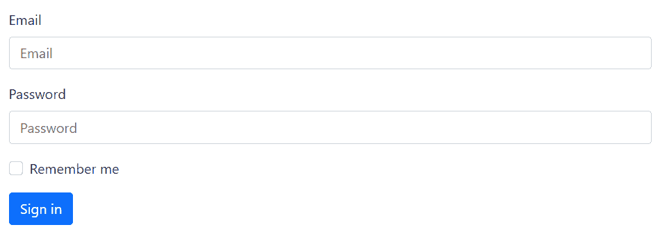](../codelab.php?topic=bootstrap&file=vertical-form-layout) 

你将在下一章学习自定义复选框和其他[自定义表单控件](bootstrap-custom-forms.php)。

 ***注意:**所有的文本表单控件，如`[<input>](../html-reference/html-input-tag.php)`和`[<textarea>](../html-reference/html-textarea-tag.php)`都需要类
`.form-control`，而`[<select>](../html-reference/html-select-tag.php)`需要类`.form-select`用于一般样式。这些类也使窗体控件 100%宽。要改变它们的宽度或内嵌使用它们，您可以利用[Bootstrap 程序的预定义网格类](bootstrap-grid-system.php)。*  ****提示:**建议使用 margin-bottom 实用程序类(如`mb-2`、`mb-3`等)。)在表单组之间添加垂直间距。因为，在模板中始终使用单向边距可以防止边距折叠，并创建更多的组合模板。*  ** * *

## 创建水平表单布局

您还可以使用 Bootstrap 网格类创建水平表单布局，其中标签和表单控件并排对齐。要创建水平的表单布局，在表单组上添加类`.row`，并使用`.col-*-*`网格类来指定标签和控件的宽度。

此外，一定要将类`.col-form-label`应用到 [`<label>`](/html-reference/html-label-tag.php) 元素上，以便它们与相关的表单控件垂直居中。让我们来看一个例子:

#### 例子

[Try this code »](../codelab.php?topic=bootstrap&file=horizontal-form-layout "Try this code using online Editor")

```html
<form>
    <div class="row mb-3">
        <label for="inputEmail" class="col-sm-2 col-form-label">Email</label>
        <div class="col-sm-10">
            <input type="email" class="form-control" id="inputEmail" placeholder="Email">
        </div>
    </div>
    <div class="row mb-3">
        <label for="inputPassword" class="col-sm-2 col-form-label">Password</label>
        <div class="col-sm-10">
            <input type="password" class="form-control" id="inputPassword" placeholder="Password">
        </div>
    </div>
    <div class="row mb-3">
        <div class="col-sm-10 offset-sm-2">
            <div class="form-check">
                    <input class="form-check-input" type="checkbox" id="checkRemember">
                    <label class="form-check-label" for="checkRemember">Remember me</label>
            </div>
        </div>
    </div>
    <div class="row">
        <div class="col-sm-10 offset-sm-2">
            <button type="submit" class="btn btn-primary">Sign in</button>
        </div>
    </div>
</form>
```

—以上示例的输出类似于以下内容:

[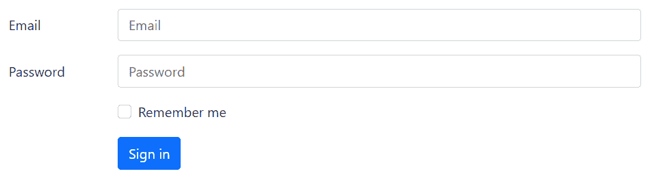](../codelab.php?topic=bootstrap&file=horizontal-form-layout) 

* * *

## 创建嵌入式表单布局

有时，您可能希望在一个水平行中显示一系列表单控件和按钮，以简化布局。你可以通过使用 [Bootstrap 的网格类](bootstrap-grid-system.php)很容易地做到这一点。

让我们看看下面的例子，看看它实际上是如何工作的:

#### 例子

[Try this code »](../codelab.php?topic=bootstrap&file=inline-form-layout "Try this code using online Editor")

```html
<form>
    <div class="row align-items-center g-3">
        <div class="col-auto">
            <label class="visually-hidden" for="inputEmail">Email</label>
            <input type="email" class="form-control" id="inputEmail" placeholder="Email">
        </div>
        <div class="col-auto">
            <label class="visually-hidden" for="inputPassword">Password</label>
            <input type="password" class="form-control" id="inputPassword" placeholder="Password">
        </div>
        <div class="col-auto">
            <div class="form-check">
                <input class="form-check-input" type="checkbox" id="checkRemember">
                <label class="form-check-label" for="checkRemember">Remember me</label>
            </div>
        </div>
        <div class="col-auto">
            <button type="submit" class="btn btn-primary">Sign in</button>
        </div>
    </div>
</form>
```

—以上示例的输出类似于以下内容:

[](../codelab.php?topic=bootstrap&file=inline-form-layout) 

查看 snippets 部分，查看一些设计精美的 Bootstrap 表单的例子。

 ***提示:**建议为每个表单输入包含一个标签，否则屏幕阅读器会对您的表单产生问题。然而，在内联表单布局的情况下，你可以使用`.visually-hidden`类隐藏标签，这样只有屏幕阅读器可以阅读它。*  ** * *

## 创建响应式表单布局

您还可以通过使用带有特定断点的网格类来使您的表单具有响应性。

以下示例将创建一个在中型设备及以上设备(即视窗宽度≥768px)上内联布局的表单，但该表单将在较小的视窗上垂直堆叠。

#### 例子

[Try this code »](../codelab.php?topic=bootstrap&file=responsive-form-layout "Try this code using online Editor")

```html
<form>
    <div class="row align-items-center g-3">
        <div class="col-md-auto col-12">
            <label class="form-label d-md-none" for="inputEmail">Email</label>
            <input type="email" class="form-control" id="inputEmail" placeholder="Email">
        </div>
        <div class="col-md-auto col-12">
            <label class="form-label d-md-none" for="inputPassword">Password</label>
            <input type="password" class="form-control" id="inputPassword" placeholder="Password">
        </div>
        <div class="col-md-auto col-12">
            <div class="form-check">
                <input class="form-check-input" type="checkbox" id="checkRemember">
                <label class="form-check-label" for="checkRemember">Remember me</label>
            </div>
        </div>
        <div class="col-md-auto col-12">
            <button type="submit" class="btn btn-primary">Sign in</button>
        </div>
    </div>
</form>
```

* * *

## 创建静态表单控件

可能会出现这样的情况:您只想在表单标签旁边显示纯文本值，而不是工作表单控件。通过用`.form-control-plaintext`替换类`.form-control`并应用属性`readonly`，可以很容易地做到这一点。

`.form-control-plaintext`类从表单域中移除默认样式，但是保留正确的边距和填充。让我们来看一个例子:

#### 例子

[Try this code »](../codelab.php?topic=bootstrap&file=static-form-control "Try this code using online Editor")

```html
<form>
    <div class="row mb-3">
        <label for="inputEmail" class="col-sm-2 col-form-label">Email</label>
        <div class="col-sm-10">
            <input type="email" readonly class="form-control-plaintext" id="inputEmail" value="peterparker@example.com">
        </div>
    </div>
    <div class="row mb-3">
        <label for="inputPassword" class="col-sm-2 col-form-label">Password</label>
        <div class="col-sm-10">
            <input type="password" class="form-control" id="inputPassword" placeholder="Password">
        </div>
    </div>
    <div class="row mb-3">
        <div class="col-sm-10 offset-sm-2">
            <div class="form-check">
                    <input class="form-check-input" type="checkbox" id="checkRemember">
                    <label class="form-check-label" for="checkRemember">Remember me</label>
            </div>
        </div>
    </div>
    <div class="row">
        <div class="col-sm-10 offset-sm-2">
            <button type="submit" class="btn btn-primary">Sign in</button>
        </div>
    </div>
</form>
```

—以上示例的输出类似于以下内容:

[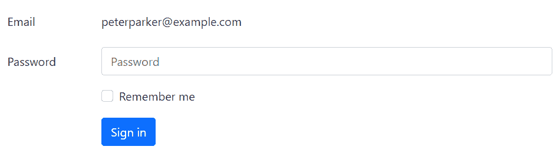](../codelab.php?topic=bootstrap&file=static-form-control) 

* * *

## 表单控件的列大小

您还可以将输入、文本区域和选择框的大小与 Bootstrap 网格列的大小相匹配。简单地说，将你的表单控件(即 [`<input>`](../html-reference/html-input-tag.php) 、 [`<textarea>`](../html-reference/html-textarea-tag.php) 和 [`<select>`](../html-reference/html-select-tag.php) )放置在网格列中。

让我们尝试下面的例子来理解它的基本工作原理:

#### 例子

[Try this code »](../codelab.php?topic=bootstrap&file=grid-sizing-of-form-controls "Try this code using online Editor")

```html
<div class="row g-3">
    <div class="col-6">
        <input type="text" class="form-control" placeholder="City">
    </div>
    <div class="col-4">
        <select class="form-select">
            <option>State</option>
        </select>
    </div>
    <div class="col-2">
        <input type="text" class="form-control" placeholder="Zip">
    </div>
</div>
```

—上述示例的输出类似于以下内容:

[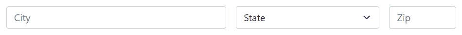](../codelab.php?topic=bootstrap&file=grid-sizing-of-form-controls) 

* * *

## 内嵌放置复选框和单选按钮

默认情况下，任意数量的直接同级的自定义复选框和单选按钮将垂直堆叠，并与`.form-check`类保持适当的间距。

但是，您也可以通过简单地将类`.form-check-inline`添加到`.form-check`元素中，将这些自定义复选框和单选按钮内联(即，在同一行中),如下所示:

#### 例子

[Try this code »](../codelab.php?topic=bootstrap&file=placing-checkboxes-inline "Try this code using online Editor")

```html
<div class="row">
    <div class="col-12">
        <div class="form-check form-check-inline">
            <input type="checkbox" class="form-check-input" name="hobbies" id="checkMusic">
            <label class="form-check-label" for="checkMusic">Music</label>
        </div>
        <div class="form-check form-check-inline ms-3">
            <input type="checkbox" class="form-check-input" name="hobbies" id="checkTravel" checked>
            <label class="form-check-label" for="checkTravel">Travel</label>
        </div>
        <div class="form-check form-check-inline ms-3">
            <input type="checkbox" class="form-check-input" name="hobbies" id="checkReading" checked>
            <label class="form-check-label" for="checkReading">Reading</label>
        </div>
    </div>
</div>
```

—以上示例的输出类似于以下内容:

[](../codelab.php?topic=bootstrap&file=placing-checkboxes-inline) 

同样，您可以内嵌放置单选按钮，如下例所示:

#### 例子

[Try this code »](../codelab.php?topic=bootstrap&file=placing-radio-buttons-inline "Try this code using online Editor")

```html
<div class="row">
    <div class="col-12">
        <div class="form-check form-check-inline">
            <input type="radio" class="form-check-input" name="gender" id="radioMale" checked>
            <label class="form-check-label" for="radioMale">Male</label>
        </div>
        <div class="form-check form-check-inline ms-3">
            <input type="radio" class="form-check-input" name="gender" id="radioFemale">
            <label class="form-check-label" for="radioFemale">Female</label>
        </div>
    </div>
</div>
```

—以上示例的输出类似于以下内容:

[](../codelab.php?topic=bootstrap&file=placing-radio-buttons-inline) 

* * *

## 向表单控件添加帮助文本

以有效的方式放置表单控件的帮助文本，以指导用户在表单中输入正确的数据。您可以使用类`.form-text`放置表单控件的块级帮助文本。块帮助文本通常显示在控件的底部。这里有一个例子:

#### 例子

[Try this code »](../codelab.php?topic=bootstrap&file=block-help-text "Try this code using online Editor")

```html
<label class="form-label" for="inputPassword">Password</label>
<input type="password" class="form-control" id="inputPassword">
<div class="form-text">
    Must be 8-20 characters long, contain letters, numbers and special characters, but must not contain spaces.
</div>
```

—以上示例的输出类似于以下内容:

[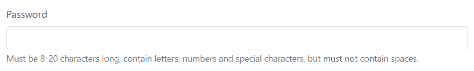](../codelab.php?topic=bootstrap&file=block-help-text) 

类似地，您也可以使用`<small>`元素放置内联帮助文本。这种情况下不需要使用`.form-text`。以下示例显示了如何实现这一点:

#### 例子

[Try this code »](../codelab.php?topic=bootstrap&file=inline-help-text "Try this code using online Editor")

```html
<div class="row align-items-center g-3">
    <div class="col-auto">
        <label class="col-form-label" for="inputPassword">Password</label>
    </div>
    <div class="col-auto">
        <input type="password" class="form-control" id="inputPassword">
    </div>
    <div class="col-auto">
        <span class="form-text">Must be 8-20 characters long.</span>
    </div>
</div>
```

—以上示例的输出类似于以下内容:

[](../codelab.php?topic=bootstrap&file=inline-help-text) 

* * *

## 创建禁用的表单控件

要禁用单个表单控件，如`<input>`、`<textarea>`、`<select>`，只需给它们添加属性`disabled`，Bootstrap 会完成剩下的工作。这里有一个例子:

#### 例子

[Try this code »](../codelab.php?topic=bootstrap&file=disabled-form-controls "Try this code using online Editor")

```html
<input type="text" class="form-control mb-3" placeholder="Disabled input" disabled>
<textarea class="form-control mb-3" placeholder="Disabled textarea" disabled></textarea>
<select class="form-select" disabled>
    <option>Disabled select</option>
</select>
```

—上述示例的输出类似于以下内容:

[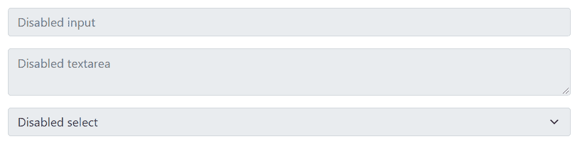](../codelab.php?topic=bootstrap&file=disabled-form-controls) 

但是，如果您想一次禁用 [`<form>`](/html-reference/html-form-tag.php) 中的所有控件，请将它们放在 [`<fieldset>`](/html-reference/html-fieldset-tag.php) 元素中，并对其应用属性`disabled`，如下例所示:

#### 例子

[Try this code »](../codelab.php?topic=bootstrap&file=disabled-forms "Try this code using online Editor") 

```html
<form>
    <fieldset disabled>
        <div class="row mb-3">
            <label for="inputEmail" class="col-sm-2 col-form-label">Email</label>
            <div class="col-sm-10">
                <input type="email" class="form-control" id="inputEmail" placeholder="Email">
            </div>
        </div>
        <div class="row mb-3">
            <label for="inputPassword" class="col-sm-2 col-form-label">Password</label>
            <div class="col-sm-10">
                <input type="password" class="form-control" id="inputPassword" placeholder="Password">
            </div>
        </div>
        <div class="row mb-3">
            <div class="col-sm-10 offset-sm-2">
                <div class="form-check">
                        <input class="form-check-input" type="checkbox" id="checkRemember">
                        <label class="form-check-label" for="checkRemember">Remember me</label>
                </div>
            </div>
        </div>
        <div class="row">
            <div class="col-sm-10 offset-sm-2">
                <button type="submit" class="btn btn-primary">Sign in</button>
            </div>
        </div>
    </fieldset>
</form>
```*  *—以上示例的输出类似于以下内容:

[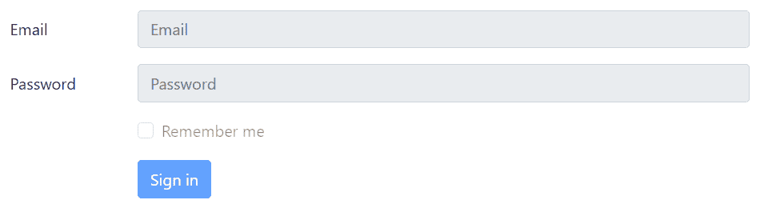](../codelab.php?topic=bootstrap&file=horizontal-form-layout) 

* * *

## 创建只读输入

您还可以在输入或文本区域上添加`readonly`布尔属性，以防止修改其值。只读输入以较浅的背景显示(就像禁用的输入一样)，但它保留标准文本光标。看看下面的例子，看看它是如何工作的:

#### 例子

[Try this code »](../codelab.php?topic=bootstrap&file=read-only-input-and-textarea "Try this code using online Editor")

```html
<input type="text" class="form-control mb-2" value="This input value cannot be changed." readonly>
<textarea rows="3" class="form-control" readonly>This textarea value cannot be changed.</textarea>
```

—以上示例的输出类似于以下内容:

[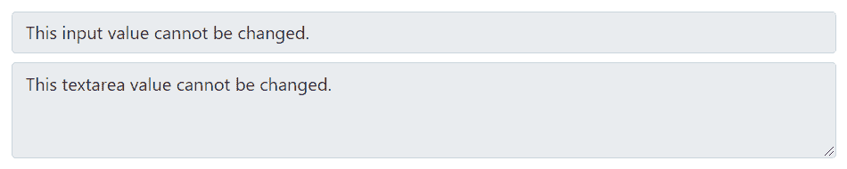](../codelab.php?topic=bootstrap&file=read-only-input-and-textarea) 

* * *

## 表单控件的高度大小

您可以轻松地更改文本输入的高度，并选择与[按钮大小](bootstrap-buttons.php)相匹配的框。

在文本输入上使用表单控件高度尺寸分类，如`.form-control-lg`和`.form-control-sm`，以创建更大或更小的尺寸。这里有一个例子:

#### 例子

[Try this code »](../codelab.php?topic=bootstrap&file=text-input-height-sizing "Try this code using online Editor") 

```html
<div class="row mb-3">
    <label class="col-sm-2 col-form-label col-form-label-lg">Email</label>
    <div class="col-sm-10">
        <input type="email" class="form-control form-control-lg" placeholder="Large input">
    </div>
</div>
<div class="row mb-3">
    <label class="col-sm-2 col-form-label">Email</label>
    <div class="col-sm-10">
        <input type="email" class="form-control" placeholder="Default input">
    </div>
</div>
<div class="row">
    <label class="col-sm-2 col-form-label">Email</label>
    <div class="col-sm-10">
        <input type="email" class="form-control form-control-sm" placeholder="Small input">
    </div>
</div>
```*  *—以上示例的输出类似于以下内容:

[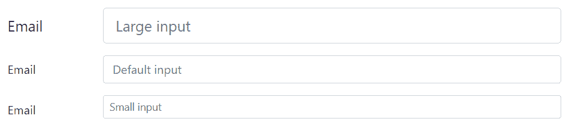](../codelab.php?topic=bootstrap&file=text-input-height-sizing)  ***提示:**确保在 [`<label>`](/html-reference/html-label-tag.php) 或 [`<legend>`](/html-reference/html-legend-tag.php) 元素上应用类`.col-form-label-lg`或`.col-form-label-sm`，以根据表单控件正确调整标签的大小。*  *类似地，您可以使用 [`<select>`](../html-reference/html-select-tag.php) 元素上的`.form-select-lg`和`.form-select-sm`类创建更大和更小的选择框变体，如下所示:

#### 例子

[Try this code »](../codelab.php?topic=bootstrap&file=select-box-height-sizing "Try this code using online Editor") 

```html
<div class="row mb-3">
    <label class="col-sm-2 col-form-label col-form-label-lg">State</label>
    <div class="col-sm-10">
        <select class="form-select form-select-lg">
            <option>Large select</option>
        </select>
    </div>
</div>    
<div class="row mb-3">
    <label class="col-sm-2 col-form-label">State</label>
    <div class="col-sm-10">
        <select class="form-select">
            <option>Default select</option>
        </select>
    </div>
</div>    
<div class="row">
    <label class="col-sm-2 col-form-label col-form-label-sm">State</label>
    <div class="col-sm-10">
        <select class="form-select form-select-sm">
            <option>Small select</option>
        </select>
    </div>
</div>
```*  *—以上示例的输出类似于以下内容:

[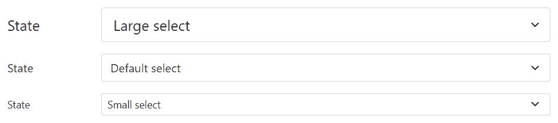](../codelab.php?topic=bootstrap&file=select-box-height-sizing) 

* * *

## Bootstrap 表单验证

Bootstrap 提供了一种简单快捷的方法来在客户端验证 web 表单。它使用浏览器的本地表单验证 API 来验证表单。表单验证样式是通过 CSS `:invalid`和`:valid`伪类应用的。适用于`<input>`、`<select>`、`<textarea>`要素。

让我们试试下面的例子，看看它实际上是如何工作的:

#### 例子

[Try this code »](../codelab.php?topic=bootstrap&file=form-validation "Try this code using online Editor")

```html
<form class="needs-validation" novalidate>
    <div class="mb-3">
        <label class="form-label" for="inputEmail">Email</label>
        <input type="email" class="form-control" id="inputEmail" placeholder="Email" required>
        <div class="invalid-feedback">Please enter a valid email address.</div>
    </div>
    <div class="mb-3">
        <label class="form-label" for="inputPassword">Password</label>
        <input type="password" class="form-control" id="inputPassword" placeholder="Password" required>
        <div class="invalid-feedback">Please enter your password to continue.</div>
    </div>
    <div class="mb-3">
        <div class="form-check">
            <input class="form-check-input" type="checkbox" id="checkRemember">
            <label class="form-check-label" for="checkRemember">Remember me</label>
        </div>
    </div>
    <button type="submit" class="btn btn-primary">Sign in</button>
</form>
```

 ***注意:**对于自定义 Bootstrap 表单验证消息，您需要通过向`<form>`元素添加`novalidate`布尔属性来禁用浏览器默认反馈工具提示。但是，它仍然提供对 JavaScript 中的表单验证 API 的访问。*  *下面是定制的 JavaScript 代码，如果有无效字段，它会显示错误消息并禁用表单提交。参见 [JavaScript 闭包](/javascript-tutorial/javascript-closures.php)章节，了解自执行函数。

#### 例子

[Try this code »](../codelab.php?topic=bootstrap&file=form-validation "Try this code using online Editor")

```html
<script>
    // Self-executing function
    (function() {
        'use strict';
        window.addEventListener('load', function() {
            // Fetch all the forms we want to apply custom Bootstrap validation styles to
            var forms = document.getElementsByClassName('needs-validation');

            // Loop over them and prevent submission
            var validation = Array.prototype.filter.call(forms, function(form) {
                form.addEventListener('submit', function(event) {
                    if (form.checkValidity() === false) {
                        event.preventDefault();
                        event.stopPropagation();
                    }
                    form.classList.add('was-validated');
                }, false);
            });
        }, false);
    })();
</script>
```

—以上示例的输出类似于以下内容:

[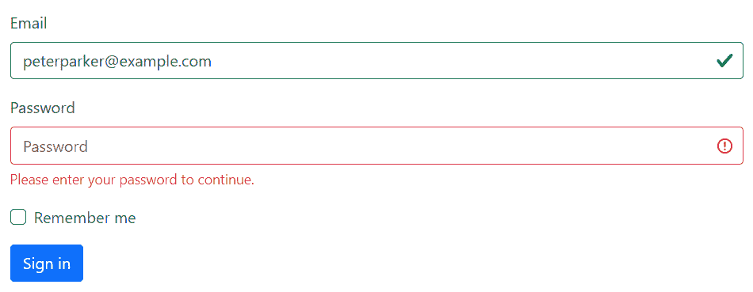](../codelab.php?topic=bootstrap&file=form-validation)  ***提示:**要以编程方式重置表单的外观，请在提交后从`<form>`元素中移除`.was-validated`类。当您单击提交按钮时，Bootstrap 程序会自动将该类应用到表单上。*  *如果需要服务器端验证，可以使用`.is-invalid`和`.is-valid`类来指示无效和有效的表单字段。这些类也支持`.invalid-feedback`和`.valid-feedback`。让我们看看下面的例子:

#### 例子

[Try this code »](../codelab.php?topic=bootstrap&file=server-side-form-validation "Try this code using online Editor")

```html
<form>
    <div class="mb-3">
        <label class="form-label" for="inputEmail">Email</label>
        <input type="email" class="form-control is-valid" id="inputEmail" placeholder="Email" value="peterparker@example.com" required>
        <div class="valid-feedback">Good! Your email address looks valid.</div>
    </div>
    <div class="mb-3">
        <label class="form-label" for="inputPassword">Password</label>
        <input type="password" class="form-control is-invalid" id="inputPassword" placeholder="Password" required>
        <div class="invalid-feedback">Opps! You have entered an invalid password.</div>
    </div>
    <div class="mb-3">
        <div class="form-check">
            <input class="form-check-input" type="checkbox" id="checkRemember">
            <label class="form-check-label" for="checkRemember">Remember me</label>
        </div>
    </div>
    <button type="submit" class="btn btn-primary">Sign in</button>
</form>
```

—以上示例的输出类似于以下内容:

[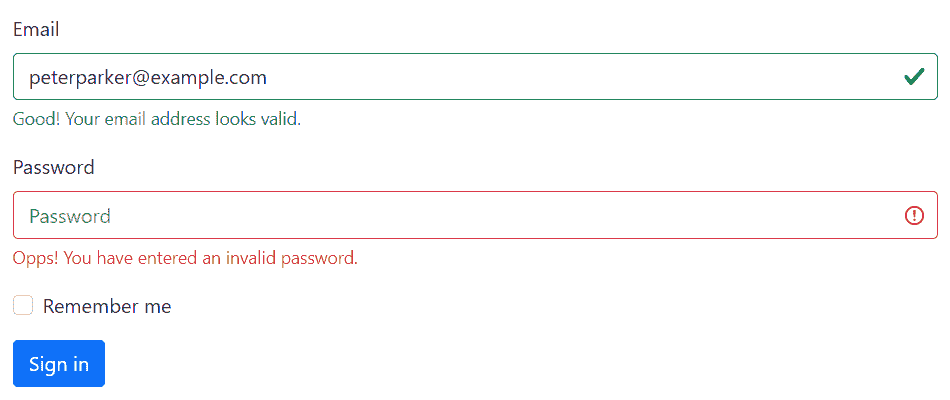](../codelab.php?topic=bootstrap&file=form-validation) 

您也可以将`.{valid|invalid}-feedback`类替换为`.{valid|invalid}-tooltip`类，以工具提示的形式显示验证反馈文本。

此外，确保在父元素上应用样式`position: relative`或类`.position-relative`,以获得正确的反馈工具提示定位。这里有一个例子:

#### 例子

[Try this code »](../codelab.php?topic=bootstrap&file=display-validation-feedback-in-tooltip-style "Try this code using online Editor")

```html
<form>
    <div class="mb-3 position-relative">
        <label class="form-label" for="inputEmail">Email</label>
        <input type="email" class="form-control is-valid" id="inputEmail" placeholder="Email" value="peterparker@example.com" required>
        <div class="valid-tooltip">Good! Your email address looks valid.</div>
    </div>
    <div class="mb-3 position-relative">
        <label class="form-label" for="inputPassword">Password</label>
        <input type="password" class="form-control is-invalid" id="inputPassword" placeholder="Password" required>
        <div class="invalid-tooltip">Opps! You have entered an invalid password.</div>
    </div>
    <div class="mb-3">
        <div class="form-check">
            <input class="form-check-input" type="checkbox" id="checkRemember">
            <label class="form-check-label" for="checkRemember">Remember me</label>
        </div>
    </div>
    <button type="submit" class="btn btn-primary">Sign in</button>
</form>
```

—上述示例的输出类似于以下内容:

[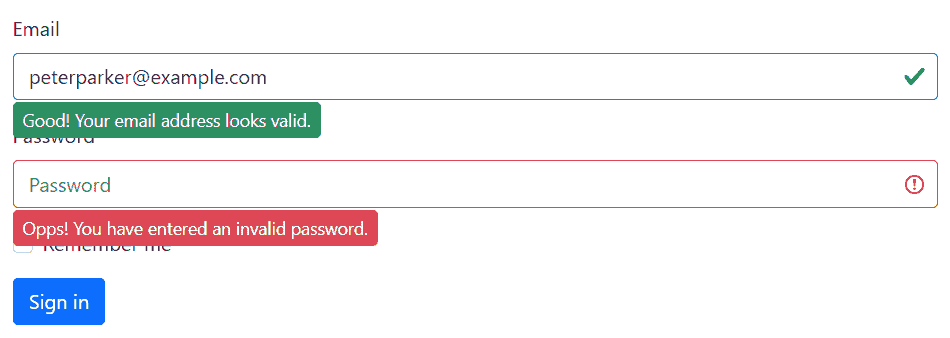](../codelab.php?topic=bootstrap&file=display-validation-feedback-in-tooltip-style) 

* * *

## Bootstrap 中支持的表单控件

Bootstrap 包括对所有标准 HTML 表单控件以及[新 HTML5 输入类型](../html-tutorial/html5-new-input-types.php)的支持，例如日期时间、数字、电子邮件、url、搜索、范围、颜色、url 等等。以下示例将向您展示标准表单控件与 Bootstrap 的用法。

#### 例子

[Try this code »](../codelab.php?topic=bootstrap&file=supported-from-controls "Try this code using online Editor") 

```html
<form>
    <div class="row mb-3">
        <label class="col-sm-3 col-form-label" for="firstName">First Name:</label>
        <div class="col-sm-9">
            <input type="text" class="form-control" id="firstName" placeholder="First Name" required>
        </div>
    </div>
    <div class="row mb-3">
        <label class="col-sm-3 col-form-label" for="lastName">Last Name:</label>
        <div class="col-sm-9">
            <input type="text" class="form-control" id="lastName" placeholder="Last Name" required>
        </div>
    </div>
    <div class="row mb-3">
        <label class="col-sm-3 col-form-label" for="emailAddress">Email Address:</label>
        <div class="col-sm-9">
            <input type="email" class="form-control" id="emailAddress" placeholder="Email Address" required>
        </div>
    </div>
    <div class="row mb-3">
        <label class="col-sm-3 col-form-label" for="phoneNumber">Mobile Number:</label>
        <div class="col-sm-9">
            <input type="number" class="form-control" id="phoneNumber" placeholder="Phone Number" required>
        </div>
    </div>        
    <div class="row mb-3">
        <label class="col-sm-3 col-form-label">Date of Birth:</label>
        <div class="col-sm-3">
            <select class="form-select" required>
                <option>Date</option>
            </select>
        </div>
        <div class="col-sm-3">
            <select class="form-select" required>
                <option>Month</option>
            </select>
        </div>
        <div class="col-sm-3">
            <select class="form-select">
                <option>Year</option>
            </select>
        </div>
    </div>
    <div class="row mb-3">
        <label class="col-sm-3 col-form-label" for="postalAddress">Postal Address:</label>
        <div class="col-sm-9">
            <textarea rows="3" class="form-control" id="postalAddress" placeholder="Postal Address" required></textarea>
        </div>
    </div>
    <div class="row mb-3">
        <label class="col-sm-3 col-form-label" for="ZipCode">Zip Code:</label>
        <div class="col-sm-9">
            <input type="text" class="form-control" id="ZipCode" placeholder="Zip Code" required>
        </div>
    </div>
    <div class="row mb-3">
        <label class="col-sm-3 col-form-label" for="uploadImage">Upload Image:</label>
        <div class="col-sm-9">
            <input type="file" class="form-control" id="uploadImage">
        </div>
    </div>
    <div class="row mb-3">
        <label class="col-sm-3 col-form-label">Gender:</label>
        <div class="col-sm-9 mt-2">
            <div class="form-check form-check-inline">
                <input type="radio" class="form-check-input" name="gender" id="radioMale">
                <label class="form-check-label" for="radioMale">Male</label>
            </div>
            <div class="form-check form-check-inline">
                <input type="radio" class="form-check-input" name="gender" id="radioFemale">
                <label class="form-check-label" for="radioFemale">Female</label>
            </div>
        </div>
    </div>
    <div class="row mb-3">
        <div class="col-sm-9 offset-sm-3">
            <div class="form-check">
                <input class="form-check-input" type="checkbox" id="checkAgree" value="agree">
                <label class="form-check-label" for="checkAgree">I agree to the <a href="#">Terms and Conditions</a></label>
            </div>
        </div>
    </div>
    <div class="row mb-3">
        <div class="col-sm-9 offset-sm-3">
            <input type="submit" class="btn btn-primary" value="Submit">
            <input type="reset" class="btn btn-secondary ms-2" value="Reset">
        </div>
    </div>
</form>
```**********