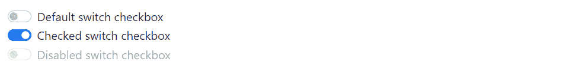
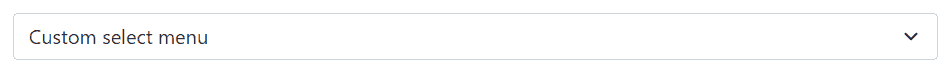
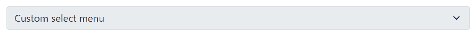
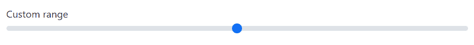

# Bootstrap 自定义表单

> 原文：<https://www.tutorialrepublic.com/twitter-bootstrap-tutorial/bootstrap-custom-forms.php>

在本教程中，你将学习如何使用 Bootstrap 创建自定义表单控件。

## 创建自定义表单控件

Bootstrap 使您能够定制浏览器的默认表单控件，以创建更加优雅的表单布局。现在，您可以创建完全定制的、跨浏览器兼容的单选按钮和复选框、文件输入、选择下拉列表、范围输入等等。

在接下来的几节中，您将看到如何一个接一个地创建这些定制表单元素。

## 创建自定义复选框

要创建自定义复选框，请将每个复选框`<input>`及其对应的`<label>`包装在一个`<div>`元素中，并应用如下例所示的类:

#### 例子

[Try this code »](../codelab.php?topic=bootstrap&file=custom-checkboxes "Try this code using online Editor")

```
<div class="form-check">
    <input type="checkbox" class="form-check-input" name="customCheck" id="customCheck1">
    <label class="form-check-label" for="customCheck1">Custom checkbox</label>
</div>
<div class="form-check">
    <input type="checkbox" class="form-check-input" name="customCheck" id="customCheck2" checked>
    <label class="form-check-label" for="customCheck2">Another custom checkbox</label>
</div>
```

—以上示例的输出类似于以下内容:

[](../codelab.php?topic=bootstrap&file=custom-checkboxes) 

* * *

## 创建自定义单选按钮

类似地，您可以使用 Bootstrap 程序创建自定义单选按钮，如下所示:

#### 例子

[Try this code »](../codelab.php?topic=bootstrap&file=custom-radio-buttons "Try this code using online Editor")

```
<div class="form-check">
    <input type="radio" class="form-check-input" name="customRadio" id="customRadio1">
    <label class="form-check-label" for="customRadio1">Custom radio</label>
</div>
<div class="form-check">
    <input type="radio" class="form-check-input" name="customRadio" id="customRadio2" checked>
    <label class="form-check-label" for="customRadio2">Another custom radio</label>
</div>
```

—以上示例的输出类似于以下内容:

[](../codelab.php?topic=bootstrap&file=custom-radio-buttons) 

* * *

## 内嵌复选框和单选按钮

您还可以通过简单地在包装器`.form-check`元素上添加类`.form-check-inline`来将这些自定义复选框和单选按钮内联。

以下示例将内嵌显示复选框(即在同一行)。

#### 例子

[Try this code »](../codelab.php?topic=bootstrap&file=custom-checkboxes-inline "Try this code using online Editor")

```
<div class="form-check form-check-inline">
    <input type="checkbox" class="form-check-input" name="customCheck" id="customCheck1">
    <label class="form-check-label" for="customCheck1">Custom checkbox</label>
</div>
<div class="form-check form-check-inline">
    <input type="checkbox" class="form-check-input" name="customCheck" id="customCheck2" checked>
    <label class="form-check-label" for="customCheck2">Another custom checkbox</label>
</div>
```

—以上示例的输出类似于以下内容:

[](../codelab.php?topic=bootstrap&file=custom-checkboxes-inline) 

同样，您可以内嵌放置单选按钮，如下例所示:

#### 例子

[Try this code »](../codelab.php?topic=bootstrap&file=custom-radios-inline "Try this code using online Editor")

```
<div class="form-check form-check-inline">
    <input type="radio" class="form-check-input" name="customRadio" id="customRadio1">
    <label class="form-check-label" for="customRadio1">Custom radio</label>
</div>
<div class="form-check form-check-inline">
    <input type="radio" class="form-check-input" name="customRadio" id="customRadio2" checked>
    <label class="form-check-label" for="customRadio2">Another custom radio</label>
</div>
```

—以上示例的输出类似于以下内容:

[](../codelab.php?topic=bootstrap&file=custom-radios-inline) 

* * *

## 禁用自定义复选框和单选按钮

也可以禁用自定义复选框和单选按钮。只需将布尔属性`disabled`添加到`<input>`元素中，如下例所示:

#### 例子

[Try this code »](../codelab.php?topic=bootstrap&file=disabled-custom-checkboxes-and-radio-buttons "Try this code using online Editor")

```
<div class="form-check">
    <input type="checkbox" class="form-check-input" id="customCheck" disabled>
    <label class="form-check-label" for="customCheck">Disabled custom checkbox</label>
</div>
<div class="form-check">
    <input type="radio" class="form-check-input" id="customRadio" disabled>
    <label class="form-check-label" for="customRadio">Disabled custom radio</label>
</div>
```

—以上示例的输出类似于以下内容:

[](../codelab.php?topic=bootstrap&file=disabled-custom-checkboxes-and-radio-buttons) 

* * *

## 创建拨动开关

开关标签类似于自定义复选框——唯一的区别是——它使用`.form-switch`类来呈现切换开关。开关也支持`disabled`属性。

让我们尝试下面的例子来理解它的基本工作原理:

#### 例子

[Try this code »](../codelab.php?topic=bootstrap&file=toggle-switch "Try this code using online Editor")

```
<div class="form-check form-switch">
    <input class="form-check-input" type="checkbox" id="switchDefault">
    <label class="form-check-label" for="switchDefault">Default switch checkbox</label>
</div>
<div class="form-check form-switch">
    <input class="form-check-input" type="checkbox" id="switchChecked" checked>
    <label class="form-check-label" for="switchChecked">Checked switch checkbox</label>
</div>
<div class="form-check form-switch">
    <input class="form-check-input" type="checkbox" id="switchDisabled" disabled>
    <label class="form-check-label" for="switchDisabled">Disabled switch checkbox</label>
</div>
```

—以上示例的输出类似于以下内容:

[](../codelab.php?topic=bootstrap&file=toggle-switch) 

* * *

## 创建自定义选择菜单

您还可以通过简单地在`<select>`元素上添加类`.form-select`来定制选择下拉菜单。然而，这种定制样式仅限于`<select>`的初始外观，由于浏览器的限制，不能修改`<option>` s。

#### 例子

[Try this code »](../codelab.php?topic=bootstrap&file=custom-select-dropdown "Try this code using online Editor")

```
<select class="form-select">
    <option selected>Custom select menu</option>
    <option value="1">One</option>
    <option value="2">Two</option>
    <option value="3">Three</option>
</select>
```

—以上示例的输出类似于以下内容:

[](../codelab.php?topic=bootstrap&file=custom-select-dropdown) 

您还可以在自定义选择上添加`disabled`属性，使其呈现灰色外观，并移除指针事件，如下例所示:

#### 例子

[Try this code »](../codelab.php?topic=bootstrap&file=disabled-custom-select-dropdown "Try this code using online Editor")

```
<select class="form-select" disabled>
    <option selected>Custom select menu</option>
    <option value="1">One</option>
    <option value="2">Two</option>
    <option value="3">Three</option>
</select>
```

—以上示例的输出类似于以下内容:

[](../codelab.php?topic=bootstrap&file=disabled-custom-select-dropdown) 

您还可以分别使用`<select>`元素上的`.form-select-lg`和`.form-select-sm`类来创建定制选择的大变量和小变量，以匹配类似大小的 [Bootstrap 的文本输入](bootstrap-forms.php)的高度。让我们看看下面的例子:

#### 例子

[Try this code »](../codelab.php?topic=bootstrap&file=custom-select-sizing "Try this code using online Editor")

```
<select class="form-select form-select-lg">
    <option selected>Large custom select menu</option>
    <option value="1">One</option>
    <option value="2">Two</option>
    <option value="3">Three</option>
</select>
<select class="form-select mt-3">
    <option selected>Default custom select menu</option>
    <option value="1">One</option>
    <option value="2">Two</option>
    <option value="3">Three</option>
</select>
<select class="form-select form-select-sm mt-3">
    <option selected>Small custom select menu</option>
    <option value="1">One</option>
    <option value="2">Two</option>
    <option value="3">Three</option>
</select>
```

—以上示例的输出类似于以下内容:

[](../codelab.php?topic=bootstrap&file=custom-select-sizing) 

Bootstrap 定制选择也像普通选择一样支持`multiple`和`size` 属性:

#### 例子

[Try this code »](../codelab.php?topic=bootstrap&file=custom-multi-select-dropdown "Try this code using online Editor")

```
<select class="form-select" size="3" multiple>
    <option value="1">One</option>
    <option value="2">Two</option>
    <option value="3">Three</option>
    <option value="4">Four</option>
</select>
```

* * *

## 创建自定义范围输入

要创建自定义范围输入，只需将类`.form-range`应用于`<input type="range">`。

#### 例子

[Try this code »](../codelab.php?topic=bootstrap&file=custom-range "Try this code using online Editor")

```
<label for="customRange">Custom range</label>
<input type="range" class="form-range" id="customRange">
```

—以上示例的输出类似于以下内容:

[](../codelab.php?topic=bootstrap&file=custom-range) 

您还可以在范围输入上添加`disabled`属性，使其呈现灰色外观，并移除指针事件，如下例所示:

#### 例子

[Try this code »](../codelab.php?topic=bootstrap&file=disabled-custom-range "Try this code using online Editor")

```
<label for="customRange">Disabled range</label>
<input type="range" class="form-range" id="customRange" disabled>
```

—以上示例的输出类似于以下内容:

[](../codelab.php?topic=bootstrap&file=disabled-custom-range) 

### 设置最小值和最大值

默认情况下，范围输入的最小值和最大值分别为 0 和 100。但是，您可以为那些使用`min`和`max`属性的用户指定新的值。

此外，默认情况下，范围输入“捕捉”到整数值。要改变这一点，您可以指定一个`step`值。在下面的例子中，我们通过使用`step="0.5"`将步骤数增加了一倍。

#### 例子

[Try this code »](../codelab.php?topic=bootstrap&file=custom-range-with-min-max-and-step "Try this code using online Editor")

```
<label for="customRange">Custom range</label>
<input type="range" class="form-range" min="0" max="10" step="0.5" id="customRange">
```