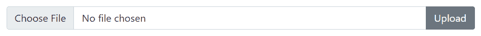

# 引导输入组

> 原文：<https://www.tutorialrepublic.com/twitter-bootstrap-tutorial/bootstrap-input-groups.php>

在本教程中，您将学习如何使用引导输入组组件。

## 用 Bootstrap 扩展表单控件

Bootstrap input group 组件是一个非常灵活和强大的组件，用于创建交互和优雅的表单控件，但是，它仅限于文本输入、select 和 textarea。

在接下来的几节中，你将看到如何扩展窗体控件，在它的前面、后面或两边添加文本、图标和按钮，使你的窗体更有吸引力。

## 创建预先计划和追加的输入

使用类`.input-group`创建输入组。它充当输入和插件的容器。

此外，将文本或图标包装在一个 [`<span>`](/html-reference/html-span-tag.php) 元素中，并对其应用类`.input-group-text`并将其放置在输入之前或之后。让我们看看下面的例子:

#### 例子

[Try this code »](../codelab.php?topic=bootstrap&file=prepend-and-append-inputs "Try this code using online Editor")

```
<div class="row g-2">
    <div class="col-6">
        <div class="input-group">
            <span class="input-group-text">
                <span class="bi-person"></span>
            </span>
            <input type="text" class="form-control" placeholder="Username">
        </div>
    </div>
    <div class="col-6">
        <div class="input-group">            
            <input type="text" class="form-control" placeholder="Amount">
            <span class="input-group-text">.00</span>
        </div>
    </div>
    <div class="col-6">
        <div class="input-group">
            <span class="input-group-text">https://www.</span>
            <input type="text" class="form-control" placeholder="Domain name">
        </div>
    </div>
    <div class="col-6">
        <div class="input-group">
            <span class="input-group-text">$</span>
            <input type="text" class="form-control" placeholder="US Dollar">
            <span class="input-group-text">.00</span>
        </div>
    </div>
</div>
```

—以上示例的输出类似于以下内容:

[](../codelab.php?topic=bootstrap&file=prepend-and-append-inputs) 

从 Bootstrap 5 开始，你还可以预先计划或附加选择框下拉和文本区域表单控件。让我们试试下面的例子，看看它是如何工作的:

#### 例子

[Try this code »](../codelab.php?topic=bootstrap&file=prepend-and-append-select-box-and-textarea "Try this code using online Editor")

```
<div class="row g-2">
    <div class="col-12">
        <div class="input-group">            
            <span class="input-group-text">Address</span>
            <textarea class="form-control"></textarea>
        </div>
    </div>
    <div class="col-6">
        <div class="input-group">
            <label class="input-group-text">Country</label>
            <select class="form-select">
                <option selected>Choose...</option>
                <option>France</option>
                <option>Germany</option>
                <option>Hungary</option>
            </select>
        </div>
    </div>
    <div class="col-6">
        <div class="input-group">
            <select class="form-select">
                <option selected>Choose...</option>
                <option>One</option>
                <option>Two</option>
                <option>Three</option>
            </select>
            <button type="button" class="btn btn-secondary">Submit</button>
        </div>
    </div>
</div>
```

—上述示例的输出类似于以下内容:

[](../codelab.php?topic=bootstrap&file=prepend-and-append-select-box-and-textarea) 

类似地，您可以在 Bootstrap 的自定义文件输入中预先计划或追加插件，如下所示:

#### 例子

[Try this code »](../codelab.php?topic=bootstrap&file=prepend-and-append-custom-file-input "Try this code using online Editor")

```
<div class="input-group">
    <input type="file" class="form-control">
    <button type="button" class="btn btn-secondary">Upload</button>
</div>
```

—以上示例的输出类似于以下内容:

[](../codelab.php?topic=bootstrap&file=prepend-and-append-custom-file-input) 

* * *

## 复选框和单选按钮插件

类似地，你可以在输入组的插件中放置复选框或单选按钮来代替文本。

#### 例子

[Try this code »](../codelab.php?topic=bootstrap&file=input-groups-with-checkbox-and-radio-buttons "Try this code using online Editor")

```
<div class="row">
    <div class="col-6">
        <div class="input-group">
            <span class="input-group-text">
                <input type="checkbox" class="form-check-input mt-0">
            </span>
            <input type="text" class="form-control">
        </div>
    </div>
    <div class="col-6">
        <div class="input-group">
            <span class="input-group-text">
                <input type="radio" class="form-check-input mt-0">
            </span>
            <input type="text" class="form-control">
        </div>
    </div>
</div>
```

—以上示例的输出类似于以下内容:

[](../codelab.php?topic=bootstrap&file=input-groups-with-checkbox-and-radio-buttons) 

* * *

## 放置多个输入或插件

您也可以轻松地将多个输入并排放在一个输入组中，如下所示:

#### 例子

[Try this code »](../codelab.php?topic=bootstrap&file=placing-multiple-inputs-within-an-input-group "Try this code using online Editor")

```
<div class="input-group">
    <span class="input-group-text">Your Name</span>
    <input type="text" class="form-control" placeholder="First name">
    <input type="text" class="form-control" placeholder="Last name">
</div>
```

—以上示例的输出类似于以下内容:

[](../codelab.php?topic=bootstrap&file=placing-multiple-inputs-within-an-input-group) 

类似地，你也可以在一个输入组中并排放置多个插件。您也可以将它与复选框和单选输入混合使用，如下例所示:

#### 例子

[Try this code »](../codelab.php?topic=bootstrap&file=placing-multiple-addons-within-an-input-group "Try this code using online Editor")

```
<div class="row">
    <div class="col-6">
        <div class="input-group">
            <span class="input-group-text">
                <input type="checkbox" class="form-check-input mt-0">
            </span>
            <span class="input-group-text">$</span>
            <input type="text" class="form-control">
        </div>
    </div>
    <div class="col-6">
        <div class="input-group">
            <span class="input-group-text">$</span>
            <span class="input-group-text">0.00</span>
            <input type="text" class="form-control">
        </div>
    </div>
</div>
```

—以上示例的输出类似于以下内容:

[](../codelab.php?topic=bootstrap&file=placing-multiple-addons-within-an-input-group) 

* * *

## 表单控件的按钮插件

您还可以像文本一样在表单控件中预先添加或追加按钮。简单地说，在`.input-group`中放置尽可能多的按钮，如下例所示:

#### 例子

[Try this code »](../codelab.php?topic=bootstrap&file=input-groups-with-buttons "Try this code using online Editor")

```
<div class="row">
    <div class="col-5">
        <div class="input-group">
            <input type="text" class="form-control" placeholder="Search...">
            <button type="button" class="btn btn-secondary">
                <i class="bi-search"></i>
            </button>
        </div>
    </div>
    <div class="col-7">
        <div class="input-group">
            <input type="text" class="form-control" placeholder="Type something...">
            <button type="submit" class="btn btn-primary">Submit</button>
            <button type="reset" class="btn btn-danger">Reset</button>
        </div>
    </div>
</div>
```

—以上示例的输出类似于以下内容:

[](../codelab.php?topic=bootstrap&file=input-groups-with-buttons) 

* * *

## 添加按钮下拉列表

如果您想从一个按钮执行多个操作，甚至可以向表单控件添加带有下拉菜单的按钮。同样，在输入组的情况下，你不需要`.dropdown`包装元素，否则通常是需要的。让我们来看一个例子:

#### 例子

[Try this code »](../codelab.php?topic=bootstrap&file=input-groups-with-button-dropdowns "Try this code using online Editor")

```
<div class="row">
    <div class="col-6">
        <div class="input-group">
            <button type="button" class="btn btn-outline-secondary dropdown-toggle" data-bs-toggle="dropdown">Dropdown</button>
            <div class="dropdown-menu">
                <a href="#" class="dropdown-item">Action</a>
                <a href="#" class="dropdown-item">Another action</a>
            </div>
            <input type="text" class="form-control">
        </div>
    </div>
    <div class="col-6">
        <div class="input-group">
            <input type="text" class="form-control">
            <button type="button" class="btn btn-outline-secondary dropdown-toggle" data-bs-toggle="dropdown">Dropdown</button>
            <div class="dropdown-menu">
                <a href="#" class="dropdown-item">Action</a>
                <a href="#" class="dropdown-item">Another action</a>
            </div>
        </div>
    </div>
</div>
```

—以上示例的输出类似于以下内容:

[](../codelab.php?topic=bootstrap&file=input-groups-with-button-dropdowns) 

* * *

## 添加分段下拉按钮组

同样，您可以定义分段的下拉按钮组，其中下拉按钮放置在其他按钮旁边，如下例所示:

#### 例子

[Try this code »](../codelab.php?topic=bootstrap&file=input-groups-with-split-dropdown-button-groups "Try this code using online Editor")

```
<div class="row">
    <div class="col-6">
        <div class="input-group">
            <button type="button" class="btn btn-outline-secondary">Action</button>
            <button type="button" class="btn btn-outline-secondary dropdown-toggle dropdown-toggle-split" data-bs-toggle="dropdown">
                <span class="visually-hidden">Toggle Dropdown</span>
            </button>
            <div class="dropdown-menu">
                <a href="#" class="dropdown-item">Action</a>
                <a href="#" class="dropdown-item">Another action</a>
            </div>
            <input type="text" class="form-control">
        </div>
    </div>
    <div class="col-6">
        <div class="input-group">
            <input type="text" class="form-control">
            <button type="button" class="btn btn-outline-secondary">Action</button>
            <button type="button" class="btn btn-outline-secondary dropdown-toggle dropdown-toggle-split" data-bs-toggle="dropdown">
                <span class="visually-hidden">Toggle Dropdown</span>
            </button>
            <div class="dropdown-menu">
                <a href="#" class="dropdown-item">Action</a>
                <a href="#" class="dropdown-item">Another action</a>
            </div>
        </div>
    </div>
</div>
```

—以上示例的输出类似于以下内容:

[](../codelab.php?topic=bootstrap&file=input-groups-with-split-dropdown-button-groups) 

* * *

## 输入组的高度大小

您还可以向`.input-group`元素本身添加相对的表单大小调整类，如`.input-group-lg`或`.input-group-sm`，使其高度变大或变小。

`.input-group`中的内容会自动调整大小——不需要在每个元素上重复表单控件大小类。这里有一个例子:

#### 例子

[Try this code »](../codelab.php?topic=bootstrap&file=input-group-height-sizing "Try this code using online Editor")

```
<!-- Larger input group -->
<div class="input-group input-group-lg">
    <span class="input-group-text">Large</span>
    <input type="text" class="form-control">
</div>

<!-- Default input group -->
<div class="input-group mt-2">
    <span class="input-group-text">Default</span>
    <input type="text" class="form-control">
</div>

<!-- Smaller input group -->
<div class="input-group input-group-sm mt-2">
    <span class="input-group-text">Small</span>
    <input type="text" class="form-control">
</div>
```

—以上示例的输出类似于以下内容:

[](../codelab.php?topic=bootstrap&file=input-group-height-sizing)