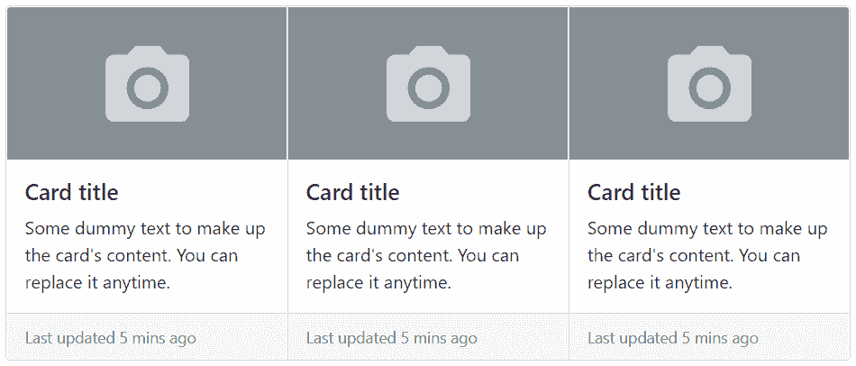

# Bootstrap卡

> 原文：<https://www.tutorialrepublic.com/twitter-bootstrap-tutorial/bootstrap-cards.php>

在本教程中，您将学习如何使用Bootstrap卡组件。

## 使用Bootstrap卡

Bootstrap卡是一个灵活和可扩展的内容容器。它包括页眉和页脚选项、各种各样的内容、上下文背景颜色和强大的显示选项。卡取代了旧 Bootstrap 3 版本中的面板、孔和缩略图组件。

在接下来的部分中，您将看到您可以使用卡组件做什么。

## 创建基本卡

卡片加价非常简单。外部包装器需要基类`.card`，而内容可以放在`.card-body`元素中。下面的例子将向你展示如何创建一个包含图片、一些文本内容和一个按钮的卡片。

#### 例子

[Try this code »](../codelab.php?topic=bootstrap&file=card "Try this code using online Editor")

```
<div class="card" style="width: 300px;">
    
    <div class="card-body text-center">
        <h5 class="card-title">Alice Liddel</h5>
        <p class="card-text">Alice is a freelance web designer and developer based in London. She is specialized in HTML5, CSS3, JavaScript, Bootstrap, etc.</p>
        <a href="#" class="btn btn-primary">View Profile</a>
    </div>
</div>
```

—上述示例的输出类似于以下内容:

[](../codelab.php?topic=bootstrap&file=card)  ***注意:**卡片没有固定的宽度，它们将占据其父元素的整个宽度。所以，如果你需要一个固定宽度的卡片，你需要自己在卡片上应用宽度属性。此外，默认情况下，卡片没有空白，如果需要，使用[间距实用程序类](bootstrap-helper-classes.php#spacing-classes)。*  ** * *

## 卡组件的内容类型

card 组件支持各种各样内容，包括图像、文本、列表组、链接、导航等等。以下是该卡支持的示例。

### 仅身体卡

当你需要创建一个填充框的时候，你可以简单的使用`.card`和`.card-body`。

#### 例子

[Try this code »](../codelab.php?topic=bootstrap&file=basic-card "Try this code using online Editor")

```
<div class="card">
    <div class="card-body">This is some text within a padded box.</div>
</div>
```

—以上示例的输出类似于以下内容:

[](../codelab.php?topic=bootstrap&file=basic-card) 

### 带有标题、文本和链接的卡片

此外，您还可以将标题和链接与文本一起放在卡片内，如下所示:

#### 例子

[Try this code »](../codelab.php?topic=bootstrap&file=card-with-titles-text-and-links "Try this code using online Editor")

```
<div class="card" style="width: 300px;">
    <div class="card-body">
        <h5 class="card-title">Eiffel Tower</h5>
        <h6 class="card-subtitle mb-3 text-muted">Champ de Mars, Paris, France</h6>
        <p class="card-text">Built in 1889 Eiffel Tower is one of the most iconic landmarks in the world.</p>
        <a href="#" class="card-link">View pictures</a>
        <a href="#" class="card-link">Discover history</a>
    </div>
</div>
```

—上述示例的输出类似于以下内容:

[](../codelab.php?topic=bootstrap&file=card-with-titles-text-and-links) 

### 带页眉和页脚的卡片

您还可以分别使用`.card-header`和`.card-footer`类在卡片中添加页眉和页脚。让我们看看下面的例子:

#### 例子

[Try this code »](../codelab.php?topic=bootstrap&file=card-with-header-and-footer "Try this code using online Editor")

```
<div class="card text-center">
    <div class="card-header">Featured</div>
    <div class="card-body">
        <h5 class="card-title">NASA Launched Solar Probe</h5>
        <p class="card-text">NASA launched Parker space probe in 2018 with the mission of making observations of the outer corona of the Sun. It is the first-ever mission to "touch" the Sun.</p>
        <a href="#" class="btn btn-primary">Know more</a>
    </div>
    <div class="card-footer text-muted">3 years ago</div>
</div>
```

—以上示例的输出类似于以下内容:

[](../codelab.php?topic=bootstrap&file=card-with-header-and-footer)  ***提示:**您可以使用文本对齐实用程序类，如`.text-center`和`.text-end`，将卡片的内容分别对齐到中心和右端。默认情况下，它们是左对齐的。*  *### 将列表组放入卡片中

您还可以将列表组与其他内容类型一起放在卡片中，如下所示。

#### 例子

[Try this code »](../codelab.php?topic=bootstrap&file=card-with-list-group "Try this code using online Editor")

```
<div class="card" style="width: 300px;">
    <div class="card-header">Featured</div>
    <ul class="list-group list-group-flush">
        <li class="list-group-item">An item</li>
        <li class="list-group-item">A second item</li>
        <li class="list-group-item">A third item</li>
    </ul>
    <div class="card-body">
        <a href="#" class="card-link">Add More</a>
        <a href="#" class="card-link">Share</a>
    </div>
</div>
```

—以上示例的输出类似于以下内容:

[](../codelab.php?topic=bootstrap&file=card-with-list-group) 

### 在卡中混合和匹配多种内容类型

随意混合和搭配多种内容类型，以创建您需要的卡片。以下示例将创建一个具有图像、文本、列表组和超链接的固定宽度的卡片。

#### 例子

[Try this code »](../codelab.php?topic=bootstrap&file=card-with-multiple-content-types "Try this code using online Editor")

```
<div class="card" style="width: 300px;">
    
    <div class="card-body">
        <h5 class="card-title">Card title</h5>
        <p class="card-text">Here is some example text to make up the card's content. Replace it with your own text anytime.</p>
    </div>
    <ul class="list-group list-group-flush">
        <li class="list-group-item">An item</li>
        <li class="list-group-item">A second item</li>
        <li class="list-group-item">A third item</li>
    </ul>
    <div class="card-body">
        <a href="#" class="card-link">Card link</a>
        <a href="#" class="card-link">Another link</a>
    </div>
</div>
```

—以上示例的输出类似于以下内容:

[](../codelab.php?topic=bootstrap&file=card-with-multiple-content-types) 

* * *

## 向卡片添加导航

您还可以将 [Bootstrap 的导航组件](bootstrap-navs.php)如标签和药丸添加到卡头。

要向卡片添加选项卡导航，只需将选项卡标记放在卡片标题内，将选项卡内容放在卡片正文内。你还需要在`.nav`元素上使用一个额外的类`.card-header-tabs`和类`.nav-tabs`来正确对齐。

让我们试试下面的例子，它创建了一个优雅的选项卡式导航。

#### 例子

[Try this code »](../codelab.php?topic=bootstrap&file=card-with-tabs-navigation "Try this code using online Editor") *```
<div class="card text-center">
    <div class="card-header">
        <ul class="nav nav-tabs card-header-tabs">
            <li class="nav-item">
                <a href="#home" class="nav-link active" data-bs-toggle="tab">Home</a>
            </li>
            <li class="nav-item">
                <a href="#profile" class="nav-link" data-bs-toggle="tab">Profile</a>
            </li>
            <li class="nav-item">
                <a href="#messages" class="nav-link" data-bs-toggle="tab">Messages</a>
            </li>
        </ul>
    </div>
    <div class="card-body">
        <div class="tab-content">
            <div class="tab-pane fade show active" id="home">
                <h5 class="card-title">Home tab content</h5>
                <p class="card-text">Here is some example text to make up the tab's content. Replace it with your own text anytime.</p>
                <a href="#" class="btn btn-primary">Go somewhere</a>
            </div>
            <div class="tab-pane fade" id="profile">
                <h5 class="card-title">Profile tab content</h5>
                <p class="card-text">Here is some example text to make up the tab's content. Replace it with your own text anytime.</p>
                <a href="#" class="btn btn-primary">Go somewhere</a>
            </div>
            <div class="tab-pane fade" id="messages">
                <h5 class="card-title">Messages tab content</h5>
                <p class="card-text">Here is some example text to make up the tab's content. Replace it with your own text anytime.</p>
                <a href="#" class="btn btn-primary">Go somewhere</a>
            </div>
        </div>
    </div>
</div>
```*  *—以上示例的输出类似于以下内容:

[](../codelab.php?topic=bootstrap&file=card-with-tabs-navigation) 

类似地，您可以通过在`.nav`元素上使用额外的类`.card-header-pills`和类`.nav-pills`来将药丸导航添加到卡片中，如下所示:

#### 例子

[Try this code »](../codelab.php?topic=bootstrap&file=card-with-pills-navigation "Try this code using online Editor") *```
<div class="card text-center">
    <div class="card-header">
        <ul class="nav nav-pills card-header-pills">
            <li class="nav-item">
                <a href="#home" class="nav-link active" data-bs-toggle="tab">Home</a>
            </li>
            <li class="nav-item">
                <a href="#profile" class="nav-link" data-bs-toggle="tab">Profile</a>
            </li>
            <li class="nav-item">
                <a href="#messages" class="nav-link" data-bs-toggle="tab">Messages</a>
            </li>
        </ul>
    </div>
    <div class="card-body">
        <div class="tab-content">
            <div class="tab-pane fade show active" id="home">
                <h5 class="card-title">Home tab content</h5>
                <p class="card-text">Here is some example text to make up the tab's content. Replace it with your own text anytime.</p>
                <a href="#" class="btn btn-primary">Go somewhere</a>
            </div>
            <div class="tab-pane fade" id="profile">
                <h5 class="card-title">Profile tab content</h5>
                <p class="card-text">Here is some example text to make up the tab's content. Replace it with your own text anytime.</p>
                <a href="#" class="btn btn-primary">Go somewhere</a>
            </div>
            <div class="tab-pane fade" id="messages">
                <h5 class="card-title">Messages tab content</h5>
                <p class="card-text">Here is some example text to make up the tab's content. Replace it with your own text anytime.</p>
                <a href="#" class="btn btn-primary">Go somewhere</a>
            </div>
        </div>
    </div>
</div>
```*  *—以上示例的输出类似于以下内容:

[](../codelab.php?topic=bootstrap&file=card-with-pills-navigation) 

* * *

## 定制卡片样式

有几个选项可用于自定义卡片的背景、边框和颜色。

### 自定义背景和颜色

你可以简单地使用[背景](bootstrap-helper-classes.php#background-color-classes)和[颜色](bootstrap-helper-classes.php#color-classes)工具类来改变卡片的外观。让我们尝试下面的例子来理解它的基本工作原理:

#### 例子

[Try this code »](../codelab.php?topic=bootstrap&file=card-styles "Try this code using online Editor") *```
<div class="row">
    <div class="col-6">
        <div class="card text-white bg-primary mb-4">
            <div class="card-body">
                <h5 class="card-title">Primary card title</h5>
                <p class="card-text">Some dummy text to make up the card's content. You can replace it anytime.</p>
            </div>
        </div>
    </div>
    <div class="col-6">
        <div class="card text-white bg-secondary mb-4">
            <div class="card-body">
                <h5 class="card-title">Secondary card title</h5>
                <p class="card-text">Some dummy text to make up the card's content. You can replace it anytime.</p>
            </div>
        </div>
    </div>
    <div class="col-6">
        <div class="card text-white bg-success mb-4">
            <div class="card-body">
                <h5 class="card-title">Success card title</h5>
                <p class="card-text">Some dummy text to make up the card's content. You can replace it anytime.</p>
            </div>
        </div>
    </div>
    <div class="col-6">
        <div class="card text-white bg-danger mb-4">
            <div class="card-body">
                <h5 class="card-title">Danger card title</h5>
                <p class="card-text">Some dummy text to make up the card's content. You can replace it anytime.</p>
            </div>
        </div>
    </div>
    <div class="col-6">
        <div class="card text-white bg-warning mb-4">
            <div class="card-body">
                <h5 class="card-title">Warning card title</h5>
                <p class="card-text">Some dummy text to make up the card's content. You can replace it anytime.</p>
            </div>
        </div>
    </div>
    <div class="col-6">
        <div class="card text-white bg-info mb-4">
            <div class="card-body">
                <h5 class="card-title">Info card title</h5>
                <p class="card-text">Some dummy text to make up the card's content. You can replace it anytime.</p>
            </div>
        </div>
    </div>
    <div class="col-6">
        <div class="card text-white bg-dark">
            <div class="card-body">
                <h5 class="card-title">Dark card title</h5>
                <p class="card-text">Some dummy text to make up the card's content. You can replace it anytime.</p>
            </div>
        </div>
    </div>
    <div class="col-6">
        <div class="card bg-light">
            <div class="card-body">
                <h5 class="card-title">Light card title</h5>
                <p class="card-text">Some dummy text to make up the card's content. You can replace it anytime.</p>
            </div>
        </div>
    </div>
</div>
```*  *—以上示例的输出类似于以下内容:

[](../codelab.php?topic=bootstrap&file=card-styles) 

### 自定义边框和颜色

同样，您可以使用 text 和 border 实用程序类定制任何卡片的边框和文本颜色。只需在`.card`或其子元素上应用这些类，如下所示:

#### 例子

[Try this code »](../codelab.php?topic=bootstrap&file=card-styles-outline "Try this code using online Editor") *```
<div class="row">
    <div class="col-6">
        <div class="card border-primary mb-4">
            <div class="card-body text-primary">
                <h5 class="card-title">Primary card title</h5>
                <p class="card-text">Some dummy text to make up the card's content. You can replace it anytime.</p>
            </div>
        </div>
    </div>
    <div class="col-6">
        <div class="card border-secondary mb-4">
            <div class="card-body text-secondary">
                <h5 class="card-title">Secondary card title</h5>
                <p class="card-text">Some dummy text to make up the card's content. You can replace it anytime.</p>
            </div>
        </div>
    </div>
    <div class="col-6">
        <div class="card border-success mb-4">
            <div class="card-body text-success">
                <h5 class="card-title">Success card title</h5>
                <p class="card-text">Some dummy text to make up the card's content. You can replace it anytime.</p>
            </div>
        </div>
    </div>
    <div class="col-6">
        <div class="card border-danger mb-4">
            <div class="card-body text-danger">
                <h5 class="card-title">Danger card title</h5>
                <p class="card-text">Some dummy text to make up the card's content. You can replace it anytime.</p>
            </div>
        </div>
    </div>
    <div class="col-6">
        <div class="card border-warning mb-4">
            <div class="card-body text-warning">
                <h5 class="card-title">Warning card title</h5>
                <p class="card-text">Some dummy text to make up the card's content. You can replace it anytime.</p>
            </div>
        </div>
    </div>
    <div class="col-6">
        <div class="card border-info mb-4">
            <div class="card-body text-info">
                <h5 class="card-title">Info card title</h5>
                <p class="card-text">Some dummy text to make up the card's content. You can replace it anytime.</p>
            </div>
        </div>
    </div>
    <div class="col-6">
        <div class="card border-dark mb-4">
            <div class="card-body text-dark">
                <h5 class="card-title">Dark card title</h5>
                <p class="card-text">Some dummy text to make up the card's content. You can replace it anytime.</p>
            </div>
        </div>
    </div>
    <div class="col-6">
        <div class="card border-light mb-4">
            <div class="card-body text-muted">
                <h5 class="card-title">Light card title</h5>
                <p class="card-text">Some dummy text to make up the card's content. You can replace it anytime.</p>
            </div>
        </div>
    </div>
</div>
```*  *—以上示例的输出类似于以下内容:

[](../codelab.php?topic=bootstrap&file=card-styles-outline) 

* * *

## 卡片布局选项

除了卡片的样式之外，Bootstrap 还包括一些用于布置卡片系列的选项。然而，这些布局还没有响应。

### 创建卡组

您可以使用卡片组将卡片呈现为具有相同宽度和高度列的单个附加元素。但是，卡组中的卡会水平堆叠在超小型设备上(即视口宽度< 576 像素)。让我们尝试一个例子，看看它实际上是如何工作的:

#### 例子

[Try this code »](../codelab.php?topic=bootstrap&file=cards-group "Try this code using online Editor") *```
<div class="card-group">
    <div class="card">
        
        <div class="card-body">
            <h5 class="card-title">Card title</h5>
            <p class="card-text">Some dummy text to make up the card's content. You can replace it anytime.</p>
        </div>
        <div class="card-footer">
            <small class="text-muted">Last updated 5 mins ago</small>
        </div>
    </div>
    <div class="card">
        
        <div class="card-body">
            <h5 class="card-title">Card title</h5>
            <p class="card-text">Some dummy text to make up the card's content. You can replace it anytime.</p>
        </div>
        <div class="card-footer">
            <small class="text-muted">Last updated 5 mins ago</small>
        </div>
    </div>
    <div class="card">
        
        <div class="card-body">
            <h5 class="card-title">Card title</h5>
            <p class="card-text">Some dummy text to make up the card's content. You can replace it anytime.</p>
        </div>
        <div class="card-footer">
            <small class="text-muted">Last updated 5 mins ago</small>
        </div>
    </div>
</div>
```*  *—以上示例的输出类似于以下内容:

[](../codelab.php?topic=bootstrap&file=cards-group) 

## 创建卡片网格

您可以使用 Bootstrap 网格系统及其`.row-cols-*`类来控制每行显示多少网格列(环绕在您的卡片周围)。例如，您可以使用类`.row-cols-1`每行显示一张卡片，类似地，您可以使用类`.row-cols-md-2`每行显示两张卡片，从中间断点开始(即视窗宽度`≥768px`)。

#### 例子

[Try this code »](../codelab.php?topic=bootstrap&file=cards-grid "Try this code using online Editor") *```
<div class="row row-cols-1 row-cols-md-2 g-4">
    <div class="col">
        <div class="card">
            
            <div class="card-body">
                <h5 class="card-title">Card title</h5>
                <p class="card-text">Some dummy text to make up the card's content. You can replace it anytime.</p>
            </div>
            <div class="card-footer">
                <small class="text-muted">Last updated 5 mins ago</small>
            </div>
        </div>
    </div>
    <div class="col">
        <div class="card">
            
            <div class="card-body">
                <h5 class="card-title">Card title</h5>
                <p class="card-text">Some dummy text to make up the card's content. You can replace it anytime.</p>
            </div>
            <div class="card-footer">
                <small class="text-muted">Last updated 5 mins ago</small>
            </div>
        </div>
    </div>
    <div class="col">
        <div class="card">
            
            <div class="card-body">
                <h5 class="card-title">Card title</h5>
                <p class="card-text">Some dummy text to make up the card's content. You can replace it anytime.</p>
            </div>
            <div class="card-footer">
                <small class="text-muted">Last updated 5 mins ago</small>
            </div>
        </div>
    </div>
    <div class="col">
        <div class="card">
            
            <div class="card-body">
                <h5 class="card-title">Card title</h5>
                <p class="card-text">Some dummy text to make up the card's content. You can replace it anytime.</p>
            </div>
            <div class="card-footer">
                <small class="text-muted">Last updated 5 mins ago</small>
            </div>
        </div>
    </div>
</div>
```*  *—上述示例的输出如下所示:

[](../codelab.php?topic=bootstrap&file=cards-grid) 

* * *

## 创建水平卡片

您也可以使用网格和实用程序类的组合来创建图像和文本内容并排放置的水平卡片，如下例所示:

#### 例子

[Try this code »](../codelab.php?topic=bootstrap&file=horizontal-card "Try this code using online Editor")

```
<div class="card" style="max-width: 500px;">
    <div class="row g-0">
        <div class="col-sm-5">
            
        </div>
        <div class="col-sm-7">
            <div class="card-body">
                <h5 class="card-title">Alice Liddel</h5>
                <p class="card-text">Alice is a freelance web designer and developer based in London. She is specialized in HTML5, CSS3, JavaScript, Bootstrap, etc.</p>
                <a href="#" class="btn btn-primary stretched-link">View Profile</a>
            </div>
        </div>
    </div>
</div>
```

—上述示例的输出类似于以下内容:

[](../codelab.php?topic=bootstrap&file=horizontal-card) 

* * *

## 卡片图像覆盖

你甚至可以使用类`.card-img-overlay`代替`.card-body`将一个图像变成卡片背景，并将卡片的文本放在它的顶部。根据图像的不同，您可能需要额外的样式来进行更好的调整。让我们来看一个例子:

#### 例子

[Try this code »](../codelab.php?topic=bootstrap&file=card-image-overlays "Try this code using online Editor")

```
<div class="card text-white" style="width: 350px;">
    
    <div class="card-img-overlay">
        <h5 class="card-title">Alice Liddel</h5>
        <p class="card-text">Alice is a freelance web designer and developer based in London. She is specialized in HTML5, CSS3, JavaScript, Bootstrap, etc.</p>
        <a href="#" class="btn btn-primary stretched-link">View Profile</a>
    </div>
</div>
```

—以上示例的输出类似于以下内容:

[](../codelab.php?topic=bootstrap&file=card-image-overlays)  ***注意:**卡片内容不能大于图像高度。如果内容大于图像，内容将显示在图像之外。*  ** * *

## 卡片内的文本对齐

使用文本对齐实用程序类，您可以轻松地更改任何卡片的文本对齐方式——全部或特定部分。例如，您可以使用类`.text-center`和`.text-end`将卡片的文本内容分别对齐到中心和右端。

#### 例子

[Try this code »](../codelab.php?topic=bootstrap&file=card-text-alignment "Try this code using online Editor") *```
<div class="row row-cols-1 row-cols-md-3 g-3">
    <div class="col">
        <!-- Card with default left text alignment -->
        <div class="card">
            <div class="card-body">
                <h5 class="card-title">Card title</h5>
                <p class="card-text">Some dummy text to make up the card's content. You can replace it anytime.</p>
                <a href="#" class="btn btn-primary">Know more</a>
            </div>
        </div>
    </div>
    <div class="col">
        <!-- Card with center text alignment -->
        <div class="card text-center">
            <div class="card-body">
                <h5 class="card-title">Card title</h5>
                <p class="card-text">Some dummy text to make up the card's content. You can replace it anytime.</p>
                <a href="#" class="btn btn-primary">Know more</a>
            </div>
        </div>
    </div>
    <div class="col">
    <!-- Card with right text alignment -->
        <div class="card text-end">
            <div class="card-body">
                <h5 class="card-title">Card title</h5>
                <p class="card-text">Some dummy text to make up the card's content. You can replace it anytime.</p>
                <a href="#" class="btn btn-primary">Know more</a>
            </div>
        </div>
    </div>
</div>
```*  *—以上示例的输出类似于以下内容:

[](../codelab.php?topic=bootstrap&file=card-text-alignment) 

* * *

## 指定卡片尺寸

卡片没有特定的宽度，它们默认为 100%宽。但是，您可以根据需要使用自定义 CSS、网格类或调整实用程序类来更改这一点。

让我们尝试下面的例子来理解它的基本工作原理:

#### 例子

[Try this code »](../codelab.php?topic=bootstrap&file=card-sizing "Try this code using online Editor") *```
<!-- Card sizing using grid markup -->
<div class="row">
    <div class="col-sm-6">
        <div class="card">
            <div class="card-body">
                <h5 class="card-title">Card title</h5>
                <p class="card-text">Some dummy text to make up the card's content. You can replace it anytime.</p>
                <a href="#" class="btn btn-primary">Know more</a>
            </div>
        </div>
    </div>
    <div class="col-sm-6">
        <div class="card">
            <div class="card-body">
                <h5 class="card-title">Card title</h5>
                <p class="card-text">Some dummy text to make up the card's content. You can replace it anytime.</p>
                <a href="#" class="btn btn-primary">Know more</a>
            </div>
        </div>
    </div>
</div>

<!-- Card sizing using sizing utility classes -->
<div class="card w-75">
    <div class="card-body">
        <h5 class="card-title">Card title</h5>
        <p class="card-text">Some dummy text to make up the card's content. You can replace it anytime.</p>
        <a href="#" class="btn btn-primary">Know more</a>
    </div>
</div>

<!-- Card sizing using sizing utility classes -->
<div class="card" style="width: 15rem;">
    <div class="card-body">
        <h5 class="card-title">Card title</h5>
        <p class="card-text">Some dummy text to make up the card's content. You can replace it anytime.</p>
        <a href="#" class="btn btn-primary">Know more</a>
    </div>
</div>
```*  ** * *

## 具有拉伸链接的卡片

您可以将类`.stretched-link`添加到卡片内部的链接中，使整张卡片可点击(即整张卡片就像一个链接)。对于拉伸链接，不建议使用多个链接。

尝试下面的例子，看看这实际上是如何工作的:

#### 例子

[Try this code »](../codelab.php?topic=bootstrap&file=card-with-stretched-link "Try this code using online Editor")

```
<div class="card" style="width: 300px;">
    
    <div class="card-body text-center">
        <h5 class="card-title">Alice Liddel</h5>
        <p class="card-text">Alice is a freelance web designer and developer based in London. She is specialized in HTML5, CSS3, JavaScript, Bootstrap, etc.</p>
        <a href="#" class="btn btn-primary stretched-link">View Profile</a>
    </div>
</div>
```***********