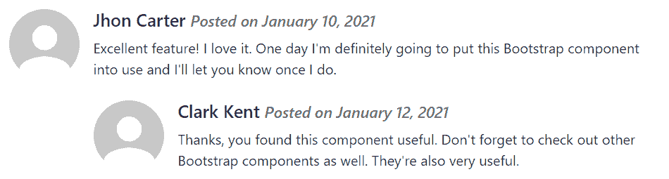

# Bootstrap 媒体对象

> 原文：<https://www.tutorialrepublic.com/twitter-bootstrap-tutorial/bootstrap-media-objects.php>

在本教程中，您将学习如何在 Bootstrap 中创建媒体对象。

## 在 Bootstrap 中使用媒体对象

从版本 5 开始，Bootstrap 媒体对象已停止使用。但是，您仍然可以创建包含左对齐或右对齐媒体对象(如图像或视频)以及文本内容(如博客评论、推文等)的布局。使用 flex 和 spacing 实用程序类。

#### 例子

[Try this code »](../codelab.php?topic=bootstrap&file=media-objects "Try this code using online Editor")

```html
<div class="d-flex">
    <div class="flex-shrink-0">
        
    </div>
    <div class="flex-grow-1 ms-3">
        <h5>Jhon Carter <small class="text-muted"><i>Posted on January 10, 2021</i></small></h5>
        <p>Excellent feature! I love it. One day I'm definitely going to put this Bootstrap component into use and I'll let you know once I do.</p>
    </div>
</div>
```

—上述示例的输出类似于以下内容:

[](../codelab.php?topic=bootstrap&file=media-objects) 

您还可以创建媒体对象的其他变体。将图像修改器类如`.rounded`或`.rounded-circle`应用于图像，创建圆角或圆形图像。

#### 例子

[Try this code »](../codelab.php?topic=bootstrap&file=rounded-media-objects "Try this code using online Editor")

```html
<div class="d-flex">
    <div class="flex-shrink-0">
        
    </div>
    <div class="flex-grow-1 ms-3">
        <h5>Jhon Carter <small class="text-muted"><i>Posted on January 10, 2021</i></small></h5>
        <p>Excellent feature! I love it. One day I'm definitely going to put this Bootstrap component into use and I'll let you know once I do.</p>
    </div>
</div>
```

—以上示例的输出类似于以下内容:

[](../codelab.php?topic=bootstrap&file=rounded-media-objects) 

* * *

## 创建嵌套媒体对象

媒体对象也可以嵌套在其他媒体对象中。这对于在博客文章中创建评论线索非常有用。让我们来看一个例子:

#### 例子

[Try this code »](../codelab.php?topic=bootstrap&file=nested-media-objects "Try this code using online Editor")

```html
<div class="d-flex">
    <div class="flex-shrink-0">
        
    </div>
    <div class="flex-grow-1 ms-3">
        <h5>Jhon Carter <small class="text-muted"><i>Posted on January 10, 2021</i></small></h5>
        <p>Excellent feature! I love it. One day I'm definitely going to put this Bootstrap component into use and I'll let you know once I do.</p>

        <!-- Nested media object -->
        <div class="d-flex mt-4">
            <div class="flex-shrink-0">
                
            </div>
            <div class="flex-grow-1 ms-3">
                <h5>Clark Kent <small class="text-muted"><i>Posted on January 12, 2021</i></small></h5>
                <p>Thanks, you found this component useful. Don't forget to check out other Bootstrap components as well. They're also very useful.</p>
            </div>
        </div>
    </div>
</div>
```

—以上示例的输出类似于以下内容:

[](../codelab.php?topic=bootstrap&file=nested-media-objects) 

* * *

## 媒体对象的对齐

您还可以通过调整 HTML 代码本身来更改内容和媒体的水平对齐方式，如下例所示:

#### 例子

[Try this code »](../codelab.php?topic=bootstrap&file=horizontal-alignment-of-media-objects "Try this code using online Editor")

```html
<div class="d-flex">
    <div class="flex-grow-1 me-3">
        <h5>Jhon Carter <small class="text-muted"><i>Posted on January 10, 2021</i></small></h5>
        <p>Excellent feature! I love it. One day I'm definitely going to put this Bootstrap component into use and I'll let you know once I do.</p>
    </div>
    <div class="flex-shrink-0">
        
    </div>
</div>
```

—以上示例的输出类似于以下内容:

[](../codelab.php?topic=bootstrap&file=horizontal-alignment-of-media-objects) 

除此之外，您还可以使用 flexbox 实用程序类在内容块的中间或底部对齐图像或其他媒体，例如，您可以使用类`.align-self-center`进行垂直居中对齐，使用类`.align-self-end`进行底部对齐。

默认情况下，媒体对象内的媒体是顶部对齐的。这里有一个例子:

#### 例子

[Try this code »](../codelab.php?topic=bootstrap&file=vertical-alignment-of-media-objects "Try this code using online Editor") 

```html
<!--Top aligned media-->
<div class="d-flex">
    <div class="flex-shrink-0">
        
    </div>
    <div class="flex-grow-1 ms-3">
        <h5>Top aligned media <small class="text-muted"><i>This is Default</i></small></h5>
        <p>Lorem ipsum dolor sit amet, consectetur adipiscing elit...</p>
    </div>
</div>
<hr>

<!--Middle aligned media-->
<div class="d-flex">
    <div class="flex-shrink-0 align-self-center">
        
    </div>
    <div class="flex-grow-1 ms-3">
        <h5>Middle Aligned Media</h5>
        <p>Vestibulum quis quam ut magna consequat faucibus aleo...</p>
    </div>
</div>
<hr>

<!--Bottom aligned media-->
<div class="d-flex">
    <div class="flex-shrink-0 align-self-end">
        
    </div>
    <div class="flex-grow-1 ms-3">
        <h5>Bottom Aligned Media</h5>
        <p>Amet nibh libero, in gravida nulla. Nulla vel metus...</p>
    </div>
</div>
```*