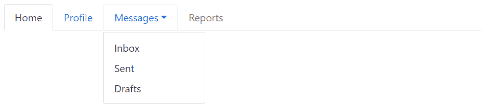

# 引导导航:标签和药丸

> 原文：<https://www.tutorialrepublic.com/twitter-bootstrap-tutorial/bootstrap-navs.php>

在本教程中，你将学习如何使用引导导航组件创建导航。

## 引导导航组件

Bootstrap 提供了一种简单快捷的方式来创建基本的导航，以及像标签和药丸这样非常灵活和优雅的组件。所有引导程序的导航组件，包括标签和药丸，通过基本的`.nav`类共享相同的基本标记和样式。

## 使用引导创建基本导航

您可以使用 Bootstrap `.nav`类创建一个基本的导航菜单，如下所示:

#### 例子

[Try this code »](../codelab.php?topic=bootstrap&file=nav "Try this code using online Editor")

```
<nav class="nav">
    <a href="#" class="nav-item nav-link active">Home</a>
    <a href="#" class="nav-item nav-link">Profile</a>
    <a href="#" class="nav-item nav-link">Messages</a>
    <a href="#" class="nav-item nav-link disabled" tabindex="-1">Reports</a>
</nav>
```

—以上示例的输出类似于以下内容:

[](../codelab.php?topic=bootstrap&file=nav)  ***注意:**你可以使用类`.disabled`让一个链接看起来像被禁用了。但是，`.disabled`类仅仅通过使链接变灰和移除悬停效果来改变链接的视觉外观，然而链接将保持可点击，除非你[移除`"href"`属性](/faq/how-to-remove-clickable-behavior-from-a-disabled-link-using-jquery.php)。*  ** * *

## 导航项目对齐

默认情况下，nav 是左对齐的，但是您可以使用 flexbox 实用程序轻松地将它们居中或右对齐。

以下示例使用类`.justify-content-center`将导航项目居中对齐。

#### 例子

[Try this code »](../codelab.php?topic=bootstrap&file=nav-center-alignment "Try this code using online Editor")

```
<nav class="nav justify-content-center">
    <a href="#" class="nav-item nav-link active">Home</a>
    <a href="#" class="nav-item nav-link">Profile</a>
    <a href="#" class="nav-item nav-link">Messages</a>
    <a href="#" class="nav-item nav-link disabled" tabindex="-1">Reports</a>
</nav>
```

—以上示例的输出类似于以下内容:

[](../codelab.php?topic=bootstrap&file=nav-center-alignment) 

类似地，您可以使用类`.justify-content-end`将导航项目右对齐，就像这样:

#### 例子

[Try this code »](../codelab.php?topic=bootstrap&file=nav-right-alignment "Try this code using online Editor")

```
<nav class="nav justify-content-end">
    <a href="#" class="nav-item nav-link active">Home</a>
    <a href="#" class="nav-item nav-link">Profile</a>
    <a href="#" class="nav-item nav-link">Messages</a>
    <a href="#" class="nav-item nav-link disabled" tabindex="-1">Reports</a>
</nav>
```

—以上示例的输出类似于以下内容:

[](../codelab.php?topic=bootstrap&file=nav-right-alignment) 

此外，您甚至可以通过使用类`.flex-column`改变灵活项目的方向来垂直堆叠导航项目。此外，如果您想在较小的视窗上垂直堆叠导航，而不是在其他视窗上，请使用响应断点(例如，`.flex-sm-column`)。

#### 例子

[Try this code »](../codelab.php?topic=bootstrap&file=vertically-stacked-nav "Try this code using online Editor")

```
<nav class="nav flex-column">
    <a href="#" class="nav-item nav-link active">Home</a>
    <a href="#" class="nav-item nav-link">Profile</a>
    <a href="#" class="nav-item nav-link">Messages</a>
    <a href="#" class="nav-item nav-link disabled" tabindex="-1">Reports</a>
</nav>
```

—以上示例的输出类似于以下内容:

[](../codelab.php?topic=bootstrap&file=vertically-stacked-nav) 

* * *

## 创建基本选项卡

简单地说，将类`.nav-tabs`添加到基本导航中以生成选项卡式导航，如下所示:

#### 例子

[Try this code »](../codelab.php?topic=bootstrap&file=nav-tabs "Try this code using online Editor")

```
<nav class="nav nav-tabs">
    <a href="#" class="nav-item nav-link active">Home</a>
    <a href="#" class="nav-item nav-link">Profile</a>
    <a href="#" class="nav-item nav-link">Messages</a>
    <a href="#" class="nav-item nav-link disabled" tabindex="-1">Reports</a>
</nav>
```

—以上示例的输出类似于以下内容:

[](../codelab.php?topic=bootstrap&file=nav-tabs) 

参见关于[引导标签](bootstrap-tabs.php)的教程，了解如何创建动态标签在内容之间切换。

您还可以向选项卡项目添加图标，使其更具吸引力，如下所示:

#### 例子

[Try this code »](../codelab.php?topic=bootstrap&file=tabs-with-icons "Try this code using online Editor")

```
<nav class="nav nav-tabs">
    <a href="#" class="nav-item nav-link active">
        <i class="bi-house-door"></i> Home
    </a>
    <a href="#" class="nav-item nav-link">
        <i class="bi-person"></i> Profile
    </a>
    <a href="#" class="nav-item nav-link">
        <i class="bi-envelope"></i> Messages
    </a>
    <a href="#" class="nav-item nav-link disabled" tabindex="-1">
        <i class="bi-bar-chart"></i> Reports
    </a>
</nav>
```

—以上示例的输出类似于以下内容:

[](../codelab.php?topic=bootstrap&file=tabs-with-icons) 

参见关于[引导图标](bootstrap-icons.php)的教程，了解如何在引导中使用图标。此外，查看[引导图标类](/bootstrap-icons-classes.php)，探索引导提供的图标。

* * *

## 创建药丸导航

类似地，您可以通过在基本导航上添加类`.nav-pills`而不是类`.nav-tabs`来创建基于药丸的导航，如下例所示:

#### 例子

[Try this code »](../codelab.php?topic=bootstrap&file=nav-pills "Try this code using online Editor")

```
<nav class="nav nav-pills">
    <a href="#" class="nav-item nav-link active">Home</a>
    <a href="#" class="nav-item nav-link">Profile</a>
    <a href="#" class="nav-item nav-link">Messages</a>
    <a href="#" class="nav-item nav-link disabled" tabindex="-1">Reports</a>
</nav>
```

—以上示例的输出类似于以下内容:

[](../codelab.php?topic=bootstrap&file=nav-pills) 

类似地，像导航标签一样，你也可以添加图标到你的药丸导航，使它更有吸引力:

#### 例子

[Try this code »](../codelab.php?topic=bootstrap&file=pills-with-icons "Try this code using online Editor")

```
<nav class="nav nav-pills">
    <a href="#" class="nav-item nav-link active">
        <i class="bi-house-door"></i> Home
    </a>
    <a href="#" class="nav-item nav-link">
        <i class="bi-person"></i> Profile
    </a>
    <a href="#" class="nav-item nav-link">
        <i class="bi-envelope"></i> Messages
    </a>
    <a href="#" class="nav-item nav-link disabled" tabindex="-1">
        <i class="bi-bar-chart"></i> Reports
    </a>
</nav>
```

—以上示例的输出类似于以下内容:

[](../codelab.php?topic=bootstrap&file=pills-nav-with-icons) 

此外，您可以在`.nav`元素上应用类`.flex-column`,使药丸导航显示为垂直堆叠。如果您需要将它们堆叠在特定的视口而不是其他视口，您也可以使用响应版本(如`.flex-sm-column`)。

#### 例子

[Try this code »](../codelab.php?topic=bootstrap&file=vertically-stacked-pills-nav "Try this code using online Editor")

```
<nav class="nav nav-pills flex-column">
    <a href="#" class="nav-item nav-link active">
        <i class="bi-house-door"></i> Home
    </a>
    <a href="#" class="nav-item nav-link">
        <i class="bi-person"></i> Profile
    </a>
    <a href="#" class="nav-item nav-link">
        <i class="bi-envelope"></i> Messages
    </a>
    <a href="#" class="nav-item nav-link disabled" tabindex="-1">
        <i class="bi-bar-chart"></i> Reports
    </a>
</nav>
```

—以上示例的输出类似于以下内容:

[](../codelab.php?topic=bootstrap&file=vertically-stacked-pills-nav) 

* * *

## 带有下拉菜单的引导导航

你可以添加下拉菜单到标签页和药丸导航的链接中，只需要一点额外的标记。

除了`.nav`、`.nav-tabs`或`.nav-pills`类之外，还需要四个 CSS 类`.dropdown`、`.dropdown-toggle`、`.dropdown-menu`和`.dropdown-item`，以便在不使用任何 JavaScript 代码的情况下，在选项卡和药丸导航中创建简单的下拉菜单。

### 创建带有下拉菜单的选项卡

下面的例子将向你展示如何添加一个简单的下拉菜单到一个标签。

#### 例子

[Try this code »](../codelab.php?topic=bootstrap&file=tabs-with-dropdown-menus "Try this code using online Editor")

```
<nav class="nav nav-tabs">
    <a href="#" class="nav-item nav-link active">Home</a>
    <a href="#" class="nav-item nav-link">Profile</a>
    <div class="nav-item dropdown">
        <a href="#" class="nav-link dropdown-toggle" data-bs-toggle="dropdown">Messages</a>
        <div class="dropdown-menu">
            <a href="#" class="dropdown-item">Inbox</a>
            <a href="#" class="dropdown-item">Sent</a>
            <a href="#" class="dropdown-item">Drafts</a>
        </div>
    </div>
    <a href="#" class="nav-item nav-link disabled" tabindex="-1">Reports</a>
</nav>
```

—以上示例的输出类似于以下内容:

[](../codelab.php?topic=bootstrap&file=tabs-with-dropdown-menus) 

### 创建带下拉菜单的药丸

下面的例子将向你展示如何添加一个简单的下拉菜单到一个药丸导航。

#### 例子

[Try this code »](../codelab.php?topic=bootstrap&file=pills-with-dropdown-menus "Try this code using online Editor")

```
<nav class="nav nav-pills">
    <a href="#" class="nav-item nav-link active">Home</a>
    <a href="#" class="nav-item nav-link">Profile</a>
    <div class="nav-item dropdown">
        <a href="#" class="nav-link dropdown-toggle" data-bs-toggle="dropdown">Messages</a>
        <div class="dropdown-menu">
            <a href="#" class="dropdown-item">Inbox</a>
            <a href="#" class="dropdown-item">Sent</a>
            <a href="#" class="dropdown-item">Drafts</a>
        </div>
    </div>
    <a href="#" class="nav-item nav-link disabled" tabindex="-1">Reports</a>
</nav>
```

—以上示例的输出类似于以下内容:

[](../codelab.php?topic=bootstrap&file=pills-with-dropdown-menus) 

在[引导下拉菜单](bootstrap-dropdowns.php)一章中，您将了解更多关于下拉菜单的信息。

* * *

## 填充并对齐导航组件

您可以使用`.nav`元素上的`.nav-fill`类来强制您的`.nav-item`扩展并按比例填充所有可用宽度。在下面的例子中，所有的水平空间都被导航项占据了，但是每个导航项的宽度并不相同。

#### 例子

[Try this code »](../codelab.php?topic=bootstrap&file=nav-fill "Try this code using online Editor")

```
<nav class="nav nav-pills nav-fill">
    <a href="#" class="nav-item nav-link">Home</a>
    <a href="#" class="nav-item nav-link">About</a>
    <a href="#" class="nav-item nav-link active">Explore Products</a>
    <a href="#" class="nav-item nav-link">Contact Us</a>
</nav>
```

—以上示例的输出类似于以下内容:

[](../codelab.php?topic=bootstrap&file=nav-fill) 

或者，如果您希望 nav 填充所有水平空间，并且每个 nav 项具有相同的宽度，您可以使用类`.nav-justified`而不是`.nav-fill`。

#### 例子

[Try this code »](../codelab.php?topic=bootstrap&file=nav-justified "Try this code using online Editor")

```
<nav class="nav nav-pills nav-justified">
    <a href="#" class="nav-item nav-link">Home</a>
    <a href="#" class="nav-item nav-link">About</a>
    <a href="#" class="nav-item nav-link active">Explore Products</a>
    <a href="#" class="nav-item nav-link">Contact Us</a>
</nav>
```

—以上示例的输出类似于以下内容:

[](../codelab.php?topic=bootstrap&file=nav-justified)*