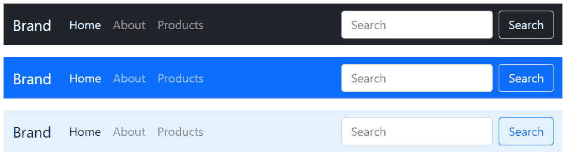

# 引导导航条

> 原文：<https://www.tutorialrepublic.com/twitter-bootstrap-tutorial/bootstrap-navbar.php>

在本教程中，您将学习如何使用 Bootstrap navbar 组件创建静态和固定位置的响应导航标题。

## 用引导程序创建导航栏

您可以使用 Bootstrap navbar 组件为您的网站或应用创建响应性导航标题。这些响应式导航条在移动电话等具有小视窗的设备上会被折叠，但在用户单击切换按钮时会展开。但是，在笔记本电脑或台式机等中型和大型设备上，它将正常水平放置。

你也可以创建不同版本的导航条，比如带有下拉菜单和搜索框的导航条，以及固定位置的导航条。下面的例子将向你展示如何创建一个简单的带有导航链接的静态导航栏。

#### 例子

[Try this code »](../codelab.php?topic=bootstrap&file=static-navbar "Try this code using online Editor")

```
<nav class="navbar navbar-expand-lg navbar-light bg-light">
    <div class="container-fluid">
        <a href="#" class="navbar-brand">Brand</a>
        <button type="button" class="navbar-toggler" data-bs-toggle="collapse" data-bs-target="#navbarCollapse">
            <span class="navbar-toggler-icon"></span>
        </button>
        <div class="collapse navbar-collapse" id="navbarCollapse">
            <div class="navbar-nav">
                <a href="#" class="nav-item nav-link active">Home</a>
                <a href="#" class="nav-item nav-link">Profile</a>
                <a href="#" class="nav-item nav-link">Messages</a>
                <a href="#" class="nav-item nav-link disabled" tabindex="-1">Reports</a>
            </div>
            <div class="navbar-nav ms-auto">
                <a href="#" class="nav-item nav-link">Login</a>
            </div>
        </div>
    </div>
</nav>
```

—以上示例的输出类似于以下内容:

[](../codelab.php?topic=bootstrap&file=static-navbar)  ***提示:**导航条需要一个带有`.navbar-expand{-sm|-md|-lg|-xl|-xxl}`的包装`.navbar`用于响应折叠，外观需要配色方案类。此外，使用 spacing 和 flex 实用程序类来控制导航栏中的间距和对齐方式。*  ****注意:**导航条及其内容在默认情况下是流动的。改变[容器](bootstrap-containers.php)(如`.container{-sm|-md|-lg|-xl|-xxl}`)以不同方式限制其水平宽度。*  ** * *

## 向导航栏添加徽标图像

您也可以将您的徽标图像放在导航栏内，而不是纯文本。但是，您需要手动设置徽标的高度，以使其在导航条内合适，如下所示:

#### 例子

[Try this code »](../codelab.php?topic=bootstrap&file=navbar-with-logo "Try this code using online Editor")

```
<nav class="navbar navbar-expand-lg navbar-light bg-light">
    <div class="container-fluid">
        <a href="#" class="navbar-brand">
            
        </a>
        <button type="button" class="navbar-toggler" data-bs-toggle="collapse" data-bs-target="#navbarCollapse">
            <span class="navbar-toggler-icon"></span>
        </button>
        <div class="collapse navbar-collapse" id="navbarCollapse">
            <div class="navbar-nav">
                <a href="#" class="nav-item nav-link active">Home</a>
                <a href="#" class="nav-item nav-link">Profile</a>
                <a href="#" class="nav-item nav-link">Messages</a>
                <a href="#" class="nav-item nav-link disabled" tabindex="-1">Reports</a>
            </div>
            <div class="navbar-nav ms-auto">
                <a href="#" class="nav-item nav-link">Login</a>
            </div>
        </div>
    </div>
</nav>
```

—以上示例的输出类似于以下内容:

[](../codelab.php?topic=bootstrap&file=navbar-with-logo)  ***提示:**使用[实用类](bootstrap-helper-classes.php)如`.ms-auto`、`.me-auto`、`.justify-content-between`等。对齐导航栏中的导航链接、窗体、按钮或文本。*  ** * *

## 向导航栏添加下拉菜单

您还可以在导航栏中包含下拉框和搜索框，如下所示:

#### 例子

[Try this code »](../codelab.php?topic=bootstrap&file=navbar-with-dropdown "Try this code using online Editor")

```
<nav class="navbar navbar-expand-lg navbar-light bg-light">
    <div class="container-fluid">
        <a href="#" class="navbar-brand">Brand</a>
        <button type="button" class="navbar-toggler" data-bs-toggle="collapse" data-bs-target="#navbarCollapse">
            <span class="navbar-toggler-icon"></span>
        </button>
        <div class="collapse navbar-collapse" id="navbarCollapse">
            <div class="navbar-nav">
                <a href="#" class="nav-item nav-link active">Home</a>
                <a href="#" class="nav-item nav-link">Profile</a>
                <div class="nav-item dropdown">
                    <a href="#" class="nav-link dropdown-toggle" data-bs-toggle="dropdown">Messages</a>
                    <div class="dropdown-menu">
                        <a href="#" class="dropdown-item">Inbox</a>
                        <a href="#" class="dropdown-item">Sent</a>
                        <a href="#" class="dropdown-item">Drafts</a>
                    </div>
                </div>
                <a href="#" class="nav-item nav-link disabled" tabindex="-1">Reports</a>
            </div>
            <div class="navbar-nav ms-auto">
                <a href="#" class="nav-item nav-link">Login</a>
            </div>
        </div>
    </div>
</nav>
```

—以上示例的输出类似于以下内容:

[](../codelab.php?topic=bootstrap&file=navbar-with-dropdown) 

查看 snippets 部分，查看一些设计精美的引导导航条的例子。

* * *

## 将搜索表单放在导航栏中

搜索表单是导航栏中非常常见的组件，你经常在各种网站上看到它。您可以使用 [`<form>`](../html-reference/html-form-tag.php) 元素上的类`.d-flex`在导航栏中放置各种表单控件，如下例所示:

#### 例子

[Try this code »](../codelab.php?topic=bootstrap&file=navbar-with-search-form "Try this code using online Editor")

```
<nav class="navbar navbar-expand-lg navbar-light bg-light">
    <div class="container-fluid">
        <a href="#" class="navbar-brand">Brand</a>
        <button type="button" class="navbar-toggler" data-bs-toggle="collapse" data-bs-target="#navbarCollapse">
            <span class="navbar-toggler-icon"></span>
        </button>
        <div class="collapse navbar-collapse justify-content-between" id="navbarCollapse">
            <div class="navbar-nav">
                <a href="#" class="nav-item nav-link active">Home</a>
                <a href="#" class="nav-item nav-link">Profile</a>
                <div class="nav-item dropdown">
                    <a href="#" class="nav-link dropdown-toggle" data-bs-toggle="dropdown">Messages</a>
                    <div class="dropdown-menu">
                        <a href="#" class="dropdown-item">Inbox</a>
                        <a href="#" class="dropdown-item">Sent</a>
                        <a href="#" class="dropdown-item">Drafts</a>
                    </div>
                </div>
            </div>
            <form class="d-flex">
                <div class="input-group">                    
                    <input type="text" class="form-control" placeholder="Search">
                    <button type="button" class="btn btn-secondary"><i class="bi-search"></i></button>
                </div>
            </form>
            <div class="navbar-nav">
                <a href="#" class="nav-item nav-link">Login</a>
            </div>
        </div>
    </div>
</nav>
```

—以上示例的输出类似于以下内容:

[](../codelab.php?topic=bootstrap&file=navbar-with-search-form) 

* * *

## 更改导航栏的配色方案

您也可以通过使用`.navbar-light`选择浅背景色，或者使用`.navbar-dark`选择深背景色来更改导航栏的配色方案。然后，用[背景色实用程序类](bootstrap-helper-classes.php#background-color-classes)对其进行自定义，比如`.bg-dark`、`.bg-primary`等等。

或者，您也可以自己在`.navbar`元素上应用 CSS [`background-color`](/css-reference/css-background-color-property.php) 属性来自定义导航栏主题，如下例所示:

#### 例子

[Try this code »](../codelab.php?topic=bootstrap&file=navbar-color-schemes "Try this code using online Editor")

```
<nav class="navbar navbar-dark bg-dark">
    <!-- Navbar content -->
</nav>

<nav class="navbar navbar-dark bg-primary">
    <!-- Navbar content -->
</nav>

<nav class="navbar navbar-light" style="background-color: #ddeeff;">
    <!-- Navbar content -->
</nav>
```

—以上示例的输出类似于以下内容:

[](../codelab.php?topic=bootstrap&file=navbar-color-schemes) 

* * *

## 引导固定导航条

Bootstrap 还提供了创建固定在顶部、固定在底部或粘贴在顶部的导航条的机制(即，随着页面滚动，直到它到达顶部，然后停留在那里)。

### 固定在顶部的导航条

将 position 实用程序类`.fixed-top`应用于`.navbar`元素，以固定视口顶部的导航栏，使其不会随页面滚动。这里有一个例子:

#### 例子

[Try this code »](../codelab.php?topic=bootstrap&file=navbar-fixed-to-top "Try this code using online Editor")

```
<nav class="navbar fixed-top navbar-expand-lg navbar-dark bg-dark">
    <!-- Navbar content -->
</nav>
```

### 导航条固定在底部

类似地，将类`.fixed-bottom`添加到`.navbar`元素中，以固定视口底部的导航条。它也不会随着页面滚动。让我们看看它是如何工作的:

#### 例子

[Try this code »](../codelab.php?topic=bootstrap&file=navbar-fixed-to-bottom "Try this code using online Editor")

```
<nav class="navbar fixed-bottom navbar-expand-lg navbar-dark bg-dark">
    <!-- Navbar content -->
</nav>
```

### 导航条粘在顶部

你也可以创建粘性顶部导航条，它随着页面滚动，直到到达顶部，然后停留在那里，只需简单地使用`.navbar`元素上的`.sticky-top`类，如下所示:

#### 例子

[Try this code »](../codelab.php?topic=bootstrap&file=navbar-sticky-top "Try this code using online Editor")

```
<nav class="navbar sticky-top navbar-expand-lg navbar-dark bg-dark">
    <!-- Navbar content -->
</nav>
```

 ***注意:**在实现*固定顶部*或*固定底部*导航条时，记得在`[<body>](../html-reference/html-body-tag.php)`元素的顶部或底部添加`[padding](../css-reference/css-padding-property.php)`(至少 70px)以防止内容到导航条下面。另外，一定要在引导程序的 CSS 文件后添加自定义的[样式表](../html-tutorial/html-styles.php)，否则样式表中的样式规则可能会被引导程序的样式规则覆盖。*  ****提示:**将`.navbar`内容放置在`.container`、`.container-fluid`或`.container{-sm|-md|-lg|-xl|-xxl}`中，以便适当填充并与其余内容对齐。*****