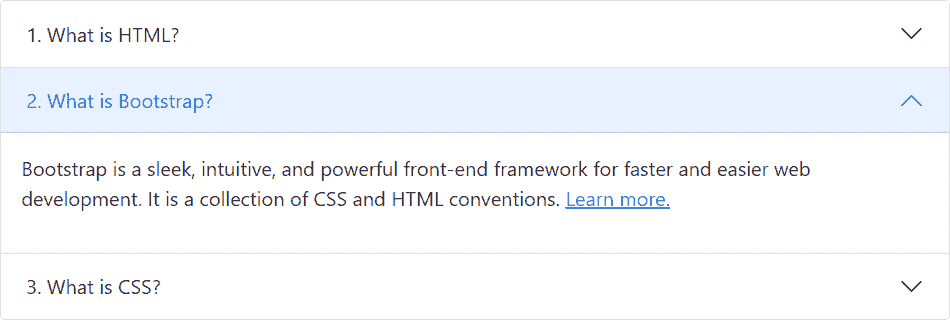
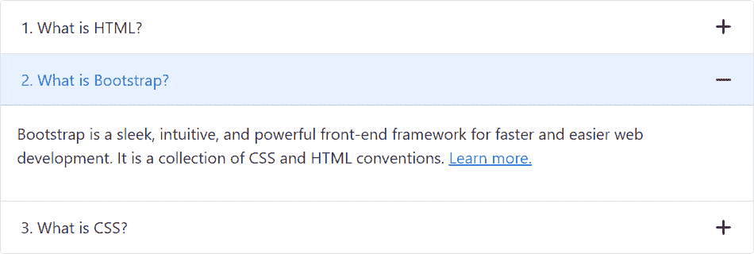
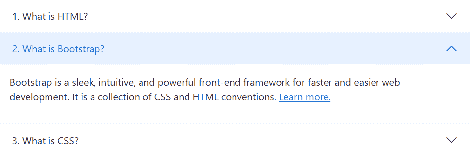
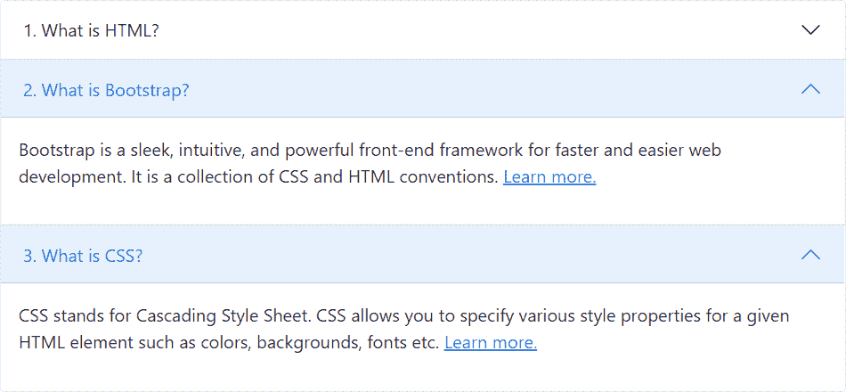

# Bootstrap 手风琴

> 原文：<https://www.tutorialrepublic.com/twitter-bootstrap-tutorial/bootstrap-accordion.php>

在本教程中，你将学习如何用 Bootstrap 创建手风琴。

## 使用 Bootstrap 创建折叠式小部件

手风琴是一系列互相堆叠的面板。

折叠式菜单和窗口小部件在 web 应用中广泛使用，用于管理小区域中的大量内容和导航列表。使用 Bootstrap collapse 插件，你可以创建手风琴或者显示和隐藏内容，而无需编写任何 JavaScript 代码。

让我们看看如何使用 Bootstrap 可折叠插件构建一个简单的 accordion 小部件。

#### 例子

[Try this code »](../codelab.php?topic=bootstrap&file=accordion "Try this code using online Editor") *```
<div class="accordion" id="myAccordion">
    <div class="accordion-item">
        <h2 class="accordion-header" id="headingOne">
            <button type="button" class="accordion-button collapsed" data-bs-toggle="collapse" data-bs-target="#collapseOne">1\. What is HTML?</button>									
        </h2>
        <div id="collapseOne" class="accordion-collapse collapse" data-bs-parent="#myAccordion">
            <div class="card-body">
                <p>HTML stands for HyperText Markup Language. HTML is the standard markup language for describing the structure of web pages. <a href="https://www.tutorialrepublic.com/html-tutorial/" target="_blank">Learn more.</a></p>
            </div>
        </div>
    </div>
    <div class="accordion-item">
        <h2 class="accordion-header" id="headingTwo">
            <button type="button" class="accordion-button" data-bs-toggle="collapse" data-bs-target="#collapseTwo">2\. What is Bootstrap?</button>
        </h2>
        <div id="collapseTwo" class="accordion-collapse collapse show" data-bs-parent="#myAccordion">
            <div class="card-body">
                <p>Bootstrap is a sleek, intuitive, and powerful front-end framework for faster and easier web development. It is a collection of CSS and HTML conventions. <a href="https://www.tutorialrepublic.com/twitter-bootstrap-tutorial/" target="_blank">Learn more.</a></p>
            </div>
        </div>
    </div>
    <div class="accordion-item">
        <h2 class="accordion-header" id="headingThree">
            <button type="button" class="accordion-button collapsed" data-bs-toggle="collapse" data-bs-target="#collapseThree">3\. What is CSS?</button>                     
        </h2>
        <div id="collapseThree" class="accordion-collapse collapse" data-bs-parent="#myAccordion">
            <div class="card-body">
                <p>CSS stands for Cascading Style Sheet. CSS allows you to specify various style properties for a given HTML element such as colors, backgrounds, fonts etc. <a href="https://www.tutorialrepublic.com/css-tutorial/" target="_blank">Learn more.</a></p>
            </div>
        </div>
    </div>
</div>
```*  *—以上示例的输出类似于以下内容:

[](../codelab.php?topic=bootstrap&file=accordion) 

* * *

## 带加减图标的 Bootstrap 手风琴

您还可以在带有几行自定义 CSS 代码的 Bootstrap accordion 小部件中使用加号和减号图标(代替 v 形上下图标)。让我们试试下面的例子:

#### 例子

[Try this code »](../codelab.php?topic=bootstrap&file=accordion-with-plus-minus-icon "Try this code using online Editor")

```
<style>
.accordion-button::after {
    background-image: url("data:image/svg+xml,%3csvg viewBox='0 0 16 16' fill='%23333' xmlns='http://www.w3.org/2000/svg'%3e%3cpath fill-rule='evenodd' d='M8 0a1 1 0 0 1 1 1v6h6a1 1 0 1 1 0 2H9v6a1 1 0 1 1-2 0V9H1a1 1 0 0 1 0-2h6V1a1 1 0 0 1 1-1z' clip-rule='evenodd'/%3e%3c/svg%3e");
    transform: scale(0.75) !important;
}
.accordion-button:not(.collapsed)::after {
    background-image: url("data:image/svg+xml,%3csvg viewBox='0 0 16 16' fill='%23333' xmlns='http://www.w3.org/2000/svg'%3e%3cpath fill-rule='evenodd' d='M0 8a1 1 0 0 1 1-1h14a1 1 0 1 1 0 2H1a1 1 0 0 1-1-1z' clip-rule='evenodd'/%3e%3c/svg%3e");
}
</style>
```

—以上示例的输出类似于以下内容:

[](../codelab.php?topic=bootstrap&file=accordion-with-plus-minus-icon) 

* * *

## Bootstrap 边到边折叠

您可以选择将类`.accordion-flush`添加到`.accordion`元素中，以移除外部边框和圆角，从而创建与其父容器边对边的折叠。

让我们看看下面的例子，以了解它实际上是如何工作的:

#### 例子

[Try this code »](../codelab.php?topic=bootstrap&file=edge-to-edge-accordion "Try this code using online Editor") *```
<div class="accordion accordion-flush" id="myAccordion">
    <div class="accordion-item">
        <h2 class="accordion-header" id="headingOne">
            <button type="button" class="accordion-button collapsed" data-bs-toggle="collapse" data-bs-target="#collapseOne">1\. What is HTML?</button>									
        </h2>
        <div id="collapseOne" class="accordion-collapse collapse" data-bs-parent="#myAccordion">
            <div class="card-body">
                <p>HTML stands for HyperText Markup Language. HTML is the standard markup language for describing the structure of web pages. <a href="https://www.tutorialrepublic.com/html-tutorial/" target="_blank">Learn more.</a></p>
            </div>
        </div>
    </div>
    <div class="accordion-item">
        <h2 class="accordion-header" id="headingTwo">
            <button type="button" class="accordion-button" data-bs-toggle="collapse" data-bs-target="#collapseTwo">2\. What is Bootstrap?</button>
        </h2>
        <div id="collapseTwo" class="accordion-collapse collapse show" data-bs-parent="#myAccordion">
            <div class="card-body">
                <p>Bootstrap is a sleek, intuitive, and powerful front-end framework for faster and easier web development. It is a collection of CSS and HTML conventions. <a href="https://www.tutorialrepublic.com/twitter-bootstrap-tutorial/" target="_blank">Learn more.</a></p>
            </div>
        </div>
    </div>
    <div class="accordion-item">
        <h2 class="accordion-header" id="headingThree">
            <button type="button" class="accordion-button collapsed" data-bs-toggle="collapse" data-bs-target="#collapseThree">3\. What is CSS?</button>                     
        </h2>
        <div id="collapseThree" class="accordion-collapse collapse" data-bs-parent="#myAccordion">
            <div class="card-body">
                <p>CSS stands for Cascading Style Sheet. CSS allows you to specify various style properties for a given HTML element such as colors, backgrounds, fonts etc. <a href="https://www.tutorialrepublic.com/css-tutorial/" target="_blank">Learn more.</a></p>
            </div>
        </div>
    </div>
</div>
```*  *—以上示例的输出类似于以下内容:

[](../codelab.php?topic=bootstrap&file=accordion) 

* * *

## 带独立面板的 Bootstrap 手风琴

您还可以通过省略每个`.accordion-collapse`元素上的`data-bs-parent`属性，使折叠面板在另一个面板打开时保持打开。

让我们试试下面的例子，看看它是如何工作的:

#### 例子

[Try this code »](../codelab.php?topic=bootstrap&file=accordion-with-independent-collapsible-panels "Try this code using online Editor") *```
<div class="accordion" id="myAccordion">
    <div class="accordion-item">
        <h2 class="accordion-header" id="headingOne">
            <button type="button" class="accordion-button collapsed" data-bs-toggle="collapse" data-bs-target="#collapseOne">1\. What is HTML?</button>									
        </h2>
        <div id="collapseOne" class="accordion-collapse collapse">
            <div class="card-body">
                <p>HTML stands for HyperText Markup Language. HTML is the standard markup language for describing the structure of web pages. <a href="https://www.tutorialrepublic.com/html-tutorial/" target="_blank">Learn more.</a></p>
            </div>
        </div>
    </div>
    <div class="accordion-item">
        <h2 class="accordion-header" id="headingTwo">
            <button type="button" class="accordion-button" data-bs-toggle="collapse" data-bs-target="#collapseTwo">2\. What is Bootstrap?</button>
        </h2>
        <div id="collapseTwo" class="accordion-collapse collapse show">
            <div class="card-body">
                <p>Bootstrap is a sleek, intuitive, and powerful front-end framework for faster and easier web development. It is a collection of CSS and HTML conventions. <a href="https://www.tutorialrepublic.com/twitter-bootstrap-tutorial/" target="_blank">Learn more.</a></p>
            </div>
        </div>
    </div>
    <div class="accordion-item">
        <h2 class="accordion-header" id="headingThree">
            <button type="button" class="accordion-button collapsed" data-bs-toggle="collapse" data-bs-target="#collapseThree">3\. What is CSS?</button>                     
        </h2>
        <div id="collapseThree" class="accordion-collapse collapse">
            <div class="card-body">
                <p>CSS stands for Cascading Style Sheet. CSS allows you to specify various style properties for a given HTML element such as colors, backgrounds, fonts etc. <a href="https://www.tutorialrepublic.com/css-tutorial/" target="_blank">Learn more.</a></p>
            </div>
        </div>
    </div>
</div>
```*  *—以上示例的输出类似于以下内容:

[](../codelab.php?topic=bootstrap&file=accordion-with-independent-collapsible-panels)***