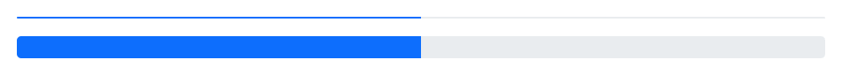
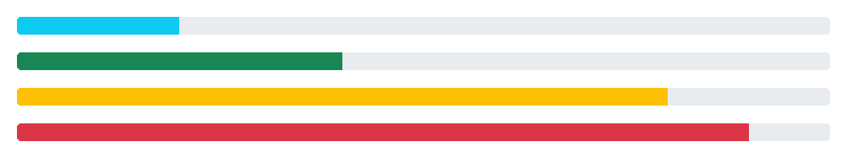

# 引导进度条

> 原文：<https://www.tutorialrepublic.com/twitter-bootstrap-tutorial/bootstrap-progress-bars.php>

在本教程中，你将学习如何使用 Bootstrap 创建进度条。

## 用引导程序创建进度条

进度条可用于向用户显示任务或操作的进度。

下面的例子将向你展示如何创建一个简单的垂直渐变进度条。

#### 例子

[Try this code »](../codelab.php?topic=bootstrap&file=progress-bar "Try this code using online Editor")

```
<div class="progress">
    <div class="progress-bar" style="width: 50%"></div>
</div>
```

—上述示例的输出类似于以下内容:

[](../codelab.php?topic=bootstrap&file=progress-bar)  ***注意:**包装器，即`.progress`元素表示进度条的最大值，而内部的`.progress-bar`元素表示到目前为止的进度。另外，`.progress-bar`需要一个内嵌样式，或者自定义 CSS 来设置它们的宽度。*  ** * *

## 创建带有标签的进度条

您也可以将文本放在`.progress-bar`元素中，以百分比标签的形式显示进度状态，如下例所示:

#### 例子

[Try this code »](../codelab.php?topic=bootstrap&file=progress-bar-with-label "Try this code using online Editor")

```
<div class="progress">
    <div class="progress-bar" style="width: 60%">
        60%
    </div>
</div>
```

—以上示例的输出类似于以下内容:

[](../codelab.php?topic=bootstrap&file=progress-bar-with-label) 

如果您正在显示百分比标签，您还应该在进度条上应用一个 [`min-width`](../css-reference/css-min-width-property.php) ,以确保即使百分比很低，标签文本仍然可读，如下所示:

#### 例子

[Try this code »](../codelab.php?topic=bootstrap&file=progress-bar-with-label-and-min-width "Try this code using online Editor")

```
<div class="progress">
    <div class="progress-bar" style="min-width: 20px;">
        0%
    </div>
</div>
<div class="progress">
    <div class="progress-bar" style="min-width: 20px; width: 2%;">
        2%
    </div>
</div>
```

* * *

## 设置进度条的高度

进度条的默认高度是`16px`，但是您也可以根据自己的需要通过设置`.progress`元素上的 CSS [`height`](/css-reference/css-height-property.php) 属性来设置进度条的高度，如下所示:

#### 例子

[Try this code »](../codelab.php?topic=bootstrap&file=progress-bar-height-sizing "Try this code using online Editor")

```
<!-- Progress bar with 2px height -->
<div class="progress" style="height: 2px;">
    <div class="progress-bar" style="width: 50%;"></div>
</div>
<!-- Progress bar with 20px height -->
<div class="progress" style="height: 20px;">
    <div class="progress-bar" style="width: 50%;"></div>
</div>
```

—以上示例的输出类似于以下内容:

[](../codelab.php?topic=bootstrap&file=progress-bar-height-sizing) 

* * *

## 创建条状进度条

要创建剥离的进度条，只需向`.progress-bar`元素添加一个额外的类`.progress-bar-striped`，如下例所示:

#### 例子

[Try this code »](../codelab.php?topic=bootstrap&file=stripped-progress-bar "Try this code using online Editor")

```
<div class="progress">
    <div class="progress-bar progress-bar-striped" style="width: 60%;"></div>
</div>
```

—上述示例的输出类似于以下内容:

[](../codelab.php?topic=bootstrap&file=stripped-progress-bar)  *提示:条纹是在进度条的背景色上通过 CSS 渐变生成的。参见关于 [CSS3 渐变](/css-tutorial/css3-gradients.php)的教程，学习如何使用 CSS 创建渐变颜色。*  ** * *

## 创建动画进度条

您也可以动画显示剥离的进度条。将类`.progress-bar-animated`添加到`.progress-bar`元素中，它将通过 [CSS3 动画](/css-tutorial/css3-animations.php)从右向左动画显示条纹。

#### 例子

[Try this code »](../codelab.php?topic=bootstrap&file=animated-progress-bar "Try this code using online Editor")

```
<div class="progress">
    <div class="progress-bar progress-bar-striped progress-bar-animated" style="width: 60%"></div>
</div>
```

—以上示例的输出类似于以下内容:

<iframe src="../examples/bootstrap/bootstrap-animated-progress-bar.html" style="border:none;display:block;width:100%;height:16px;"></div> </div> <hr/> <h2>动态更改进度条值</h2> <p>静态进度条给人的印象不是很深刻。下面的例子将让您大致了解如何使用 jQuery 动态更新引导进度条的状态。</p> <!--Code box--> <div class="example"> <div class="codebox multi-style-mode"> <div class="codebox-title"> <h4>例子</h4> <div class="code-style"> <span class="active" data-target="0" data-url="dynamically-change-progress-bar-value-using-jquery">jQuery</span> <span data-target="1" data-url="dynamically-change-progress-bar-value-using-javascript">JavaScript</span> </div> <a href="../codelab.php?topic=bootstrap&amp;file=dynamically-change-progress-bar-value-using-jquery" target="_blank" class="try-btn" title="Try this code using online Editor">Try this code <span>»</span></a> </div> <pre class="syntax-highlighter line-numbers"><code class="language-markup">&lt;script&gt; var i = 0; function makeProgress(){ if(i &lt; 100){ i = i + 1; $(".progress-bar").css("width", i + "%").text(i + "%"); } // Wait for sometime before running this script again setTimeout("makeProgress()", 100); } makeProgress(); &lt;/script&gt;</code></pre> <pre class="syntax-highlighter line-numbers hide"><code class="language-markup">&lt;script&gt; var i = 0; var bar = document.querySelector(".progress-bar"); function makeProgress(){ if(i &lt; 100){ i = i + 1; bar.style.width = i + "%"; bar.innerText = i + "%"; } // Wait for sometime before running this script again setTimeout("makeProgress()", 100); } makeProgress(); &lt;/script&gt;</code></pre> </div> </div> <!--End:Code box--> <hr/> <h2>创建堆叠进度条</h2> <p>您还可以在一个进度组件中放置多个进度条来堆叠它们。</p> <p>这里有一个例子来演示它实际上是如何工作的。</p> <!--Code box--> <div class="example"> <div class="codebox"> <div class="codebox-title"><h4>例子</h4><a href="../codelab.php?topic=bootstrap&amp;file=stacked-progress-bar" target="_blank" class="try-btn" title="Try this code using online Editor">Try this code <span>»</span></a></div> <pre class="syntax-highlighter line-numbers"><code class="language-markup">&lt;div class="progress"&gt; &lt;div class="progress-bar bg-success" style="width: 40%"&gt; Program Files (40%) &lt;/div&gt; &lt;div class="progress-bar bg-warning" style="width: 25%"&gt; Residual Files (25%) &lt;/div&gt; &lt;div class="progress-bar bg-danger" style="width: 15%"&gt; Junk Files (15%) &lt;/div&gt; &lt;/div&gt;</code></pre> </div> </div> <!--End:Code box--> <p>—上述示例的输出类似于以下内容:</p> <div class="shadow"> <div class="preview-box"> <a href="../codelab.php?topic=bootstrap&amp;file=stacked-progress-bar" target="_blank">  </a> </div> </div> <hr/> <h2>创建不同颜色的进度条</h2> <p>您还可以使用<a href="bootstrap-helper-classes.php#background-color-classes">背景颜色实用程序类</a>来创建各种颜色的进度条，以便通过颜色传达含义，如下例所示:</p> <!--Code box--> <div class="example"> <div class="codebox"> <div class="codebox-title"><h4>例子</h4><a href="../codelab.php?topic=bootstrap&amp;file=progress-bar-with-emphasis" target="_blank" class="try-btn" title="Try this code using online Editor">Try this code <span>»</span></a></div> <pre class="syntax-highlighter line-numbers"><code class="language-markup">&lt;div class="progress"&gt; &lt;div class="progress-bar bg-info" style="width: 20%"&gt;&lt;/div&gt; &lt;/div&gt; &lt;div class="progress"&gt; &lt;div class="progress-bar bg-success" style="width: 40%"&gt;&lt;/div&gt; &lt;/div&gt; &lt;div class="progress"&gt; &lt;div class="progress-bar bg-warning" style="width: 80%"&gt;&lt;/div&gt; &lt;/div&gt; &lt;div class="progress"&gt; &lt;div class="progress-bar bg-danger" style="width: 90%"&gt;&lt;/div&gt; &lt;/div&gt;</code></pre> </div> </div> <!--End:Code box--> <p>—上述示例的输出类似于以下内容:</p> <div class="shadow"> <div class="preview-box"> <a href="../codelab.php?topic=bootstrap&amp;file=progress-bar-with-emphasis" target="_blank">  </a> </div> </div> <hr/> <h2>制作不同颜色的条纹进度条</h2> <p>与纯色相似，您也可以使用相同的背景色工具类创建不同颜色的条纹进度条。让我们看看下面的例子:</p> <!--Code box--> <div class="example"> <div class="codebox"> <div class="codebox-title"><h4>例子</h4><a href="../codelab.php?topic=bootstrap&amp;file=striped-progress-bar-with-emphasis" target="_blank" class="try-btn" title="Try this code using online Editor">Try this code <span>»</span></a></div> <pre class="syntax-highlighter line-numbers"><code class="language-markup">&lt;div class="progress"&gt; &lt;div class="progress-bar progress-bar-striped bg-info" style="width: 20%"&gt;&lt;/div&gt; &lt;/div&gt; &lt;div class="progress"&gt; &lt;div class="progress-bar progress-bar-striped bg-success" style="width: 40%"&gt;&lt;/div&gt; &lt;/div&gt; &lt;div class="progress"&gt; &lt;div class="progress-bar progress-bar-striped bg-warning" style="width: 80%"&gt;&lt;/div&gt; &lt;/div&gt; &lt;div class="progress"&gt; &lt;div class="progress-bar progress-bar-striped bg-danger" style="width: 90%"&gt;&lt;/div&gt; &lt;/div&gt;</code></pre> </div> </div> <!--End:Code box--> <p>—以上示例的输出类似于以下内容:</p> <div class="shadow"> <div class="preview-box"> <a href="../codelab.php?topic=bootstrap&amp;file=striped-progress-bar-with-emphasis" target="_blank">  </a> </div> </div> <!--Bottom Navigation--> <!--End:Bottom Navigation--> <!-- InstanceEndEditable --> </body> </html></iframe>**