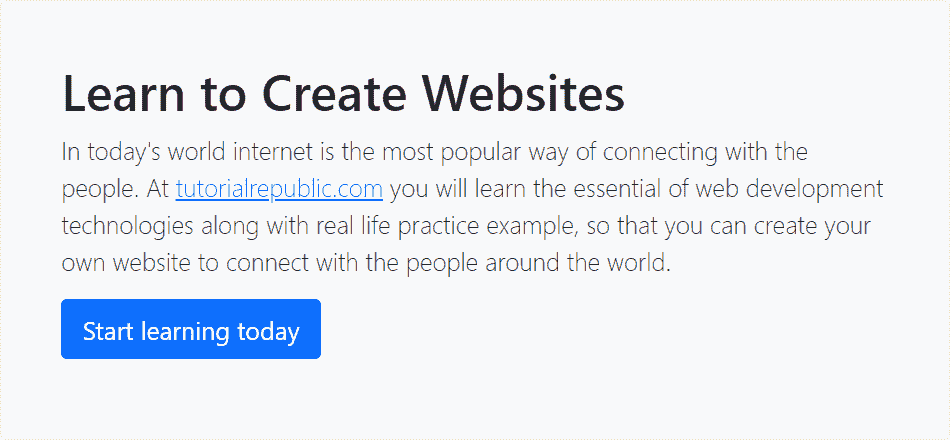

# Bootstrap大屏幕

> 原文：<https://www.tutorialrepublic.com/twitter-bootstrap-tutorial/bootstrap-jumbotron.php>

在本教程中，你将学习如何在 Bootstrap 中创建超大屏幕。

## 用大屏幕展示内容

Bootstrap大屏幕提供了一种在网页上展示关键内容或信息的绝佳方式。然而，在版本 5 中，Bootstrap 的默认大屏幕组件已经被删除。但是，您仍然可以使用 Bootstrap 内置的实用程序类来创建自定义的超大屏幕。

让我们看一个例子来了解如何创建一个自定义的超大屏幕:

#### 例子

[Try this code »](../codelab.php?topic=bootstrap&file=jumbotron "Try this code using online Editor")

```
<div class="p-5 mb-4 bg-light border rounded-3">
    <h1>Learn to Create Websites</h1>
    <p class="lead">In today's world internet is the most popular way of connecting with the people. At <a href="https://www.tutorialrepublic.com" target="_blank">tutorialrepublic.com</a> you will learn the essential of web development technologies along with real life practice example, so that you can create your own website to connect with the people around the world.</p>
    <p><a href="https://www.tutorialrepublic.com" target="_blank" class="btn btn-primary btn-lg">Start learning today</a></p>
</div>
```

—以上示例的输出类似于以下内容:

[](../codelab.php?topic=bootstrap&file=jumbotron)  ***提示:**`.p-5`类在所有四个边上应用`3rem`的填充，而`.mb-4`类在大屏幕上应用`1.5rem`的下边距。同样，类`.border`和`.rounded-3`分别在所有四个边上应用边界和边界半径`.3rem`。参见[Bootstrap助手类](bootstrap-helper-classes.php)章节，了解更多关于各种实用程序类的信息。*  *您还可以创建内容居中的全幅超大屏幕，没有圆角和边框，只需将其内部内容包装在`.container`元素中，并从包装元素中删除`.border`和`.rounded-*`类，如下例所示:

#### 例子

[Try this code »](../codelab.php?topic=bootstrap&file=jumbotron-full-width "Try this code using online Editor")

```
<div class="py-5 mb-4 bg-light">
    <div class="container">
        <h1>Learn to Create Websites</h1>
        <p class="lead">In today's world internet is the most popular way of connecting with the people. At <a href="https://www.tutorialrepublic.com" target="_blank">tutorialrepublic.com</a> you will learn the essential of web development technologies along with real life practice example, so that you can create your own website to connect with the people around the world.</p>
        <p><a href="https://www.tutorialrepublic.com" target="_blank" class="btn btn-primary btn-lg">Start learning today</a></p>
    </div>
</div>
```

* * *

## 改变大屏幕的配色方案

类似地，你可以使用Bootstrap程序的[颜色](bootstrap-helper-classes.php#color-classes)和[背景](bootstrap-helper-classes.php#background-color-classes)实用程序类来创建其他类型的超大屏幕。下面的例子将创建一个黑暗的变体超大屏幕。

#### 例子

[Try this code »](../codelab.php?topic=bootstrap&file=jumbotron-dark-variant "Try this code using online Editor")

```
<div class="p-5 mb-4 bg-dark text-white rounded-3">
    <h1>Learn to Create Websites</h1>
    <p class="lead">In today's world internet is the most popular way of connecting with the people. At <a href="https://www.tutorialrepublic.com" target="_blank" class="text-white">tutorialrepublic.com</a> you will learn the essential of web development technologies along with real life practice example, so that you can create your own website to connect with the people around the world.</p>
    <p><a href="https://www.tutorialrepublic.com" target="_blank" class="btn btn-light btn-lg">Start learning today</a></p>
</div>
```*