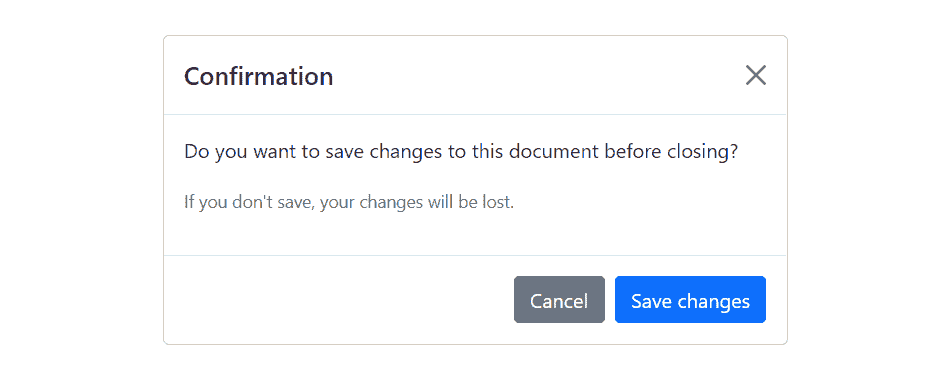

# Bootstrap 模型

> 原文：<https://www.tutorialrepublic.com/twitter-bootstrap-tutorial/bootstrap-modals.php>

在本教程中，你将学习如何用 Bootstrap 创建模态。

## 使用 Bootstrap 创建模型

模式基本上是一个对话框或弹出窗口，用于向用户提供重要信息或提示用户在继续之前采取必要的行动。模态广泛用于警告用户会话超时等情况，或者在执行任何关键操作(如保存或删除重要数据)之前收到他们的最终确认。

你可以很容易地用 Bootstrap 模式插件创建非常智能和灵活的对话框。下面的例子展示了创建一个简单模型的基本结构，该模型具有页眉、消息正文和页脚，页脚包含用户的操作按钮。

#### 例子

jQuery JavaScript[Try this code »](../codelab.php?topic=bootstrap&file=show-modal-on-page-load-using-jquery "Try this code using online Editor")

```
<!-- jQuery Code (to Show Modal on Page Load) -->
<script>
$(document).ready(function() {
    $("#myModal").modal("show");
});
</script>

<!-- Modal HTML -->
<div id="myModal" class="modal fade" tabindex="-1">
    <div class="modal-dialog">
        <div class="modal-content">
            <div class="modal-header">
                <h5 class="modal-title">Confirmation</h5>
                <button type="button" class="btn-close" data-bs-dismiss="modal"></button>
            </div>
            <div class="modal-body">
                <p>Do you want to save changes to this document before closing?</p>
                <p class="text-secondary"><small>If you don't save, your changes will be lost.</small></p>
            </div>
            <div class="modal-footer">
                <button type="button" class="btn btn-secondary" data-bs-dismiss="modal">Cancel</button>
                <button type="button" class="btn btn-primary">Save changes</button>
            </div>
        </div>
    </div>
</div>
```

```
<!-- JavaScript Code (to Show Modal on Page Load) -->
<script>
document.addEventListener("DOMContentLoaded", function() {
    var myModal = new bootstrap.Modal(document.getElementById("myModal"));
    myModal.show();
});
</script>

<!-- Modal HTML -->
<div id="myModal" class="modal fade" tabindex="-1">
    <div class="modal-dialog">
        <div class="modal-content">
            <div class="modal-header">
                <h5 class="modal-title">Confirmation</h5>
                <button type="button" class="btn-close" data-bs-dismiss="modal"></button>
            </div>
            <div class="modal-body">
                <p>Do you want to save changes to this document before closing?</p>
                <p class="text-secondary"><small>If you don't save, your changes will be lost.</small></p>
            </div>
            <div class="modal-footer">
                <button type="button" class="btn btn-secondary" data-bs-dismiss="modal">Cancel</button>
                <button type="button" class="btn btn-primary">Save changes</button>
            </div>
        </div>
    </div>
</div>
```

—如果您尝试上面的例子，当 DOM 通过 JavaScript 完全加载时，它会自动启动模态窗口。输出将如下所示:

[](../codelab.php?topic=bootstrap&file=modal)  ***提示:**总是试图将你的模态 HTML 放在文档的顶层位置，最好是在`[<body>](../html-reference/html-body-tag.php)`标签(即`</body>`)结束之前，以避免其他元素的干扰，否则可能会影响模态的外观或功能。*  *查看 snippets 部分，获得一些设计精美的 Bootstrap 模式的例子。

* * *

## 通过数据属性激活模式

您可以通过数据属性点击按钮或链接来激活 Bootstrap 模式，而无需编写任何 JavaScript 代码。看看下面的例子，看看它是如何工作的:

#### 例子

[Try this code »](../codelab.php?topic=bootstrap&file=activate-modals-via-data-attribute "Try this code using online Editor")

```
<!-- Button HTML (to Trigger Modal) -->
<a href="#myModal" class="btn btn-lg btn-primary" data-bs-toggle="modal">Launch Demo Modal</a>

<!-- Modal HTML -->
<div id="myModal" class="modal fade">
    <div class="modal-dialog">
        <div class="modal-content">
            <div class="modal-header">
                <h5 class="modal-title">Confirmation</h5>
                <button type="button" class="btn-close" data-bs-dismiss="modal"></button>
            </div>
            <div class="modal-body">
                <p>Do you want to save changes to this document before closing?</p>
                <p class="text-secondary"><small>If you don't save, your changes will be lost.</small></p>
            </div>
            <div class="modal-footer">
                <button type="button" class="btn btn-secondary" data-bs-dismiss="modal">Cancel</button>
                <button type="button" class="btn btn-primary">Save changes</button>
            </div>
        </div>
    </div>
</div> 
```

上面的例子通过点击“启动演示模态”按钮来启动模态窗口。为了更好地理解，让我们一个接一个地浏览这个模态代码的每一部分。

## 代码解释

为了通过数据属性激活一个 Bootstrap 模式，我们基本上需要两个组件——像按钮或链接这样的控制器元素，以及模式元素本身。

*   文档中每个模态的最外层容器必须有一个惟一的 id(在本例中是`id="myModal"`，*第 5 行*)，这样它就可以通过控制器元素的`data-bs-target`(用于按钮)或`href`(用于超链接)(*第 2 行*)属性被定位。
*   属性`data-bs-toggle="modal"`需要添加到控制器元素上(*第 2 行*)，如按钮或锚，以及属性`data-bs-target="#myModal"`或`href="#myModal"`来定位要切换的特定模态。
*   `.modal-dialog`类(*第 6 行*)设置模式框的宽度以及水平和垂直对齐。而类`.modal-content`设置文本和背景颜色、边框、圆角等样式。

其余的事情是不言自明的，比如`.modal-header`元素定义了一个通常包含模态标题和关闭按钮的模态标题，而`.modal-body`元素包含了文本、图像、表单等实际内容。并且`.modal-footer`元素为用户定义了通常包含动作按钮的页脚。

 ***注意:**`.modal`元素上的`.fade`类在显示和隐藏模态窗口时添加了一个渐变和滑动的动画效果。如果你想要没有任何效果的模态，你可以删除这个类。此外，当模态对于用户的视口或设备来说变得太长时，它们独立于页面本身滚动。*  ** * *

## 通过 JavaScript 激活模态

你也可以通过 JavaScript 激活一个 Bootstrap 模型窗口——只要在你的 JavaScript 代码中用模态`id`或`class`选择器调用`modal()`Bootstrap 方法。

#### 例子

jQuery JavaScript[Try this code »](../codelab.php?topic=bootstrap&file=activate-modals-via-jquery "Try this code using online Editor")

```
<script>
$(document).ready(function() {
    $("#myBtn").click(function() {
        $("#myModal").modal("show");
    });
});
</script>
```

```
<script>
document.addEventListener("DOMContentLoaded", function() {
    var btn = document.getElementById("myBtn");

    btn.addEventListener("click", function() {
        var myModal = new bootstrap.Modal(document.getElementById("myModal"));
        myModal.show();
    });
});
</script>
```

* * *

## 更改模态的大小

Bootstrap 为您提供了进一步放大或缩小模型的选项。您可以通过在`.modal-dialog`上分别添加一个额外的类`.modal-sm`、`.modal-lg`和`.modal-xl`来创建小的、大的以及超大的模态。这里有一个例子:

#### 例子

[Try this code »](../codelab.php?topic=bootstrap&file=large-and-small-modal-sizes "Try this code using online Editor") *```
<!-- Extra Large modal -->
<button class="btn btn-primary" data-bs-toggle="modal" data-bs-target="#extraLargeModal">Extra Large modal</button>

<div id="extraLargeModal" class="modal fade" tabindex="-1" role="dialog">
    <div class="modal-dialog modal-xl">
        <div class="modal-content">
            <div class="modal-header">
                <h5 class="modal-title">Extra Large Modal</h5>
                <button type="button" class="btn-close" data-bs-dismiss="modal"></button>          
            </div>
            <div class="modal-body">
                <p>Add the <code>.modal-xl</code> class on <code>.modal-dialog</code> to create this extra large modal.</p>
            </div>
            <div class="modal-footer">
                <button type="button" class="btn btn-secondary" data-bs-dismiss="modal">Cancel</button>
                <button type="button" class="btn btn-primary">OK</button>
            </div>
        </div>
    </div>
</div>

<!-- Large modal -->
<button class="btn btn-primary" data-bs-toggle="modal" data-bs-target="#largeModal">Large modal</button>

<div id="largeModal" class="modal fade" tabindex="-1" role="dialog">
    <div class="modal-dialog modal-lg">
        <div class="modal-content">
            <div class="modal-header">
                <h5 class="modal-title">Large Modal</h5>
                <button type="button" class="btn-close" data-bs-dismiss="modal"></button>              
            </div>
            <div class="modal-body">
                <p>Add the <code>.modal-lg</code> class on <code>.modal-dialog</code> to create this large modal.</p>
            </div>
            <div class="modal-footer">
                <button type="button" class="btn btn-secondary" data-bs-dismiss="modal">Cancel</button>
                <button type="button" class="btn btn-primary">OK</button>
            </div>
        </div>
    </div>
</div>

<!-- Small modal -->
<button class="btn btn-primary" data-bs-toggle="modal" data-bs-target="#smallModal">Small modal</button>

<div id="smallModal" class="modal fade" tabindex="-1" role="dialog">
    <div class="modal-dialog modal-sm">
        <div class="modal-content">
            <div class="modal-header">
                <h5 class="modal-title">Small Modal</h5>
                <button type="button" class="btn-close" data-bs-dismiss="modal"></button>       
            </div>
            <div class="modal-body">
                <p>Add the <code>.modal-sm</code> class on <code>.modal-dialog</code> to create this small modal.</p>
            </div>
            <div class="modal-footer">
                <button type="button" class="btn btn-secondary" data-bs-dismiss="modal">Cancel</button>
                <button type="button" class="btn btn-primary">OK</button>
            </div>
        </div>
    </div>
</div>
```*  ****提示:**默认模态的最大宽度为`500px`，而小、大、特大模态的最大宽度分别为`300px`、`800px`、`1140px`。*  ** * *

## 基于触发按钮更改模式内容

通常一个网页上的几个模块有几乎相同的内容，只有细微的差别。

你可以使用[模态事件](#modal-events)来创建基于相同模态 HTML 的略有不同的模态窗口。下面的例子将向你展示如何根据触发器按钮的`data-title`属性值改变模态窗口的标题。

#### 例子

jQuery JavaScript[Try this code »](../codelab.php?topic=bootstrap&file=change-modal-content-based-on-trigger-button-using-jquery "Try this code using online Editor")

```
<script>
$(document).ready(function() {
    $("#myModal").on("show.bs.modal", function(event) {
        // Get the button that triggered the modal
        var button = $(event.relatedTarget);

        // Extract value from the custom data-* attribute
        var titleData = button.data("title");

        // Change modal title
        $(this).find(".modal-title").text(titleData);
    });
});
</script>
```

```
<script>
document.addEventListener("DOMContentLoaded", function() {
    var myModal = document.getElementById("myModal");

    myModal.addEventListener("show.bs.modal", function(event) {        
        // Get the button that triggered the modal
        var button = event.relatedTarget;

        // Extract value from the custom data-* attribute
        var titleData = button.getAttribute("data-title");

        // Change modal title
        myModal.querySelector(".modal-title").innerText = titleData;
    });
});
</script>
```

* * *

## 创建垂直居中模式

简单地添加类`.modal-dialog-centered`到`.modal-dialog`元素来垂直居中模态。如果 modal 有很长的内容，你可以在`.modal-dialog`上额外应用类`.modal-dialog-scrollable`来使 modal 主体可滚动。这里有一个例子:

#### 例子

[Try this code »](../codelab.php?topic=bootstrap&file=vertically-centering-the-modal "Try this code using online Editor") *```
<!-- Button HTML (to Trigger Modal) -->
<a href="#modalCenter" role="button" class="btn btn-primary" data-bs-toggle="modal">Vertically Centered Modal</a>

<!-- Modal HTML -->
<div id="modalCenter" class="modal fade" tabindex="-1">
    <div class="modal-dialog modal-dialog-centered">
        <div class="modal-content">
            <div class="modal-header">
                <h5 class="modal-title">Vertical Alignment Demo</h5>
                <button type="button" class="btn-close" data-bs-dismiss="modal"></button>
            </div>
            <div class="modal-body">
                <p>Lorem ipsum dolor sit amet, consectetur elit...</p>
            </div>
            <div class="modal-footer">
                <button type="button" class="btn btn-secondary" data-bs-dismiss="modal">Close</button>
                <button type="button" class="btn btn-primary">OK, Got it!</button>
            </div>
        </div>
    </div>
</div>
```*  ** * *

## 在模态中使用网格

您还可以利用[Bootstrap 网格系统](#)在一个模型中创建网格布局。简单地说，使用`.row`类创建行，使用`.col-*`、`.col-sm-*`、`.col-md-*`、`.col-lg-*`和`.col-xl-*`类在`.modal-body`中创建列。让我们来看一个例子:

#### 例子

[Try this code »](../codelab.php?topic=bootstrap&file=creating-row-columns-inside-modal "Try this code using online Editor") *```
<div id="myModal" class="modal fade" tabindex="-1">
    <div class="modal-dialog">
        <div class="modal-content">
            <div class="modal-header">
                <h5 class="modal-title">Send Us a Message</h5>
                <button type="button" class="btn-close" data-bs-dismiss="modal"></button>
            </div>
            <div class="modal-body">
                <div class="row">
                    <div class="col-6">
                        <div class="form-group">
                            <label>First Name</label>
                            <input type="text" class="form-control">
                        </div>
                    </div>
                    <div class="col-6">
                        <div class="form-group">
                            <label>Last Name</label>
                            <input type="text" class="form-control">
                        </div>
                    </div>
                </div>
                <div class="row">
                    <div class="col-12">
                        <div class="form-group">
                            <label>Email</label>
                            <input type="email" class="form-control">
                        </div>
                    </div>
                </div>
                <div class="row">
                    <div class="col-12">
                        <div class="form-group">
                            <label>Comments</label>
                            <textarea class="form-control"></textarea>
                        </div>
                    </div>
                </div>
            </div>
            <div class="modal-footer">
                <button type="button" class="btn btn-secondary" data-bs-dismiss="modal">Cancel</button>
                <button type="button" class="btn btn-primary">Send Email</button>
            </div>
        </div>
    </div>
</div>
```*  ** * *

## 通过 Ajax 加载模态内容

您还可以通过 Ajax 在 Bootstrap 模式中加载远程内容。

在下面的示例中，在使用 jQuery `load()`方法和 Bootstrap `show.bs.modal`事件激活时，将从远程文件中插入模式主体中的内容。

#### 例子

jQuery JavaScript[Try this code »](../codelab.php?topic=bootstrap&file=loading-content-in-modal-body-via-ajax-using-jquery "Try this code using online Editor")

```
<!-- jQuery Code (to Load Content via Ajax) -->
<script>
$(document).ready(function() {
    $("#myModal").on("show.bs.modal", function() {
        // Place the returned HTML into the selected element
        $(this).find(".modal-body").load("remote.php");
    });
});
</script>

<!-- Button HTML (to Trigger Modal) -->
<button type="button" class="btn btn-lg btn-primary" data-bs-toggle="modal" data-bs-target="#myModal">Launch Demo Modal</button>

<!-- Modal HTML -->
<div id="myModal" class="modal fade" tabindex="-1">
    <div class="modal-dialog">
        <div class="modal-content">
            <div class="modal-header">
                <h5 class="modal-title">Ajax Loading Demo</h5>
                <button type="button" class="btn-close" data-bs-dismiss="modal"></button>
            </div>
            <div class="modal-body">
                <!-- Content will be loaded here from "remote.php" file -->
            </div>
            <div class="modal-footer">
                <button type="button" class="btn btn-secondary" data-bs-dismiss="modal">Close</button>
                <button type="button" class="btn btn-primary">OK, Got it!</button>
            </div>
        </div>
    </div>
</div>
```

```
<!-- JavaScript Code (to Load Content via Ajax) -->
<script>
// Define function to fetch content from a remote file
function loadContent(url) {
    var httpRequest = new XMLHttpRequest();

    httpRequest.onreadystatechange = function() {
        // Processing the server response
        if(httpRequest.readyState === XMLHttpRequest.DONE) {
            if(httpRequest.status === 200) {
                updateModal(httpRequest.responseText);
            } else {
                alert("There was a problem with the request.");
            }
        }
    };

    httpRequest.open("GET", url, true);
    httpRequest.send();
};

// Define function to update modal based on response
function updateModal(response) {
    var myModal = document.getElementById("myModal");
	myModal.querySelector(".modal-body").innerHTML = response;

}

// Load content in modal upon activation
document.addEventListener("DOMContentLoaded", function() {
    myModal.addEventListener("show.bs.modal", function() {
        loadContent("remote.php");
    });
});
</script>

<!-- Button HTML (to Trigger Modal) -->
<button type="button" class="btn btn-lg btn-primary" data-bs-toggle="modal" data-bs-target="#myModal">Launch Demo Modal</button>

<!-- Modal HTML -->
<div id="myModal" class="modal fade" tabindex="-1">
    <div class="modal-dialog">
        <div class="modal-content">
            <div class="modal-header">
                <h5 class="modal-title">Ajax Loading Demo</h5>
                <button type="button" class="btn-close" data-bs-dismiss="modal"></button>
            </div>
            <div class="modal-body">
                <!-- Content will be loaded here from "remote.php" file -->
            </div>
            <div class="modal-footer">
                <button type="button" class="btn btn-secondary" data-bs-dismiss="modal">Close</button>
                <button type="button" class="btn btn-primary">OK, Got it!</button>
            </div>
        </div>
    </div>
</div>
```

 *提示:你也可以根据需要在模态中放置[工具提示](bootstrap-tooltips.php)和[弹出框](bootstrap-popovers.php)。当模态关闭时，其中的任何工具提示和弹出窗口也会自动消失。*  ** * *

## 选择

有一些选项可以传递给`modal()` Bootstrap 方法来定制一个模态的功能。选项可以通过数据属性或 JavaScript 传递。

通过数据属性设置模态选项，只需在`data-bs-`后面加上选项名称，如`data-bs-backdrop="static"`、`data-bs-keyboard="false"`等。

| 名字 | 类型 | 缺省值 | 描述 |
| --- | --- | --- | --- |
| 背景 | 布尔型
或字符串型`'static'` | 真实的 | 包括一个模态背景(黑色覆盖区域)元素。或者，您可以指定`static`作为背景，它不会在单击时关闭模态。 |
| 键盘 | 布尔型 | 真实的 | 按下 escape 键时关闭模式窗口。 |
| 集中 | 布尔型 | 真实的 | 初始化时将焦点放在模式上。 |
| 显示 | 布尔型 | 真实的 | 显示初始化或激活时的模式。 |

数据属性为设置模态选项提供了一种简单的方法，但是 JavaScript 是更好的方法，因为它可以避免重复的工作。参见下面方法部分中的[传递选项](#passing-options)示例，了解如何使用 JavaScript 为模态设置选项。

在下面的例子中，我们将`backdrop`选项设置为`static` ( *第 5 行*)，这可以防止在点击模式外部(即黑色覆盖区域)时模式关闭。

#### 例子

[Try this code »](../codelab.php?topic=bootstrap&file=modal-with-static-backdrop "Try this code using online Editor")

```
<!-- Button HTML (to Trigger Modal) -->
<button type="button" class="btn btn-lg btn-primary" data-bs-target="#myModal" data-bs-toggle="modal">Launch Demo Modal</button>

<!-- Modal HTML -->
<div id="myModal" class="modal fade" data-bs-backdrop="static" tabindex="-1">
    <div class="modal-dialog">
        <div class="modal-content">
            <div class="modal-header">
                <h5 class="modal-title">Confirmation</h5>
                <button type="button" class="btn-close" data-bs-dismiss="modal"></button>
            </div>
            <div class="modal-body">
                <p>Do you want to save changes to this document before closing?</p>
                <p class="text-secondary"><small>If you don't save, your changes will be lost.</small></p>
            </div>
            <div class="modal-footer">
                <button type="button" class="btn btn-secondary" data-bs-dismiss="modal">Cancel</button>
                <button type="button" class="btn btn-primary">Save changes</button>
            </div>
        </div>
    </div>
</div>
```

* * *

## 方法

这些是标准的 bootstrap 模式方法:

## 传递选项

您还可以使用 options 对象将[选项](#modal-options)传递给模态。

让我们来试试下面的例子，当用户点击背景时，它会阻止模式关闭(比如模式后面的黑色覆盖区域)。

#### 例子

jQuery JavaScript[Try this code »](../codelab.php?topic=bootstrap&file=stop-hiding-modal-on-backdrop-click-using-jquery "Try this code using online Editor")

```
<script>
$(document).ready(function() {
    $("#myModal").modal({
        backdrop: "static"
    });
});
</script>
```

```
<script>
document.addEventListener("DOMContentLoaded", function() {
    var myModal = new bootstrap.Modal(document.getElementById("myModal"), {
        backdrop: "static"
    });
});
</script>
```

下面的示例将防止模式在按下 escape 键时关闭。

#### 例子

jQuery JavaScript[Try this code »](../codelab.php?topic=bootstrap&file=prevent-hiding-modal-on-escape-key-press-using-jquery "Try this code using online Editor")

```
<script>
$(document).ready(function() {
    $("#myModal").modal({
        keyboard: false
    });
});
</script>
```

```
<script>
document.addEventListener("DOMContentLoaded", function() {
    var myModal = new bootstrap.Modal(document.getElementById("myModal"), {
        keyboard: false
    });
});
</script>
```

## 触发器

此方法可用于手动切换模式窗口。

#### 例子

jQuery JavaScript[Try this code »](../codelab.php?topic=bootstrap&file=toggle-modal-using-jquery "Try this code using online Editor")

```
<script>
$(document).ready(function() {
    $("#myBtn").click(function() {
        $("#myModal").modal("toggle");
    });
});
</script>
```

```
<script>
document.addEventListener("DOMContentLoaded", function() {
    var btn = document.getElementById("myBtn");
    var myModal = new bootstrap.Modal(document.getElementById("myModal"));

    btn.addEventListener("click", function() {        
        myModal.toggle();
    });
});
</script>
```

## 显示

此方法可用于手动打开模式窗口。

#### 例子

jQuery JavaScript[Try this code »](../codelab.php?topic=bootstrap&file=show-modal-using-jquery "Try this code using online Editor")

```
<script>
$(document).ready(function() {
    $("#myBtn").click(function() {
        $("#myModal").modal("show");
    });
});
</script>
```

```
<script>
document.addEventListener("DOMContentLoaded", function() {
    var btn = document.getElementById("myBtn");
    var myModal = new bootstrap.Modal(document.getElementById("myModal"));

    btn.addEventListener("click", function() {        
        myModal.show();
    });
});
</script>
```

## 隐藏

此方法可用于手动隐藏模式窗口。

#### 例子

jQuery JavaScript[Try this code »](../codelab.php?topic=bootstrap&file=hide-modal-using-jquery "Try this code using online Editor")

```
<script>
$(document).ready(function() {
    $("#myBtn").click(function() {
        $("#myModal").modal("hide");
    });
});
</script>
```

```
<script>
document.addEventListener("DOMContentLoaded", function() {
    var myModal = new bootstrap.Modal(document.getElementById("myModal"));
    var btn = document.getElementById("myBtn");

    btn.addEventListener("click", function() {        
        myModal.hide();
    });
});
</script>
```

## 处理更新

该方法重新调整模式的位置，以抵消由于视口滚动条的出现而发生的跳动，以防模式高度以这样的方式改变，即它在打开时变得高于视口高度。

这种场景的一个常见例子是通过 JavaScript 显示模型内部的隐藏元素，或者在激活后使用 Ajax 加载模型内部的内容。

#### 例子

jQuery JavaScript[Try this code »](../codelab.php?topic=bootstrap&file=handle-modal-update-using-jquery "Try this code using online Editor")

```
<script>
$(document).ready(function() {
    $("#showText").click(function() {
        $("#textBlock").show();
        $("#myModal").modal("handleUpdate");
    });
});
</script>
```

```
<script>
document.addEventListener("DOMContentLoaded", function() {
    var btn = document.getElementById("showText");

    btn.addEventListener("click", function() {
        document.getElementById("textBlock").style.display = "block";
        var myModal = bootstrap.Modal.getInstance(document.getElementById("myModal"));
        myModal.handleUpdate();
    });
});
</script>
```

## 处理

这个方法破坏了一个元素的模态(即删除 DOM 元素上存储的数据)。

#### 例子

jQuery JavaScript[Try this code »](../codelab.php?topic=bootstrap&file=dispose-modal-using-jquery "Try this code using online Editor")

```
<script>
$(document).ready(function() {
    $("#myBtn").click(function() {
        var myModal = bootstrap.Modal.getInstance($("#myModal")[0]);
        console.log(myModal);
        // {_element: div#myModal.modal.fade, _config: {…}, _dialog: div.modal-dialog, _backdrop: ke, _isShown: false, …}

        $("#myModal").modal("dispose");
        console.log(myModal);
        // {_element: null, _config: null, _dialog: null, _backdrop: null, _isShown: null, …}
    });
});
</script>
```

```
<script>
document.addEventListener("DOMContentLoaded", function() {
    var btn = document.getElementById("myBtn");

    btn.addEventListener("click", function() {
        var myModal = bootstrap.Modal.getInstance(document.getElementById("myModal"));
        console.log(myModal);
        // {_element: div#myModal.modal.fade, _config: {…}, _dialog: div.modal-dialog, _backdrop: ke, _isShown: false, …}

        myModal.dispose();
        console.log(myModal);
        // {_element: null, _config: null, _dialog: null, _backdrop: null, _isShown: null, …}
    });
});
</script>
```

## getInstance

这是一个静态方法，允许您获取与 DOM 元素相关联的模态实例。

#### 例子

jQuery JavaScript[Try this code »](../codelab.php?topic=bootstrap&file=get-modal-instance-using-jquery "Try this code using online Editor")

```
<script>
$(document).ready(function() {
    $("#myBtn").click(function() {
        var modal = bootstrap.Modal.getInstance($("#myModal")[0]);
        console.log(modal);
        // {_element: div#myModal.modal.fade, _config: {…}, _dialog: div.modal-dialog, _backdrop: ke, _isShown: false, …}
    });
});
</script>
```

```
<script>
document.addEventListener("DOMContentLoaded", function() {
    var btn = document.getElementById("myBtn");

    btn.addEventListener("click", function() {
        var myModal = document.getElementById("myModal");
        var modal = bootstrap.Modal.getInstance(myModal);
        console.log(modal);
        // {_element: div#myModal.modal.fade, _config: {…}, _dialog: div.modal-dialog, _backdrop: ke, _isShown: false, …}
    });
});
</script>
```

## getOrCreateInstance

这是一个静态方法，它允许您获取与 DOM 元素相关联的模态实例，或者在模态没有初始化的情况下创建一个新的模态实例。

#### 例子

jQuery JavaScript[Try this code »](../codelab.php?topic=bootstrap&file=get-or-create-modal-instance-using-jquery "Try this code using online Editor")

```
<script>
$(document).ready(function() {
    $("#myBtn").click(function() {
        var modal = bootstrap.Modal.getOrCreateInstance($("#myModal")[0]);
        console.log(modal);
        // {_element: div#myModal.modal.fade, _config: {…}, _dialog: div.modal-dialog, _backdrop: ke, _isShown: false, …}
    });
});
</script>
```

```
<script>
document.addEventListener("DOMContentLoaded", function() {
    var btn = document.getElementById("myBtn");

    btn.addEventListener("click", function() {
        var myModal = document.getElementById("myModal");
        var modal = bootstrap.Modal.getOrCreateInstance(myModal);
        console.log(modal);
        // {_element: div#myModal.modal.fade, _config: {…}, _dialog: div.modal-dialog, _backdrop: ke, _isShown: false, …}
    });
});
</script>
```

 ***提示:**静态方法不能在类的实例(即对象)上调用。它们在类本身上被调用。关键字`static`用于定义一个类的静态方法。*  ** * *

## 事件

Bootstrap 的模态类包含一些用于挂钩模态功能的事件。

| 事件 | 描述 |
| --- | --- |
| show.bs.modal | 当调用 show instance 方法时，此事件将立即激发。 |
| showed . bs . modal | 当模式对用户可见时，将触发此事件。它将等到 CSS 转换过程完全完成后才会被触发。 |
| hide.bs.modal | 当 hide 实例方法被调用时，此事件立即被激发。 |
| hidden.bs.modal | 当模式对用户隐藏完毕时，将触发此事件。它将等到 CSS 转换过程完全完成后才会被触发。 |
| hidePrevented.bs.modal | 该事件在模态显示时触发，其`backdrop`选项设置为`static`并执行模态外的点击，或者`keyboard`选项设置为`false`并执行退出键。 |

下面的示例在模式窗口的淡出过渡完全完成时向用户显示一条警告消息。

#### 例子

jQuery JavaScript[Try this code »](../codelab.php?topic=bootstrap&file=listen-to-hidden-bs-modal-event-using-jquery "Try this code using online Editor")

```
<script>
$(document).ready(function() {
    $("#myModal").on("hidden.bs.modal", function() {
        alert("Modal window has been completely closed.");
    });
});
</script>
```

```
<script>
document.addEventListener("DOMContentLoaded", function() {
    var myModal = document.getElementById("myModal");

    myModal.addEventListener("hidden.bs.modal", function() {
        alert("Modal window has been completely closed.");
    });
});
</script>
```

如果您试图通过单击黑色区域来关闭模式，下面的示例将显示一条警告消息。

#### 例子

jQuery JavaScript[Try this code »](../codelab.php?topic=bootstrap&file=listen-to-hideprevented-bs-modal-event-using-jquery "Try this code using online Editor")

```
<script>
$(document).ready(function(){
    $("#myModal").on("hidePrevented.bs.modal", function(){
        alert("Modal can't be closed by clicking outside, because the backdrop option is set to static.");
    });
});
</script>
```

```
<script>
document.addEventListener("DOMContentLoaded", function() {
    var myModal = document.getElementById("myModal");

    myModal.addEventListener("hidePrevented.bs.modal", function() {
        alert("Modal can't be closed by clicking outside, because the backdrop option is set to static.");
    });
});
</script>
```

 ***提示:**参见 [Bootstrap FAQ](../faq.php#bootstrap-less) 部分，了解更多关于模态的示例，如设置垂直对齐、更改默认宽度、嵌入 YouTube 视频等。*********