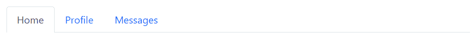
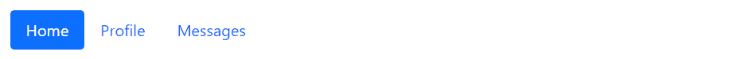

# Bootstrap 标签

> 原文：<https://www.tutorialrepublic.com/twitter-bootstrap-tutorial/bootstrap-tabs.php>

在本教程中，你将学习如何使用 Bootstrap 标签插件创建动态标签来切换内容。

## 使用 Bootstrap 创建选项卡

基于选项卡的导航提供了一种强大的机制，通过将内容分成不同的窗格，每个窗格一次只能查看一个，来处理小区域内的大量内容。

用户可以通过在窗格之间切换来快速访问内容，而无需离开页面。以下示例将向您展示如何使用 Bootstrap 选项卡组件创建基本选项卡。

#### 例子

[Try this code »](../codelab.php?topic=bootstrap&file=basic-tabs "Try this code using online Editor")

```
<ul class="nav nav-tabs">
    <li class="nav-item">
        <a href="#" class="nav-link active">Home</a>
    </li>
    <li class="nav-item">
        <a href="#" class="nav-link">Profile</a>
    </li>
    <li class="nav-item">
        <a href="#" class="nav-link">Messages</a>
    </li>
</ul>
```

—以上示例的输出类似于以下内容:

[](../codelab.php?topic=bootstrap&file=basic-tabs) 

标签插件也适用于药丸导航。要创建 pill nav，只需在选项卡标记中用`.nav-pills`替换类`.nav-tabs`，如下例所示:

#### 例子

[Try this code »](../codelab.php?topic=bootstrap&file=basic-pills "Try this code using online Editor")

```
<ul class="nav nav-pills">
    <li class="nav-item">
        <a href="#" class="nav-link active">Home</a>
    </li>
    <li class="nav-item">
        <a href="#" class="nav-link">Profile</a>
    </li>
    <li class="nav-item">
        <a href="#" class="nav-link">Messages</a>
    </li>
</ul>
```

—以上示例的输出类似于以下内容:

[](../codelab.php?topic=bootstrap&file=basic-pills) 

* * *

## 通过数据属性创建动态选项卡

您无需编写任何 JavaScript 代码就可以激活选项卡或药丸导航——只需在每个选项卡上指定`data-bs-toggle="tab"`,或在每个药丸上指定`data-bs-toggle="pill"`,并为每个选项卡创建一个具有唯一 ID 的`.tab-pane`,并将它们包装在`.tab-content`中。

让我们看一个例子来理解如何通过数据属性创建动态选项卡。

#### 例子

[Try this code »](../codelab.php?topic=bootstrap&file=create-dynamic-tabs-via-data-attributes "Try this code using online Editor")

```
<ul class="nav nav-tabs">
    <li class="nav-item">
        <a href="#home" class="nav-link active" data-bs-toggle="tab">Home</a>
    </li>
    <li class="nav-item">
        <a href="#profile" class="nav-link" data-bs-toggle="tab">Profile</a>
    </li>
    <li class="nav-item">
        <a href="#messages" class="nav-link" data-bs-toggle="tab">Messages</a>
    </li>
</ul>
<div class="tab-content">
    <div class="tab-pane fade show active" id="home">
        <p>Home tab content ...</p>
    </div>
    <div class="tab-pane fade" id="profile">
        <p>Profile tab content ...</p>
    </div>
    <div class="tab-pane fade" id="messages">
        <p>Messages tab content ...</p>
    </div>
</div>
```

 ***提示:**`.fade`类被添加到每个`.tab-pane`中，以使标签在显示新标签内容时淡入。此外，您必须将`.active`类添加到`.nav-link`中，并将`.show`和`.active`类添加到相应的`.tab-pane`中，以使其最初可见。*  ** * *

## 通过 JavaScript 创建动态标签

您也可以通过 JavaScript 启用选项卡。每个选项卡都需要单独激活。

#### 例子

jQuery JavaScript[Try this code »](../codelab.php?topic=bootstrap&file=create-dynamic-tabs-via-jquery "Try this code using online Editor")

```
<script>
$(document).ready(function(){
    $("#myTab a").click(function(e){
        e.preventDefault();
        $(this).tab("show");
    });
});
</script>
```

```
<script>
document.addEventListener("DOMContentLoaded", function(){
    var tabList = [].slice.call(document.querySelectorAll("#myTab a"));
    tabList.forEach(function(tab){
        var tabTrigger = new bootstrap.Tab(tab);

        tab.addEventListener("click", function(event){
            event.preventDefault();
            tabTrigger.show();
        });
    });
});
</script>
```

您可以通过多种方式激活单个选项卡。让我们看看下面的例子:

#### 例子

jQuery JavaScript[Try this code »](../codelab.php?topic=bootstrap&file=activate-individual-tabs-via-jquery "Try this code using online Editor")

```
$('#myTab a[href="#profile"]').tab("show"); // show tab targeted by the selector
$("#myTab a:first").tab("show"); // show first tab
$("#myTab a:last").tab("show"); // show last tab
$("#myTab li:eq(1) a").tab("show"); // show second tab (0-indexed, like an array)
```

```
// Show tab targeted by the selector
var profileTabElement = document.querySelector('#myTab a[href="#profile"]');
var profileTab = new bootstrap.Tab(profileTabElement);
profileTab.show();

// Show first tab
var firstTabElement = document.querySelector("#myTab li:first-child a");
var firstTab = new bootstrap.Tab(firstTabElement);
firstTab.show();

// Show last tab
var lastTabElement = document.querySelector("#myTab li:last-child a");
var lastTab = new bootstrap.Tab(lastTabElement);
lastTab.show();

// Show second tab (0-indexed, like an array);
var secondTabElement = document.querySelectorAll("#myTab li")[1].firstElementChild;
var secondTab = new bootstrap.Tab(secondTabElement);
secondTab.show();
```

* * *

## 方法

这是标准的 bootstrap 的 tab 方法:

## 显示

激活给定的选项卡并显示其关联的窗格。之前选择的任何其他选项卡将被取消选择，并且其关联的窗格将被隐藏。

#### 例子

jQuery JavaScript[Try this code »](../codelab.php?topic=bootstrap&file=show-tab-using-jquery "Try this code using online Editor")

```
<script>
$(document).ready(function(){
    $("#myTab a:last").tab("show"); // show last tab
});
</script>
```

```
<script>
document.addEventListener("DOMContentLoaded", function(){
    // Show last tab
    var lastTabElement = document.querySelector("#myTab li:last-child a");
    var lastTab = new bootstrap.Tab(lastTabElement);
    lastTab.show();
});
</script>
```

## 处理

该方法销毁元素的标签(即删除 DOM 元素上存储的数据)。

#### 例子

jQuery JavaScript[Try this code »](../codelab.php?topic=bootstrap&file=dispose-tab-using-jquery "Try this code using online Editor")

```
<script>
$(document).ready(function(){
    $("#myBtn").click(function(){
        var lastTab = bootstrap.Tab.getInstance($("#myTab a:last")[0]);
        console.log(lastTab);
        // {_element: a.nav-link}

        $("#myTab a:last").tab("dispose");
        console.log(lastTab);
        // {_element: null}
    });
});
</script>
```

```
<script>
document.addEventListener("DOMContentLoaded", function(){
    var btn = document.getElementById("myBtn");
    var element = document.querySelector("#myTab li:last-child a");

    btn.addEventListener("click", function(){
        var lastTab = bootstrap.Tab.getInstance(element);
        console.log(lastTab);
        // {_element: a.nav-link}

        lastTab.dispose();
        console.log(lastTab);
        // {_element: null}
    });
});
</script>
```

## getInstance

这是一个静态方法，允许您获取与 DOM 元素相关联的选项卡实例。

#### 例子

jQuery JavaScript[Try this code »](../codelab.php?topic=bootstrap&file=get-tab-instance-using-jquery "Try this code using online Editor")

```
<script>
$(document).ready(function(){
    // Get tab instance on button click
    $("#myBtn").click(function(){
        var lastTab = bootstrap.Tab.getInstance($("#myTab a:first")[0]);
        console.log(lastTab);
        // {_element: a.nav-link.active}
    });
});
</script>
```

```
<script>
document.addEventListener("DOMContentLoaded", function(){
    var btn = document.getElementById("myBtn");
    var element = document.querySelector("#myTab li:first-child a");

    // Get tab instance on button click
    btn.addEventListener("click", function(){
        var firstTab = bootstrap.Tab.getInstance(element);
        console.log(firstTab);
        // {_element: a.nav-link.active}
    });
});
</script>
```

## getOrCreateInstance

这是一个静态方法，允许您获取与 DOM 元素相关联的选项卡实例，或者在选项卡未初始化的情况下创建一个新的实例。

#### 例子

jQuery JavaScript[Try this code »](../codelab.php?topic=bootstrap&file=get-or-create-tab-instance-using-jquery "Try this code using online Editor")

```
<script>
$(document).ready(function(){
    // Get or create tab instance on button click
    $("#myBtn").click(function(){
        var lastTab = bootstrap.Tab.getOrCreateInstance($("#myTab a:first")[0]);
        console.log(lastTab);
        // {_element: a.nav-link.active}
    });
});
</script>
```

```
<script>
document.addEventListener("DOMContentLoaded", function(){
    var btn = document.getElementById("myBtn");
    var element = document.querySelector("#myTab li:first-child a");

    // Get or create tab instance on button click
    btn.addEventListener("click", function(){
        var firstTab = bootstrap.Tab.getOrCreateInstance(element);
        console.log(firstTab);
        // {_element: a.nav-link.active}
    });
});
</script>
```

* * *

## 事件

这些是增强选项卡功能的标准 Bootstrap 事件。

| 事件 | 描述 |
| --- | --- |
| show.bs.tab | 此事件在选项卡显示时触发，但在新选项卡显示之前。您可以使用`event.target`和`event.relatedTarget`分别定位活动标签和前一个活动标签(如果可用)。 |
| showed . bs . tab | 此事件在选项卡显示后的选项卡显示时触发。您可以使用`event.target`和`event.relatedTarget`分别定位活动标签和前一个活动标签(如果可用)。 |
| hide.bs.tab | 当要隐藏当前活动选项卡，从而显示新选项卡时，将触发此事件。您可以使用`event.target`和`event.relatedTarget`分别定位当前激活的选项卡和即将激活的新选项卡。 |
| hidden.bs.tab | 此事件在隐藏上一个活动选项卡并显示新选项卡后触发。您可以使用`event.target`和`event.relatedTarget`分别定位前一个活动标签和新的活动标签。 |

以下示例在选项卡转换完全完成时向用户显示活动选项卡和上一个选项卡的名称。

#### 例子

jQuery JavaScript[Try this code »](../codelab.php?topic=bootstrap&file=listening-to-tab-events-using-jquery "Try this code using online Editor")

```
<script>
$(document).ready(function(){
    $('a[data-bs-toggle="tab"]').on("shown.bs.tab", function(e){
        console.log(e.target); // newly activated tab
        console.log(e.relatedTarget); // previous active tab
    });
});
</script>
```

```
<script>
document.addEventListener("DOMContentLoaded", function(){
    var tabList = [].slice.call(document.querySelectorAll('a[data-bs-toggle="tab"]'));
    tabList.forEach(function(tab){
        tab.addEventListener("shown.bs.tab", function(e){
            console.log(e.target); // newly activated tab
            console.log(e.relatedTarget); // previous active tab
        });
    });
});
</script>
```*