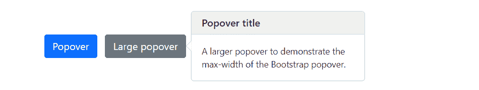

# Bootstrap 爆米花

> 原文：<https://www.tutorialrepublic.com/twitter-bootstrap-tutorial/bootstrap-popovers.php>

在本教程中，你将学习如何用 Bootstrap 创建 popovers。

## 使用 Bootstrap 创建 Popovers

Popover 是一个小的内容覆盖图，当用户点击它时，用来显示任何元素的次要信息，就像 iPad 上的那些内容一样。

### 步骤 1:添加弹出标签

要创建 popover，您需要向元素添加`data-bs-toggle="popover"`属性。然而，popover 的标题及其在触发或激活时显示的内容可以分别使用`title`和`data-bs-content`属性来指定。

下面是向按钮添加弹出窗口的标准标签。

<button type="button" data-bs-toggle="popover" title="Popover title" data-bs-content="Here's some amazing content.">Click to toggle popover</button>

类似地，您可以将弹出框添加到链接、图标等其他元素中。

 ***注意:**由于性能原因，popovers 数据 API 像[工具提示](bootstrap-tooltips.php)一样被选择，这意味着使用 popovers 你必须自己初始化它们。此外，标题和内容值为零的弹出窗口永远不会显示，在隐藏元素上触发弹出窗口也不会起作用。*  *### 步骤 2:启用弹出窗口

弹出式菜单可以通过 JavaScript 触发——只需用 JavaScript 代码中所需元素的`id`、`class`或任何 [CSS 选择器](../css-tutorial/css-selectors.php)调用`popover()` Bootstrap 方法。

您可以单独初始化 popoverss，也可以一次性初始化所有 popover。下面的示例代码将初始化页面上的所有弹出窗口，方法是通过它们的`data-bs-toggle`属性选择它们。

#### 例子

jQuery JavaScript[Try this code »](../codelab.php?topic=bootstrap&file=enable-popovers-via-jquery "Try this code using online Editor")

```html
<script>
$(document).ready(function(){
    $('[data-bs-toggle="popover"]').popover();  
});
</script>
```

```html
<script>
document.addEventListener("DOMContentLoaded", function(){
    var popoverTriggerList = [].slice.call(document.querySelectorAll('[data-bs-toggle="popover"]'));
    var popoverList = popoverTriggerList.map(function(element){
        return new bootstrap.Popover(element);
    });
});
</script>
```

—以上示例的输出类似于以下内容:

[](../codelab.php?topic=bootstrap&file=enable-popovers-via-jquery) 

* * *

## 设定波波弗的方向

您可以设置弹出窗口出现在元素的顶部、右侧、底部和左侧。

### 通过数据属性定位 Popovers

以下示例将向您展示如何通过数据属性设置弹出窗口的方向。

#### 例子

[Try this code »](../codelab.php?topic=bootstrap&file=popovers-placement-via-data-attributes "Try this code using online Editor")

```html
<button type="button" class="btn btn-secondary" data-bs-toggle="popover" data-bs-placement="top" title="Popover title" data-bs-content="Popover on top">Popover on top</button>
<button type="button" class="btn btn-secondary" data-bs-toggle="popover" data-bs-placement="right" title="Popover title" data-bs-content="Popover on right.">Popover on right</button>
<button type="button" class="btn btn-secondary" data-bs-toggle="popover" data-bs-placement="bottom" title="Popover title" data-bs-content="Popover on bottom.">Popover on bottom</button>
<button type="button" class="btn btn-secondary" data-bs-toggle="popover" data-bs-placement="left" title="Popover title" data-bs-content="Popover on left.">Popover on left</button>
```

### 通过 JavaScript 定位 Popovers

下面的例子将向你展示如何通过 JavaScript 设置弹出窗口的方向。

#### 例子

jQuery JavaScript[Try this code »](../codelab.php?topic=bootstrap&file=popovers-placement-via-jquery "Try this code using online Editor")

```html
<script>
$(document).ready(function(){
    $("#popTop").popover({placement : "top"});
    $("#popRight").popover({placement : "right"});
    $("#popBottom").popover({placement : "bottom"});
    $("#popLeft").popover({ placement : "left"});
});
</script>
```

```html
<script>
document.addEventListener("DOMContentLoaded", function(){
    // Placement of popover on top
    var popTop = document.getElementById("popTop");
    var popoverTop = new bootstrap.Popover(popTop, { 
        placement : "top" 
    });

    // Placement of popover on right
    var popRight = document.getElementById("popRight");
    var popoverRight = new bootstrap.Popover(popRight, { 
        placement : "right" 
    });

    // Placement of popover on bottom
    var popBottom = document.getElementById("popBottom");
    var popoverBottom = new bootstrap.Popover(popBottom, { 
        placement : "bottom" 
    });

    // Placement of popover on left
    var popLeft = document.getElementById("popLeft");
    var popoverLeft = new bootstrap.Popover(popLeft, { 
        placement : "left" 
    });
});
</script>
```

* * *

## 下次点击时隐藏弹出菜单

默认情况下，弹出窗口不会隐藏，直到您再次单击触发元素。当用户进行下一次点击时，您可以使用焦点触发器来隐藏弹出窗口。

#### 例子

[Try this code »](../codelab.php?topic=bootstrap&file=dismiss-popovers-on-next-click "Try this code using online Editor")

```html
<a href="#" class="btn btn-primary" tabindex="0" data-bs-toggle="popover" data-bs-trigger="focus" title="Popover title" data-bs-content="Here's some amazing content.">Dismissible popover</a>
```

 ***注意:**为了让这个特性在不同的浏览器上都能正常工作，你必须使用`[<a>](../html-reference/html-a-tag.php)`标签，而不是`[<button>](../html-reference/html-button-tag.php)`标签，并且你还必须包含一个`tabindex`属性。*  ** * *

## 选择

有一些选项可以传递给`popover()` Bootstrap 方法来定制 popover 插件的功能。

| 名字 | 类型 | 缺省值 | 描述 |
| --- | --- | --- | --- |
| 动画 | 布尔型 | 真实的 | 对弹出窗口应用 CSS 淡入淡出过渡。 |
| 容器 | 字符串&#124;元素&#124; false | 错误的 | 将弹出框追加到特定元素。指定`container: 'body'`以避免在更复杂的组件(如输入组、按钮组等)中出现渲染问题。) |
| 内容 | 字符串&#124;元素&#124;函数 | '' | 如果`data-bs-content`属性不存在，则设置默认内容值。 |
| 耽搁 | 数字&#124;对象 | Zero | 显示和隐藏弹出窗口的延迟时间(毫秒)—不适用于手动触发类型。如果提供了一个数字，延迟将应用于隐藏/显示对象结构是:`delay: { "show": 500, "hide": 100 }` |
| 超文本标签语言 | 布尔型 | 错误的 | 将 HTML 插入弹出窗口。如果使用`false`，`innerText`属性将内容插入到 DOM 中。如果你担心 XSS 的袭击，就用简单的文字。 |
| 安置 | 字符串&#124;函数 | 对吧 | 设置弹出窗口的位置—自动&#124;顶部&#124;底部&#124;左侧&#124;右侧。当`auto`值被指定时，它将动态地重新定向弹出窗口。 |
| 选择器 | 字符串&#124;假 | 错误的 | 如果提供了选择器，弹出对象将被附加到指定的目标。这通常用于将 popovers 应用于动态添加的 DOM 元素。 |
| 模板 | 线 | `'<div class="popover"><div class="popover-arrow"></div><h3 class="popover-header"></h3><div class="popover-body"></div></div>'` | 创建弹出窗口时使用的基本 HTML。弹出框的`title`将被插入到`.popover-header`元素中。弹出框的`content`将被插入到`.popover-body`元素中。元素将成为弹出者的箭头。最外面的包装元素应该有`.popover`类。 |
| 标题 | 字符串&#124;元素&#124;函数 | '' | 如果`title`属性不存在，则设置默认标题值。 |
| 引发 | 线 | 点击 | 指定如何触发 popover 单击&#124;悬停&#124;聚焦&#124;手动。您可以传递多个触发器；用空格隔开。值`manual`表示 popover 将通过`.show()`、`.hide()`和`.toggle()`方法以编程方式触发；该值不能与任何其他触发器结合使用。 |
| 后退移位 | 排列 | ['顶部'，'右侧'，'底部'，'左侧'] | 允许您指定回退时将使用哪个放置弹出器。 |
| 分界线 | 字符串&#124;元素 | 剪辑父母的 | 弹出器的溢出约束边界(仅适用于弹出器的`preventOverflow`修改器)。它还可以接受 HTMLElement 引用(仅通过 JavaScript)。 |
| 自定义类别 | 字符串&#124;函数 | '' | 当弹出窗口显示时，将类添加到弹出窗口。请注意，除了模板中指定的任何类之外，还将添加这些类。要添加多个类，请用空格分隔它们，如:`'class1 class2'`。您还可以传递一个函数，该函数应该返回包含附加类名的单个字符串。 |
| 使卫生 | 布尔型 | 真实的 | 启用或禁用清理。如果激活`'template'`，`'content'`和`'title'`选项将被清除。 |
| allowList | 目标 | [*默认值*](https://getbootstrap.com/docs/4.6/getting-started/javascript/#sanitizer) | 包含允许的属性和标签的对象。 |
| 圣人 fn | 空&#124;函数 | 空 | 允许您指定自己的清理功能。 |
| 抵消 | 数组&#124;字符串&#124;函数 | [0, 8] | popover 相对于其目标的偏移量。您还可以在数据属性中传递一个字符串，用逗号分隔值，如:`data-bs-offset="10,20"` |
| popperConfig | 空&#124;对象&#124;函数 | 空 | 允许您更改 Bootstrap 程序的默认弹出器配置，参见[弹出器的配置](https://popper.js.org/docs/v1/#Popper.Defaults)。 |

您可以通过使用数据属性或 JavaScript 来设置这些选项。对于通过数据属性设置弹出窗口选项，只需将选项名称和正确的值附加到`data-bs-`上，如`data-bs-animation="false"`、`data-bs-placement="top"`等。

此外，当通过数据属性传递选项时，确保将选项名称的案例类型从**骆驼案例**更改为**烤肉串案例**。比如不用`data-bs-customClass="my-class"`，用`data-bs-custom-class="my-class"`。

然而，JavaScript 是设置这些选项的首选方式，因为它可以避免重复工作。参见下面的[传递选项](#passing-options)部分，了解如何通过 JavaScript 为 popovers 设置选项。

* * *

## 方法

这些是标准的 Bootstrap 弹出方法:

## 传递选项

您还可以使用 options 对象将选项传递给弹出窗口。

如果所选元素中省略或缺少`title`属性的值，下面的示例将动态设置弹出窗口的标题文本:

#### 例子

jQuery JavaScript[Try this code »](../codelab.php?topic=bootstrap&file=set-title-text-for-popovers-using-jquery "Try this code using online Editor")

```html
<script>
$(document).ready(function(){
    $("#myPopover").popover({
        title : "Default popover title"
    });
});
</script>
```

```html
<script>
document.addEventListener("DOMContentLoaded", function(){
    var element = document.getElementById("myPopover");
    var tooltip = new bootstrap.Popover(element, {
        title : "Default popover title"
    });
});
</script>
```

以下示例将向您展示如何在 popover 中放置 HTML 内容:

#### 例子

jQuery JavaScript[Try this code »](../codelab.php?topic=bootstrap&file=place-html-inside-a-popover-using-jquery "Try this code using online Editor")

```html
<script>
$(document).ready(function(){
    $("#myPopover").popover({
        title: '<h4 class="custom-title"><i class="bi-info-circle-fill"></i> Popover info</h4>',
        content: '<p>This is a <em>simple example</em> demonstrating how to insert HTML code inside <strong>Bootstrap popover</strong>.</p>',
        html: true
    }); 
});
</script>
```

```html
<script>
document.addEventListener("DOMContentLoaded", function(){
    var element = document.getElementById("myPopover");
    var popover = new bootstrap.Popover(element, {
        title: '<h4 class="custom-title"><i class="bi-info-circle-fill"></i> Popover info</h4>',
        content: '<p>This is a <em>simple example</em> demonstrating how to insert HTML code inside <strong>Bootstrap popover</strong>.</p>',
        html: true
    });
});
</script>
```

下面的例子将向您展示如何通过 JavaScript 动态地使用弹出窗口的`delay`选项来控制显示和隐藏弹出窗口的时间。

#### 例子

jQuery JavaScript[Try this code »](../codelab.php?topic=bootstrap&file=set-popovers-show-hide-time-delay-using-jquery "Try this code using online Editor")

```html
<script>
$(document).ready(function(){
    // Show and hide popover with same speed
    $("#tinyPopover").popover({
        delay: 100
    });

    // Show and hide popover with different speed
    $("#largePopover").popover({
        delay: {show: 0, hide: 2000}
    }); 
});
</script>
```

```html
<script>
document.addEventListener("DOMContentLoaded", function(){
    var tinyTrigger = document.getElementById("tinyPopover");
    var largeTrigger = document.getElementById("largePopover");

    // Showing and hiding popover with same speed
    var tinyPopover = new bootstrap.Popover(tinyTrigger, {
        delay: 100
    });

    // Showing and hiding popover with different speed
    var largePopover = new bootstrap.Popover(largeTrigger, {
        delay: {show: 0, hide: 2000}
    });
});
</script>
```

下面的例子将向您展示如何为 Bootstrap popovers 创建您自己的定制模板，而不是通过 JavaScript 动态使用默认模板。

#### 例子

jQuery JavaScript[Try this code »](../codelab.php?topic=bootstrap&file=create-custom-template-for-popovers-using-jquery "Try this code using online Editor")

```html
<script>
$(document).ready(function(){
    $('[data-bs-toggle="popover"]').popover({
        template: '<div class="popover"><div class="popover-arrow"></div><h3 class="popover-header"></h3><div class="popover-body"></div><div class="popover-footer"><a class="btn btn-secondary btn-sm close">Close</a></div></div>'
    });

    // Close popover on button click
    $(document).on("click", ".popover .close" , function(){
        $(this).parents(".popover").popover("hide");
    });
});
</script>
```

```html
<script>
document.addEventListener("DOMContentLoaded", function(){
    var popoverTriggerList = [].slice.call(document.querySelectorAll('[data-bs-toggle="popover"]'));
    var popoverList = popoverTriggerList.map(function(element){
        return new bootstrap.Popover(element, {
            template: '<div class="popover"><div class="popover-arrow"></div><h3 class="popover-header"></h3><div class="popover-body"></div><div class="popover-footer"><a class="btn btn-secondary btn-sm close">Close</a></div></div>'
        });
    });
});

// Close popover on button click
document.addEventListener("click", function(e){
    if(e.target && e.target.classList.contains("close")){
        var popover = bootstrap.Popover.getInstance(e.target.closest(".popover"));
        popover.hide();
    }
});
</script>
```

以下示例将在`#wrapper`元素的末尾插入 popover 的动态生成的 HTML 代码，而不是默认的 [`<body>`](../html-reference/html-body-tag.php) 元素。

#### 例子

jQuery JavaScript[Try this code »](../codelab.php?topic=bootstrap&file=set-popovers-container-using-jquery "Try this code using online Editor")

```html
<script>
$(document).ready(function(){
    // Append popover HTML to wrapper element
    $("#myPopover").popover({
        container: "#wrapper"
    }); 
});
</script>
```

```html
<script>
document.addEventListener("DOMContentLoaded", function(){
    var element = document.getElementById("myPopover");

    // Append popover HTML to wrapper element
    var popover = new bootstrap.Popover(element, {
        container: "#wrapper"
    });
});
</script>
```

 ***注意:**覆盖弹出窗口的默认`container`选项值不会在页面上产生任何可见的差异。要查看实际结果，您需要检查 DOM。按 Ctrl+Shift+I (Windows / Linux)或 Cmd+Opt+I (Mac)打开开发人员工具或 DOM 检查器。*  *同样，您可以为弹出式菜单设置其他选项。让我们看看 Bootstrap popover 插件的其他方法。

## 显示

这个方法显示了一个元素的弹出窗口。这被认为是弹出器的“手动”触发。

#### 例子

jQuery JavaScript[Try this code »](../codelab.php?topic=bootstrap&file=calling-popover-methods-using-jquery "Try this code using online Editor")

```html
<script>
$(document).ready(function(){
    $("#myBtn").click(function(){
        $("#myPopover").popover("show");
    }); 
});
</script>
```

```html
<script>
document.addEventListener("DOMContentLoaded", function(){
    var btn = document.getElementById("myBtn");
    var element = document.getElementById("myPopover");

    // Create a popover instance
    var myPopover = new bootstrap.Popover(element);

    btn.addEventListener("click", function(){
        myPopover.show();
    });
});
</script>
```

## 隐藏

这个方法隐藏了一个元素的弹出窗口。这被认为是弹出器的“手动”触发。

#### 例子

jQuery JavaScript[Try this code »](../codelab.php?topic=bootstrap&file=calling-popover-methods-using-jquery "Try this code using online Editor")

```html
<script>
$(document).ready(function(){
    $("#myBtn").click(function(){
        $("#myPopover").popover("hide");
    }); 
});
</script>
```

```html
<script>
document.addEventListener("DOMContentLoaded", function(){
    var btn = document.getElementById("myBtn");
    var element = document.getElementById("myPopover");

    // Create a popover instance
    var myPopover = new bootstrap.Popover(element);

    btn.addEventListener("click", function(){
        myPopover.hide();
    });
});
</script>
```

## 触发器

此方法切换元素的弹出窗口。这被认为是弹出器的“手动”触发。

#### 例子

jQuery JavaScript[Try this code »](../codelab.php?topic=bootstrap&file=calling-popover-methods-using-jquery "Try this code using online Editor")

```html
<script>
$(document).ready(function(){
    $("#myBtn").click(function(){
        $("#myPopover").popover("toggle");
    }); 
});
</script>
```

```html
<script>
document.addEventListener("DOMContentLoaded", function(){
    var btn = document.getElementById("myBtn");
    var element = document.getElementById("myPopover");

    // Create a popover instance
    var myPopover = new bootstrap.Popover(element);

    btn.addEventListener("click", function(){
        myPopover.toggle();
    });
});
</script>
```

## 处理

这个方法隐藏并销毁一个元素的弹出窗口(即删除 DOM 元素上存储的数据)。

#### 例子

jQuery JavaScript[Try this code »](../codelab.php?topic=bootstrap&file=calling-popover-methods-using-jquery "Try this code using online Editor")

```html
<script>
$(document).ready(function(){
    $("#myBtn").click(function(){
        $("#myPopover").popover("dispose");
    }); 
});
</script>
```

```html
<script>
document.addEventListener("DOMContentLoaded", function(){
    var btn = document.getElementById("myBtn");
    var element = document.getElementById("myPopover");

    // Create a popover instance
    var myPopover = new bootstrap.Popover(element);

    btn.addEventListener("click", function(){
        myPopover.dispose();
    });
});
</script>
```

## 使能够

这个方法使元素的弹出窗口能够被显示。默认情况下，弹出窗口是启用的。

#### 例子

jQuery JavaScript[Try this code »](../codelab.php?topic=bootstrap&file=calling-popover-methods-using-jquery "Try this code using online Editor")

```html
<script>
$(document).ready(function(){
    $("#myBtn").click(function(){
        $("#myPopover").popover("enable");
    }); 
});
</script>
```

```html
<script>
document.addEventListener("DOMContentLoaded", function(){
    var btn = document.getElementById("myBtn");
    var element = document.getElementById("myPopover");

    // Create a popover instance
    var myPopover = new bootstrap.Popover(element);

    btn.addEventListener("click", function(){
        myPopover.enable();
    });
});
</script>
```

## 使残废

该方法取消了显示元素弹出窗口的能力。弹出窗口只有在重新启用后才能显示。

#### 例子

jQuery JavaScript[Try this code »](../codelab.php?topic=bootstrap&file=calling-popover-methods-using-jquery "Try this code using online Editor")

```html
<script>
$(document).ready(function(){
    $("#myBtn").click(function(){
        $("#myPopover").popover("disable");
    }); 
});
</script>
```

```html
<script>
document.addEventListener("DOMContentLoaded", function(){
    var btn = document.getElementById("myBtn");
    var element = document.getElementById("myPopover");

    // Create a popover instance
    var myPopover = new bootstrap.Popover(element);

    btn.addEventListener("click", function(){
        myPopover.disable();
    });
});
</script>
```

## toggleEnabled

此方法切换显示或隐藏元素弹出窗口的能力。

#### 例子

jQuery JavaScript[Try this code »](../codelab.php?topic=bootstrap&file=calling-popover-methods-using-jquery "Try this code using online Editor")

```html
<script>
$(document).ready(function(){
    $("#myBtn").click(function(){
        $("#myPopover").popover("toggleEnabled");
    }); 
});
</script>
```

```html
<script>
document.addEventListener("DOMContentLoaded", function(){
    var btn = document.getElementById("myBtn");
    var element = document.getElementById("myPopover");

    // Create a popover instance
    var myPopover = new bootstrap.Popover(element);

    btn.addEventListener("click", function(){
        myPopover.toggleEnabled();
    });
});
</script>
```

## 更新

此方法更新元素弹出窗口的位置。

#### 例子

jQuery JavaScript[Try this code »](../codelab.php?topic=bootstrap&file=calling-popover-methods-using-jquery "Try this code using online Editor")

```html
<script>
$(document).ready(function(){
    $("#myBtn").click(function(){
        $("#myPopover").popover("update");
    }); 
});
</script>
```

```html
<script>
document.addEventListener("DOMContentLoaded", function(){
    var btn = document.getElementById("myBtn");
    var element = document.getElementById("myPopover");

    // Create a popover instance
    var myPopover = new bootstrap.Popover(element);

    btn.addEventListener("click", function(){
        myPopover.update();
    });
});
</script>
```

## getInstance

这是一个静态方法，允许您获取与 DOM 元素相关联的 popover 实例。

#### 例子

jQuery JavaScript[Try this code »](../codelab.php?topic=bootstrap&file=get-popover-instance-using-jquery "Try this code using online Editor")

```html
<script>
$(document).ready(function(){
    // Trigger the popover
    $("#myPopover").popover();

    // Get popover instance on button click
    $("#myBtn").click(function(){      	
        var myPopover = bootstrap.Popover.getInstance($("#myPopover")[0]);
        console.log(myPopover);
        // {_element: button#myPopover.btn.btn-primary.btn-lg, _isEnabled: true, _timeout: 0, _hoverState: null, _activeTrigger: {…}, …}
    });
});
</script>
```

```html
<script>
document.addEventListener("DOMContentLoaded", function(){
    var btn = document.getElementById("myBtn");
    var element = document.getElementById("myPopover");

    // Trigger the popover
    var myPopover = new bootstrap.Popover(element);

    // Get popover instance on button click
    btn.addEventListener("click", function(){        
        var popover = bootstrap.Popover.getInstance(element);
        console.log(popover);
        // {_element: button#myPopover.btn.btn-primary.btn-lg, _isEnabled: true, _timeout: 0, _hoverState: null, _activeTrigger: {…}, …}
    });
});
</script>
```

## getOrCreateInstance

这是一个静态方法，允许您获取与 DOM 元素相关联的 popover 实例，或者在 popover 没有初始化的情况下创建一个新的实例。

#### 例子

jQuery JavaScript[Try this code »](../codelab.php?topic=bootstrap&file=get-or-create-popover-instance-using-jquery "Try this code using online Editor")

```html
<script>
$(document).ready(function(){
    // Get or create popover instance on button click
    $("#myBtn").click(function(){
        var myPopover = bootstrap.Popover.getOrCreateInstance($("#myPopover")[0]);
        console.log(myPopover);
        // {_element: button#myPopover.btn.btn-primary.btn-lg, _isEnabled: true, _timeout: 0, _hoverState: "", _activeTrigger: {…}, …}
    });
});
</script>
```

```html
<script>
document.addEventListener("DOMContentLoaded", function(){
    var btn = document.getElementById("myBtn");
    var element = document.getElementById("myPopover");

    // Get or create popover instance on button click
    btn.addEventListener("click", function(){        
        var popover = bootstrap.Popover.getOrCreateInstance(element);
        console.log(popover);
        // {_element: button#myPopover.btn.btn-primary.btn-lg, _isEnabled: true, _timeout: 0, _hoverState: "", _activeTrigger: {…}, …}
    });
});
</script>
```

* * *

## 事件

Bootstrap 的 popover 类包含一些用于挂钩 popover 功能的事件。

| 事件 | 描述 |
| --- | --- |
| show.bs.popover | 当调用 show instance 方法时，此事件将立即激发。 |
| showed . bs . popover | 当弹出窗口对用户可见时，将触发此事件。它将等到 CSS 转换过程完全完成后才会被触发。 |
| hide.bs.popover | 当 hide 实例方法被调用时，此事件立即被激发。 |
| hidden.bs.popover | 当 popover 对用户隐藏完毕时，将触发此事件。它将等到 CSS 转换过程完全完成后才会被触发。 |
| inserted.bs.popover | 当 popover 模板被添加到 DOM 中时，这个事件在`show.bs.popover`事件之后被触发。 |

当弹出窗口的淡出过渡完全完成时，下面的示例将向用户显示一条警告消息。

#### 例子

jQuery JavaScript[Try this code »](../codelab.php?topic=bootstrap&file=listening-to-popover-events-using-jquery "Try this code using online Editor")

```html
<script>
$(document).ready(function(){
    // Initialize popover
    $("#myPopover").popover();

    // Show alert when the popover has finished being hidden 
    $("#myPopover").on("hidden.bs.popover", function(){
        alert("Popover has been completely closed.");
    });
});
</script>
```

```html
<script>
document.addEventListener("DOMContentLoaded", function(){
    var myPopover = document.getElementById("myPopover");

    // Initialize popover
    var popover = new bootstrap.Popover(myPopover); 

    // Show alert when the popover has finished being hidden 
    myPopover.addEventListener("hidden.bs.popover", function(){
        alert("Popover has been completely closed.");
    });                           
});
</script>
```***