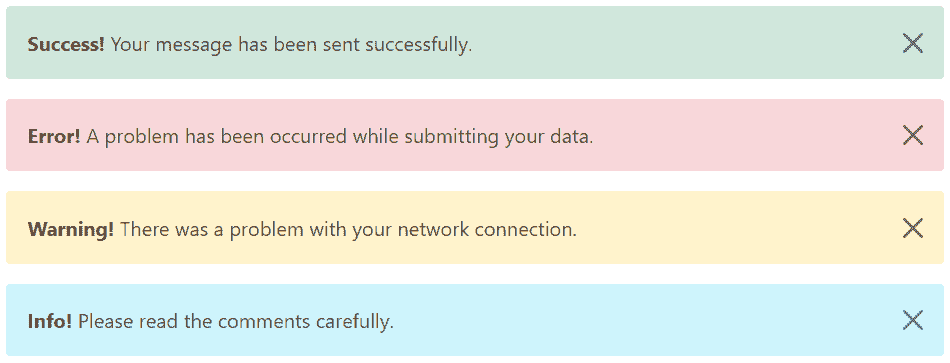
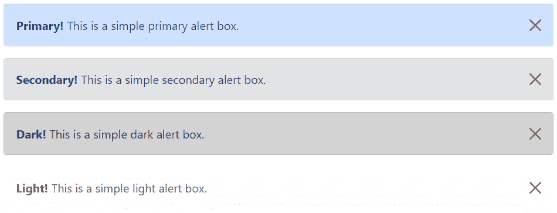
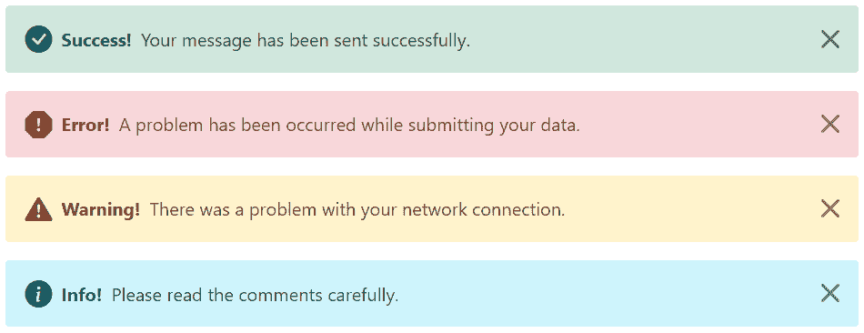
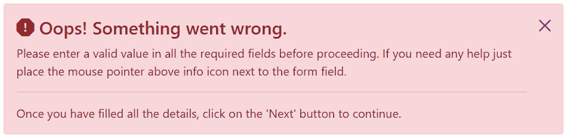
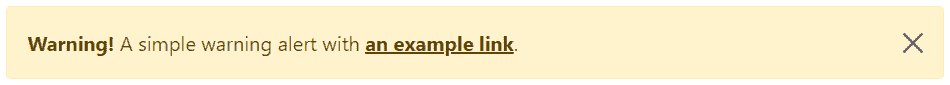

# Bootstrap 警报

> 原文：<https://www.tutorialrepublic.com/twitter-bootstrap-tutorial/bootstrap-alerts.php>

在本教程中，您将学习如何使用 Bootstrap 创建警报消息。

## 使用 Bootstrap 创建警报消息

警告框经常用于突出需要终端用户立即注意的信息，例如警告、错误或确认消息。

使用 Bootstrap，您可以通过添加上下文类(例如，`.alert-success`、`.alert-warning`、`.alert-info`等)轻松创建各种用途的优雅警报消息。)到`.alert`基类。您还可以添加一个可选的关闭按钮来消除任何警报。

Bootstrap 总共提供 8 种不同类型的警报。以下示例将向您展示最常用的警报，它们是:成功、错误或危险、警告和信息警报。

#### 例子

[Try this code »](../codelab.php?topic=bootstrap&file=common-alert-messages "Try this code using online Editor")

```html
<!-- Success Alert -->
<div class="alert alert-success alert-dismissible fade show">
    <strong>Success!</strong> Your message has been sent successfully.
    <button type="button" class="btn-close" data-bs-dismiss="alert"></button>
</div>

<!-- Error Alert -->
<div class="alert alert-danger alert-dismissible fade show">
    <strong>Error!</strong> A problem has been occurred while submitting your data.
    <button type="button" class="btn-close" data-bs-dismiss="alert"></button>
</div>

<!-- Warning Alert -->
<div class="alert alert-warning alert-dismissible fade show">
    <strong>Warning!</strong> There was a problem with your network connection.
    <button type="button" class="btn-close" data-bs-dismiss="alert"></button>
</div>

<!-- Info Alert -->
<div class="alert alert-info alert-dismissible fade show">
    <strong>Info!</strong> Please read the comments carefully.
    <button type="button" class="btn-close" data-bs-dismiss="alert"></button>
</div>
```

—以上示例的输出类似于以下内容:

[](../codelab.php?topic=bootstrap&file=common-alert-messages) 

以下是剩余的四个 Bootstrap 警报，可用于各种目的。

#### 例子

[Try this code »](../codelab.php?topic=bootstrap&file=new-alert-boxes "Try this code using online Editor")

```html
<!-- Primary Alert -->
<div class="alert alert-primary alert-dismissible fade show">
    <strong>Primary!</strong> This is a simple primary alert box.
    <button type="button" class="btn-close" data-bs-dismiss="alert"></button>
</div>

<!-- Secondary Alert -->
<div class="alert alert-secondary alert-dismissible fade show">
    <strong>Secondary!</strong> This is a simple secondary alert box.
    <button type="button" class="btn-close" data-bs-dismiss="alert"></button>
</div>

<!-- Dark Alert -->
<div class="alert alert-dark alert-dismissible fade show">
    <strong>Dark!</strong> This is a simple dark alert box.
    <button type="button" class="btn-close" data-bs-dismiss="alert"></button>
</div>

<!-- Light Alert -->
<div class="alert alert-light alert-dismissible fade show">
    <strong>Light!</strong> This is a simple light alert box.
    <button type="button" class="btn-close" data-bs-dismiss="alert"></button>
</div>
```

—以上示例的输出类似于以下内容:

[](../codelab.php?topic=bootstrap&file=new-alert-boxes)  ***提示:**`.alert`元素上的`.fade`和`.show`类在关闭警告框时启用渐变过渡效果。如果你不想动画只是删除这些类。此外，在`.alert`元件上需要类别`.alert-dismissible`用于`.btn-close`的正确定位。如果您的提醒没有关闭按钮，您可以跳过此课程。*  ** * *

## 向 Bootstrap 警报添加图标

您也可以在 Bootstrap 警报中放置图标。你可以使用[Bootstrap 图标](bootstrap-icons.php)或者像字体 Awesome 这样的第三方图标。让我们看看下面的例子:

#### 例子

[Try this code »](../codelab.php?topic=bootstrap&file=alert-with-icons "Try this code using online Editor") 

```html
<!-- Success Alert -->
<div class="alert alert-success alert-dismissible d-flex align-items-center fade show">
    <i class="bi-check-circle-fill"></i>
    <strong class="mx-2">Success!</strong> Your message has been sent successfully.
    <button type="button" class="btn-close" data-bs-dismiss="alert"></button>
</div>

<!-- Error Alert -->
<div class="alert alert-danger alert-dismissible d-flex align-items-center fade show">
    <i class="bi-exclamation-octagon-fill"></i>
    <strong class="mx-2">Error!</strong> A problem has been occurred while submitting your data.
    <button type="button" class="btn-close" data-bs-dismiss="alert"></button>
</div>

<!-- Warning Alert -->
<div class="alert alert-warning alert-dismissible d-flex align-items-center fade show">
    <i class="bi-exclamation-triangle-fill"></i>
    <strong class="mx-2">Warning!</strong> There was a problem with your network connection.
    <button type="button" class="btn-close" data-bs-dismiss="alert"></button>
</div>

<!-- Info Alert -->
<div class="alert alert-info alert-dismissible d-flex align-items-center fade show">
    <i class="bi-info-circle-fill"></i>
    <strong class="mx-2">Info!</strong> Please read the comments carefully.
    <button type="button" class="btn-close" data-bs-dismiss="alert"></button>
</div>
```*  *—上述示例的输出类似于以下内容:

[](../codelab.php?topic=bootstrap&file=alert-with-icons) 

* * *

## 警报中的附加内容

您还可以在警报中放置额外的 HTML 元素，如标题、段落和分隔线。要管理元素之间的间距，您可以使用边距实用程序类，如下所示:

#### 例子

[Try this code »](../codelab.php?topic=bootstrap&file=alert-with-additional-content "Try this code using online Editor")

```html
<div class="alert alert-danger alert-dismissible fade show">
    <h4 class="alert-heading"><i class="bi-exclamation-octagon-fill"></i> Oops! Something went wrong.</h4>
    <p>Please enter a valid value in all the required fields before proceeding. If you need any help just place the mouse pointer above info icon next to the form field.</p>
    <hr>
    <p class="mb-0">Once you have filled all the details, click on the 'Next' button to continue.</p>
    <button type="button" class="btn-close" data-bs-dismiss="alert"></button>
</div>
```

—以上示例的输出类似于以下内容:

[](../codelab.php?topic=bootstrap&file=alert-with-additional-content) 

* * *

## 匹配通知中的链接颜色

您可以将实用程序类`.alert-link`应用于任何警告框内的链接，以快速创建匹配的彩色链接，如下例所示:

#### 例子

[Try this code »](../codelab.php?topic=bootstrap&file=alert-links "Try this code using online Editor")

```html
<div class="alert alert-warning alert-dismissible fade show">
    <strong>Warning!</strong> A simple warning alert with <a href="#" class="alert-link">an example link</a>.
    <button type="button" class="btn-close" data-bs-dismiss="alert"></button>
</div>
```

—以上示例的输出类似于以下内容:

[](../codelab.php?topic=bootstrap&file=alert-links) 

同样，您可以匹配其他警告框中的链接。让我们试试下面的例子:

#### 例子

[Try this code »](../codelab.php?topic=bootstrap&file=matching-links-inside-different-alerts "Try this code using online Editor") 

```html
<!-- Success Alert -->
<div class="alert alert-success alert-dismissible fade show">
    <strong>Success!</strong> A simple success alert with <a href="#" class="alert-link">an example link</a>.
    <button type="button" class="btn-close" data-bs-dismiss="alert"></button>
</div>

<!-- Error Alert -->
<div class="alert alert-danger alert-dismissible fade show">
    <strong>Error!</strong> A simple danger alert with <a href="#" class="alert-link">an example link</a>.
    <button type="button" class="btn-close" data-bs-dismiss="alert"></button>
</div>

<!-- Warning Alert -->
<div class="alert alert-warning alert-dismissible fade show">
    <strong>Warning!</strong> A simple warning alert with <a href="#" class="alert-link">an example link</a>.
    <button type="button" class="btn-close" data-bs-dismiss="alert"></button>
</div>

<!-- Info Alert -->
<div class="alert alert-info alert-dismissible fade show">
    <strong>Info!</strong> A simple info alert with <a href="#" class="alert-link">an example link</a>.
    <button type="button" class="btn-close" data-bs-dismiss="alert"></button>
</div>

<!-- Primary Alert -->
<div class="alert alert-primary alert-dismissible fade show">
    <strong>Primary!</strong> A simple primary alert with <a href="#" class="alert-link">an example link</a>.
    <button type="button" class="btn-close" data-bs-dismiss="alert"></button>
</div>

<!-- Secondary Alert -->
<div class="alert alert-secondary alert-dismissible fade show">
    <strong>Secondary!</strong> A simple secondary alert with <a href="#" class="alert-link">an example link</a>.
    <button type="button" class="btn-close" data-bs-dismiss="alert"></button>
</div>

<!-- Dark Alert -->
<div class="alert alert-dark alert-dismissible fade show">
    <strong>Dark!</strong> A simple dark alert with <a href="#" class="alert-link">an example link</a>.
    <button type="button" class="btn-close" data-bs-dismiss="alert"></button>
</div>

<!-- Light Alert -->
<div class="alert alert-light alert-dismissible fade show">
    <strong>Light!</strong> A simple light alert with <a href="#" class="alert-link">an example link</a>.
    <button type="button" class="btn-close" data-bs-dismiss="alert"></button>
</div>
```*  ** * *

## 通过数据属性关闭警报

数据属性提供了一种简单易行的方法来为警告框添加关闭功能。

只需将`data-bs-dismiss="alert"`添加到关闭按钮，它将自动启用包含警告消息框的解除。此外，将类`.alert-dismissible`添加到`.alert`元素中，以便正确定位`.btn-close`按钮。

#### 例子

[Try this code »](../codelab.php?topic=bootstrap&file=dismissal-of-alerts-via-data-attributes "Try this code using online Editor")

```html
<div class="alert alert-info alert-dismissible fade show">
    <strong>Note!</strong> This is a simple example of dismissible alert.
    <button type="button" class="btn-close" data-bs-dismiss="alert"></button>
</div>
```

使用 [`<button>`](/html-reference/html-button-tag.php) 元素创建关闭按钮，使所有设备的行为一致。

* * *

## 通过 JavaScript 关闭提醒

您也可以通过 JavaScript 解除警报。让我们尝试一个例子，看看它是如何工作的:

#### 例子

jQuery JavaScript[Try this code »](../codelab.php?topic=bootstrap&file=dismissal-of-alerts-via-jquery "Try this code using online Editor")

```html
<script>
$(document).ready(function(){
    $("#myBtn").click(function(){
        $("#myAlert").alert("close");
    });
});
</script>
```

```html
<script>
document.addEventListener("DOMContentLoaded", function(){
    var btn = document.getElementById("myBtn");
    var element = document.getElementById("myAlert");

    // Create alert instance
    var myAlert = new bootstrap.Alert(element);

    btn.addEventListener("click", function(){
        myAlert.close();
    });
});
</script>
```

* * *

## 方法

以下是标准的 Bootstrap 数据库警报方法:

## 关闭

该方法通过从 DOM 中移除警报来关闭警报。如果`.fade`和`.show`类出现在元素上，警告将在移除之前淡出。

#### 例子

jQuery JavaScript[Try this code »](../codelab.php?topic=bootstrap&file=close-alerts-using-javascript "Try this code using online Editor")

```html
<script>
$(document).ready(function(){
    $("#myBtn").click(function(){
        $("#myAlert").alert("close");
    });
});
</script>
```

```html
<script>
document.addEventListener("DOMContentLoaded", function(){
    var btn = document.getElementById("myBtn");
    var element = document.getElementById("myAlert");

    // Create alert instance
    var myAlert = new bootstrap.Alert(element);

    btn.addEventListener("click", function(){
        myAlert.close();
    });
});
</script>
```

## 处理

该方法破坏元素的警告(即删除 DOM 元素上存储的数据)。

#### 例子

jQuery JavaScript[Try this code »](../codelab.php?topic=bootstrap&file=dispose-alerts-using-jquery "Try this code using online Editor")

```html
<script>
$(document).ready(function(){
    $("#myBtn").click(function(){
        $("#myAlert").alert("dispose");
    });
});
</script>
```

```html
<script>
document.addEventListener("DOMContentLoaded", function(){
    var btn = document.getElementById("myBtn");
    var element = document.getElementById("myAlert");

    // Create alert instance
    var myAlert = new bootstrap.Alert(element);

    btn.addEventListener("click", function(){
        myAlert.dispose();
    });
});
</script>
```

## getInstance

这是一个静态方法，允许您获取与 DOM 元素相关联的 alert 实例。

#### 例子

jQuery JavaScript[Try this code »](../codelab.php?topic=bootstrap&file=get-alert-instance-using-jquery "Try this code using online Editor")

```html
<script>
$(document).ready(function(){
    // Create alert instance
    $("#myAlert").alert();

    // Get alert instance on button click
    $("#myBtn").click(function(){
        var myAlert = bootstrap.Alert.getInstance($("#myAlert")[0]);
        console.log(myAlert);
        // {_element: div#myAlert.alert.alert-info.alert-dismissible.fade.show}
    });
});
</script>
```

```html
<script>
document.addEventListener("DOMContentLoaded", function(){
    var btn = document.getElementById("myBtn");
    var element = document.getElementById("myAlert");

    // Create alert instance
    var myAlert = new bootstrap.Alert(element);

    // Get tooltip instance on button click
    btn.addEventListener("click", function(){
        var alert = bootstrap.Alert.getInstance(element);
        console.log(alert);
        // {_element: div#myAlert.alert.alert-info.alert-dismissible.fade.show}
    });
});
</script>
```

## getOrCreateInstance

这是一个静态方法，允许您获取与 DOM 元素相关联的 alert 实例，或者在 alert 没有初始化的情况下创建一个新实例。

#### 例子

jQuery JavaScript[Try this code »](../codelab.php?topic=bootstrap&file=get-or-create-alert-instance-using-jquery "Try this code using online Editor")

```html
<script>
$(document).ready(function(){
    $("#myBtn").click(function(){
        var myAlert = bootstrap.Alert.getOrCreateInstance($("#myAlert")[0]);
        console.log(myAlert);
        // {_element: div#myAlert.alert.alert-info.alert-dismissible.fade.show}
    });
});
</script>
```

```html
<script>
document.addEventListener("DOMContentLoaded", function(){
    var btn = document.getElementById("myBtn");
    var element = document.getElementById("myAlert");

    btn.addEventListener("click", function(){
        var myAlert = bootstrap.Alert.getOrCreateInstance(element);
        console.log(myAlert);
        // {_element: div#myAlert.alert.alert-info.alert-dismissible.fade.show}
    });
});
</script>
```

* * *

## 事件

Bootstrap 的 alert 类包括几个用于挂钩警报功能的事件。

| 事件 | 描述 |
| --- | --- |
| 关闭. bs.alert | 当调用`close`实例方法时，该事件立即触发。 |
| 关闭. bs.alert | 当警报关闭且 CSS 转换完成时，将触发此事件。 |

下面的示例在警报消息框的淡出过渡完全完成时向用户显示一条警报消息。

#### 例子

jQuery JavaScript[Try this code »](../codelab.php?topic=bootstrap&file=listening-to-alert-events-using-jquery "Try this code using online Editor")

```html
<script>
$(document).ready(function(){
    $("#myAlert").on("closed.bs.alert", function(){
        alert("Alert message box has been closed.");
    });
});
</script>
```

```html
<script>
document.addEventListener("DOMContentLoaded", function(){
    var myAlert = document.getElementById("myAlert");

    myAlert.addEventListener("closed.bs.alert", function(){
        alert("Alert message box has been closed.");
    });
});
</script>
```***