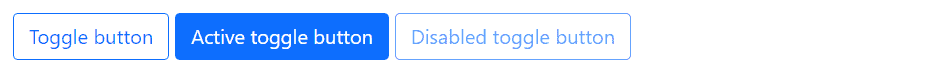
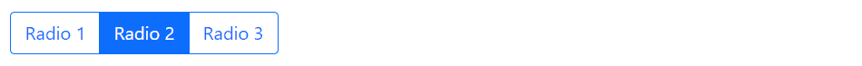

# Bootstrap 状态按钮

> 原文：<https://www.tutorialrepublic.com/twitter-bootstrap-tutorial/bootstrap-stateful-buttons.php>

在本教程中，你将学习如何用 Bootstrap 创建切换按钮。

## 控制按钮状态

在上一节中，你已经学习了[Bootstrap 按钮样式和修改](bootstrap-buttons.php)以及如何创建[按钮组和工具栏](bootstrap-button-groups.php)。使用 Bootstrap，你可以对按钮做更多的事情，比如控制按钮的状态，使复选框和单选按钮的行为像切换按钮，等等。在下一节中，我们将详细讨论它们。

## 创建单个切换按钮

只需添加数据属性`data-bs-toggle="button"`，即可激活单个按钮上的切换(即将按钮的正常状态变为按下状态，反之亦然)。

如果您正在预先切换一个按钮，您必须手动添加`.active`类。

#### 例子

[Try this code »](../codelab.php?topic=bootstrap&file=single-toggle-button "Try this code using online Editor")

```html
<button type="button" class="btn btn-outline-primary" data-bs-toggle="button" autocomplete="off">Toggle button</button>
<button type="button" class="btn btn-outline-primary active" data-bs-toggle="button" autocomplete="off">Active toggle button</button>
<button type="button" class="btn btn-outline-primary" data-bs-toggle="button" autocomplete="off" disabled>Disabled toggle button</button>
```

—单击时的切换按钮看起来会像这样:

[](../codelab.php?topic=bootstrap&file=single-toggle-button)  ***注意:**Mozilla Firefox 浏览器跨页面加载保持按钮状态，为了防止这种行为，您可以简单地在包含按钮的表单上设置属性`autocomplete="off"`，或者直接设置输入或按钮元素的属性。*  ** * *

## 创建复选框按钮组

您还可以组合复选框来创建按钮组上的复选框样式切换。让我们尝试下面的例子来理解它的基本工作原理:

#### 例子

[Try this code »](../codelab.php?topic=bootstrap&file=checkbox-button-groups "Try this code using online Editor")

```html
<div class="btn-group">
    <input type="checkbox" class="btn-check" name="options" id="check1" autocomplete="off" checked>
    <label class="btn btn-outline-primary" for="check1">Checkbox 1</label>

    <input type="checkbox" class="btn-check" name="options" id="check2" autocomplete="off">
    <label class="btn btn-outline-primary" for="check2">Checkbox 2</label>

    <input type="checkbox" class="btn-check" name="options" id="check3" autocomplete="off" checked>
    <label class="btn btn-outline-primary" for="check3">Checkbox 3</label>
</div>
```

—以上示例的输出类似于以下内容:

[](../codelab.php?topic=bootstrap&file=checkbox-button-groups)  ***注意:**不要使用`.active`类来预选按钮组中的复选框或单选按钮，因为它只会改变视觉外观，使它们看起来像被选中了一样。要实际预选它们，您需要自己在输入元素上应用`checked`属性。*  ** * *

## 创建单选按钮组

类似地，您可以在按钮组上创建单选按钮样式，如下所示:

#### 例子

[Try this code »](../codelab.php?topic=bootstrap&file=radio-button-groups "Try this code using online Editor")

```html
<div class="btn-group">
    <input type="radio" class="btn-check" name="options" id="radio1" autocomplete="off">
    <label class="btn btn-outline-primary" for="radio1">Radio 1</label>

    <input type="radio" class="btn-check" name="options" id="radio2" autocomplete="off" checked>
    <label class="btn btn-outline-primary" for="radio2">Radio 2</label>

    <input type="radio" class="btn-check" name="options" id="radio3" autocomplete="off">
    <label class="btn btn-outline-primary" for="radio3">Radio 3</label>
</div>
```

—以上示例的输出类似于以下内容:

[](../codelab.php?topic=bootstrap&file=radio-button-groups) 

* * *

## 方法

以下是标准的 bootstrap 按钮方法:

## 触发器

此方法切换按钮的按下状态。它改变了按钮的外观，使它看起来像是被激活了。您也可以通过简单地使用`data-bs-toggle="button"`属性来启用按钮的自动切换。让我们看看下面的例子:

#### 例子

jQuery JavaScript[Try this code »](../codelab.php?topic=bootstrap&file=toggle-button-state-using-jquery "Try this code using online Editor")

```html
<script>
$(document).ready(function(){
    $(".btn").click(function(){
        $(this).button("toggle");
    });
});
</script>
```

```html
<script>
document.addEventListener("DOMContentLoaded", function(){
    var buttons = document.querySelectorAll(".btn");

    buttons.forEach(function(button){
        button.addEventListener("click", function(e){
            var btn = new bootstrap.Button(e.target);
            btn.toggle();
        });
    });
});
</script>
```

## 处理

这个方法销毁一个元素的按钮(即删除 DOM 元素上存储的数据)。

#### 例子

jQuery JavaScript[Try this code »](../codelab.php?topic=bootstrap&file=dispose-buttons-using-jquery "Try this code using online Editor")

```html
<script>
$(document).ready(function(){
    $("#disposeBtn").click(function(){
        var myButton = bootstrap.Button.getInstance($("#myButton")[0]);
        console.log(myButton);
        // {_element: button#myButton.btn.btn-outline-primary.active}

        myButton.dispose();
        console.log(myButton);
        // {_element: null}
    });
});
</script>
```

```html
<script>
document.addEventListener("DOMContentLoaded", function(){
    var disposeBtn = document.getElementById("disposeBtn");
    var myButton = document.getElementById("myButton");

    disposeBtn.addEventListener("click", function(){
        var bsButton = bootstrap.Button.getInstance(myButton);
        console.log(bsButton);
        // {_element: button#myButton.btn.btn-outline-primary.active}

        bsButton.dispose();
        console.log(bsButton);
        // {_element: null}
    });
});
</script>
```

## getInstance

这是一个静态方法，它允许您获取与 DOM 元素相关联的按钮实例。

#### 例子

jQuery JavaScript[Try this code »](../codelab.php?topic=bootstrap&file=get-button-instance-using-jquery "Try this code using online Editor")

```html
<script>
$(document).ready(function(){
    $("#getBtn").click(function(){
        var myButton = bootstrap.Button.getInstance($("#myButton")[0]);
        console.log(myButton);
        // {_element: button#myButton.btn.btn-outline-primary.active}
    });
});
</script>
```

```html
<script>
document.addEventListener("DOMContentLoaded", function() {
    var getBtn = document.getElementById("getBtn");
    var myButton = document.getElementById("myButton");

    getBtn.addEventListener("click", function(){
        var bsButton = bootstrap.Button.getInstance(myButton);
        console.log(bsButton);
        // {_element: button#myButton.btn.btn-outline-primary.active}
    });
});
</script>
```

## getOrCreateInstance

这是一个静态方法，它允许您获取与 DOM 元素相关联的按钮实例，或者在按钮没有初始化的情况下创建一个新的按钮实例。

#### 例子

jQuery JavaScript[Try this code »](../codelab.php?topic=bootstrap&file=get-or-create-button-instance-using-jquery "Try this code using online Editor")

```html
<script>
$(document).ready(function(){
    $("#getBtn").click(function(){
        var myButton = bootstrap.Button.getOrCreateInstance($("#myButton")[0]);
        console.log(myButton);
    });
});
</script>
```

```html
<script>
document.addEventListener("DOMContentLoaded", function() {
    var myBtn = document.getElementById("getBtn");
    var myButton = document.getElementById("myButton");

    getBtn.addEventListener("click", function(){
        var bsButton = bootstrap.Button.getOrCreateInstance(myButton);
        console.log(bsButton);
    });
});
</script>
```

