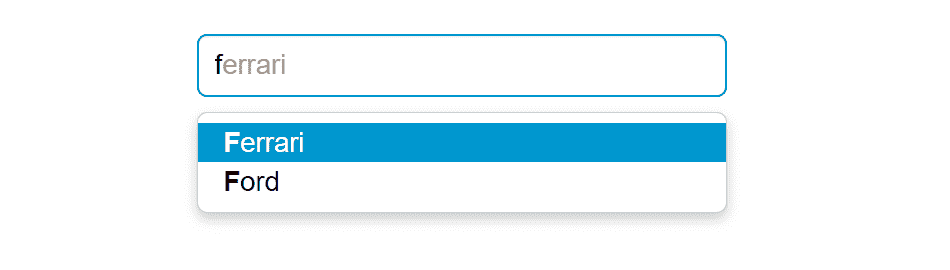

# Bootstrap 提前输入

> 原文：<https://www.tutorialrepublic.com/twitter-bootstrap-tutorial/bootstrap-typeahead.php>

在本教程中，你将学习如何用 Bootstrap 创建 typeaheads。

## 使用 Bootstrap 创建 Typeaheads

在现代 web 表单中，提前输入字段非常流行。使用 typeahead 的主要目的是改善用户体验，在他们填写表单或搜索某些内容时，根据他们输入的文本提供提示或可能的选择列表，就像 Google 即时搜索一样。

提前键入功能还节省了时间并减少了潜在错误的数量，因为用户犯拼写错误的可能性较小。Typeahead 插件已经从 Bootstrap(3.0 以上)中删除，支持使用 [Twitter typeahead](https://twitter.github.io/typeahead.js/) 。

Twitter typeaheads 是一个快速且功能全面的自动完成库，灵感来自 twitter.com 的自动完成搜索功能。要创建 Twitter typeaheads，首先从他们的官方页面—【https://twitter.github.io/typeahead.js/】下载`typeahead.js`并包含在你的项目中，之后你可以将任何基于文本的 [`<input>`](../html-reference/html-input-tag.php) 元素转化为 typeahead。

Twitter typeaheads 需要 jQuery 1.9+才能工作。非 jQuery 版本不可用。

## 使用本地数据集创建 Twitter Typeahead

以下示例将向您展示如何使用本地数据集创建 Twitter typeahead。

#### 例子

[Try this code »](../codelab.php?topic=bootstrap&file=typeahead-with-local-dataset "Try this code using online Editor")

```html
<script>
$(document).ready(function(){
    // Defining the local dataset
    var cars = ['Audi', 'BMW', 'Bugatti', 'Ferrari', 'Ford', 'Lamborghini', 'Mercedes Benz', 'Porsche', 'Rolls-Royce', 'Volkswagen'];

    // Constructing the suggestion engine
    var cars = new Bloodhound({
        datumTokenizer: Bloodhound.tokenizers.whitespace,
        queryTokenizer: Bloodhound.tokenizers.whitespace,
        local: cars
    });

    // Initializing the typeahead
    $('.typeahead').typeahead({
        hint: true,
        highlight: true, /* Enable substring highlighting */
        minLength: 1 /* Specify minimum characters required for showing suggestions */
    },
    {
        name: 'cars',
        source: cars
    });
});
</script>
```

—以上示例的输出类似于以下内容:

[](../codelab.php?topic=bootstrap&file=typeahead-with-local-dataset)  ***注意:** Bloodhound 是`typeahead.js`建议引擎。它非常灵活，并提供高级功能，如预取远程数据、使用浏览器[本地存储](../html-tutorial/html5-web-storage.php)通过智能缓存进行快速查找等。*  ****提示:**如果你想防止默认的浏览器菜单出现在 Bootstrap 式预输入下拉菜单上，为输入框设置`autocomplete="off"`。*  ** * *

## 创建 Twitter Typeahead 外部数据集

还可以通过指向包含一组基准的 JSON 文件的 URL 来指定外部数据集。组成数据集的单个单元称为基准面。

#### 例子

[Try this code »](../codelab.php?topic=bootstrap&file=typeahead-with-external-dataset "Try this code using online Editor")

```html
<script>
$(document).ready(function(){
    // Sonstructs the suggestion engine
    var countries = new Bloodhound({
        datumTokenizer: Bloodhound.tokenizers.whitespace,
        queryTokenizer: Bloodhound.tokenizers.whitespace,
        // The url points to a json file that contains an array of country names
        prefetch: 'data/countries.json'
    });

    // Initializing the typeahead with remote dataset without highlighting
    $('.typeahead').typeahead(null, {
        name: 'countries',
        source: countries,
        limit: 10 /* Specify max number of suggestions to be displayed */
    });
});
</script>
```

