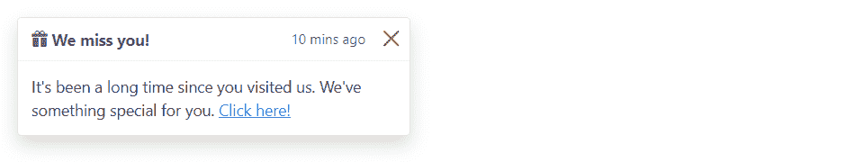
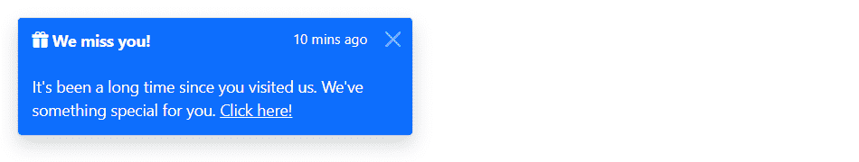
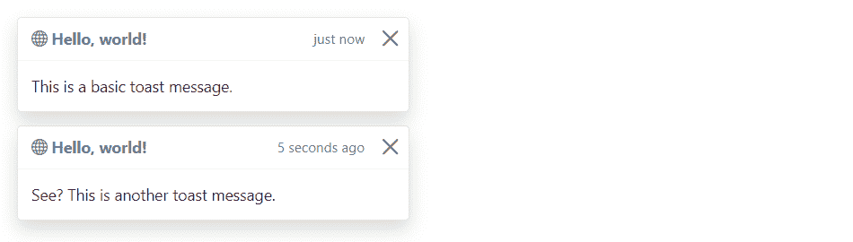
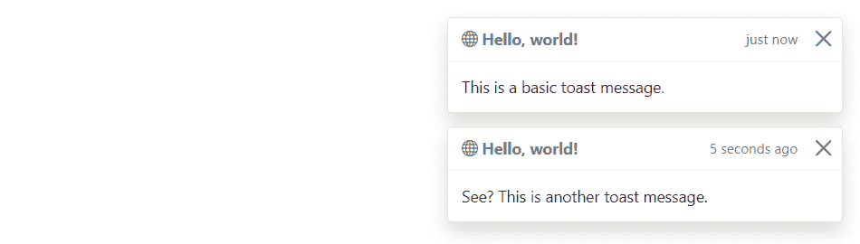

# Bootstrap 吐司

> 原文：<https://www.tutorialrepublic.com/twitter-bootstrap-tutorial/bootstrap-toasts.php>

在本教程中，您将学习如何使用 Bootstrap toast 组件。

## 用 Bootstrap 创建吐司

toast 组件是 Bootstrap 4 中新引入的。它们是轻量级通知，类似于在计算机屏幕上由 web 浏览器显示的推送通知。它们由 flexbox 构建，因此您可以轻松地在网页上对齐和定位它们。

此外，由于性能原因，toasts 是可选的，所以您必须自己用`toast()`方法初始化它们。此外，如果您没有指定`autohide: false`选项，吐司将在 5000 毫秒(5 秒)后自动隐藏。现在让我们看看如何制作吐司。

### 步骤 1:添加 Toast 标签

吐司的标签非常简单。下面的例子将展示如何创建一个包含标题、正文和关闭按钮的 toast 组件。

#### 例子

[Try this code »](../codelab.php?topic=bootstrap&file=toast "Try this code using online Editor")

```html
<div class="toast" id="myToast">
    <div class="toast-header">
        <strong class="me-auto"><i class="bi-gift-fill"></i> We miss you!</strong>
        <small>10 mins ago</small>
        <button type="button" class="btn-close" data-bs-dismiss="toast"></button>
    </div>
    <div class="toast-body">
        It's been a long time since you visited us. We've something special for you. <a href="#">Click here!</a>
    </div>
</div>
```

### 第二步:敬酒

吐司可以通过 JavaScript 触发——只需用 JavaScript 代码中目标元素的`id`、`class`或任何 [CSS 选择器](../css-tutorial/css-selectors.php)调用`toast()` Bootstrap 方法。

#### 例子

jQuery JavaScript[Try this code »](../codelab.php?topic=bootstrap&file=trigger-toast-via-jquery "Try this code using online Editor")

```html
<script>
$(document).ready(function(){
    $("#myBtn").click(function(){
        $("#myToast").toast("show");
    });
});
</script>
```

```html
<script>
document.addEventListener("DOMContentLoaded", function(){
    var btn = document.getElementById("myBtn");
    var element = document.getElementById("myToast");

    // Create toast instance
    var myToast = new bootstrap.Toast(element);

    btn.addEventListener("click", function(){
        myToast.show();
    });
});
</script>
```

—以上示例的输出类似于以下内容:

[](../codelab.php?topic=bootstrap&file=toast) 

* * *

## 改变烤面包的配色方案

你可以使用[颜色](bootstrap-helper-classes.php#color-classes)和[背景](bootstrap-helper-classes.php#background-color-classes)工具类来创建不同配色方案的吐司。

以下示例将创建一个背景为蓝色、文本为白色的吐司。

#### 例子

[Try this code »](../codelab.php?topic=bootstrap&file=toast-with-different-color-schemes "Try this code using online Editor")

```html
<div class="toast bg-primary text-white fade show">
    <div class="toast-header bg-primary text-white">
        <strong class="me-auto"><i class="bi-gift-fill"></i> We miss you!</strong>
        <small>10 mins ago</small>
        <button type="button" class="btn-close btn-close-white" data-bs-dismiss="toast"></button>
    </div>
    <div class="toast-body">
        It's been a long time since you visited us. We've something special for you. <a href="#" class="text-white">Click here!</a>
    </div>
</div>
```

—以上示例的输出类似于以下内容:

[](../codelab.php?topic=bootstrap&file=toast-with-different-color-schemes) 

* * *

## 垂直堆放吐司

你可以将多块吐司垂直叠放，只需将它们包裹在一个吐司容器中，这样会在垂直方向上增加一些间隔。让我们看看下面的例子:

#### 例子

[Try this code »](../codelab.php?topic=bootstrap&file=vertically-stacked-toasts "Try this code using online Editor") *```html
<div class="toast-container">
    <div class="toast fade show">
        <div class="toast-header">
            <strong class="me-auto"><i class="bi-globe"></i> Hello, world!</strong>
            <small>just now</small>
            <button type="button" class="btn-close" data-bs-dismiss="toast"></button>
        </div>
        <div class="toast-body">
            This is a basic toast message.
        </div>
    </div>

    <div class="toast fade show">
        <div class="toast-header">
            <strong class="me-auto"><i class="bi-globe"></i> Hello, world!</strong>
            <small>5 seconds ago</small>
            <button type="button" class="btn-close" data-bs-dismiss="toast"></button>
        </div>
        <div class="toast-body">
            See? This is another toast message.
        </div>
    </div>
</div>
```*  *—以上示例的输出类似于以下内容:

[](../codelab.php?topic=bootstrap&file=vertically-stacked-toasts) 

* * *

## 敬酒的位置

你可以使用定制的 [CSS 定位](/css-tutorial/css-position.php)在网页的任何地方放置吐司。但是，建议通知位于右上角、右下角或中上方。

此外，如果您只想一次显示一个 toast，可以将定位样式内联(即直接放在`.toast`元素上)。让我们尝试一个例子，看看它是如何工作的:

#### 例子

[Try this code »](../codelab.php?topic=bootstrap&file=toasts-placement "Try this code using online Editor") *```html
<div class="toast-container" style="position: absolute; top: 10px; right: 10px;">
    <div class="toast fade show">
        <div class="toast-header">
            <strong class="me-auto"><i class="bi-globe"></i> Hello, world!</strong>
            <small>just now</small>
            <button type="button" class="btn-close" data-bs-dismiss="toast"></button>
        </div>
        <div class="toast-body">
            This is a basic toast message.
        </div>
    </div>

    <div class="toast fade show">
        <div class="toast-header">
            <strong class="me-auto"><i class="bi-globe"></i> Hello, world!</strong>
            <small>5 seconds ago</small>
            <button type="button" class="btn-close" data-bs-dismiss="toast"></button>
        </div>
        <div class="toast-body">
            See? This is another toast message.
        </div>
    </div>
</div>
```*  *—以上示例的输出类似于以下内容:

[](../codelab.php?topic=bootstrap&file=toasts-placement) 

* * *

## 选择

有一些选项可以传递给`toast()` Bootstrap 方法来定制 toast 的功能。选项可以通过数据属性或 JavaScript 传递。

通过数据属性设置 toast 选项，只需在`data-bs-`后面加上选项名称，如`data-bs-autohide="false"`、`data-bs-delay="3000"`等。

| 名字 | 类型 | 缺省值 | 描述 |
| --- | --- | --- | --- |
| 动画 | 布尔型 | 真实的 | 对吐司应用 CSS 淡入淡出过渡。 |
| 自动隐藏 | 布尔型 | 真实的 | 自动隐藏吐司。 |
| 耽搁 | 数字 | Five thousand | 延迟隐藏 toast(毫秒)。 |

数据属性为设置 toast 选项提供了一种简单的方法，但是 JavaScript 是更好的方法，因为它可以避免重复的工作。参见下面方法部分中的[传递选项](#passing-options)示例，了解如何使用 JavaScript 为吐司设置选项。

在下面的例子中，我们使用数据属性(*第 1 行*)将`autohide`选项设置为`false`，这可以防止 toast 自动关闭。

#### 例子

[Try this code »](../codelab.php?topic=bootstrap&file=stop-hiding-toast-automatically-via-data-attributes "Try this code using online Editor")

```html
<div class="toast" id="myToast" data-bs-autohide="false">
    <div class="toast-header">
        <strong class="me-auto"><i class="bi-gift-fill"></i> We miss you!</strong>
        <small>10 mins ago</small>
        <button type="button" class="btn-close" data-bs-dismiss="toast"></button>
    </div>
    <div class="toast-body">
        It's been a long time since you visited us. We've something special for you. <a href="#">Click here!</a>
    </div>
</div>
```

* * *

## 方法

这些是标准的 bootstrap 的 toast 方法:

## 传递选项

您还可以使用 options 对象将[选项](#toast-options)传递给 toast。

下面的示例代码将阻止 toast 自动关闭。

#### 例子

jQuery JavaScript[Try this code »](../codelab.php?topic=bootstrap&file=disable-toast-autohide-via-jquery "Try this code using online Editor")

```html
<script>
$(document).ready(function(){
    $("#myToast").toast({
        autohide: false
    }); 
});
</script>
```

```html
<script>
document.addEventListener("DOMContentLoaded", function(){
    var element = document.getElementById("myToast");
    var myToast = new bootstrap.Toast(element, {
        autohide: false
    });
});
</script>
```

下面的示例代码将 toast 的自动隐藏时间增加到 10 秒。

#### 例子

jQuery JavaScript[Try this code »](../codelab.php?topic=bootstrap&file=increase-toast-autohide-time-via-jquery "Try this code using online Editor")

```html
<script>
$(document).ready(function(){
    $("#myToast").toast({
        delay: 10000
    }); 
});
</script>
```

```html
<script>
document.addEventListener("DOMContentLoaded", function(){
    var element = document.getElementById("myToast");
    var myToast = new bootstrap.Toast(element, {
        delay: 10000
    });
});
</script>
```

## 显示

此方法用于显示 toast。

#### 例子

jQuery JavaScript[Try this code »](../codelab.php?topic=bootstrap&file=calling-toast-methods-using-jquery "Try this code using online Editor")

```html
<script>
$(document).ready(function(){
    $(#myBtn").click(function(){
        $("#myToast").toast("show");
    });
});
</script>
```

```html
<script>
document.addEventListener("DOMContentLoaded", function(){
    var btn = document.getElementById("myBtn");
    var element = document.getElementById("myToast");

    // Create toast instance
    var myToast = new bootstrap.Toast(element);

    btn.addEventListener("click", function(){
        myToast.show();
    });
});
</script>
```

## 隐藏

这个方法是用来隐藏吐司的。如果你设置`autohide`为`false`，你必须手动调用这个方法。

#### 例子

jQuery JavaScript[Try this code »](../codelab.php?topic=bootstrap&file=calling-toast-methods-using-jquery "Try this code using online Editor")

```html
<script>
$(document).ready(function(){
    $(#myBtn").click(function(){
        $("#myToast").toast("hide");
    });
});
</script>
```

```html
<script>
document.addEventListener("DOMContentLoaded", function(){
    var btn = document.getElementById("myBtn");
    var element = document.getElementById("myToast");

    // Create toast instance
    var myToast = new bootstrap.Toast(element);

    btn.addEventListener("click", function(){
        myToast.hide();
    });
});
</script>
```

## 处理

此方法隐藏元素的 toast。toast 将保留在 DOM 上，但不会再显示。

#### 例子

jQuery JavaScript[Try this code »](../codelab.php?topic=bootstrap&file=calling-toast-methods-using-jquery "Try this code using online Editor")

```html
<script>
$(document).ready(function(){
    $(#myBtn").click(function(){
        $("#myToast").toast("dispose");
    });
});
</script>
```

```html
<script>
document.addEventListener("DOMContentLoaded", function(){
    var btn = document.getElementById("myBtn");
    var element = document.getElementById("myToast");

    // Create toast instance
    var myToast = new bootstrap.Toast(element);

    btn.addEventListener("click", function(){
        myToast.dispose();
    });
});
</script>
```

## getInstance

这是一个静态方法，允许您获取与 DOM 元素相关联的 toast 实例。

#### 例子

jQuery JavaScript[Try this code »](../codelab.php?topic=bootstrap&file=get-toast-instance-using-jquery "Try this code using online Editor")

```html
<script>
$(document).ready(function(){
    $("#myBtn").click(function(){
        var myToast = bootstrap.Toast.getInstance($("#myToast")[0]);
        console.log(myToast);
        // {_element: div#myToast.toast.fade.show, _config: {…}, _timeout: null, _hasMouseInteraction: false, _hasKeyboardInteraction: false}
    });
});
</script>
```

```html
<script>
document.addEventListener("DOMContentLoaded", function(){
    var btn = document.getElementById("myBtn");
    var element = document.getElementById("myToast");

    btn.addEventListener("click", function(){        
        var myToast = bootstrap.Toast.getInstance(element);
        console.log(myToast);
        // {_element: div#myToast.toast.fade.show, _config: {…}, _timeout: null, _hasMouseInteraction: false, _hasKeyboardInteraction: false}
    });
});
</script>
```

## getOrCreateInstance

这是一个静态方法，允许您获取与 DOM 元素相关联的 toast 实例，或者在 toast 未初始化的情况下创建一个新实例。

#### 例子

jQuery JavaScript[Try this code »](../codelab.php?topic=bootstrap&file=get-or-create-toast-instance-using-jquery "Try this code using online Editor")

```html
<script>
$(document).ready(function(){
    $("#myBtn").click(function(){
        var myToast = bootstrap.Toast.getOrCreateInstance($("#myToast")[0]);
        console.log(myToast);
        // {_element: div#myToast.toast.fade.show, _config: {…}, _timeout: null, _hasMouseInteraction: false, _hasKeyboardInteraction: false}
    });
});
</script>
```

```html
<script>
document.addEventListener("DOMContentLoaded", function(){
    var btn = document.getElementById("myBtn");
    var element = document.getElementById("myToast");

    btn.addEventListener("click", function(){        
        var myToast = bootstrap.Toast.getOrCreateInstance(element);
        console.log(myToast);
        // {_element: div#myToast.toast.fade.show, _config: {…}, _timeout: null, _hasMouseInteraction: false, _hasKeyboardInteraction: false}
    });
});
</script>
```

 ***提示:**静态方法不能在类的实例(即对象)上调用。它们在类本身上被调用。关键字`static`用于定义一个类的静态方法。*  ** * *

## 事件

Bootstrap 的模态类包含一些用于挂钩模态功能的事件。

| 事件 | 描述 |
| --- | --- |
| show.bs.toast | 当调用 show instance 方法时，此事件将立即激发。 |
| showed . bs . toast | 当 toast 对用户可见时，将触发此事件。它将等到 CSS 转换过程完全完成后才会被触发。 |
| hide.bs.toast | 当 hide 实例方法被调用时，此事件立即被激发。 |
| 隐藏的. bs .吐司 | 当用户看不到 toast 时，将触发此事件。它将等到 CSS 转换过程完全完成后才会被触发。 |

下面的示例将在 toast 的淡出过渡完全完成时向用户显示一条警告消息。让我们尝试一下，看看它是如何工作的:

#### 例子

jQuery JavaScript[Try this code »](../codelab.php?topic=bootstrap&file=listening-to-toast-events-using-jquery "Try this code using online Editor")

```html
<script>
$(document).ready(function(){
    $("#myToast").on("hidden.bs.toast", function(){
        alert("Toast component has been completely closed.");
    });
});
</script>
```

```html
<script>
document.addEventListener("DOMContentLoaded", function(){
    var myToast = document.getElementById("myToast");

    myToast.addEventListener("hidden.bs.toast", function(){
        alert("Toast component has been completely closed.");
    });
});
</script>
```***