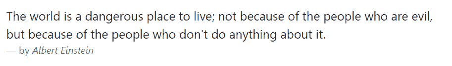

# 引导印刷术

> 原文：<https://www.tutorialrepublic.com/twitter-bootstrap-4-tutorial/bootstrap-typography.php>

在本教程中，你将学习文本内容的样式和格式，如标题、段落、引号等。用自举。

## 使用标题

您可以定义所有的 [HTML 标题](../html-tutorial/html-headings.php)、`<h1>`到`<h6>`——与您在简单 HTML 文档中定义的方式相同。如果您想在元素的文本上应用与标题相同的样式，也可以在其他元素上使用标题类`.h1`到`.h6`。

#### 例子

[Try this code »](../codelab.php?topic=bootstrap-4&file=headings "Try this code using online Editor")

```
<h1>h1\. Bootstrap heading</h1>
<h2>h2\. Bootstrap heading</h2>
<h3>h3\. Bootstrap heading</h3>
<h4>h4\. Bootstrap heading</h4>
<h5>h5\. Bootstrap heading</h5>
<h6>h6\. Bootstrap heading</h6>
```

—以上示例的输出类似于以下内容:

[](../codelab.php?topic=bootstrap-4&file=headings) 

* * *

## 自定义标题

此外，您可以将 [`<small>`](../html-reference/html-small-tag.php) 标签与`.text-muted`类一起使用，以更小、更轻的变体显示任何标题的次要文本。这里有一个例子:

#### 例子

[Try this code »](../codelab.php?topic=bootstrap-4&file=headings-with-secondary-text "Try this code using online Editor")

```
<h2>
    Fancy display heading
    <small class="text-muted">With faded secondary text</small>
</h2>
```

—上述示例的输出类似于以下内容:

[](../codelab.php?topic=bootstrap-4&file=headings-with-secondary-text) 

* * *

## 显示标题

Bootstrap 4 引入了显示标题，当您需要一个突出的标题时可以使用。显示标题以较大的 [`font-size`](/css-reference/css-font-size-property.php) 但较浅的 [`font-weight`](/css-reference/css-font-weight-property.php) 显示。

有四种不同的显示标题可用。下面是一个例子:

#### 例子

[Try this code »](../codelab.php?topic=bootstrap-4&file=display-headings "Try this code using online Editor")

```
<h1 class="display-1">Display Heading 1</h1>
<h1 class="display-2">Display Heading 2</h1>
<h1 class="display-3">Display Heading 3</h1>
<h1 class="display-4">Display Heading 4</h1>
```

—以上示例的输出类似于以下内容:

[](../codelab.php?topic=bootstrap-4&file=display-headings) 

* * *

## 使用段落

Bootstrap 的全局默认 [`font-size`](../css-reference/css-font-size-property.php) 为 **1rem** (通常为 16px)，带有 **1.5** 【通常为 24px】的 [`line-height`](../css-reference/css-line-height-property.php) ，应用于 [`<body>`](../html-reference/html-body-tag.php) 元素以及所有段落，即 [`<p>`](../html-reference/html-p-tag.php) 元素。除此之外 [`margin-bottom`](/css-reference/css-margin-bottom-property.php) 中的 **1rem** 也适用于所有段落。

你也可以通过在一个段落上添加类别`.lead`来突出它。

#### 例子

[Try this code »](../codelab.php?topic=bootstrap-4&file=paragraphs "Try this code using online Editor")

```
<p>This is how a normal paragraph looks like in Bootstrap.</p>
<p class="lead">This is how a paragraph stands out in Bootstrap.</p>
```

—以上示例中的 HTML 代码将产生以下结果:

[](../codelab.php?topic=bootstrap-4&file=paragraphs)  ***提示:CSS 中的**`rem`代表“根 em”。1rem 等于根元素(即 [`<html>`](/html-reference/html-html-tag.php) 元素)的字体大小，在大多数浏览器中默认为 16px。*  ** * *

## 文本对齐

您可以使用文本对齐类轻松地在段落内左对齐、右对齐和居中对齐文本。

#### 例子

[Try this code »](../codelab.php?topic=bootstrap-4&file=text-alignment "Try this code using online Editor")

```
<p class="text-left">Left aligned text.</p>
<p class="text-center">Center aligned text.</p>
<p class="text-right">Right aligned text.</p>
<p class="text-justify">Justified text.</p>
```

您还可以使用响应文本对齐类根据屏幕大小对齐文本。这些类使用与网格系统相同的视口宽度断点。

#### 例子

[Try this code »](../codelab.php?topic=bootstrap-4&file=responsive-text-alignment "Try this code using online Editor")

```
<p class="text-sm-left">Text aligned to left on small or wider viewports.</p>
<p class="text-md-left">Text aligned to left on medium or wider viewports.</p>
<p class="text-lg-left">Text aligned to left on large or wider viewports.</p>
<p class="text-xl-left">Text aligned to left on extra-large or wider viewports.</p>
```

* * *

## 文本格式

你可以自由使用文本格式化标签，如 [`<strong>`](../html-reference/html-strong-tag.php) 、 [`<i>`](../html-reference/html-i-tag.php) 、 [`<small>`](../html-reference/html-small-tag.php) 等，使你的文本加粗、倾斜、变小等等，就像你在简单的 HTML 页面中做的一样。

#### 例子

[Try this code »](../codelab.php?topic=bootstrap-4&file=text-formatting "Try this code using online Editor")

```
<p><b>This is bold text</b></p>
<p><code>This is computer code</code></p>
<p><em>This is emphasized text</em></p>
<p><i>This is italic text</i></p>
<p><mark>This is highlighted text</mark></p>
<p><small>This is small text</small></p>
<p><strong>This is strongly emphasized text</strong></p>
<p>This is <sub>subscript</sub> and <sup>superscript</sup></p>
<p><ins>This text is inserted to the document</ins></p>
<p><del>This text is deleted from the document</del></p>
```

—以上示例的输出类似于以下内容:

[](../codelab.php?topic=bootstrap-4&file=text-formatting) 

* * *

## 文本转换

您也可以将文本转换为小写、大写或使其大写。

#### 例子

[Try this code »](../codelab.php?topic=bootstrap-4&file=text-transformation "Try this code using online Editor")

```
<p class="text-lowercase">The quick brown fox jumps over the lazy dog.</p>
<p class="text-uppercase">The quick brown fox jumps over the lazy dog.</p>
<p class="text-capitalize">The quick brown fox jumps over the lazy dog.</p>
```

—以上示例的输出类似于以下内容:

[](../codelab.php?topic=bootstrap-4&file=text-transformation) 

* * *

## 文本着色

在网站设计中，颜色是传达重要信息的有力手段。

Bootstrap 有一些强调实用程序类可用于此目的，例如用绿色显示成功消息，用红色显示警告或错误消息等。

#### 例子

[Try this code »](../codelab.php?topic=bootstrap-4&file=text-emphasis-classes "Try this code using online Editor")

```
<p class="text-primary">Primary: Please read the instructions carefully before proceeding.</p>
<p class="text-secondary">Secondary: This is featured has been removed from the latest version.</p>
<p class="text-success">Success: Your message has been sent successfully.</p>
<p class="text-info">Info: You must agree with the terms and conditions to complete the sign up process.</p>
<p class="text-warning">Warning: There was a problem with your network connection.</p>
<p class="text-danger">Danger: An error has been occurred while submitting your data.</p>
<p class="text-muted">Muted: This paragraph of text is grayed out.</p>
```

—上述示例的输出类似于以下内容:

[](../codelab.php?topic=bootstrap-4&file=text-emphasis-classes) 

请查看[引导助手类](bootstrap-helper-classes.php)章节，了解其他文本着色和背景着色类，以及各种其他实用程序类。

* * *

## 样式块引号

你也可以让你的块引号看起来更漂亮——只需使用标准的 [`<blockquote>`](../html-reference/html-blockquote-tag.php) 元素定义块引号，bootstrap 的样式表会完成剩下的工作。

此外，为了识别源，您可以添加一个带有类`.blockquote-footer`的 [`<footer>`](/html-reference/html5-footer-tag.php) 元素，并将源作品的名称包装在 [`<cite>`](/html-reference/html-cite-tag.php) 中，如下所示:

#### 例子

[Try this code »](../codelab.php?topic=bootstrap-4&file=blockquotes "Try this code using online Editor")

```
<blockquote class="blockquote">
    <p class="mb-0">The world is a dangerous place to live; not because of the people who are evil, but because of the people who don't do anything about it.</p>
    <footer class="blockquote-footer">by <cite>Albert Einstein</cite></footer>
</blockquote>
```

—以上示例的输出类似于以下内容:

[](../codelab.php?topic=bootstrap-4&file=blockquotes) 

您还可以通过简单地在`<blockquote>`元素上应用文本对齐类`.text-right`或`.text-center`来将块引号向右或居中对齐。

* * *

## 截断长文本

对于较长的文本，可以使用类`.text-truncate`用省略号截断文本。元素的`display`属性值必须是`inline-block`或`block`。

当您想在一行中显示一段文本，但没有足够的空间可用时，它特别有用。让我们看看它实际上是如何工作的:

#### 例子

[Try this code »](../codelab.php?topic=bootstrap-4&file=text-truncation "Try this code using online Editor")

```
<!-- Block level element -->
<div class="row">
    <div class="col-2 text-truncate">
        The quick brown fox jumps over the lazy dog.
    </div>
</div>

<!-- Inline level element -->
<span class="d-inline-block text-truncate" style="max-width: 100px;">
    The quick brown fox jumps over the lazy dog.
</span>
```

* * *

## 环绕长单词

你可以使用类`.text-break`来防止长单词破坏你的布局。

让我们尝试下面的例子来理解它的基本工作原理:

#### 例子

[Try this code »](../codelab.php?topic=bootstrap-4&file=text-break "Try this code using online Editor")

```
<div class="row">
    <div class="col-2">
        <p class="text-break">veryveryveryveryveryveryverylongword</p>
    </div>
</div>
```*