# Bootstrap 表

> 原文：<https://www.tutorialrepublic.com/twitter-bootstrap-4-tutorial/bootstrap-tables.php>

在本教程中，你将学习如何用 Bootstrap 创建优雅的表格。

## 什么是桌子

HTML 表格用于以网格方式显示数据，如行和列。使用 Bootstrap，你可以以一种快速简单的方式极大地改善表格的外观。

参见关于 [HTML 表格](../html-tutorial/html-tables.php)的教程，了解更多关于表格的信息。

## 使用 Bootstrap 创建简单的表

您可以创建具有水平分隔线和小单元格填充(默认为 8px)的基本样式的表格，只需将 Bootstrap 的类`.table`添加到 [`<table>`](../html-reference/html-table-tag.php) 元素中。

#### 例子

[Try this code »](../codelab.php?topic=bootstrap-4&file=simple-table "Try this code using online Editor") *```
<table class="table">
    <thead>
        <tr>
            <th>Row</th>
            <th>First Name</th>
            <th>Last Name</th>
            <th>Email</th>
        </tr>
    </thead>
    <tbody>
        <tr>
            <td>1</td>
            <td>Clark</td>
            <td>Kent</td>
            <td>clarkkent@mail.com</td>
        </tr>
        <tr>
            <td>2</td>
            <td>John</td>
            <td>Carter</td>
            <td>johncarter@mail.com</td>
        </tr>
        <tr>
            <td>3</td>
            <td>Peter</td>
            <td>Parker</td>
            <td>peterparker@mail.com</td>
        </tr>            
    </tbody>
</table>
```*  *—以上示例的输出类似于以下内容:

[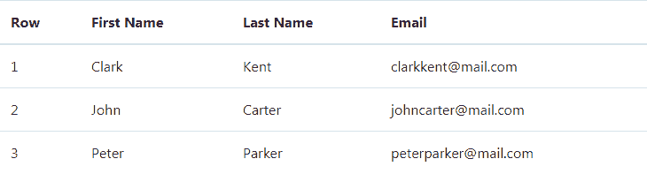](../codelab.php?topic=bootstrap-4&file=simple-table) 

您还可以创建此表格的反转版本，即深色背景上带有浅色文本的表格，方法是向`.table`基类添加一个额外的类`.table-dark`，如下所示:

#### 例子

[Try this code »](../codelab.php?topic=bootstrap-4&file=dark-table "Try this code using online Editor") *```
<table class="table table-dark">
    <thead>
        <tr>
            <th>Row</th>
            <th>First Name</th>
            <th>Last Name</th>
            <th>Email</th>
        </tr>
    </thead>
    <tbody>
        <tr>
            <td>1</td>
            <td>Clark</td>
            <td>Kent</td>
            <td>clarkkent@mail.com</td>
        </tr>
        <tr>
            <td>2</td>
            <td>John</td>
            <td>Carter</td>
            <td>johncarter@mail.com</td>
        </tr>
        <tr>
            <td>3</td>
            <td>Peter</td>
            <td>Parker</td>
            <td>peterparker@mail.com</td>
        </tr>            
    </tbody>
</table>
```*  *—以上示例的输出类似于以下内容:

[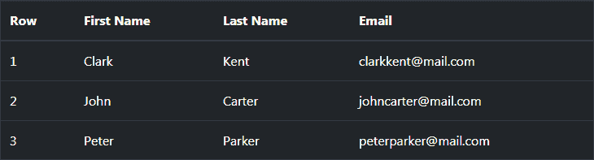](../codelab.php?topic=bootstrap-4&file=dark-table)  ***提示:**您可以在`.table`元素中添加一个额外的类`.table-dark`来创建任何表格的暗版本，比如 stripped、hoverable、bordered、compact table 等等。*  ** * *

## 创建带条纹行的表

您可以通过简单地将 Bootstrap 的类`.table-striped`添加到基类`.table`来创建具有类似斑马条纹的背景的表格。

这是通过`:nth-child` CSS 选择器将 [`background-color`](/css-reference/css-background-color-property.php) 添加到 [`<tbody>`](/html-reference/html-tbody-tag.php) 元素中的表格行来实现的。这里有一个例子:

#### 例子

[Try this code »](../codelab.php?topic=bootstrap-4&file=table-striped "Try this code using online Editor") *```
<table class="table table-striped">
    <thead>
        <tr>
            <th>Row</th>
            <th>First Name</th>
            <th>Last Name</th>
            <th>Email</th>
        </tr>
    </thead>
    <tbody>
        <tr>
            <td>1</td>
            <td>Clark</td>
            <td>Kent</td>
            <td>clarkkent@mail.com</td>
        </tr>
        <tr>
            <td>2</td>
            <td>John</td>
            <td>Carter</td>
            <td>johncarter@mail.com</td>
        </tr>
        <tr>
            <td>3</td>
            <td>Peter</td>
            <td>Parker</td>
            <td>peterparker@mail.com</td>
        </tr>            
    </tbody>
</table>
```*  *—上述示例的输出类似于以下内容:

[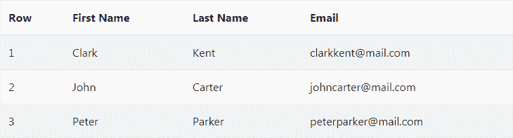](../codelab.php?topic=bootstrap-4&file=table-striped) 

类似地，您也可以通过向表中添加一个额外的类`.table-dark`来创建反相或暗版本的剥离表，如下例所示:

#### 例子

[Try this code »](../codelab.php?topic=bootstrap-4&file=dark-table-striped "Try this code using online Editor") *```
<table class="table table-striped table-dark">
    <thead>
        <tr>
            <th>Row</th>
            <th>First Name</th>
            <th>Last Name</th>
            <th>Email</th>
        </tr>
    </thead>
    <tbody>
        <tr>
            <td>1</td>
            <td>Clark</td>
            <td>Kent</td>
            <td>clarkkent@mail.com</td>
        </tr>
        <tr>
            <td>2</td>
            <td>John</td>
            <td>Carter</td>
            <td>johncarter@mail.com</td>
        </tr>
        <tr>
            <td>3</td>
            <td>Peter</td>
            <td>Parker</td>
            <td>peterparker@mail.com</td>
        </tr>            
    </tbody>
</table>
```*  *—以上示例的输出类似于以下内容:

[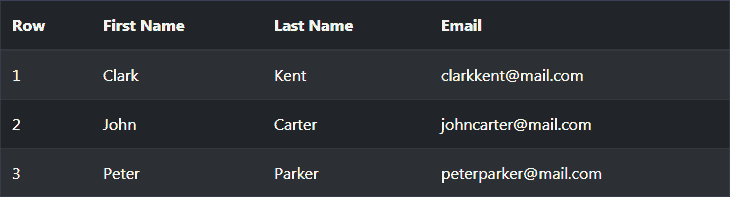](../codelab.php?topic=bootstrap-4&file=dark-table-striped) 

* * *

## 创建四面都有边框的表格

您还可以通过向`.table`基类添加一个额外的 Bootstrap 的类`.table-bordered`来为所有表格单元格添加边框，如下例所示:

#### 例子

[Try this code »](../codelab.php?topic=bootstrap-4&file=table-bordered "Try this code using online Editor") *```
<table class="table table-bordered">
    <thead>
        <tr>
            <th>Row</th>
            <th>First Name</th>
            <th>Last Name</th>
            <th>Email</th>
        </tr>
    </thead>
    <tbody>
        <tr>
            <td>1</td>
            <td>Clark</td>
            <td>Kent</td>
            <td>clarkkent@mail.com</td>
        </tr>
        <tr>
            <td>2</td>
            <td>John</td>
            <td>Carter</td>
            <td>johncarter@mail.com</td>
        </tr>
        <tr>
            <td>3</td>
            <td>Peter</td>
            <td>Parker</td>
            <td>peterparker@mail.com</td>
        </tr>            
    </tbody>
</table>
```*  *—以上示例的输出类似于以下内容:

[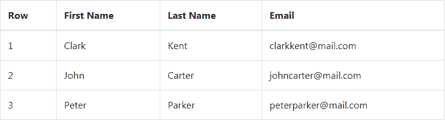](../codelab.php?topic=bootstrap-4&file=table-bordered) 

* * *

## 创建无边框表格

您还可以使用`.table`元素上的类`.table-borderless`来创建无边框表格。

#### 例子

[Try this code »](../codelab.php?topic=bootstrap-4&file=borderless-table "Try this code using online Editor") *```
<table class="table table-borderless">
    <thead>
        <tr>
            <th>Row</th>
            <th>First Name</th>
            <th>Last Name</th>
            <th>Email</th>
        </tr>
    </thead>
    <tbody>
        <tr>
            <td>1</td>
            <td>Clark</td>
            <td>Kent</td>
            <td>clarkkent@mail.com</td>
        </tr>
        <tr>
            <td>2</td>
            <td>John</td>
            <td>Carter</td>
            <td>johncarter@mail.com</td>
        </tr>
        <tr>
            <td>3</td>
            <td>Peter</td>
            <td>Parker</td>
            <td>peterparker@mail.com</td>
        </tr>            
    </tbody>
</table>
```*  *—上述示例的输出类似于以下内容:

[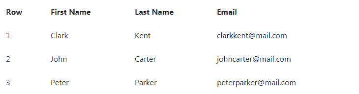](../codelab.php?topic=bootstrap-4&file=borderless-table) 

* * *

## 在表行上启用悬停状态

您还可以通过将 Bootstrap 程序的类`.table-hover`添加到`.table`基类，在 [`<tbody>`](../html-reference/html-tbody-tag.php) 元素内的表格行上启用悬停状态。这里有一个例子:

#### 例子

[Try this code »](../codelab.php?topic=bootstrap-4&file=table-with-hover-states "Try this code using online Editor") *```
<table class="table table-hover">
    <thead>
        <tr>
            <th>Row</th>
            <th>First Name</th>
            <th>Last Name</th>
            <th>Email</th>
        </tr>
    </thead>
    <tbody>
        <tr>
            <td>1</td>
            <td>Clark</td>
            <td>Kent</td>
            <td>clarkkent@mail.com</td>
        </tr>
        <tr>
            <td>2</td>
            <td>John</td>
            <td>Carter</td>
            <td>johncarter@mail.com</td>
        </tr>
        <tr>
            <td>3</td>
            <td>Peter</td>
            <td>Parker</td>
            <td>peterparker@mail.com</td>
        </tr>            
    </tbody>
</table>
```*  *—以上示例的输出类似于以下内容:

[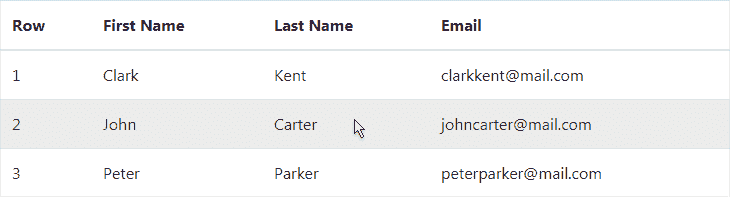](../codelab.php?topic=bootstrap-4&file=table-with-hover-states) 

* * *

## 创建小型或紧凑的表格

您还可以通过向`.table`基类添加一个额外的类`.table-sm`来使您的表更加紧凑并节省空间。类`.table-sm`通过将单元格的填充减少一半来压缩表格。下面是一个小桌子的例子:

#### 例子

[Try this code »](../codelab.php?topic=bootstrap-4&file=compact-table "Try this code using online Editor") *```
<table class="table table-sm">
    <thead>
        <tr>
            <th>Row</th>
            <th>First Name</th>
            <th>Last Name</th>
            <th>Email</th>
        </tr>
    </thead>
    <tbody>
        <tr>
            <td>1</td>
            <td>Clark</td>
            <td>Kent</td>
            <td>clarkkent@mail.com</td>
        </tr>
        <tr>
            <td>2</td>
            <td>John</td>
            <td>Carter</td>
            <td>johncarter@mail.com</td>
        </tr>
        <tr>
            <td>3</td>
            <td>Peter</td>
            <td>Parker</td>
            <td>peterparker@mail.com</td>
        </tr>            
    </tbody>
</table>
```*  *—上述示例的输出类似于以下内容:

[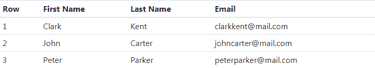](../codelab.php?topic=bootstrap-4&file=compact-table) 

* * *

## 设置表格标题颜色

您还可以使用`<thead>`元素上的修饰符类`.thead-light`或`.thead-dark`为表格标题指定不同的背景颜色。

下面的例子使用了类`.thead-light`来创建一个带有 light head 的表格。

#### 例子

[Try this code »](../codelab.php?topic=bootstrap-4&file=table-head-light "Try this code using online Editor") *```
<table class="table">
    <thead class="thead-light">
        <tr>
            <th>Row</th>
            <th>First Name</th>
            <th>Last Name</th>
            <th>Email</th>
        </tr>
    </thead>
    <tbody>
        <tr>
            <td>1</td>
            <td>Clark</td>
            <td>Kent</td>
            <td>clarkkent@mail.com</td>
        </tr>
        <tr>
            <td>2</td>
            <td>John</td>
            <td>Carter</td>
            <td>johncarter@mail.com</td>
        </tr>
        <tr>
            <td>3</td>
            <td>Peter</td>
            <td>Parker</td>
            <td>peterparker@mail.com</td>
        </tr>            
    </tbody>
</table>
```*  *—以上示例的输出类似于以下内容:

[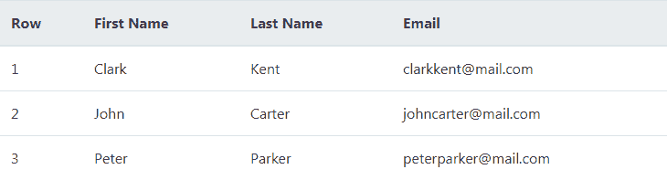](../codelab.php?topic=bootstrap-4&file=table-head-light) 

同样，您可以使用类`.thead-dark`来创建一个具有深色头的表格。

#### 例子

[Try this code »](../codelab.php?topic=bootstrap-4&file=table-head-dark "Try this code using online Editor") *```
<table class="table">
    <thead class="thead-dark">
        <tr>
            <th>Row</th>
            <th>First Name</th>
            <th>Last Name</th>
            <th>Email</th>
        </tr>
    </thead>
    <tbody>
        <tr>
            <td>1</td>
            <td>Clark</td>
            <td>Kent</td>
            <td>clarkkent@mail.com</td>
        </tr>
        <tr>
            <td>2</td>
            <td>John</td>
            <td>Carter</td>
            <td>johncarter@mail.com</td>
        </tr>
        <tr>
            <td>3</td>
            <td>Peter</td>
            <td>Parker</td>
            <td>peterparker@mail.com</td>
        </tr>            
    </tbody>
</table>
```*  *—以上示例的输出类似于以下内容:

[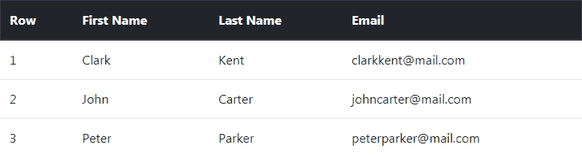](../codelab.php?topic=bootstrap-4&file=table-head-dark) 

* * *

## 表格行的可选强调类

有一些上下文类来强调行或单个单元格数据，如成功、警告、危险等。通过给背景上色。

#### 例子

[Try this code »](../codelab.php?topic=bootstrap-4&file=table-emphasis-classes "Try this code using online Editor") *```
<table class="table">
<thead>
    <tr>
        <th>Row</th>
        <th>Bill</th>
        <th>Payment Date</th>
        <th>Payment Status</th>
    </tr>
</thead>
<tbody>
    <tr class="table-primary">
        <td>1</td>
        <td>Credit Card</td>
        <td>04/07/2019</td>
        <td>Waiting for statement</td>
    </tr>
    <tr class="table-secondary">
        <td>2</td>
        <td>Insurance</td>
        <td>02/07/2019</td>
        <td>Cancelled</td>
    </tr>
    <tr class="table-success">
        <td>3</td>
        <td>Water</td>
        <td>01/07/2019</td>
        <td>Paid</td>
    </tr>
    <tr class="table-info">
        <td>4</td>
        <td>Internet</td>
        <td>05/07/2019</td>
        <td>Change plan</td>
    </tr>
    <tr class="table-warning">
        <td>5</td>
        <td>Electricity</td>
        <td>03/07/2019</td>
        <td>Pending</td>
    </tr>
    <tr class="table-danger">
        <td>6</td>
        <td>Telephone</td>
        <td>06/07/2019</td>
        <td>Due</td>
    </tr>
    <tr class="table-active">
        <td>7</td>
        <td>DTH</td>
        <td>04/07/2019</td>
        <td>Deactivated</td>
    </tr>            
    <tr class="table-light">
        <td>8</td>
        <td>Car Service</td>
        <td>08/07/2019</td>
        <td>Call in to confirm</td>
    </tr>
    <tr class="table-dark">
        <td>9</td>
        <td>Gas</td>
        <td>06/07/2019</td>
        <td>Payment failed</td>
    </tr>
</tbody>
</table>
```*  *—以上示例的输出类似于以下内容:

[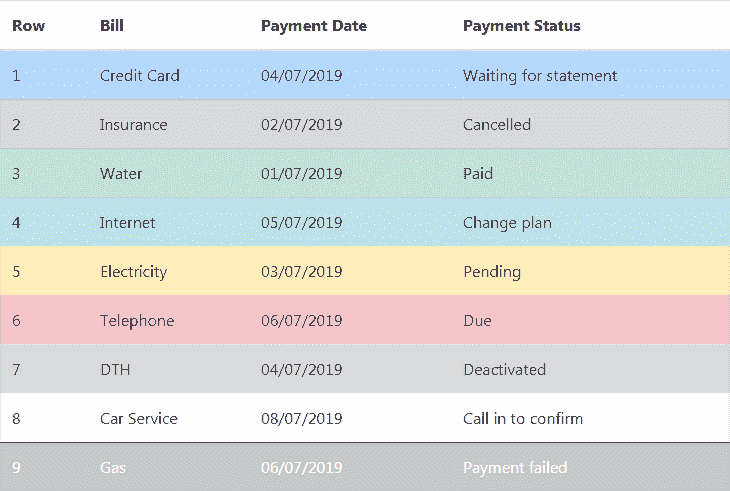](../codelab.php?topic=bootstrap-4&file=table-emphasis-classes) 

查看 snippets 部分，查看一些设计精美的 Bootstrap 表的例子。

* * *

## 使用 Bootstrap 创建响应表

您还可以创建响应式表格，以便在小型设备上实现水平滚动。

要使任何表格有响应性，只需将表格放在一个 [`<div>`](../html-reference/html-div-tag.php) 元素中，并在其上应用类`.table-responsive`。你也可以根据屏幕宽度，使用`.table-responsive{-sm|-md|-lg|-xl}`类来指定表格何时应该有滚动条

#### 例子

[Try this code »](../codelab.php?topic=bootstrap-4&file=responsive-table "Try this code using online Editor") *```
<div class="table-responsive"> 
    <table class="table">
        <thead>
            <tr>
                <th>Row</th>
                <th>First Name</th>
                <th>Last Name</th>
                <th>Email</th>
                <th>Biography</th>
            </tr>
        </thead>
        <tbody>
            <tr>
                <td>1</td>
                <td>Clark</td>
                <td>Kent</td>
                <td>clarkkent@mail.com</td>
                <td>Lorem ipsum dolor sit amet...</td>
            </tr>
            <tr>
                <td>2</td>
                <td>John</td>
                <td>Carter</td>
                <td>johncarter@mail.com</td>
                <td>Vestibulum consectetur scelerisque...</td>
            </tr>
            <tr>
                <td>3</td>
                <td>Peter</td>
                <td>Parker</td>
                <td>peterparker@mail.com</td>
                <td>Integer pulvinar leo id risus...</td>
            </tr>
        </tbody>
    </table>
</div>
```*************