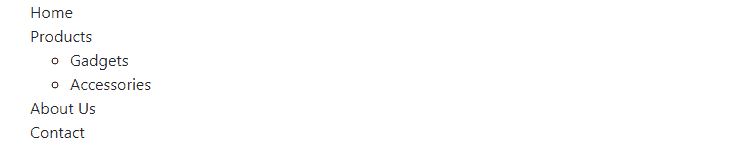
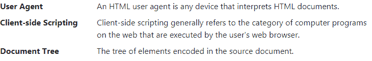

# Bootstrap列表

> 原文：<https://www.tutorialrepublic.com/twitter-bootstrap-4-tutorial/bootstrap-lists.php>

在本教程中，你将学习如何使用 Bootstrap 来设计 HTML 列表的样式。

## 使用 Bootstrap 创建列表

您可以创建三种不同类型的 HTML 列表:

*   **无序列表** —顺序并不明显重要的项目列表。无序列表中的列表项用项目符号标记。
*   **有序列表** —顺序确实很重要的项目列表。有序列表中的列表项用数字标记，如 1、ⅵ等。
*   **定义列表** —带有相关描述的术语列表。

参见关于 [HTML 列表](../html-tutorial/html-lists.php)的教程，了解不同列表类型的更多信息。

* * *

## 无样式有序和无序列表

有时您可能需要从列表项中移除默认样式。你可以通过简单地将类`.list-unstyled`应用到各自的`<ul>`或`<ol>`元素来实现。

#### 例子

[Try this code »](../codelab.php?topic=bootstrap-4&file=unstyled-list "Try this code using online Editor")

```
<ul class="list-unstyled">
    <li>Home</li>
    <li>Products
        <ul>
            <li>Gadgets</li>
            <li>Accessories</li>
        </ul>
    </li>
    <li>About Us</li>
    <li>Contact</li>
</ul>
```

—以上示例的输出类似于以下内容:

[](../codelab.php?topic=bootstrap-4&file=unstyled-list)  ***注意:**`.list-unstyled`类删除了默认的`[list-style](../css-reference/css-list-style-property.php)`，只在列表项中留下了`[padding](../css-reference/css-padding-property.php)`，这些列表项是`<ul>`或`<ol>`元素的直接子元素。*  ** * *

## 内联放置有序和无序列表项

如果你想创建一个使用有序或无序列表的水平菜单，你需要把所有列表项放在一行，即并排。你可以简单地将类`.list-inline`应用到各自的`<ul>`或`<ol>`，将类`.list-inline-item`应用到`<li>`元素。

#### 例子

[Try this code »](../codelab.php?topic=bootstrap-4&file=inline-list "Try this code using online Editor")

```
<ul class="list-inline">
    <li class="list-inline-item">Home</li>
    <li class="list-inline-item">Products</li>
    <li class="list-inline-item">About Us</li>
    <li class="list-inline-item">Contact</li>
</ul>
```

—以上示例的输出类似于以下内容:

[](../codelab.php?topic=bootstrap-4&file=inline-list) 

* * *

## 创建水平定义列表

定义列表中的术语和描述也可以使用 Bootstrap grid 系统的预定义类水平并排对齐。这里有一个例子:

#### 例子

[Try this code »](../codelab.php?topic=bootstrap-4&file=horizontal-definitoin-list "Try this code using online Editor")

```
<dl class="row">
    <dt class="col-sm-3">User Agent</dt>
    <dd class="col-sm-9">An HTML user agent is any device that interprets HTML documents.</dd>
    <dt class="col-sm-3 text-truncate">Client-side Scripting</dt>
    <dd class="col-sm-9">Client-side scripting generally refers to the category of computer programs on the web that are executed by the user's web browser.</dd>
    <dt class="col-sm-3">Document Tree</dt>
    <dd class="col-sm-9">The tree of elements encoded in the source document.</dd>
</dl>
```

—以上示例的输出类似于以下内容:

[](../codelab.php?topic=bootstrap-4&file=horizontal-definitoin-list)  ***注意:**对于更长的定义术语，您可以选择在 [`<dt>`](/html-reference/html-dt-tag.php) 元素上应用类`.text-truncate`，用省略号(…)截断文本。*  *在下一章中，你将学习如何使用[Bootstrap列表组](bootstrap-list-groups.php)组件创建更加灵活和复杂的元素列表。**