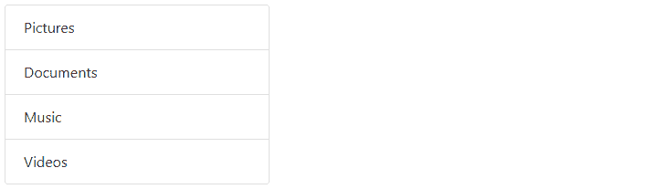
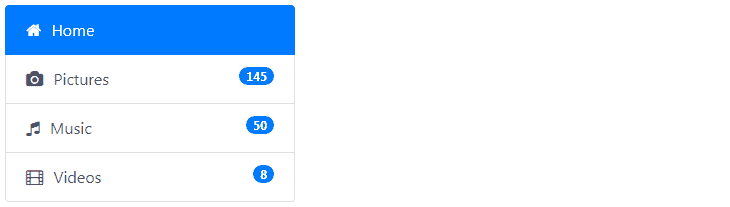
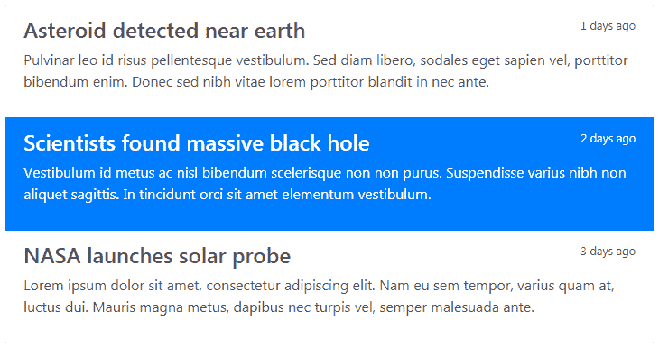
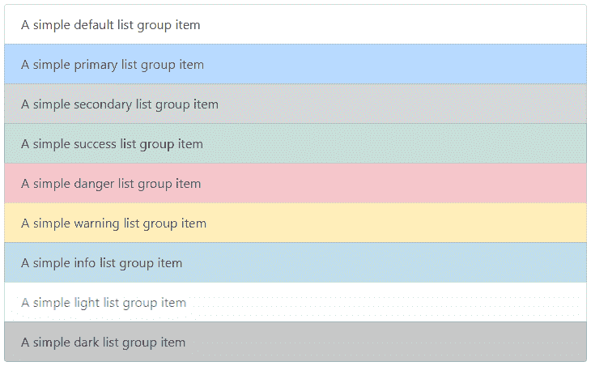

# 引导列表组

> 原文：<https://www.tutorialrepublic.com/twitter-bootstrap-4-tutorial/bootstrap-list-groups.php>

在本教程中，您将学习如何使用引导列表组组件。

## 使用引导创建列表组

列表组是非常有用和灵活的组件，用于以漂亮的方式显示元素列表。在最基本的形式中，列表组只是一个具有类`.list-group`的[无序列表](../html-tutorial/html-lists.php)，而列表项具有类`.list-group-item`。

#### 例子

[Try this code »](../codelab.php?topic=bootstrap-4&file=list-group "Try this code using online Editor")

```
<ul class="list-group">
    <li class="list-group-item">Pictures</li>
    <li class="list-group-item">Documents</li>        
    <li class="list-group-item">Music</li>
    <li class="list-group-item">Videos</li>
</ul>
```

—以上示例的输出类似于以下内容:

[](../codelab.php?topic=bootstrap-4&file=list-group) 

* * *

## 带有链接项目的列表组

您还可以通过 HTML 标记中的微小变化来使用[超链接](../html-tutorial/html-links.php)列出组项目。

只需将 [`<li>`](../html-reference/html-li-tag.php) 替换为 [`<a>`](../html-reference/html-a-tag.php) 标签，并使用 [`<div>`](../html-reference/html-div-tag.php) 元素作为父元素，而不是 [`<ul>`](../html-reference/html-ul-tag.php) 。您还可以将[图标](bootstrap-icons.php)和[徽章](bootstrap-labels-and-badges.php)添加到该列表组中，使其更加优雅。这里有一个例子:

#### 例子

[Try this code »](../codelab.php?topic=bootstrap-4&file=list-group-with-linked-items "Try this code using online Editor")

```
<div class="list-group">
    <a href="#" class="list-group-item list-group-item-action active">
        <i class="fa fa-home"></i> Home
    </a>
    <a href="#" class="list-group-item list-group-item-action">
        <i class="fa fa-camera"></i> Pictures <span class="badge badge-pill badge-primary pull-right">145</span>
    </a>
    <a href="#" class="list-group-item list-group-item-action">
        <i class="fa fa-music"></i> Music <span class="badge badge-pill badge-primary pull-right">50</span>
    </a>
    <a href="#" class="list-group-item list-group-item-action">
        <i class="fa fa-film"></i> Videos <span class="badge badge-pill badge-primary pull-right">8</span>
    </a>
</div>
```

—以上示例的输出类似于以下内容:

[](../codelab.php?topic=bootstrap-4&file=list-group-with-linked-items)  ***提示:**您可以使用引导列表组组件来创建侧边栏导航菜单，例如在您的网站上显示产品或类别列表。*  *您还可以在这些列表组中添加其他 HTML 元素，如标题和段落。

#### 例子

[Try this code »](../codelab.php?topic=bootstrap-4&file=linked-list-group-with-custom-content "Try this code using online Editor")

```
<div class="list-group">
    <a href="#" class="list-group-item list-group-item-action">
        <div class="d-flex w-100 justify-content-between">
            <h4>Asteroid detected near earth</h4>
            <small>1 days ago</small>
        </div>        
        <p>Pulvinar leo id risus pellentesque vestibulum. Sed diam libero, sodales eget sapien vel, porttitor bibendum enim. Donec sed nibh vitae lorem porttitor blandit in nec ante.</p>
    </a>
    <a href="#" class="list-group-item list-group-item-action active">
        <div class="d-flex w-100 justify-content-between">
            <h4>Scientists found massive black hole</h4>
            <small>2 days ago</small>
        </div>
        <p>Vestibulum id metus ac nisl bibendum scelerisque non non purus. Suspendisse varius nibh non aliquet sagittis. In tincidunt orci sit amet elementum vestibulum.</p>
    </a>
    <a href="#" class="list-group-item list-group-item-action">
        <div class="d-flex w-100 justify-content-between">
            <h4>NASA launches solar probe</h4>
            <small>3 days ago</small>
        </div>        
        <p>Lorem ipsum dolor sit amet, consectetur adipiscing elit. Nam eu sem tempor, varius quam at, luctus dui. Mauris magna metus, dapibus nec turpis vel, semper malesuada ante.</p>
    </a>
</div>
```

—上述示例的输出类似于以下内容:

[](../codelab.php?topic=bootstrap-4&file=linked-list-group-with-custom-content) 

* * *

## 具有上下文状态的列表组

像大多数其他组件一样，您也可以在列表组项目上使用上下文类来对它们进行额外的强调。这里有一个例子:

#### 例子

[Try this code »](../codelab.php?topic=bootstrap-4&file=list-group-with-contextual-states "Try this code using online Editor")

```
<ul class="list-group">
    <li class="list-group-item">A simple default list group item</li>
    <li class="list-group-item list-group-item-primary">A simple primary list group item</li>
    <li class="list-group-item list-group-item-secondary">A simple secondary list group item</li>
    <li class="list-group-item list-group-item-success">A simple success list group item</li>
    <li class="list-group-item list-group-item-danger">A simple danger list group item</li>
    <li class="list-group-item list-group-item-warning">A simple warning list group item</li>
    <li class="list-group-item list-group-item-info">A simple info list group item</li>
    <li class="list-group-item list-group-item-light">A simple light list group item</li>
    <li class="list-group-item list-group-item-dark">A simple dark list group item</li>
</ul>
```

—上述示例的输出类似于以下内容:

[](../codelab.php?topic=bootstrap-4&file=list-group-with-contextual-states) 

类似地，您可以将这些上下文类用于链表组项。您也可以使用类`.active`来指定活动列表组项目。这里有一个例子:

#### 例子

[Try this code »](../codelab.php?topic=bootstrap-4&file=linked-list-group-with-contextual-states "Try this code using online Editor")

```
<div class="list-group">
    <a href="#" class="list-group-item list-group-item-action">A simple default list group item</a>
    <a href="#" class="list-group-item list-group-item-action list-group-item-primary">A simple primary list group item</a>
    <a href="#" class="list-group-item list-group-item-action list-group-item-secondary">A simple secondary list group item</a>
    <a href="#" class="list-group-item list-group-item-action list-group-item-success">A simple success list group item</a>
    <a href="#" class="list-group-item list-group-item-action list-group-item-danger">A simple danger list group item</a>
    <a href="#" class="list-group-item list-group-item-action list-group-item-warning">A simple warning list group item</a>
    <a href="#" class="list-group-item list-group-item-action list-group-item-info">A simple info list group item</a>
    <a href="#" class="list-group-item list-group-item-action list-group-item-light">A simple light list group item</a>
    <a href="#" class="list-group-item list-group-item-action list-group-item-dark">A simple dark list group item</a>
</div>
```

请查看[引导标签](bootstrap-tabs.php)章节，了解如何使用列表组组件创建动态垂直标签，而无需使用任何 JavaScript 代码。*