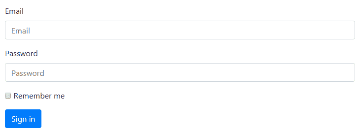
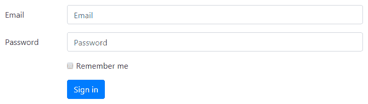
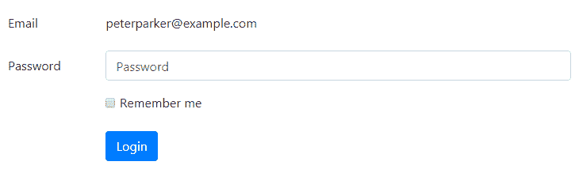
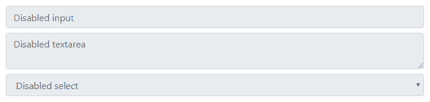
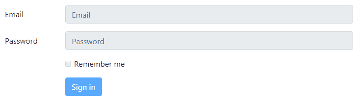
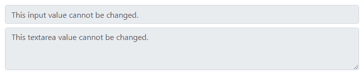
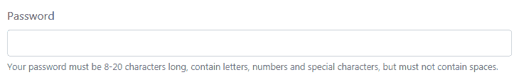
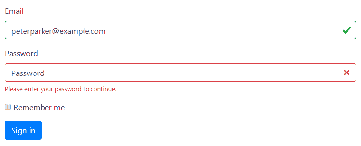
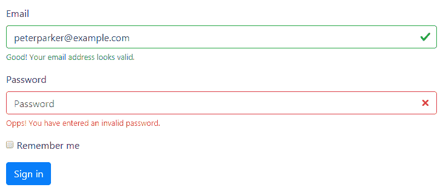
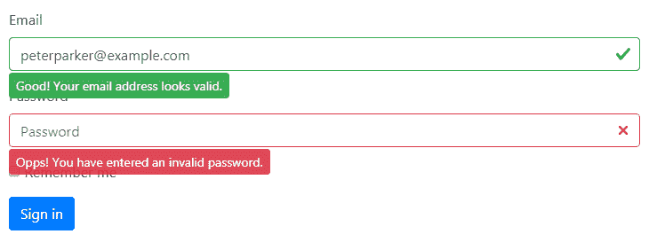

# Bootstrap表单

> 原文：<https://www.tutorialrepublic.com/twitter-bootstrap-4-tutorial/bootstrap-forms.php>

在本教程中，你将学习如何使用 Bootstrap 创建优雅的表单。

## 使用 Bootstrap 创建表单

HTML 表单是 web 页面和应用不可或缺的一部分，但是使用 CSS 一个接一个地手工创建表单布局或样式化表单控件通常是枯燥乏味的。Bootstrap 大大简化了标签、输入字段、选择框、文本区、按钮等表单控件的样式和对齐过程。通过预定义的类集合。

Bootstrap 提供了三种不同类型的表单布局:

*   垂直表单(默认表单布局)
*   水平形式
*   内嵌表单

下一节将向您详细介绍所有这些表单布局，以及与表单相关的各种Bootstrap组件。让我们开始吧。

## 创建垂直表单布局

这是默认的Bootstrap表单布局，在该布局中，样式被应用于表单控件，而无需向 [`<form>`](../html-tutorial/html-forms.php) 元素添加任何基类，也无需对标记进行任何大的更改。

此布局中的表单控件堆叠在一起，标签靠左对齐在顶部。

#### 例子

[Try this code »](../codelab.php?topic=bootstrap-4&file=vertical-form-layout "Try this code using online Editor")

```
<form>
    <div class="form-group">
        <label for="inputEmail">Email</label>
        <input type="email" class="form-control" id="inputEmail" placeholder="Email">
    </div>
    <div class="form-group">
        <label for="inputPassword">Password</label>
        <input type="password" class="form-control" id="inputPassword" placeholder="Password">
    </div>
    <div class="form-group">
        <label class="form-check-label"><input type="checkbox"> Remember me</label>
    </div>
    <button type="submit" class="btn btn-primary">Sign in</button>
</form>
```

—以上示例的输出类似于以下内容:

[](../codelab.php?topic=bootstrap-4&file=vertical-form-layout)  ***注意:**所有的文本表单控件，像`[<input>](../html-reference/html-input-tag.php)`、`[<textarea>](../html-reference/html-textarea-tag.php)`和`[<select>](../html-reference/html-select-tag.php)`都需要类`.form-control`来进行常规样式设置。`.form-control`级也使它们 100%宽。要更改它们的宽度或内嵌使用它们，您可以利用预定义的网格类。*  ** * *

## 创建水平表单布局

您还可以使用Bootstrap网格类创建水平表单布局，其中标签和表单控件并排对齐。要创建水平的表单布局，在表单组上添加类`.row`，并使用`.col-*-*`网格类来指定标签和控件的宽度。

此外，一定要将类`.col-form-label`应用到 [`<label>`](/html-reference/html-label-tag.php) 元素上，以便它们与相关的表单控件垂直居中。让我们来看一个例子:

#### 例子

[Try this code »](../codelab.php?topic=bootstrap-4&file=horizontal-form-layout "Try this code using online Editor")

```
<form>
    <div class="form-group row">
        <label for="inputEmail" class="col-sm-2 col-form-label">Email</label>
        <div class="col-sm-10">
            <input type="email" class="form-control" id="inputEmail" placeholder="Email">
        </div>
    </div>
    <div class="form-group row">
        <label for="inputPassword" class="col-sm-2 col-form-label">Password</label>
        <div class="col-sm-10">
            <input type="password" class="form-control" id="inputPassword" placeholder="Password">
        </div>
    </div>
    <div class="form-group row">
        <div class="col-sm-10 offset-sm-2">
            <label class="form-check-label"><input type="checkbox"> Remember me</label>
        </div>
    </div>
    <div class="form-group row">
        <div class="col-sm-10 offset-sm-2">
            <button type="submit" class="btn btn-primary">Sign in</button>
        </div>
    </div>
</form>
```

—上述示例的输出类似于以下内容:

[](../codelab.php?topic=bootstrap-4&file=horizontal-form-layout) 

* * *

## 创建嵌入式表单布局

有时，您可能希望在一个水平行上显示一系列标签、表单控件和按钮，以简化布局。通过将类`.form-inline`添加到 [`<form>`](../html-tutorial/html-forms.php) 元素中，可以很容易地做到这一点。但是，表单控件仅在宽度至少为 576px 的视口中内嵌显示。

让我们看看下面的例子，看看它实际上是如何工作的:

#### 例子

[Try this code »](../codelab.php?topic=bootstrap-4&file=inline-form-layout "Try this code using online Editor")

```
<form class="form-inline">
    <div class="form-group mr-2">
        <label class="sr-only" for="inputEmail">Email</label>
        <input type="email" class="form-control" id="inputEmail" placeholder="Email">
    </div>
    <div class="form-group mr-2">
        <label class="sr-only" for="inputPassword">Password</label>
        <input type="password" class="form-control" id="inputPassword" placeholder="Password">
    </div>
    <div class="form-group mr-2">        
        <label><input type="checkbox" class="mr-1"> Remember me</label>
    </div>
    <button type="submit" class="btn btn-primary">Sign in</button>
</form>
```

—以上示例的输出类似于以下内容:

[](../codelab.php?topic=bootstrap-4&file=inline-form-layout)  ***注意:**建议为每个表单输入包含一个标签，否则屏幕阅读器会对您的表单产生问题。然而，在内联表单布局的情况下，你可以使用`.sr-only`类隐藏标签，这样只有屏幕阅读器可以阅读它。*  *查看 snippets 部分，查看一些设计精美的Bootstrap表单的例子。

* * *

## 创建静态表单控件

可能会出现这样的情况:您只想在表单标签旁边显示纯文本值，而不是工作表单控件。通过用`.form-control-plaintext`替换类`.form-control`并应用属性`readonly`，可以很容易地做到这一点。

`.form-control-plaintext`类从表单域中移除默认样式，但是保留正确的边距和填充。让我们来看一个例子:

#### 例子

[Try this code »](../codelab.php?topic=bootstrap-4&file=static-form-control "Try this code using online Editor")

```
<form>
    <div class="form-group row">
        <label for="inputEmail" class="col-sm-2 col-form-label">Email</label>
        <div class="col-sm-10">
            <input type="text" readonly class="form-control-plaintext" id="inputEmail" value="peterparker@example.com">
        </div>
    </div>
    <div class="form-group row">
        <label for="inputPassword" class="col-sm-2 col-form-label">Password</label>
        <div class="col-sm-10">
            <input type="password" class="form-control" id="inputPassword" placeholder="Password">
        </div>
    </div>
    <div class="form-group row">
        <div class="col-sm-10 offset-sm-2">
            <div class="checkbox">
                <label><input type="checkbox"> Remember me</label>
            </div>
        </div>
    </div>
    <div class="form-group row">
        <div class="col-sm-10 offset-sm-2">
            <button type="submit" class="btn btn-primary">Sign in</button>
        </div>
    </div>
</form>
```

—以上示例的输出类似于以下内容:

[](../codelab.php?topic=bootstrap-4&file=static-form-control) 

* * *

## 复选框和单选按钮的位置

复选框和单选按钮可以放置在*堆叠*或*内联*。

### 堆叠复选框和单选按钮

要垂直堆叠放置复选框或单选按钮，即逐行堆叠，只需将所有控件包装在一个表单组中，并在每个 [`<label>`](/html-reference/html-label-tag.php) 上应用类`.d-block`。此外，使用边距实用程序类来获得适当的间距，如下例所示:

#### 例子

[Try this code »](../codelab.php?topic=bootstrap-4&file=stacked-checkbox-and-radio-buttons "Try this code using online Editor")

```
<!-- Vertically stacked checkboxes -->    
<div class="form-group">
    <label class="d-block">
        <input type="checkbox" class="mr-1" name="sports"> Cricket
    </label>
    <label class="d-block">
        <input type="checkbox" class="mr-1" name="sports"> Football
    </label>
    <label class="d-block">
        <input type="checkbox" class="mr-1" name="sports"> Tennis
    </label>
</div>
<!-- Vertically stacked radios -->
<div class="form-group">
    <label class="d-block">
        <input type="radio" class="mr-1" name="gender"> Male
    </label>
    <label class="d-block">
        <input type="radio" class="mr-1" name="gender"> Female
    </label>
</div>
```

### 内嵌复选框和单选按钮

但是，要将它们内联放置，即并排放置，只需将所有表单控件放在一个表单组中，并使用边距实用程序类来确保适当的间距。在这种情况下，不需要在`<label>`元素上使用`.d-block`类。让我们看看下面的例子:

#### 例子

[Try this code »](../codelab.php?topic=bootstrap-4&file=inline-checkbox-and-radio-buttons "Try this code using online Editor")

```
<!-- Inline checkboxes -->
<div class="form-group">
    <label class="mr-3">
        <input type="checkbox" class="mr-1" name="sports"> Cricket
    </label>
    <label class="mr-3">
        <input type="checkbox" class="mr-1" name="sports"> Football
    </label>
    <label class="mr-3">
        <input type="checkbox" class="mr-1" name="sports"> Tennis
    </label>
</div>
<!-- Inline radios -->
<div class="form-group">
    <label class="mr-3">
        <input type="radio" class="mr-1" name="gender"> Male
    </label>
    <label class="mr-3">
        <input type="radio" class="mr-1" name="gender"> Female
    </label>
</div>
```

* * *

## 创建禁用的表单控件

要禁用单个表单控件，如`<input>`、`<textarea>`、`<select>`，只需给它们添加属性`disabled`，Bootstrap 会完成剩下的工作。这里有一个例子:

#### 例子

[Try this code »](../codelab.php?topic=bootstrap-4&file=disabled-form-controls "Try this code using online Editor")

```
<input type="text" class="form-control mb-2" placeholder="Disabled input" disabled>
<textarea class="form-control mb-2" placeholder="Disabled textarea" disabled></textarea>
<select id="disabledSelect" class="form-control" disabled>
    <option>Disabled select</option>
</select>
```

—以上示例的输出类似于以下内容:

[](../codelab.php?topic=bootstrap-4&file=disabled-form-controls) 

但是，如果您想同时禁用 [`<form>`](/html-reference/html-form-tag.php) 中的所有控件，请将它们放置在 [`<fieldset>`](/html-reference/html-fieldset-tag.php) 元素中，并对其应用属性，如下例所示:

#### 例子

[Try this code »](../codelab.php?topic=bootstrap-4&file=disabled-forms "Try this code using online Editor") *```
<form>
    <fieldset disabled>
        <div class="form-group row">
            <label for="inputEmail" class="col-sm-2 col-form-label">Email</label>
            <div class="col-sm-10">
                <input type="email" class="form-control" id="inputEmail" placeholder="Email">
            </div>
        </div>
        <div class="form-group row">
            <label for="inputPassword" class="col-sm-2 col-form-label">Password</label>
            <div class="col-sm-10">
                <input type="password" class="form-control" id="inputPassword" placeholder="Password">
            </div>
        </div>
        <div class="form-group row">
            <div class="col-sm-10 offset-sm-2">
                <label class="form-check-label"><input type="checkbox"> Remember me</label>
            </div>
        </div>
        <div class="form-group row">
            <div class="col-sm-10 offset-sm-2">
                <button type="submit" class="btn btn-primary">Sign in</button>
            </div>
        </div>
    </fieldset>
</form>
```*  *—上面示例的输出如下所示:

[](../codelab.php?topic=bootstrap-4&file=horizontal-form-layout) 

* * *

## 创建只读输入

您还可以在输入或文本区域上添加`readonly`布尔属性，以防止修改其值。只读输入以较浅的背景显示(就像禁用的输入一样)，但它保留标准文本光标。看看下面的例子，看看它是如何工作的:

#### 例子

[Try this code »](../codelab.php?topic=bootstrap-4&file=read-only-input-and-textarea "Try this code using online Editor")

```
<input type="text" class="form-control mb-2" value="This input value cannot be changed." readonly>
<textarea rows="3" class="form-control" readonly>This textarea value cannot be changed.</textarea>
```

—以上示例的输出类似于以下内容:

[](../codelab.php?topic=bootstrap-4&file=read-only-input-and-textarea) 

* * *

## 输入、文本区域和选择框的列大小

您还可以将表单控件的大小与Bootstrap网格列的大小相匹配。只需将表单控件(即 [`<input>`](../html-reference/html-input-tag.php) 、 [`<textarea>`](../html-reference/html-textarea-tag.php) 和 [`<select>`](../html-reference/html-select-tag.php) )包装在网格列或任何自定义元素中，并在其上应用[网格类](bootstrap-grid-system.php)，如下例所示:

#### 例子

[Try this code »](../codelab.php?topic=bootstrap-4&file=grid-sizing-of-form-controls "Try this code using online Editor")

```
<div class="form-row">
    <div class="form-group col-sm-6">
        <label for="inputCity">City</label>
        <input type="text" class="form-control" id="inputCity">
    </div>
    <div class="form-group col-sm-4">
        <label for="inputState">State</label>
        <select id="inputState" class="form-control">
            <option>Select</option>
        </select>
    </div>
    <div class="form-group col-sm-2">
        <label for="inputZip">Zip</label>
        <input type="text" class="form-control" id="inputZip">
    </div>
</div>
```

 ***提示:**在创建表单布局时，也可以使用类`.form-row`来代替`.row`。`.form-row`类是标准Bootstrap网格`.row`的一个变种，它覆盖了缺省的列间距以获得更紧凑的布局。*  ** * *

## 输入和选择框的高度尺寸

你可以很容易地改变你的文本输入和选择框的高度，以匹配[按钮的大小](bootstrap-buttons.php)。使用 [`<input>`](../html-reference/html-input-tag.php) 和 [`<select>`](../html-reference/html-select-tag.php) 框中的`.form-control-lg`、`.form-control-sm`等表单控件高度调整类来创建更大或更小的尺寸。

此外，一定要在 [`<label>`](/html-reference/html-label-tag.php) 或 [`<legend>`](/html-reference/html-legend-tag.php) 元素上应用类`.col-form-label-sm`或`.col-form-label-lg`，以便根据表单控件正确调整标签的大小。

#### 例子

[Try this code »](../codelab.php?topic=bootstrap-4&file=height-sizing-of-form-controls "Try this code using online Editor") *```
<form>
    <div class="form-group row">
        <label class="col-sm-2 col-form-label col-form-label-lg">Email</label>
        <div class="col-sm-10">
            <input type="email" class="form-control form-control-lg" placeholder="Large input">
        </div>
    </div>
    <div class="form-group row">
        <label class="col-sm-2 col-form-label">Email</label>
        <div class="col-sm-10">
            <input type="email" class="form-control" placeholder="Default input">
        </div>
    </div>
    <div class="form-group row">
        <label class="col-sm-2 col-form-label">Email</label>
        <div class="col-sm-10">
            <input type="email" class="form-control form-control-sm" placeholder="Small input">
        </div>
    </div>
    <hr>
    <div class="form-group row">
        <label class="col-sm-2 col-form-label col-form-label-lg">State</label>
        <div class="col-sm-10">
            <select class="form-control form-control-lg">
                <option>Large select</option>
            </select>
        </div>
    </div>    
    <div class="form-group row">
        <label class="col-sm-2 col-form-label">State</label>
        <div class="col-sm-10">
            <select class="form-control">
                <option>Default select</option>
            </select>
        </div>
    </div>    
    <div class="form-group row">
        <label class="col-sm-2 col-form-label col-form-label-sm">State</label>
        <div class="col-sm-10">
            <select class="form-control form-control-sm">
                <option>Small select</option>
            </select>
        </div>
    </div>
</form>
```*  ** * *

## 在表单控件周围放置帮助文本

以有效的方式放置表单控件的帮助文本，以指导用户在表单中输入正确的数据。您可以使用类`.form-text`放置表单控件的块级帮助文本。块帮助文本通常显示在控件的底部。这里有一个例子:

#### 例子

[Try this code »](../codelab.php?topic=bootstrap-4&file=block-help-text "Try this code using online Editor")

```
<div class="form-group">
    <label>Password</label>
    <input type="password" class="form-control">
    <small class="form-text text-muted">
        Your password must be 8-20 characters long, contain letters, numbers and special characters, but must not contain spaces.
    </small>
</div>
```

—以上示例的输出类似于以下内容:

[](../codelab.php?topic=bootstrap-4&file=block-help-text) 

类似地，您也可以使用`<small>`元素放置内联帮助文本。这种情况下不需要使用`.form-text`。以下示例显示了如何实现这一点:

#### 例子

[Try this code »](../codelab.php?topic=bootstrap-4&file=inline-help-text "Try this code using online Editor")

```
<form class="form-inline">
    <div class="form-group">
        <label>Password</label>
        <input type="password" class="form-control mx-sm-3">
        <small class="text-muted">Must be 8-20 characters long.</small>
    </div>
</form>
```

—以上示例的输出类似于以下内容:

[](../codelab.php?topic=bootstrap-4&file=inline-help-text) 

* * *

## Bootstrap表单验证

Bootstrap 4 提供了一种在客户端验证 web 表单的简单快捷的方法。它使用浏览器的本地表单验证 API 来验证表单。表单验证样式是通过 CSS `:invalid`和`:valid`伪类应用的。适用于`<input>`、`<select>`、`<textarea>`要素。

让我们看看下面的例子，看看它实际上是如何工作的:

#### 例子

[Try this code »](../codelab.php?topic=bootstrap-4&file=form-validation "Try this code using online Editor")

```
<form class="needs-validation" novalidate>
    <div class="form-group">
        <label for="inputEmail">Email</label>
        <input type="email" class="form-control" id="inputEmail" placeholder="Email" required>
        <div class="invalid-feedback">Please enter a valid email address.</div>
    </div>
    <div class="form-group">
        <label for="inputPassword">Password</label>
        <input type="password" class="form-control" id="inputPassword" placeholder="Password" required>
        <div class="invalid-feedback">Please enter your password to continue.</div>
    </div>
    <div class="form-group">
        <label class="form-check-label"><input type="checkbox"> Remember me</label>
    </div>
    <button type="submit" class="btn btn-primary">Sign in</button>
</form>
```

 ***注意:**对于自定义Bootstrap表单验证消息，您需要通过向`<form>`元素添加`novalidate`布尔属性来禁用浏览器默认反馈工具提示。但是，它仍然提供对 JavaScript 中的表单验证 API 的访问。*  *下面是定制的 JavaScript 代码，如果有无效字段，它会显示错误消息并禁用表单提交。参见 [JavaScript 闭包](/javascript-tutorial/javascript-closures.php)章节，了解自执行函数。

#### 例子

[Try this code »](../codelab.php?topic=bootstrap-4&file=form-validation "Try this code using online Editor")

```
<script>
    // Self-executing function
    (function() {
        'use strict';
        window.addEventListener('load', function() {
            // Fetch all the forms we want to apply custom Bootstrap validation styles to
            var forms = document.getElementsByClassName('needs-validation');
            // Loop over them and prevent submission
            var validation = Array.prototype.filter.call(forms, function(form) {
                form.addEventListener('submit', function(event) {
                    if (form.checkValidity() === false) {
                        event.preventDefault();
                        event.stopPropagation();
                    }
                    form.classList.add('was-validated');
                }, false);
            });
        }, false);
    })();
</script>
```

—以上示例的输出类似于以下内容:

[](../codelab.php?topic=bootstrap-4&file=form-validation)  ***提示:**要以编程方式重置表单的外观，请在提交后从`<form>`元素中移除类`.was-validated`。当您单击提交按钮时，Bootstrap程序会自动将该类应用到表单上。*  *如果需要服务器端验证，可以用`.is-invalid`和`.is-valid`指示无效和有效的表单字段。这些类也支持`.invalid-feedback`和`.valid-feedback`。尝试下面的例子，看看它是如何工作的:

#### 例子

[Try this code »](../codelab.php?topic=bootstrap-4&file=server-side-form-validation "Try this code using online Editor")

```
<form>
    <div class="form-group">
        <label for="inputEmail">Email</label>
        <input type="email" class="form-control is-valid" id="inputEmail" placeholder="Email" value="peterparker@example.com" required>
        <div class="valid-feedback">Good! Your email address looks valid.</div>
    </div>
    <div class="form-group">
        <label for="inputPassword">Password</label>
        <input type="password" class="form-control is-invalid" id="inputPassword" placeholder="Password" required>
        <div class="invalid-feedback">Opps! You have entered an invalid password.</div>
    </div>
    <div class="form-group">
        <label class="form-check-label"><input type="checkbox"> Remember me</label>
    </div>
    <button type="submit" class="btn btn-primary">Sign in</button>
</form>
```

—上述示例的输出类似于以下内容:

[](../codelab.php?topic=bootstrap-4&file=form-validation) 

您也可以将`.{valid|invalid}-feedback`类替换为`.{valid|invalid}-tooltip`类，以工具提示的形式显示验证反馈文本。

此外，确保在父元素上应用样式`position: relative`或类`.position-relative`,以获得正确的反馈工具提示定位。这里有一个例子:

#### 例子

[Try this code »](../codelab.php?topic=bootstrap-4&file=display-validation-feedback-in-tooltip-style "Try this code using online Editor")

```
<form>
    <div class="form-group position-relative">
        <label for="inputEmail">Email</label>
        <input type="email" class="form-control is-valid" id="inputEmail" placeholder="Email" value="peterparker@example.com" required>
        <div class="valid-tooltip">Good! Your email address looks valid.</div>
    </div>
    <div class="form-group position-relative">
        <label for="inputPassword">Password</label>
        <input type="password" class="form-control is-invalid" id="inputPassword" placeholder="Password" required>
        <div class="invalid-tooltip">Opps! You have entered an invalid password.</div>
    </div>
    <div class="form-group">
        <label class="form-check-label"><input type="checkbox"> Remember me</label>
    </div>
    <button type="submit" class="btn btn-primary">Sign in</button>
</form>
```

—以上示例的输出类似于以下内容:

[](../codelab.php?topic=bootstrap-4&file=display-validation-feedback-in-tooltip-style)  ***注意:`<select>`元素的**背景图标只能与`.custom-select`一起使用，不能与`.form-control`一起使用。我们将在下一章学习[Bootstrap定制表单](bootstrap-custom-forms.php)。*  ** * *

## Bootstrap 中支持的表单控件

Bootstrap 包括对所有标准 HTML 表单控件以及[新 HTML5 输入类型](../html-tutorial/html5-new-input-types.php)的支持，例如日期时间、数字、电子邮件、url、搜索、范围、颜色、url 等等。以下示例将向您展示标准表单控件与 Bootstrap 的用法。

#### 例子

[Try this code »](../codelab.php?topic=bootstrap-4&file=supported-from-controls "Try this code using online Editor") *```
<form>
<div class="form-group row">
    <label class="col-sm-3 col-form-label" for="firstName">First Name:</label>
    <div class="col-sm-9">
        <input type="text" class="form-control" id="firstName" placeholder="First Name" required>
    </div>
</div>
<div class="form-group row">
    <label class="col-sm-3 col-form-label" for="lastName">Last Name:</label>
    <div class="col-sm-9">
        <input type="text" class="form-control" id="lastName" placeholder="Last Name" required>
    </div>
</div>
<div class="form-group row">
    <label class="col-sm-3 col-form-label" for="inputEmail">Email Address:</label>
    <div class="col-sm-9">
        <input type="email" class="form-control" id="inputEmail" placeholder="Email Address" required>
    </div>
</div>
<div class="form-group row">
    <label class="col-sm-3 col-form-label" for="phoneNumber">Mobile Number:</label>
    <div class="col-sm-9">
        <input type="number" class="form-control" id="phoneNumber" placeholder="Phone Number" required>
    </div>
</div>
<div class="form-group row">
    <label class="col-sm-3 col-form-label">Date of Birth:</label>
    <div class="col-sm-3">
        <select class="custom-select">
            <option>Date</option>
        </select>
    </div>
    <div class="col-sm-3">
        <select class="custom-select">
            <option>Month</option>
        </select>
    </div>
    <div class="col-sm-3">
        <select class="custom-select">
            <option>Year</option>
        </select>
    </div>
</div>
<div class="form-group row">
    <label class="col-sm-3 col-form-label" for="postalAddress">Postal Address:</label>
    <div class="col-sm-9">
        <textarea rows="3" class="form-control" id="postalAddress" placeholder="Postal Address" required></textarea>
    </div>
</div>
<div class="form-group row">
    <label class="col-sm-3 col-form-label" for="ZipCode">Zip Code:</label>
    <div class="col-sm-9">
        <input type="text" class="form-control" id="ZipCode" placeholder="Zip Code" required>
    </div>
</div>
<div class="form-group row">
    <label class="col-sm-3 col-form-label">Gender:</label>
    <div class="col-sm-9 mt-2">
        <label class="mb-0 mr-3">
            <input type="radio" class="mr-1" name="gender"> Male
        </label>
        <label class="mb-0 mr-3">
            <input type="radio" class="mr-1" name="gender"> Female
        </label>
    </div>
</div>
<div class="form-group row">
    <div class="col-sm-9 offset-sm-3">
        <label class="checkbox-inline">
            <input type="checkbox" class="mr-1" value="agree"> I agree to the <a href="#">Terms and Conditions</a>.
        </label>
    </div>
</div>
<div class="form-group row">
    <div class="col-sm-9 offset-sm-3">
        <input type="submit" class="btn btn-primary" value="Submit">
        <input type="reset" class="btn btn-secondary" value="Reset">
    </div>
</div>
</form>
```*********