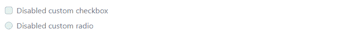

# 引导自定义表单

> 原文：<https://www.tutorialrepublic.com/twitter-bootstrap-4-tutorial/bootstrap-custom-forms.php>

在本教程中，你将学习如何使用 Bootstrap 创建自定义表单控件。

## 创建自定义表单控件

Bootstrap 4 使您能够定制浏览器的默认表单控件，以创建更加优雅的表单布局。现在，您可以创建完全定制的、跨浏览器兼容的单选按钮和复选框、文件输入、选择下拉列表、范围输入等等。

在接下来的几节中，您将看到如何一个接一个地创建这些定制表单元素。

## 创建自定义复选框

要创建自定义复选框，请将每个复选框`<input>`及其对应的`<label>`包装在一个`<div>`元素中，并应用如下例所示的类:

#### 例子

[Try this code »](../codelab.php?topic=bootstrap-4&file=custom-checkboxes "Try this code using online Editor")

```
<div class="custom-control custom-checkbox">
    <input type="checkbox" class="custom-control-input" name="customCheck" id="customCheck1">
    <label class="custom-control-label" for="customCheck1">Custom checkbox</label>
</div>
<div class="custom-control custom-checkbox mt-2">
    <input type="checkbox" class="custom-control-input" name="customCheck" id="customCheck2" checked>
    <label class="custom-control-label" for="customCheck2">Another custom checkbox</label>
</div>
```

—以上示例的输出类似于以下内容:

[](../codelab.php?topic=bootstrap-4&file=custom-checkboxes) 

* * *

## 创建自定义单选按钮

类似地，您可以使用引导程序创建自定义单选按钮，如下所示:

#### 例子

[Try this code »](../codelab.php?topic=bootstrap-4&file=custom-radio-buttons "Try this code using online Editor")

```
<div class="custom-control custom-radio">
    <input type="radio" class="custom-control-input" name="customRadio" id="customRadio1">
    <label class="custom-control-label" for="customRadio1">Custom radio</label>
</div>
<div class="custom-control custom-radio mt-2">
    <input type="radio" class="custom-control-input" name="customRadio" id="customRadio2" checked>
    <label class="custom-control-label" for="customRadio2">Another custom radio</label>
</div>
```

—以上示例的输出类似于以下内容:

[](../codelab.php?topic=bootstrap-4&file=custom-radio-buttons) 

您还可以通过简单地在包装器`<div>`元素上添加一个类`.custom-control-inline`来内嵌这些自定义复选框和单选按钮，如下所示:

#### 例子

[Try this code »](../codelab.php?topic=bootstrap-4&file=custom-radios-inline "Try this code using online Editor")

```
<div class="custom-control custom-radio custom-control-inline">
    <input type="radio" class="custom-control-input" name="customRadio" id="customRadio1">
    <label class="custom-control-label" for="customRadio1">Custom radio</label>
</div>
<div class="custom-control custom-radio custom-control-inline">
    <input type="radio" class="custom-control-input" name="customRadio" id="customRadio2" checked>
    <label class="custom-control-label" for="customRadio2">Another custom radio</label>
</div>
```

—上述示例的输出类似于以下内容:

[](../codelab.php?topic=bootstrap-4&file=custom-radios-inline) 

* * *

## 禁用自定义复选框和单选按钮

也可以禁用自定义复选框和单选按钮。只需将布尔属性`disabled`添加到`<input>`元素中，如下例所示:

#### 例子

[Try this code »](../codelab.php?topic=bootstrap-4&file=disabled-custom-checkboxes-and-radio-buttons "Try this code using online Editor")

```
<div class="custom-control custom-checkbox">
    <input type="checkbox" class="custom-control-input" id="customCheck" disabled>
    <label class="custom-control-label" for="customCheck">Disabled custom checkbox</label>
</div>
<div class="custom-control custom-radio mt-2">
    <input type="radio" class="custom-control-input" id="customRadio" disabled>
    <label class="custom-control-label" for="customRadio">Disabled custom radio</label>
</div>
```

—上述示例的输出类似于以下内容:

[](../codelab.php?topic=bootstrap-4&file=disabled-custom-checkboxes-and-radio-buttons) 

* * *

## 创建拨动开关

开关标记类似于自定义复选框，唯一的区别是它使用`.custom-switch`类代替`.custom-checkbox`来呈现切换开关。

开关也支持`disabled`属性。让我们来看一个例子:

#### 例子

[Try this code »](../codelab.php?topic=bootstrap-4&file=toggle-switch "Try this code using online Editor")

```
<div class="custom-control custom-switch">
    <input type="checkbox" class="custom-control-input" id="customSwitch1">
    <label class="custom-control-label" for="customSwitch1">Toggle switch</label>
</div>
<div class="custom-control custom-switch mt-2">
    <input type="checkbox" class="custom-control-input" disabled id="customSwitch2">
    <label class="custom-control-label" for="customSwitch2">Disabled switch element</label>
</div>
```

—以上示例的输出类似于以下内容:

[](../codelab.php?topic=bootstrap-4&file=toggle-switch) 

* * *

## 创建自定义选择菜单

自定义选择菜单可以简单地通过在`<select>`元素上添加类`.custom-select`来创建。然而，由于浏览器的限制，选择菜单的定制样式只限于初始外观，不能修改`<option>`。这里有一个例子:

#### 例子

[Try this code »](../codelab.php?topic=bootstrap-4&file=custom-select-dropdown "Try this code using online Editor")

```
<select class="custom-select">
    <option selected>Custom select menu</option>
    <option value="1">One</option>
    <option value="2">Two</option>
    <option value="3">Three</option>
</select>
```

—以上示例的输出类似于以下内容:

[](../codelab.php?topic=bootstrap-4&file=custom-select-dropdown) 

您也可以创建小的和大的自定义选择来匹配相似大小的[引导文本输入](bootstrap-forms.php)。

#### 例子

[Try this code »](../codelab.php?topic=bootstrap-4&file=custom-select-sizing "Try this code using online Editor")

```
<select class="custom-select custom-select-lg">
    <option selected>Large custom select menu</option>
    <option value="1">One</option>
    <option value="2">Two</option>
    <option value="3">Three</option>
</select>
<select class="custom-select mt-3">
    <option selected>Default custom select menu</option>
    <option value="1">One</option>
    <option value="2">Two</option>
    <option value="3">Three</option>
</select>
<select class="custom-select custom-select-sm mt-3">
    <option selected>Small custom select menu</option>
    <option value="1">One</option>
    <option value="2">Two</option>
    <option value="3">Three</option>
</select>
```

—以上示例的输出类似于以下内容:

[](../codelab.php?topic=bootstrap-4&file=custom-select-sizing) 

引导定制选择也像普通选择一样支持`multiple`和`size` 属性:

#### 例子

[Try this code »](../codelab.php?topic=bootstrap-4&file=custom-multi-select-dropdown "Try this code using online Editor")

```
<select class="custom-select" size="3" multiple>
    <option selected>Open this select menu</option>
    <option value="1">One</option>
    <option value="2">Two</option>
    <option value="3">Three</option>
</select>
```

* * *

## 创建自定义范围输入

要创建自定义范围输入，只需将类`.custom-range`应用于``<input type="range">`` 。

#### 例子

[Try this code »](../codelab.php?topic=bootstrap-4&file=custom-range "Try this code using online Editor")

```
<label for="customRange">Custom range</label>
<input type="range" class="custom-range" id="customRange">
```

—以上示例的输出类似于以下内容:

[](../codelab.php?topic=bootstrap-4&file=custom-range) 

默认情况下，范围输入的最小值和最大值分别为 0 和 100。但是，您可以为那些使用`min`和`max`属性的用户指定新的值。

此外，默认情况下，范围输入“捕捉”到整数值。要改变这一点，您可以指定一个`step`值。在下面的例子中，我们通过使用`step="0.5"`将步骤数增加了一倍。

#### 例子

[Try this code »](../codelab.php?topic=bootstrap-4&file=custom-range-with-min-max-and-step "Try this code using online Editor")

```
<label for="customRange">Custom range</label>
<input type="range" class="custom-range" min="0" max="10" step="0.5" id="customRange">
```

* * *

## 创建自定义文件输入

使用 Bootstrap 4，您还可以创建优雅的自定义文件输入，并在各种浏览器之间保持一致。让我们试试下面的例子，看看它是如何工作的:

#### 例子

[Try this code »](../codelab.php?topic=bootstrap-4&file=custom-file-input "Try this code using online Editor")

```
<div class="custom-file">
    <input type="file" class="custom-file-input" id="customFile">
    <label class="custom-file-label" for="customFile">Choose file</label>
</div>
```

—以上示例的输出类似于以下内容:

[](../codelab.php?topic=bootstrap-4&file=custom-file-input)  ***提示:** Bootstrap 通过 [`opacity`](/css-tutorial/css-opacity.php) 隐藏默认文件`<input>`，并将`<label>`改为看起来像输入的样式。按钮被生成并用 [`::after`](/css-tutorial/css-pseudo-elements.php) 伪元素定位。最后，使用 [CSS 定位](/css-tutorial/css-position.php)和适当的`width`和`height`来触发文件拾取器对话框，将透明的`<input>`放置在样式化的`<label>`上方。*